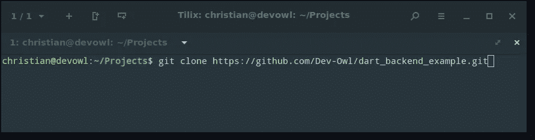
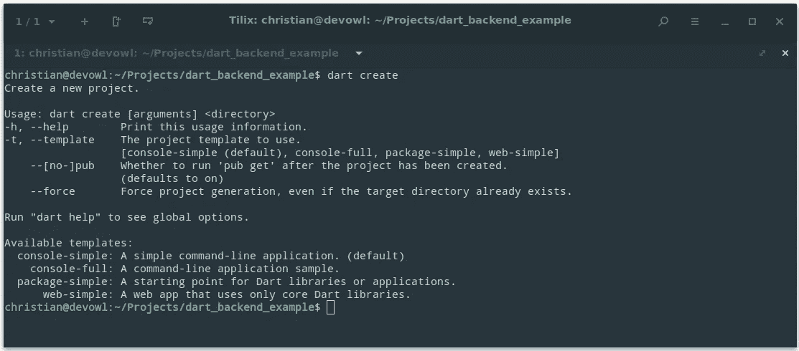
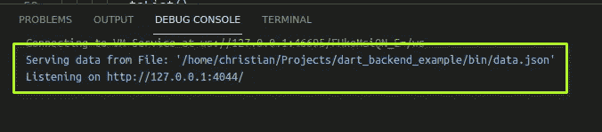
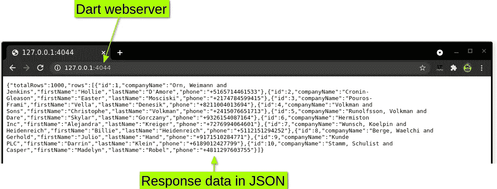
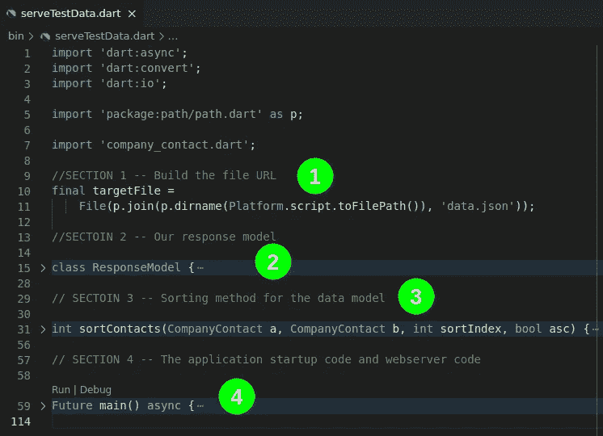

# Dart 后端示例— REST API

> 原文：<https://levelup.gitconnected.com/dart-backend-by-example-rest-api-a8a1004dc705>


由 [Kelvin Ang](https://unsplash.com/@kelvin1987?utm_source=unsplash&utm_medium=referral&utm_content=creditCopyText) 在 [Unsplash](https://unsplash.com/s/photos/server?utm_source=unsplash&utm_medium=referral&utm_content=creditCopyText) 上拍摄的照片

想知道是否可以在后端使用 Dart 代码吗？重用代码是最佳实践，允许相同的代码在多个平台上运行将减少维护、上市时间和压力。

在本教程中，我们将使用 Dart 中的 REST API 构建一个 web 服务器，允许调用者从您的服务器获取 JSON 数据。我们的 Dart 后端 REST API 将支持以下功能:

*   CORS 构型
*   服务器端排序
*   服务器端分页
*   通过 Nginx 托管(作为反向代理)

# 前言

## Dart SDK 已安装

按照下面显示的步骤安装 Dart SDK。如果您安装了 Flutter 1.21 或更新版本，您不必安装 Dart SDK，因为它包含在 Flutter 中。

[](https://dart.dev/get-dart) [## 获取 Dart SDK

### 本页描述如何下载 Dart SDK。Dart SDK 拥有您需要的库和命令行工具…

dart.dev](https://dart.dev/get-dart) 

## 任何你喜欢的想法

我将使用 Visual Studio 代码(在 Linux 上工作)，任何 IDE 都可以工作，因为你只需编辑文本(当然，如果你想调试，你需要一些与 Dart 兼容的东西)。可以在这里找到可能选项的列表。

[](https://dart.dev/tools#ides-and-editors) [## 工具

### 支持 Dart 语言的工具。

dart.dev](https://dart.dev/tools#ides-and-editors) 

# 准备好你的项目

为了让你有一个良好的开端，从我的 GitHub 页面下载下面的项目，我们将在本教程中使用它。你可以使用 GitHub 上的下载按钮，或者在 shell/命令窗口中运行下面的命令(你需要安装[Git](https://git-scm.com/downloads)):

```
git clone [https://github.com/Dev-Owl/dart_backend_example.git](https://github.com/Dev-Owl/dart_backend_example.git)
```



运行 git clone 命令

## 如何创建 dart 项目？

我们将在本教程中使用上面提到的存储库，但是您可能会问自己:“我如何才能获得一个新的项目模板？”

像 Flutter 一样，Dart 提供了一个命令行界面来生成项目模板:

```
dart create -t [PROJECT_TYPE] [PROJECT_NAME]
```



创建 dart 的帮助文本

如果您想创建一个 Dart 控制台应用程序，并将其命名为 helloWorld，命令如下:

```
dart create -t console-full helloWorld
```

Dart.dev 有一些进一步的细节和关于这个主题的[分步指南。](https://dart.dev/tutorials/server/get-started)

# 项目的结构

让我们看看您从 GitHub 下载的项目，我们将从项目根文件夹中的文件开始:

## pubspec.yaml

像扑，飞镖使用。yaml 文件来跟踪和配置依赖项和项目细节。示例项目有两个依赖项:path 和 pedantic。第一个是从文件中读取数据。
Pedantic 是一种开发依赖，这意味着它在开发过程中使用，但在最终应用中并不需要。
由 Pedantic 支持，如果你的代码违反了任何风格指南或有其他缺点，你会得到通知，simple 说它支持你编写干净的代码。

## 分析 _ 选项. yaml

Pedantic(代码分析开发依赖)使用这个文件来知道您想要应用什么样的规则。该文件被配置为使用默认规则。[如果需要可以调整配置](https://github.com/google/pedantic#enabled-lints)。

## LICENSE & README.md &。gitignore

GitHub/Git 相关文件，我们的 Dart 后端项目不需要。

## bin 文件夹

在 bin 文件夹中，你会找到应用程序的完整代码。本教程将涵盖以下细节，快速概述:

*   serveTestData.dart —主 dart 文件，包括 REST API 的代码
*   data . JSON——我们的数据存储，里面的数据将用于回答请求
*   company_contact.dart —将用于读取 JSON 数据的模型类

# 让我们建立一个网络服务器

对于从 Git 中签出的任何 Dart 或 Flutter 应用程序，第一步都应该是恢复包(包不在 Git 存储库中)。在项目的根文件夹中运行以下命令:

```
dart pub get
```

下载完依赖项后，可以使用 IDE 或通过以下命令直接启动项目:

```
dart run
```

如果一切正常，您将在控制台/IDE 输出窗口中看到两个提示:



web 服务器已经启动，找到了数据文件，正在等待请求

现在打开您选择的浏览器，打开输出中显示的 URL，或者复制下面的 URL:

[http://127.0.0.1:4044](http://127.0.0.1:4044)



在浏览器中请求数据的结果

**请注意:**web 服务器将开始在端口 4044 上列出仅来自您的计算机(本地主机)的请求。如果这个端口已经被使用，应用程序将打印一个错误并退出。

## 代码

太好了，项目正在运行！现在，让我们确保详细了解它是如何工作的。打开 serveTestData.dart 文件。在该文件中，您会发现四个部分(标有注释):



serveTestData.dart 文件中的四个部分

## 第一节

在开始时，我提到过我们希望从 JSON 文件中传输数据。当 Dart web 服务器启动时，此部分会自动构建该文件的路径。

来自 pub.dev 的[路径包使您能够与文件路径进行交互，并为您正在使用的操作系统创建匹配的路径。查看第 5 行，这是我导入包并将其重命名为 path 的地方。](https://pub.dev/packages/path)

## 第二节

我们的 REST API 需要响应客户端——为了完成这个任务，使用了类 ResponseModel。该类始终包含整数形式的总行数和 CompanyContact 对象列表。

CompanyContact 是一个位于 company_contact.dart 文件中的自定义类，在我们的 Dart REST API 中用作 [DTO(数据传输对象)](https://en.wikipedia.org/wiki/Data_transfer_object)。

## 第三节

REST API 应该支持服务器端的排序和分页、待办事项，所以它需要知道如何根据客户端的请求对数据进行排序。
为了保持代码简单，REST API 使用一个数字索引来决定数据的什么属性应该被排序。Dart 提供了一个名为 [compareTo](https://api.dart.dev/stable/1.10.1/dart-core/String/compareTo.html) 的便利函数，为我们进行排序。代码中的所有决策都是由一条 [Dart switch case](https://dart.dev/guides/language/language-tour#switch-and-case) 语句完成的。

为了确保 REST API 在没有特定排序的情况下也能工作，代码使用 ID 属性作为后备，以防客户端没有请求任何东西。
为了使客户端能够决定数据最后应该是升序还是降序，compareTo 的结果需要乘以-1，以将默认的升序方法变为降序。

简要解释比较(来自 Dart 文档):

> 如果`this`在`other`之前排序，则 compareTo(this，other)返回一个负整数，如果`this`在`other`之后排序，则返回一个正整数，如果`this`和`other`一起排序，则返回零。

## 第四节

在第 4 部分你会发现主要的功能，应用程序的开始。Dart 后端项目将总是在这个函数中启动。

## 准备好数据

首先要做的事情之一是，我们的 web 服务器将把包含示例数据的完整文件读入内存。现在使用在第 1 部分中构建的路径。这种情况在启动时只发生一次，如果文件丢失，将会打印一个错误，应用程序将停止工作。

## 绑定 web 服务器

下一步将配置并启动 web 服务器。服务器在端口 4044 上连接到您的本地环回 IPV4 地址(对于 localhost 或 127.0.0.1 来说很有趣)。这一切都发生在第 16 行对 HttpServer.bind 的调用中。如果端口 4044 已经在使用中(或者出现其他问题)，我们的 Dart 后端代码将打印一个错误并停止应用程序。如果一切正常，您将会看到代码现在为传入请求列出的消息。

## 处理传入请求

从这一点上，web 服务器正在运行并等待传入的连接。感谢 Dart 中[流的工作方式，你所需要做的就是用一个](https://dart.dev/tutorials/language/streams)[异步 For 循环](https://dart.dev/codelabs/async-await)来获取新的请求。

## 收到了新的请求

一旦你打开 URL(长版本，如果你发送一个 [HTTP GET](https://developer.mozilla.org/en-US/docs/Web/HTTP/Methods/GET) 请求到我们的 Dart 后端 REST API 的 URL)代码将进入 for 循环。
发生的第一件事是设置 JSON 响应的 contentType。这样做是为了通知客户我们将和他谈 JSON。
后面跟着另一个 [HTTP 头来设置 CORS](https://developer.mozilla.org/en-US/docs/Web/HTTP/CORS) 规则，快速版本这允许浏览器使用 API，即使它托管在不同的 URL 上(我在下面的文章中有所涉及):

[](https://medium.com/flutter-community/seven-things-you-should-know-before-starting-with-flutter-web-8e48555d819e) [## 开始使用 Flutter Web 之前你应该知道的七件事

### 获得一个良好的开端与颤振网页，点，我希望我会有一个挂在我开始之前。URL 路由…

medium.com](https://medium.com/flutter-community/seven-things-you-should-know-before-starting-with-flutter-web-8e48555d819e) 

在所有的 [HTTP 头](https://developer.mozilla.org/en-US/docs/Web/HTTP/Headers)就位后，代码将检查请求[查询参数](https://en.wikipedia.org/wiki/Query_string)。我们的后端服务器支持四个参数:

*   **偏移量** —应该跳过的数据条目数量
*   **pageSize** —客户端想要获取的元素数量
*   **sortIndex** —对数据进行排序的列的数字索引(参见第 2 节)
*   **sortAsc** —对数据进行排序的顺序(见第 2 节)

以上所有查询参数都是可选的，如果缺少它们，将使用默认值。如果请求包含某个参数的错误值，例如文本而不是数字，请求将失败，并出现 500 服务器错误。当然，这部分可以通过适当的错误消息和正确的 [HTTP 代码 400](https://developer.mozilla.org/en-US/docs/Web/HTTP/Status/400) 来通知调用者他犯了一个错误。

## 将数据发送给客户端

一旦检查了请求参数，就该在应用偏移量和页面大小之前对数据进行排序了。这是确保我们获得正确数据的第一步，如果您按姓名对数据进行排序，然后取前 50 行，您将获得不同的结果，就像您按电话号码对数据进行排序一样。
一旦数据被排序，代码就将响应“写”给客户机。
由于内置了[跳过](https://api.dart.dev/stable/2.13.0/dart-core/Iterable/skip.html)和[采取](https://api.dart.dev/stable/2.13.0/dart-core/Iterable/take.html)列表的方法，分页很快就完成了。最后一步是将响应包装在我们的 DTO 中(第 2 节)，并用 [jsonEncode](https://api.dart.dev/stable/2.12.2/dart-convert/jsonEncode.html) 将其编码为 JSON。Dart 内置了一个[到 JSON 的转换](https://dart.dev/guides/json)，JSON 数据被处理为一个[映射<字符串，动态>。
for 循环的最后一行是关闭响应，最后将数据发送给客户端。](https://api.dart.dev/stable/2.13.0/dart-core/Map-class.html)

## 完成第 4 部分代码

# 活生生的例子

完整的代码在线运行，试一试，看看几个例子:

[https://example . devo wl . de](https://example.devowl.de)

这将给出按 ID 属性升序排序的前 10 行。

[https://example.devowl.de/?sortIndex=2&sortAsc = 0&offset = 100&pageSize = 50](https://example.devowl.de/?sortIndex=2&sortAsc=0&offset=100&pageSize=50)

运行上述请求将按照 CompanyName 属性对数据进行降序排序。将跳过前 100 条记录，并返回 50 条记录。
如果您尝试下面的 URL，您将得到一个 HTTP 500 错误，值“foobar”不是 pageSize 的有效数字:

[https://example.devowl.de/?sortIndex=2&sortAsc = 0&offset = 100&pageSize = foobar](https://example.devowl.de/?sortIndex=2&sortAsc=0&offset=100&pageSize=foobar)

要查看作为应用程序后端使用的系统，请查看我在 Flutter 中关于服务器端数据表的帖子:

[](/server-side-paginated-data-table-in-flutter-d01b16f30f3) [## Flutter 中的服务器端分页数据表

### 您需要处理一大组数据，并希望以表格的形式呈现出来？高级数据表已涵盖你。了解如何…

levelup.gitconnected.com](/server-side-paginated-data-table-in-flutter-d01b16f30f3) 

或者直接进入正在运行的 Flutter Web 应用程序:

 [## 示例 _ 高级 _ 数据表

### 一个新的颤振项目。

dev-猫头鹰. github.io](https://dev-owl.github.io/advanced_datatable/#/) 

# 下一步是什么？

摆弄一下代码，你可以交换状态文件后端，用 SQLite 替换它，如果你想这样做的话，可以使用 checkout Moor。

[](https://medium.com/@c.muehle18/flutter-package-at-a-glance-local-storage-with-moor-c4736d92850a) [## Flutter package 一览 Moor 本地存储

### 欢迎收看第一集名为“扑包一瞥”的帖子！这次是关于离线存储…

medium.com](https://medium.com/@c.muehle18/flutter-package-at-a-glance-local-storage-with-moor-c4736d92850a) 

代码的另一个变化可能是 API 内部的错误处理。web API 的最佳实践是向客户端返回正确的错误代码。
排序和分页很好，但是服务器端过滤器呢？更改代码，只返回以 A 开头的公司或德国(+49)的电话号码。

希望我能向你展示如何在后端使用 Dart 并创建一个简单的 REST API。随意评论，为☺鼓掌