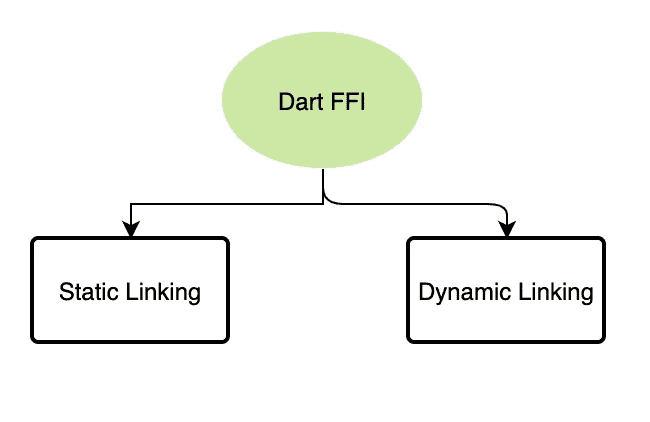
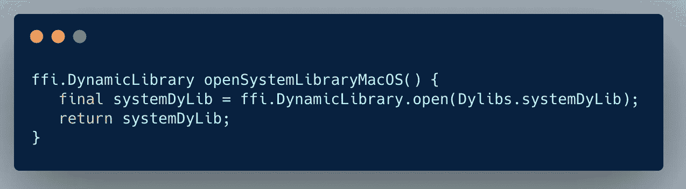
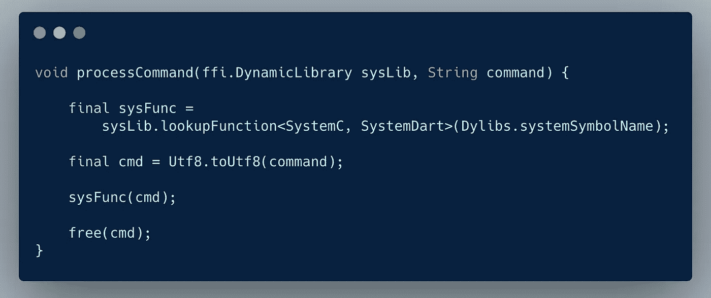
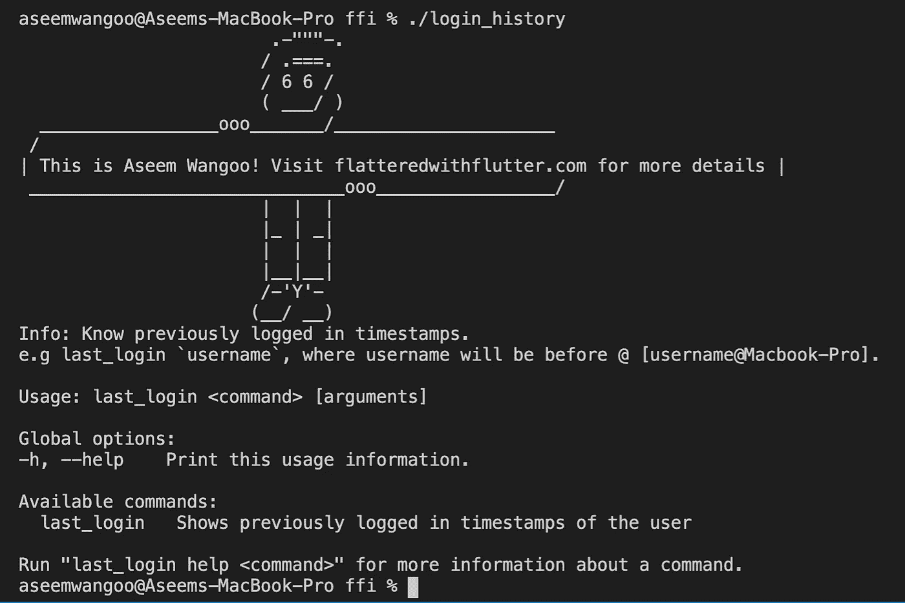
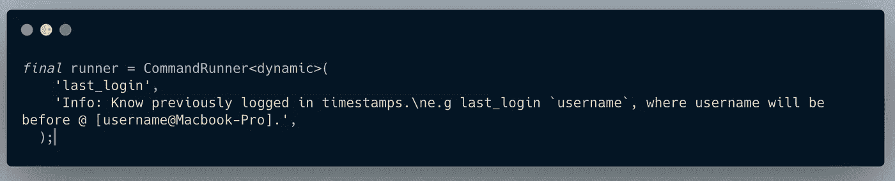
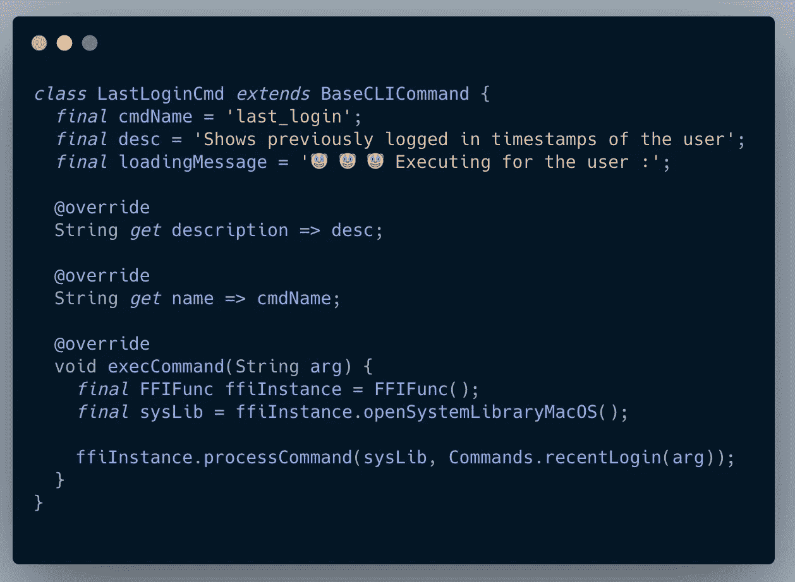
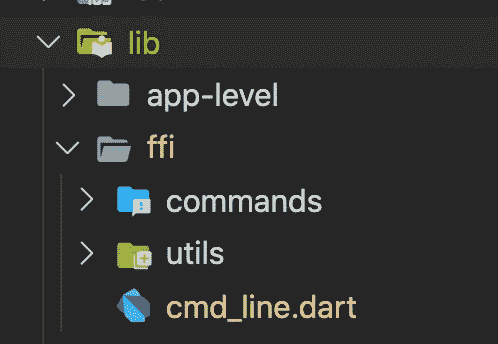
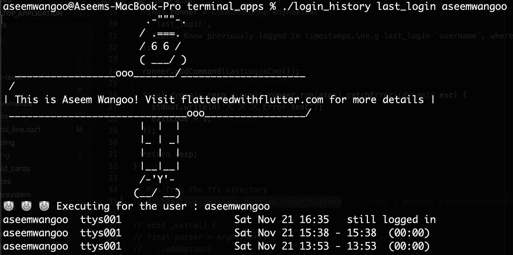

# Dart FFI 和 CLI 应用程序

> 原文：<https://levelup.gitconnected.com/dart-ffi-and-cli-app-8cc5ed2f8aae>

Dart FFI 和 CLI 应用程序

> 如何使用 Dart FFI 并创建 CLI App？嗯…

全在一个颤振资源:[https://flatteredwithflutter.com/dart-ffi-cli-dart2native/](https://flatteredwithflutter.com/dart-ffi-cli-dart2native/)

**Meetup Talk:**

Dart FFI 和 CLI

# 开始…

***等级:中级***

> 先决条件:安装包 [FFI](https://pub.dev/packages/ffi) 和 [Args](https://pub.dev/packages/args)

我们将简要介绍

1.  使用 Dart FFI
2.  获取用户的登录历史记录( **macOS**
3.  创建 CLI 应用程序

> 注意:我们不会深入解释 Dart FFI，因为已经有很多关于它的好文章。


Dart FFI 和 CLI 应用程序

1.  **使用飞镖 FFI**

FFI: ( **外部函数接口**)可用于调用基于 C/C++语言的 API



Dart FFI 和 CLI 应用程序

静态链接库嵌入到应用程序的可执行映像中，并在应用程序启动时加载。

可以使用`DynamicLibrary.executable`或`DynamicLibrary.process`加载静态链接库中的符号。

动态链接库分布在应用程序中的单独文件或文件夹中，并按需加载。动态链接库可以通过`DynamicLibrary.open`加载到 Dart 中。

**我们将如何接近？**

对于本文，我们将利用**动态系统库。**

> 如果你想创建自己的动态库，读一下这个。

## 2.获取用户的登录历史记录( **macOS**

打开终端，键入以下命令

```
last login `username`where username is before @ [username@Macbook-Pro]
```

*   你应该得到你的登录历史。我们的目标是从 Dart 调用这个命令。
*   该命令在 macOS 中的系统动态库中定义。

在 macOS 中，系统库位于

```
/usr/lib/libSystem.dylib
```

> 要获取不同操作系统的路径，请访问此处的。

我们将在 Dart 中加载上面路径中指定的动态库。



Dart FFI 和 CLI 应用程序

*   将 dart ffi 包(存在于 Flutter 中)导入为

```
import 'dart:ffi' as ffi
```

这有一个类**动态库。**我们调用方法 **open** 并加载我们的动态库( **Dylibs.systemDyLib** )。

```
class Dylibs {
  static const String systemDyLib = '/usr/lib/libSystem.dylib'; static const String systemSymbolName = 'system';
}
```

每个动态库都由符号组成。要在图书馆[找到符号，请参考这里](https://stackoverflow.com/questions/4506121/how-to-print-a-list-of-symbols-exported-from-a-dynamic-library)。

现在，获取用户登录历史属于符号 [**系统**](https://www.mkssoftware.com/docs/man3/system.3.asp) 。



Dart FFI 和 CLI 应用程序

*   使用**lookup 功能从加载的动态库中查找符号。**

我们指定了 **SystemC** 和 **SystemDart** 函数，它们基本上是

```
// C header typedef:
typedef SystemC = ffi.Void Function(ffi.Pointer<Utf8> command);// Dart header typedef
typedef SystemDart = void Function(ffi.Pointer<Utf8> command);
```

这结合了查找函数和到 Dart 函数的转换。

*   接下来，我们将命令(我们最后的登录命令)转换成 C 语言能够理解的东西

```
/// Convert a [String] to a Utf8-encoded null-terminated C string./// Returns a malloc-allocated pointer to the result.final cmd = Utf8.toUtf8(command);
```

*   使用`sysFunc(cmd)`运行命令
*   最后，释放内存，因为 C/C++没有垃圾收集。


## **3。创建一个 CLI 应用程序**

我们将创建自己的命令，其中包含关于 CLI 应用程序的信息和描述。



Dart FFI 和 CLI 应用程序

*   创建我们的司令部

我们使用 [**命令运行器**](https://pub.dev/documentation/args/latest/command_runner/CommandRunner-class.html) **、**并将我们的命令( **last_login** )定义为



CLI 中的 CommandRunner

*   添加我们最后的登录命令。为了创建你自己的命令，你需要扩展 [**命令类**](https://pub.dev/documentation/args/latest/command_runner/Command-class.html)

```
// THIS ADDS OUR LAST LOGIN COMMAND
runner.addCommand(LastLoginCmd());
```

> 注意:LastLoginCmd 是我们的自定义类

我们创建一个**抽象基本命令**类并声明这些方法。

```
abstract class BaseCLICommand extends Command<dynamic> {
  String loadingMessage; void execCommand(String arg); @override
  Future<void> run() async {
    if (argResults.arguments.isEmpty) {
      throw Exception('😳😳 Please specify the argument');
    } final arg = argResults.arguments.first;
    final loadingMsg = '$loadingMessage $arg'; stdout.write('$loadingMsg\n');
    execCommand(arg);
  }
}
```

*   **argResults.arguments** 帮助我们获取用户输入。
*   **stdout.write** 用于打印输出到控制台。
*   **execCommand** 是扩展类定义的函数。

我们的 **LastLoginCmd** 扩展了上面的类并实现了方法。



LastLoginCmd

*   在我们添加了上面的命令之后

```
// THIS ADDS OUR LAST LOGIN COMMAND
runner.addCommand(LastLoginCmd());
```

最后，我们以如下方式运行该命令

```
runner.run(args);
```

## 最后一步(转换为 CLI 应用程序)

我们利用了

`**dart2native**`，能够将 Dart 程序编译成自包含的可执行文件。通过 dart2native，您可以使用 dart 在 **macOS、Windows 或 Linux** 上创建命令行工具。

1.  导航到包含 dart 入口点的目录。例如



*我的目录将会是* ***lib/ffi***

2.运行命令

```
dart2native cmd_line.dart -o login_history
```

`-o <path>`或`--output=<path>`产生输出。

这就创建了我们名为 **login_history** 的 CLI 应用程序。

**最终输出**



与 Flutter 相关的有趣文章在这里:

[](https://medium.com/codechai/flutter-desktop-plugin-ef8c19cd9ff) [## Flutter 桌面插件

### 了解如何在 flutter 中创建桌面插件

medium.com](https://medium.com/codechai/flutter-desktop-plugin-ef8c19cd9ff) [](https://medium.com/flutter-community/flutterdesktop-and-c-7cd2e0106bd8) [## FlutterDesktop 和 C

### 从 FlutterDesktop MacOS 调用 C 库

medium.com](https://medium.com/flutter-community/flutterdesktop-and-c-7cd2e0106bd8) [](https://medium.com/codechai/flutter-and-desktop-4a19886f726b) [## 颤振和桌面

### 在 flutter 中创建桌面应用程序？现在就开始！

medium.com](https://medium.com/codechai/flutter-and-desktop-4a19886f726b) 

[*颤振桌面 App 源代码。*](https://github.com/AseemWangoo/Experiments_with_Desktop)