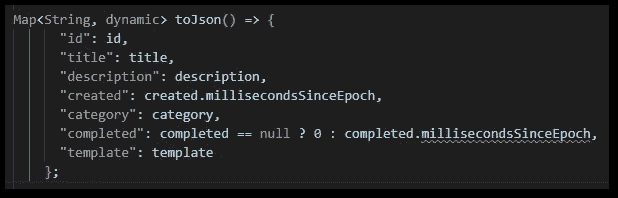
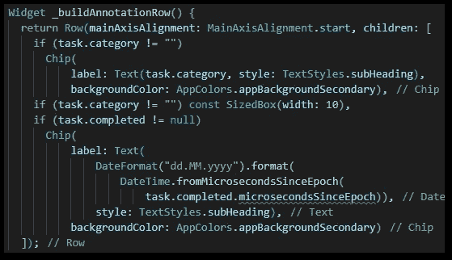
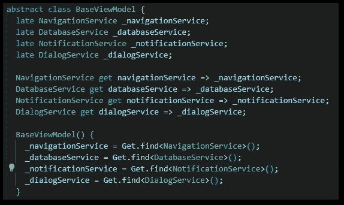
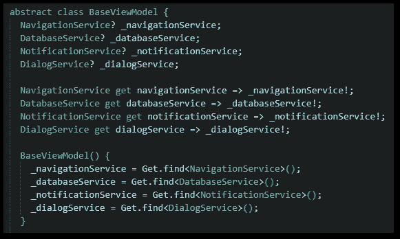

# Dart Null 安全性必须提高！

> 原文：<https://levelup.gitconnected.com/dart-null-safety-is-trash-right-now-fbd5942838a4>

## 只是现在还不够好

## 我看不到好处，对坏处感到愤怒。它需要尽快改进。


由[卡尤·戈麦斯](https://unsplash.com/@cajugos?utm_source=medium&utm_medium=referral)在 [Unsplash](https://unsplash.com?utm_source=medium&utm_medium=referral) 拍摄的照片

有一篇[文章](https://medium.com/lost-but-coding/what-has-null-safety-given-us-really-9d3cc49bb8ac)是作者同事[零安全有什么好处？](https://medium.com/u/426137a1abbf#代码更难读，这只是因为无效的安全攻击。</p><h2 id=)

[它旨在防止应用程序中出现空引用错误。有用吗？嗯，至少目前对我来说不是。静态代码分析器不够好，显示的警告非常烦人，因为它们是错误的。属性是一个真正的问题:](https://medium.com/u/426137a1abbf#代码更难读，这只是因为无效的安全攻击。</p><h2 id=)

[](https://medium.com/u/426137a1abbf#代码更难读，这只是因为无效的安全攻击。</p><h2 id=)

[只是我的应用程序中一个无用的编译器错误…](https://medium.com/u/426137a1abbf#代码更难读，这只是因为无效的安全攻击。</p><h2 id=)

[](https://medium.com/u/426137a1abbf#代码更难读，这只是因为无效的安全攻击。</p><h2 id=)

[为什么我们还要做空检查？！](https://medium.com/u/426137a1abbf#代码更难读，这只是因为无效的安全攻击。</p><h2 id=)

[简直可笑。](https://medium.com/u/426137a1abbf#代码更难读，这只是因为无效的安全攻击。</p><h2 id=)

```
🔔 Get a short summary of my Medium content on the 1st of every month in your inbox. Save time and pick what you like to read!

Click HERE to subscribe for free!
```

我认为自己是一个相当好的程序员。人无完人，包括我在内的每个人都会犯错。因此，遇到空引用错误对我来说是可能的，但可能不会像其他开发人员那样频繁。我在没有空安全的情况下编码了 15 年，我已经适应了空检查和防御性编程的情况。

但是现在，零安全让一切变得更好，对吗？🙃

## 迟到和！

不，因为你可以用`!`操作符破坏系统。它告诉编译器忽略这个位置可能的空错误，我们又回到了开始的地方。事实上，我看到人们通过将操作符包含在任何可能的代码段中，将他们飘忽不定的应用程序“迁移”到零安全性。你不会相信它看起来有多糟糕。

下面是我现在不喜欢 Dart 的两个进一步的例子:



要么使用 late 关键字，让编译器忽略错误…



或者使用？还有！运算符组合

所以你要么使用`late`关键字来关闭编译器。我说的闭嘴是指，你可以在你的类中自由使用这些字段，不会得到任何暗示，它们可能是空的。或者你跟`?` ( **你好，我可以是 null** )和`!` ( **不过别担心，我不是**)的疯狂组合。下一个缺点是，每次访问字段或变量时，您都需要使用`!`操作符**。这很愚蠢，代码看起来也很难看。老实说，我并不喜欢这两种方式。有人可能会说我应该直接注入服务，但这不是我的观点。空安全应该是无缝的，但事实并非如此。**

C#也有同样的空安全语言特性，这并没有让我感到很困扰。它也不完美，但是他们有更好的代码分析器和一些有用的关键字。`readonly`关键字迫使程序员在构造函数代码完成之前给一个字段或属性赋值。在那之后，您不会像 Dart 那样收到值可能为空的恼人警告。这样好多了。

## 如何改善？

我不知道。我不是语言设计师，也不太了解开发过程(这在 GitHub btw 上[公开可见)。目前，我经常使用`late`关键词，但感觉就像开车时没有系安全带。对我来说，拥有像 C#这样的`readonly`关键字会很酷。这就像 Dart 的`final`，但是你可以在构造函数中初始化值。当然，这只有在代码分析器比现在理解更多的上下文时才有效。](https://github.com/dart-lang)

也许我们应该向 ChatGPT 寻求解决方案😄

## 结论

Dart 中的空安全现在不是很好。但是我很希望有一天它能和 C#处于同一水平，如果开发人员继续像以前一样努力的话。感觉有点像“伙计，你没有比这更大的问题吗？”我可能不知道。也许 2-3 年后，我们都会嘲笑这篇文章。

[***通过我的推荐链接加入成千上万的媒体会员，每月只需 5 美元就可以阅读你想阅读的文章！***](https://medium.com/@xeladu/membership)

[](https://medium.com/@xeladu/membership) [## 通过我的推荐链接加入 Medium-xela du

### 只需点击一下，就可以通过会员资格访问数千篇文章！您的会员资格只需 5 美元一张…

medium.com](https://medium.com/@xeladu/membership) 

点击 [**此处**](http://medium-newsletter.quickcoder.org/) 每月一次获取我所有的中篇文章汇总🔔
浏览[我的口香糖商店](https://xeladu.gumroad.com/)寻找有趣的编程素材🏬


[赛拉杜](https://xeladu.medium.com/?source=post_page-----fbd5942838a4--------------------------------)

## 来自软件开发人员生活的感悟

[View list](https://xeladu.medium.com/list/insights-from-the-life-of-a-software-developer-e1959ecf59e6?source=post_page-----fbd5942838a4--------------------------------)8 stories

[赛拉杜](https://xeladu.medium.com/?source=post_page-----fbd5942838a4--------------------------------)

## 软件工程师的高级颤振文章

[View list](https://xeladu.medium.com/list/advanced-flutter-articles-for-software-engineers-f074879fdef3?source=post_page-----fbd5942838a4--------------------------------)9 stories