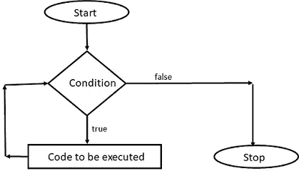

# Dart 编程—学习循环

> 原文：<https://levelup.gitconnected.com/dart-programming-learning-loops-f7e71684bb61>


在编写程序时，我们需要一遍又一遍地重复某一组指令。这就是循环进入画面的时候。循环包含程序员想要重复的指令。这种循环中的重复称为迭代。

> 有两种类型的循环:
> 
> 确定和不确定循环

**确定循环**包含确定/固定次数的迭代。

例子:`for`循环

**不定循环**包含不定/未知的迭代次数。

例子:`while`循环和`do…while`循环


环

让我们详细看看这些循环:

**一、定环**

1.  **为循环**

`for`循环用于迭代(执行)指令集指定的次数。主要用于循环迭代一组固定的值(如数组、字符串、集合)

for 循环的语法是:

```
***for(initialization; condition; step)******{******// Block of instructions******}***
```


For 循环流程图


数字阶乘的 For 循环示例

在某些情况下，我们可以使用 for 循环，如下所示:

*在 for 循环之前初始化变量*


*执行循环*内的步骤


我们可以在 for 循环中初始化和单步执行两个以上的变量


**2。对于…..在循环中**

为了处理对象列表，我们可以使用一个`for….in` 循环。

for 循环的语法是:

```
***for(variable_name in object_list)******{******// Block of instructions******}***
```


当执行一个`for…in`循环时，来自`*stringList*`的一个值被分配给变量 *str* 和 *str* 块处理。

**二。无限循环**

1.  **While 循环**

如果程序员想根据条件的结果执行一组指令，那么就使用 while 循环。While 循环也称为入口控制循环。

如果条件结果为真，则执行指令集，在结束时，循环控制再次检查条件，这意味着执行您的指令，直到条件为假。一旦控制得到条件的假结果，则执行`while`循环的立即指令

while 循环的语法:

```
***while(condition)******{******// Block of instructions******}***
```



While 循环流程图


数字阶乘的 while 循环示例

**2。do…while 循环**

`do…while`循环就像`while`循环一样工作，唯一的区别是它在结束时检查条件。这意味着一组指令在一个`do…while`循环中至少执行一次。`do…while`回路也称为出口控制回路。

while 循环的语法

```
***do {******// Block of instructions******} while(condition);***
```

不要漏掉分号(；)在`while`语句之后。


做…的流程图..while 循环


做…数字阶乘的 while 循环示例

谢谢大家！