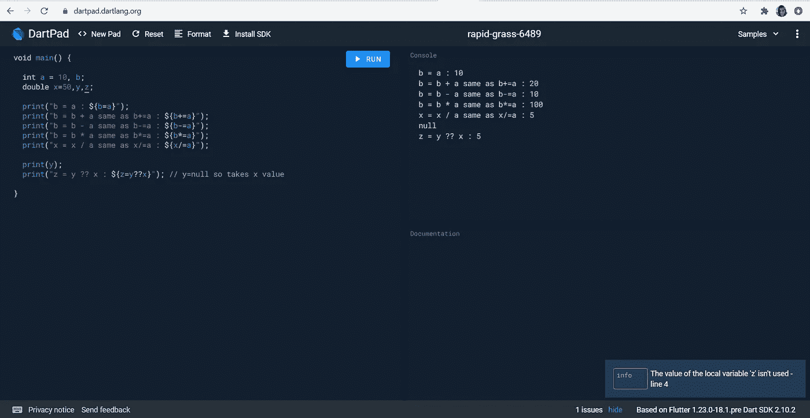

# Dart 编程-学习运算符。

> 原文：<https://levelup.gitconnected.com/dart-programming-learning-operators-43858dfd0b63>

为了计算任何值，你需要写一种特殊的语句，这种语句叫做**表达式**。操作数和运算符是表达式的主要元素。

**操作数**代表数据

**运算符**是一种特殊的符号，它告诉操作数将如何被处理以生成结果。

例如 5+3 这里 5 和 3 是操作数，+(加号)是运算符。

整个 5+3 就是表达式。

在 Dart 中，您可以获得以下类型的运算符:

*   算术运算符
*   关系运算符
*   按位运算符
*   赋值运算符
*   逻辑算子

1.  **算术运算符**

以下是 Dart 支持的算术运算符

算术运算符

算术运算符的示例

**2。关系运算符**

有时我们需要在程序中比较两个值，在这种情况下需要使用关系运算符。关系运算符总是根据下一个语句代码执行的结果返回一个布尔类型的值，即 true/false。

关系运算符

关系运算符的示例

**3。按位运算符**

在对任何表达式求值的过程中，为了提高计算速度，表达式被转换为位级。

按位运算符

按位运算符示例

**4。赋值运算符**

赋值操作符用于给变量赋值，最著名的赋值操作符是=

赋值运算符

赋值运算符示例

**5。逻辑运算符**

逻辑运算符用于组合两个表达式的结果。它总是返回一个布尔值真/假

逻辑运算符

逻辑运算符示例

谢谢大家！