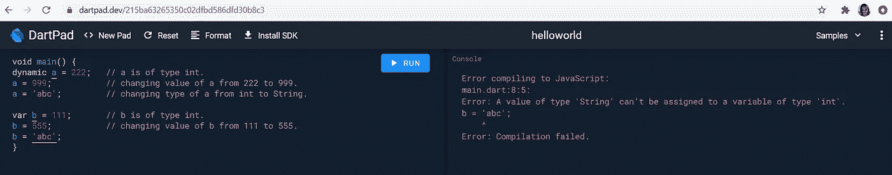

# Dart 编程-学习变量。

> 原文：<https://levelup.gitconnected.com/dart-programming-learning-variables-378d7d6f4bee>


变量用于存储程序中引用和操作的信息。变量只不过是一种保存信息的容器。变量的主要目的是在内存中存储和标记数据，供以后使用。

**Dart 语言支持以下类型:**

*   数字
*   用线串
*   布尔代数学体系的
*   列表
*   地图

1.  **数字**

dart 中的数字表示数字文字。程序员可以将数字定义为整数或双精度数

**整数:**整数值代表非小数值(没有小数点的数值)，例如“5”

声明为:

```
 ***int a = 5;***
```

`**int**`是将它声明为整数类型的关键字，`**a**`是变量名，`**=**` 是赋值运算符，`**5**`是变量的值`a`，`**;**`表示语句结束。

**Double:** Double 值代表小数值(带小数点的数值)，如“5.5”

声明为，

```
***double b = 5.5;***
```

`**double**`是声明为 Double 类型的关键字，`**b**`是变量名，`=`是赋值运算符，`**5.5**`是变量`b`的值，`**;**`表示语句结束。

**2。字符串**

Strings 表示一系列字符。例如，如果程序员想要存储名字、姓氏等。应该使用字符串数据类型。

声明为:

```
***String first_name = “XYZ”;***
```

`**String**`是将其声明为字符串类型的关键字，`**first_name**`是变量名，`**=**`是赋值运算符，`**XYZ**`是字符串变量的值。

字符串值用单引号或双引号括起来。

**3。布尔型**

布尔数据类型表示布尔值 true 和 false。

声明为:

```
***bool isEnabled = false;***
```

`**bool**`是将其声明为布尔类型的关键字，`**isEnabled**`是变量名，`**=**`是赋值运算符，`**false**`是布尔变量的值。

**4。列表**

列表是一组有序的对象。列表类似于数组。

**5。地图**

Map 数据类型表示一组键值对。

定义变量名时有一些 ***规则*** :

*   所有变量名必须以字母或下划线(_)开头。
*   在首字母之后，变量名也可以包含字母和数字。
*   变量名区分大小写。
*   除了下划线(_)和美元符号($)之外，不允许使用空格或特殊字符
*   不能使用关键字(保留字)作为变量名。

**var** 关键字:

变量必须在使用前声明。在 Dart 中，`var`关键字做同样的工作。

```
***var city_name=’London’;***
```

**动态**关键词:

声明时没有静态类型的变量被隐式声明为动态的。

```
***dynamic name=”XYZ”;***
```

**var 与动态的区别:**

**动态:**可以改变变量的类型，可以在代码后期改变变量的值。

**var:** 不能改变变量的类型，但可以在以后的代码中改变变量的值。



Dart 通过在变量名前添加数据类型来支持类型检查。**类型检查**都是为了确保程序是**类型** - **安全**，也就是说**类型**错误的可能性保持在最小。

**final 和 const 关键字:**

`final`和`const`关键字用于声明常量。不允许改变使用`final`和`const`声明的变量值。

当程序员试图修改声明为`final`或`const`的变量时，Dart 抛出异常

语法，

```
**final var_name;** 
```

运筹学

```
**final data_type var_name;**
```

&

```
**const var_name;**
```

运筹学

```
**const data_type var_name;**
```

谢谢大家！