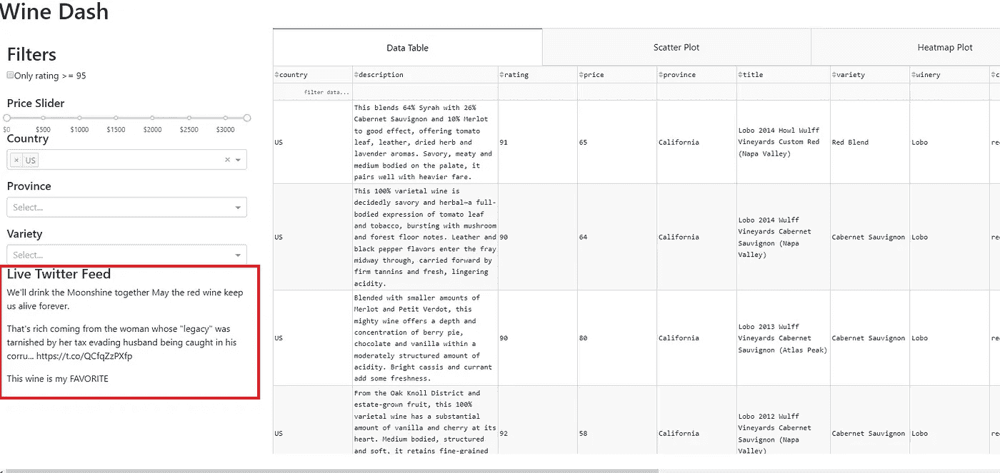
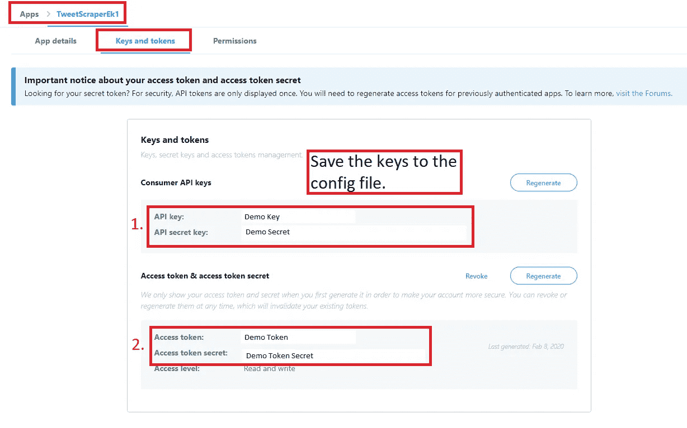
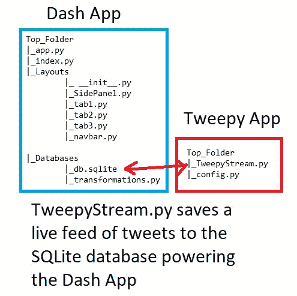
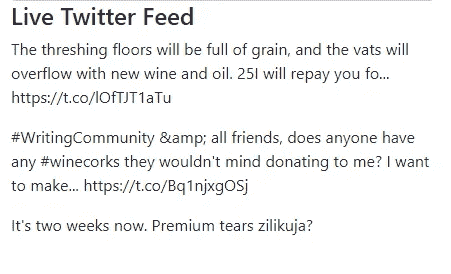

# Python 中的仪表盘，适合使用 Dash 的初学者——实时更新和将数据流式传输到仪表盘

> 原文：<https://levelup.gitconnected.com/dashboards-in-python-for-beginners-using-dash-live-updates-and-streaming-data-into-a-dashboard-37660c1ba661>

## 向 Dash 添加实时订阅源


https://www . publicdomainpictures . net

# 将数据传输到 Dash

分析流数据有几个原因。也许您正在寻找信用交易中的异常情况，监视时间序列中的网络流量和服务器资源，或者为自动交易算法捕获分笔成交点数据。或者你只是想看看人们在 Twitter 上对葡萄酒的评论！在本文中，我将解释如何使用 [Python 库 Tweepy](http://docs.tweepy.org/en/latest/streaming_how_to.html) 将实时 Tweepy 流式传输到用 Dash 构建的葡萄酒仪表盘中。

如果你是 Dash 新手，请查看我以前解释 Dash 基础知识的文章。本文建立在那些文章的[仪表板上。**如果你已经熟悉 Dash，并且想看看如何简单地将数据传输到你的应用中，请继续阅读！**](https://medium.com/swlh/dashboards-in-python-3-advanced-examples-for-dash-beginners-and-everyone-else-b1daf4e2ec0a)

[](https://medium.com/swlh/dashboards-in-python-for-beginners-and-everyone-else-using-dash-f0a045a86644) [## Python 中的仪表盘，适用于初学者和使用 Dash 的其他人

### 使用 Python 中的 Dash 初学者教程构建一个基本的和高级的仪表板

medium.com](https://medium.com/swlh/dashboards-in-python-for-beginners-and-everyone-else-using-dash-f0a045a86644) 

## 了解如何在 Linux 上托管仪表板！

[](/the-easiest-way-to-host-a-multi-page-dashboard-using-python-dash-and-linux-for-beginners-78a78e821ba) [## 对于初学者来说，使用 Python、Dash 和 Linux 托管多页仪表板的最简单方法

### 使用 uWSGI 和 Nginx 在 CentOS 上托管 Dash 应用程序

levelup.gitconnected.com](/the-easiest-way-to-host-a-multi-page-dashboard-using-python-dash-and-linux-for-beginners-78a78e821ba) 

# 改进仪表板

在我的[介绍文章](https://medium.com/swlh/dashboards-in-python-for-beginners-and-everyone-else-using-dash-f0a045a86644)中的例子中，我解释了如何创建一个使用多个选项卡的交互式仪表板应用程序。在这个例子的基础上，我将展示如何向仪表板添加以下内容:

**侧面板中的 Live Wine Twitter Feed**



侧面板中的实时 WineTwitter Feed

# 仪表板复习员

[Dash 是基于 Flask、Plotly.js 和 React.js 编写的 Python 框架](https://dash.plot.ly/)，Dash 应用由布局和回调组成:

## 布局

[布局](https://dash.plot.ly/getting-started)由组件树组成，描述了应用程序的外观以及用户如何体验内容。

## 复试

[回调](https://dash.plot.ly/getting-started-part-2)使 Dash 应用程序具有交互性。回调是 Python 函数，每当*输入*属性改变时，就会自动调用。

**所有的新代码都可以在我的 GitHub 和文末找到！**

# 为什么是 Twitter 数据？

Twitter 提供了大量的数据，很容易通过他们的 API 访问。如果你对[自然语言处理(NLP)](https://towardsdatascience.com/analyzing-wine-descriptions-using-the-natural-language-toolkit-in-python-497ac1e228d5) 感兴趣，或者对挖掘文本中的趋势和情感感兴趣，我强烈推荐你把 Twitter 作为一个数据源！对于这个教程，[你需要在 Twitter 上注册一个应用来获得 API 密匙](https://developer.twitter.com/en.html)。如果你不熟悉 Twitter 的开发者门户，可以看看下面的官方文档！

[](https://developer.twitter.com/en/docs/basics/authentication/oauth-1-0a/obtaining-user-access-tokens) [## 获取用户访问令牌(三脚 OAuth)

### 在高层次上，三足 OAuth 流程将:为消费者应用程序创建一个请求以获取请求…

developer.twitter.com](https://developer.twitter.com/en/docs/basics/authentication/oauth-1-0a/obtaining-user-access-tokens) 

将 Tweepy 连接到 Twitter 使用了 [OAuth1](https://en.wikipedia.org/wiki/OAuth) 。他们编写了一个易于使用的处理程序，使得连接到 twitter API 变得不费力。如果您是 API 认证的新手，请查看[官方 Tweepy 认证教程](http://docs.tweepy.org/en/latest/auth_tutorial.html)。

```
 pip install tweepy
```

## 管理您的 API 密钥

如果您是管理密钥的新手，请确保将它们保存到 config.py 文件中，而不是在您的应用程序中硬编码它们。 **API 密钥可能非常有价值，必须加以保护**。如果你担心你的密钥被泄露，Twitter 允许你重新生成它们。 [***将配置文件添加到您的 gitignore 文件中，以防止它也被推送到您的 repo 中*** *！*](https://towardsdatascience.com/a-simple-git-workflow-for-github-beginners-and-everyone-else-87e39b50ee08)



## 文件结构

Dash 应用程序的文件结构将保持不变，但我需要创建一个应用程序，将推文传输到 SQLite 数据库，为葡萄酒仪表板提供动力。在本教程中，我将修改 Dash 应用程序，而不是添加文件。

创建一个文件夹和两个文件:

*   TweepyStream.py
*   配置. py



## 创建配置文件

使用这个文件来存储您的 API 密钥。

```
#consumer key, consumer secret, access token, access secret.
con_key=""
con_sec=""
a_token=""
a_secret=""
```

有趣的事情…

# 从 Tweepy 开始

使用 Tweepy，我可以创建一个流对象，它将产生一个持续的 tweets 流。由我来决定如何处理传入的流。**我正在连接 wine_data SQLite 数据库，创建一个新表并插入 tweet 和时间戳**。[如果你不熟悉 SQL 表或者需要复习，查看这个免费网站的例子](https://www.w3schools.com/sql/sql_create_table.asp)。

## 导入依赖项

根据需要使用 pip 或 conda 安装依赖项。你可能需要安装 *unidecode* Python 包。函数 ***unidecode()*** 获取 Unicode 数据，并尝试用 ASCII 字符表示它。

## **创建 TweepyStream.py**

```
#import dependencies
import tweepy
from tweepy import OAuthHandler
from tweepy.streaming import StreamListenerimport json
from unidecode import unidecode
import time
import datetime#import the API keys from the config file.
from config import con_key, con_sec, a_token, a_secretimport sqlite3conn = sqlite3.connect("db\wine_data.sqlite")
c = conn.cursor()
```

我需要创建表来存储葡萄酒数据。我使用 SQLite 是因为它是轻量级的和无服务器的。另外，我喜欢把所有的数据都放在一个地方！

```
def create_table():
    c.execute("CREATE TABLE IF NOT EXISTS wineTweets(timestamp REAL, tweet TEXT)")
    conn.commit()create_table()
```

注意，如果不存在，我使用**来确保数据库中不存在该表。记住使用***conn . commit()***调用提交事务。**

## 使用 Tweepy 流式传输

twitter 流 API 允许您实时下载 Twitter 消息。Tweepy 通过处理大量的细节，使得使用 twitter 流 API 变得很容易。这对于获得大量的推文很有用，但是在我的例子中，我使用 ***time.sleep()*** 来减缓流的速度。有关如何使用所有功能的详细信息，请参见 [Twitter 流媒体 API 文档](https://developer.twitter.com/en/docs/tweets/filter-realtime/overview)和 [Tweepy 流媒体文档。](http://docs.tweepy.org/en/latest/streaming_how_to.html)

## **创建一个 StreamListner 类**

下面是一些样板代码，用于从流 twitter 数据中提取 tweet 和时间戳，并将其插入数据库。

```
class WineListener(StreamListener):def on_data(self, data):
        try:
            data = json.loads(data)
            tweet = unidecode(data['text'])
            time = data['timestamp_ms']                       #print the stream data to debug
            #print(tweet, time_ms)
            c.execute("INSERT INTO wineTweets (timestamp, tweet) VALUES (?, ?)", (time, tweet))
            conn.commit()

            #slow the stream
            time.sleep(2) except KeyError as e:
            print(str(e))
        return(True)

    def on_error(self, status_code):
        if status_code == 420:
            #returning False in on_error disconnects the stream
            return False
```

请注意，代码被包装在 try/except 中，以防止潜在的中断中断流。此外，文档建议使用 ***on_error()*** 函数在应用程序发出过多请求时充当断路器。[查看 Twitter 文档中的所有状态代码](https://developer.twitter.com/en/docs/basics/response-codes)。

## **创建一个流对象**

只要应用程序可以发出请求，它就应该尝试验证和下载推文。因此，最好将流对象代码包装在一个 *while 条件中。这样，如果遇到 420 错误，它就会停止。*

```
while True: try:
        auth = OAuthHandler(con_key, con_sec)
        auth.set_access_token(a_token, a_secret)
        twitterStream = tweepy.Stream(auth, WineListener()) #Use track to find keywords and follow to find users
        twitterStream.filter(track=['wine'])
    except Exception as e:
        print(str(e))
        time.sleep(4)
```

注意***twitterstream . filter***使用 *track* 来查找推文中的关键词。如果您想要关注特定用户的推文，请使用 ***。过滤器(follow=[""])*** 。

# 十二密码

以下是完整的 Tweepy twitter 流代码:

```
import tweepy
from tweepy import OAuthHandler
from tweepy.streaming import StreamListenerimport json
import sqlite3from unidecode import unidecode
import time
import datetimefrom config import con_key, con_sec, a_token, a_secretconn = sqlite3.connect(r"db\wine_data.sqlite")
c = conn.cursor()def create_table():
    c.execute("CREATE TABLE IF NOT EXISTS wineTweets(timestamp REAL, tweet TEXT)")
    conn.commit()create_table()class WineListener(StreamListener):def on_data(self, data):
        try:
            data = json.loads(data)
            tweet = unidecode(data['text'])
            time_ms = data['timestamp_ms']
            #print(tweet, time_ms)
            c.execute("INSERT INTO wineTweets (timestamp, tweet) VALUES (?, ?)", (time_ms, tweet))

            conn.commit()
            time.sleep(2)except KeyError as e:
            print(str(e))
        return(True)

    def on_error(self, status_code):
        if status_code == 420:
            #returning False in on_error disconnects the stream
            return Falsewhile True:try:
        auth = OAuthHandler(con_key, con_sec)
        auth.set_access_token(a_token, a_secret)
        twitterStream = tweepy.Stream(auth, WineListener())
        twitterStream.filter(track=['wine'])
    except Exception as e:
        print(str(e))
        time.sleep(4)
```

# 更新 Dash 应用程序

我没有将流添加到 Dash 应用程序的新标签或现有标签中，而是认为将它包含在侧面板中会很方便。这样，新数据总是可见的！为了自动更新仪表板，[我将使用](https://dash.plot.ly/live-updates) `[dash_core_components.Interval](https://dash.plot.ly/live-updates)` [组件](https://dash.plot.ly/live-updates)。

## 破折号间隔组件

引用 Dash 文档:

> 元素允许您在预定义的时间间隔内更新组件。`n_intervals`属性是一个整数，每过`interval`毫秒就会自动递增。

可以将间隔用作回调**的输入。**它本质上是通过在定义的时间间隔执行回调来实现自动化！

# **编辑 sidepanel.py 文件**

在侧面板的主 Div 列表中，添加另一个 ***html。Div* 列表**列表。然后，在该 Div 中添加音程组件。将组件包装在 Div 中始终是一个好的做法。如果你对此感到困惑，不要担心！完整的侧面板代码即将发布！

## 添加音程组件

在 Div 中，我添加了 ***dcc。间隔*** 组件和另一个 ***html。Div*** 作为区间回调输出的占位符。记住，Dash 允许你更新 **html** 组件的*子组件*。

```
,html.Div([
             html.H4('Live Twitter Feed')
            , html.Div(id='live-update-text')
            , dcc.Interval(
                id='interval-component',
                interval=1*10000, # in milliseconds
                n_intervals=0
            )
```

注意我使用了一个 ***html。*H4**表头区分特征。
请注意，我将时间间隔设置为 10000 毫秒，所以推文将在侧面板中每 10 秒更新一次。

## 创建回调

回调相当简单，因为它只需要做两件事:

1.  将*区间组件*组件中的 *n_intervals* 作为**输入**。
2.  **输出**的*子*为**的 *html。ID 为*的 div****-实时更新-正文。

```
[@app](http://twitter.com/app).callback(Output('live-update-text', 'children'),
              [Input('interval-component', 'n_intervals')])
def update_tweet(n):conn = sqlite3.connect(r"db\wine_data.sqlite")
    c = conn.cursor()sql = '''select tweet from wineTweets 
                where tweet not like 'RT %'
                order by timestamp desc'''
    tweet_df = pd.read_sql(sql, conn)if len(tweet_df) > 500:
        c.execute("DELETE FROM wineTweets")
        conn.commit()return html.Div([
                html.P(tweet_df['tweet'][0])
                ,html.P(tweet_df['tweet'][1])
                ,html.P(tweet_df['tweet'][2])
        ])
```

注意，我使用 SQL Select 语句来查询 SQLite 数据库。我的语句通过在 where 子句中包含“ *where tweet not like 'RT %'* ”来排除转发
[在 SQL 字符串中使用%符号充当通配符](https://www.w3schools.com/sql/sql_wildcards.asp)。
注意，我包含了一个 **IF** 语句，当数据库达到一定大小时，它会截断数据库。因为我只显示前 3 个结果，所以我没有必要保存这些数据！

该函数返回 3 个 ***html。P* 组件**组件。他们只是显示最近的推文。如果你想显示更多的推文，添加更多的 ***html。P*** 组件！

如果您不熟悉 SQL Select 语句，请查看我的介绍文章:

[](https://medium.com/@erickleppen01/learn-sql-techniques-selecting-data-and-more-in-sql-server-624f81dd16b2) [## 学习 SQL 技术:在 SQL Server 中选择数据和更多内容

### SQL 语句介绍和查找重复数据的查询。学习 SQL

medium.com](https://medium.com/@erickleppen01/learn-sql-techniques-selecting-data-and-more-in-sql-server-624f81dd16b2) 

# 完整的侧板代码

这是更新后的 sidepanel.py 代码，如果您一直在学习前面的教程，您可以复制并粘贴它:

```
import dash
import plotly
import dash_core_components as dcc
import dash_html_components as html 
import dash_bootstrap_components as dbc 
import dash_table
import pandas as pd
from dash.dependencies import Input, Output
import sqlite3from app import appfrom tabs import tab1, tab2
from database import transformsdf = transforms.df
min_p=df.price.min()
max_p=df.price.max()layout = html.Div([
    html.H1('Wine Dash')
    ,dbc.Row([dbc.Col(
        html.Div([
         html.H2('Filters')
        , dcc.Checklist(id='rating-95'
        , options = [
            {'label':'Only rating >= 95 ', 'value':'Y'}
        ])
        ,html.Div([html.P()
                ,html.H5('Price Slider')
                ,dcc.RangeSlider(id='price-slider'
                            ,min = min_p
                            ,max= max_p
                            , marks = {0: '$0',
                                        500: '$500',
                                        1000: '$1000',
                                        1500: '$1500',
                                        2000: '$2000',
                                        2500: '$2500',
                                        3000: '$3000',
                                       }
                            , value = [0,3300]
                            )

                            ])
        ,html.Div([html.P()
            ,html.H5('Country')
            , dcc.Dropdown(id = 'country-drop'
                        ,options=[
                             {'label': i, 'value': i} for i in df.country.unique()
                        ],
                        value=['US'],
                        multi=True
                    )  
        ]),html.Div([html.P()
            ,html.H5('Province')
            , dcc.Dropdown(id = 'province-drop',
                            value=[],
                            multi=True
                        )]),html.Div([html.P()
            ,html.H5('Variety')
            , dcc.Dropdown(id = 'variety-drop',
                            value=[],
                            multi=True
                        )])
        ,html.Div([
             html.H4('Live Twitter Feed')
            , html.Div(id='live-update-text')
            , dcc.Interval(
                id='interval-component',
                interval=1*10000, # in milliseconds
                n_intervals=0
            )
        ])], style={'marginBottom': 50, 'marginTop': 25, 'marginLeft':15, 'marginRight':15}
        )#end div
    , width=3) # End col,dbc.Col(html.Div([
            dcc.Tabs(id="tabs", value='tab-1', children=[
                    dcc.Tab(label='Data Table', value='tab-1'),
                    dcc.Tab(label='Scatter Plot', value='tab-2'),
                    dcc.Tab(label='Heatmap Plot', value='tab-3'),
                ])
            , html.Div(id='tabs-content')
        ]), width=9)
        ]) #end row

    ])#end div[@app](http://twitter.com/app).callback(Output('live-update-text', 'children'),
              [Input('interval-component', 'n_intervals')])
def update_tweet(n):conn = sqlite3.connect(r"db\wine_data.sqlite")
    c = conn.cursor()sql = '''select tweet from wineTweets 
                where tweet not like 'RT %'
                order by timestamp desc'''
    tweet_df = pd.read_sql(sql, conn)if len(tweet_df) > 5000:
        c.execute("DELETE FROM wineTweets")
        conn.commit()return html.Div([
                html.P(tweet_df['tweet'][0])
                ,html.P(tweet_df['tweet'][1])
                ,html.P(tweet_df['tweet'][2])
        ])[@app](http://twitter.com/app).callback(Output('province-drop', 'options'),
[Input('country-drop', 'value')])
def set_province_options(country):

    if len(country)> 0:
        countries = country
        return [{'label': i, 'value': i} for i in sorted(set(df['province'].loc[df['country'].isin(countries)]))]

    else:
        countries = []
        return [{'label': i, 'value': i} for i in sorted(set(df['province'].loc[df['country'].isin(countries)]))][@app](http://twitter.com/app).callback(Output('variety-drop', 'options'),
[Input('province-drop', 'value')])
def set_variety_options(province):# if province is None:
    #     provinces = []

    if len(province)> 0:
        provinces = province
        return [{'label': i, 'value': i} for i in sorted(set(df['variety'].loc[df['province'].isin(provinces)]))]

    else:
        provinces = []
        return [{'label': i, 'value': i} for i in sorted(set(df['variety'].loc[df['province'].isin(provinces)]))]
```



推特直播

# 包扎

虽然我只向 wine dashboard 添加了一个新组件，但是本教程展示了使用 ***dcc*** 将数据从 SQL 数据库拖到 Dash dashboard 是多么简单。 ***区间*** 分量。使用 Twitter 作为数据源来传输实时推文，我不仅可以了解最新的葡萄酒聊天，还可以收集数据集来探索更高级的 NLP。Tweepy 使与 Twitter API 的交互和直接向数据库传输数据变得容易，而 Dash 使显示信息变得容易。

尽管本教程使用了 twitter 数据，但同样的概念也可以应用于出于任何原因从数据库中提取数据！Dash 使 dcc 的使用变得简单。将数据输入仪表板的间隔组件。

如果您对托管您的仪表板或数据科学项目感兴趣，请查看我比较一些流行选项的文章！

[](https://medium.com/@erickleppen01/affordable-options-for-hosting-your-data-science-projects-7d290e8a5c11) [## 托管数据科学项目的经济实惠的选择

### 简要介绍 3 个托管选项:数字海洋、Hetzner 和 Heroku

medium.com](https://medium.com/@erickleppen01/affordable-options-for-hosting-your-data-science-projects-7d290e8a5c11) 

# 谢谢大家！

*   *如果你喜欢这个，* [*在 Medium 上关注我*](https://medium.com/@erickleppen) *了解更多*
*   [*通过订阅*](https://erickleppen.medium.com/membership) 获得对我的内容的完全访问和帮助支持
*   *我们来连线上*[*LinkedIn*](https://www.linkedin.com/in/erickleppen01/)
*   *用 Python 分析数据？查看我的* [*网站*](https://pythondashboards.com/)

[**—埃里克·克莱彭**](http://pythondashboards.com/)

感谢阅读！**查看我的其他文章或我的 GitHub 获取完整的仪表板代码**:

[](https://medium.com/swlh/dashboards-in-python-for-beginners-and-everyone-else-using-dash-f0a045a86644) [## Python 中的仪表盘，适用于初学者和使用 Dash 的其他人

### 使用 Python 中的 Dash 初学者教程构建一个基本的和高级的仪表板

medium.com](https://medium.com/swlh/dashboards-in-python-for-beginners-and-everyone-else-using-dash-f0a045a86644) [](https://medium.com/swlh/dashboards-in-python-3-advanced-examples-for-dash-beginners-and-everyone-else-b1daf4e2ec0a) [## Python 中的仪表板:Dash 初学者和其他人的 3 个高级示例

### 编写 Python 仪表板代码！学习使用动态下拉列表过滤数据，创建热图，并添加导航栏…

medium.com](https://medium.com/swlh/dashboards-in-python-3-advanced-examples-for-dash-beginners-and-everyone-else-b1daf4e2ec0a) [](https://github.com/bendgame) [## 弯曲游戏-概述

### 在 GitHub 上注册你自己的个人资料，这是托管代码、管理项目和构建软件的最佳地方…

github.com](https://github.com/bendgame)