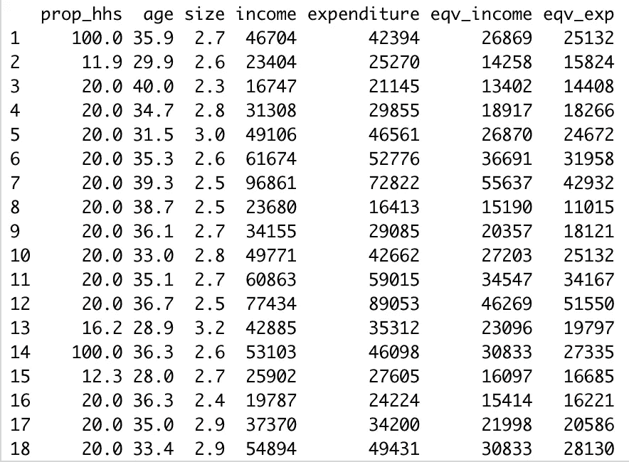
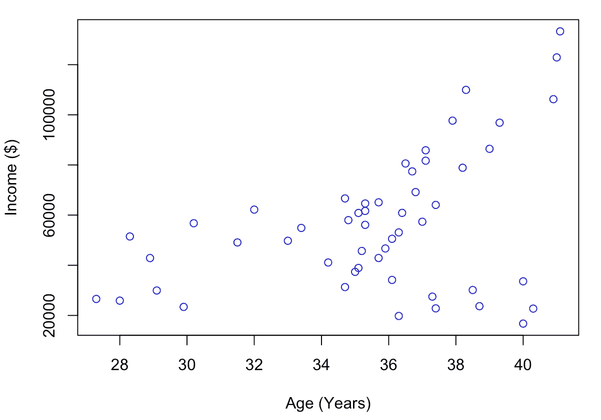
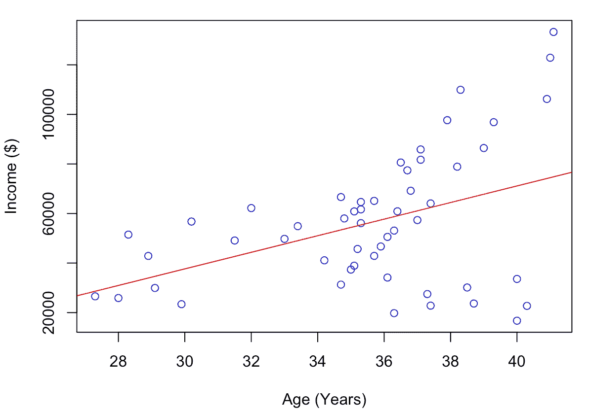
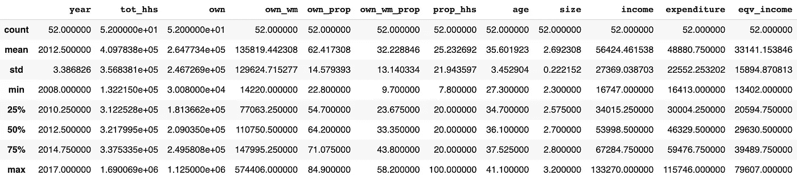
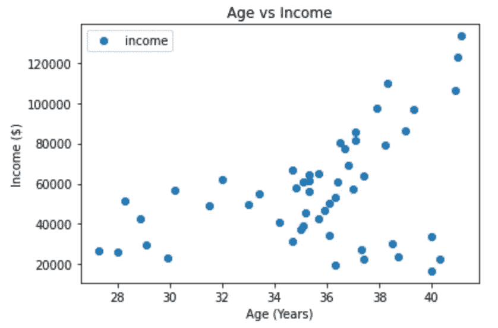
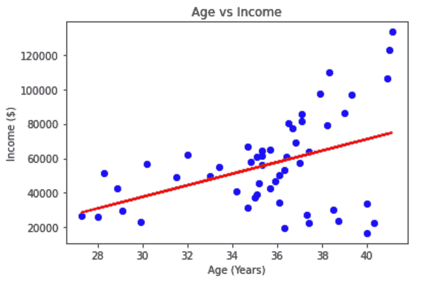

# 使用 R 和 Python 开始数据分析

> 原文：<https://levelup.gitconnected.com/data-analysis-uniqueness-in-r-and-python-72a11bb1eda8>

R 和 Python 编程语言数据分析方法的比较。

**什么是数据科学&数据分析？**

许多统计学家和数据科学家都认为“数据是新的石油”随着 21 世纪数据的兴起，数据科学从大型数据集中获得洞察力，并概述独特比较的趋势。

**线性回归基础知识**

当以图表形式分析数据时，最常用的工具是线性回归。线性回归有助于对数据集之间的趋势和相关性进行建模，以便从中获得洞察力。线性回归是一种基于最佳拟合线(即回归线)的统计方法:

```
y = a + bx
```

上式中，(a)是截距，(y)是因变量，(x)是自变量，(b)是直线的斜率。

线性回归在分析数据集时特别有用，因为它紧密地模拟了因变量和自变量之间的关系。

**实例案例分析**

对于我们的数据分析，我们正在研究家庭生活成本价格指数的例子。包含家庭生活成本价格指数的 CSV 文件可以在[这里](https://www.stats.govt.nz/large-datasets/csv-files-for-download/)找到。任务是用家庭总收入来模拟普通家庭所有者的年龄。我们将使用 R 和 Python 中的方法来执行线性回归，并研究普通房主的年龄与其收入之间的相关性。我们将比较这两种编程语言以及它们产生的结果。

**R 中的数据分析**

首先，让我们设置工作目录，开始提取 CSV 文件的过程。

```
1 setwd("~/Desktop")
```

创建工作目录后，下一步是使用 read.table()函数导入 CSV 文件:

```
2 house = read.table('HOUSE.csv', header=TRUE, sep=",")
```

显示该表为我们提供了数据集的前 18 行和前 18 列:



将年龄列标在 x 轴上，收入列标在 y 轴上，我们得到的是点分布图:

```
3 plot(house$age, house$income)
```



数据集的点图

下面我们使用上面创建的点图创建一个线性回归模型。使用 R 函数 abline()绘制直线，该函数可用于向 R 中的任何图形或数据集添加垂直、水平或回归线。

```
4 line <- lm(house$income ~ house$age)
5 abline(line)
```

在上面代码片段的第 4 行，函数产生收入(y 轴)和年龄(x 轴)之间的斜率。在第 5 行中，abline()函数根据图形的斜率生成一条回归线。结果如下:



R 中的线性回归线

我们走吧！我们推导出 R 中的回归线，发现年龄和收入之间呈正相关，因为年龄每增加两年，收入就增加大约 7000 美元。

现在，下一步是在 Python 中尝试这一点！

**Python 中的数据分析**

提醒我们的任务:用家庭总收入来模拟普通家庭所有者的年龄。

首先，让我们用 Python 导入分析所需的库:

```
1 import math
2 import numpy as np
3 import pandas as pd
4 import matplotlib.pyplot as plt
5 from sklearn.linear_model import LinearRegression
6 from sklearn import metrics
7 %matplotlib inline
```

下一步是使用 Python 函数导入 CSV 文件:

```
8 dataset = pd.read_csv('household-living-costs-price-indexes-march-9 2020-quarter-group-facts.csv')
```

现在让我们显示 CSV，并查看行和列:

```
10 dataset.describe()
```



家庭收入数据集

使用数据集，我们现在可以将“年龄”和“家庭收入”绘制成点状图(年龄为 x 轴，家庭收入为 y 轴):

```
11 dataset.plot(x='age', y='income', style='o')
12 plt.title('Age vs Income')
13 plt.xlabel('Age (Years)')
14 plt.ylabel('Income ($)')
15 plt.show()
```



年龄与收入点图

下一步是将其转换为 NumPy 数组格式:

```
16 X = dataset['age'].values.reshape(-1,1)
17 Y = dataset['income'].values.reshape(-1,1)
```

将它转换成 NumPy 数组后，我们可以创建 LinearRegression 类的一个实例，如下所示:

```
18 regress = LinearRegression()
19 regress.fit(X, Y)
```

下一步是进行预测，以在变量“Y_pred”中创建最佳拟合线:

```
20 Y_pred = regress.predict(X)
```

我们走吧！我们的最后一步是将我们的努力付诸实践，绘制分散点并显示回归线:

```
21 plt.scatter(X, Y, color='blue')
22 plt.plot(X, Y_pred, color='red', linewidth=2)
23 plt.title('Age vs Income')
24 plt.xlabel('Age (Years)')
25 plt.ylabel('Income ($)')
26 plt.show()
```



线性回归线

根据我们在 Python 中的回归分析，我们绘制了最佳拟合线，现在可以从该图中获得洞察力。首先，我们现在知道年龄每增加两年，收入就会增加大约 7000 美元。这个结果与使用 r 获得的结果相同。

**结论**

比较 R 和 Python 两种方法，我们发现线性回归的结果几乎相同！也就是说，需要注意的是，R 中的方法大约需要 5-6 行代码，而 Python 中的方法大约需要 18 行函数代码。

使用 R 的好处是，它有利于数据科学家和分析师，他们希望立即得到结果并对数据集进行统计分析。Python 可以执行相对相同的任务，并且在更大的规模上，可以与机器学习算法集成，以设计新产品和程序。如果您想要创建更大规模的产品，Python 中的数据分析允许与 API 和机器学习算法集成，以获得复杂的解决方案。

仅此而已！同时使用 R 和 Python，您可以通过对您选择的任何数据集使用线性回归和其他函数来从数据分析中获得一些见解。我鼓励你前进，继续探索！

[](https://skilled.dev) [## 编写面试问题

### 一个完整的平台，在这里我会教你找到下一份工作所需的一切，以及…

技术开发](https://skilled.dev)