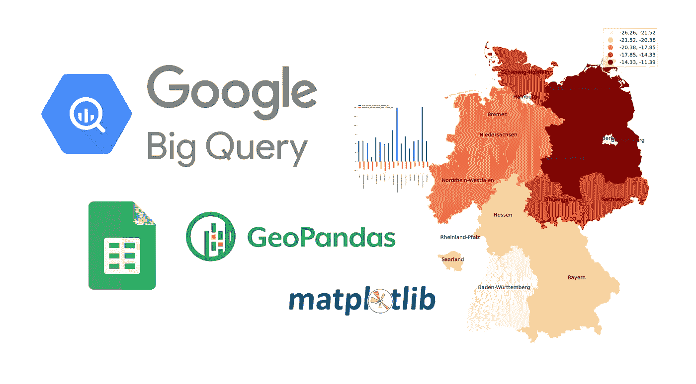
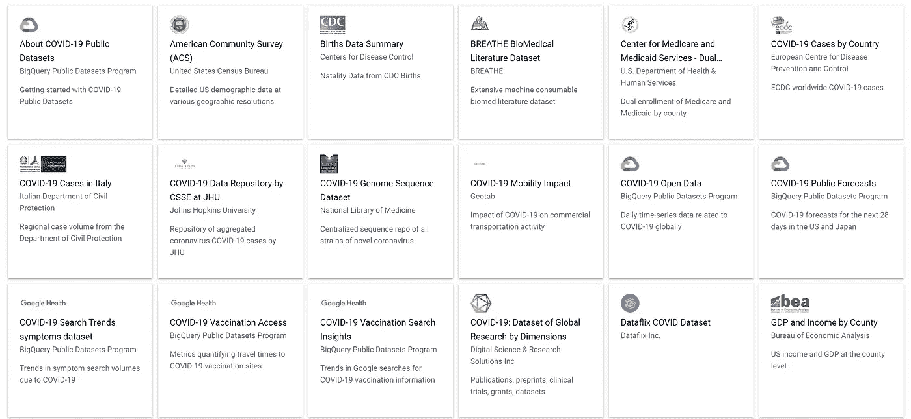
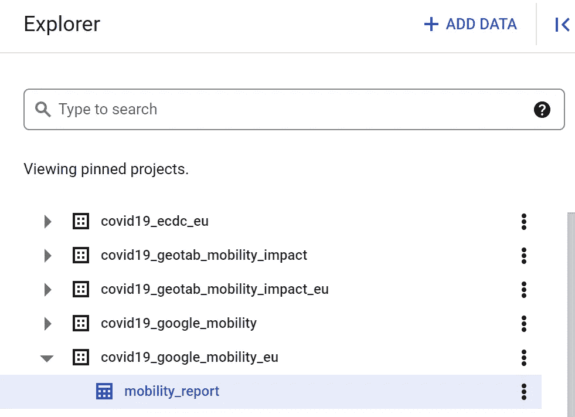
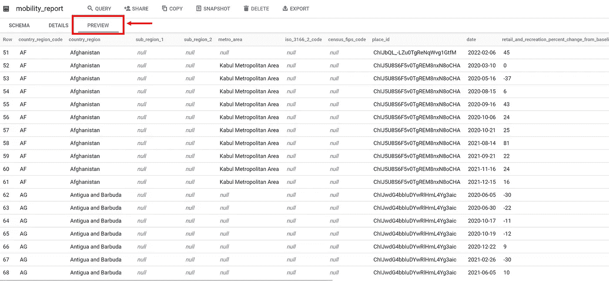
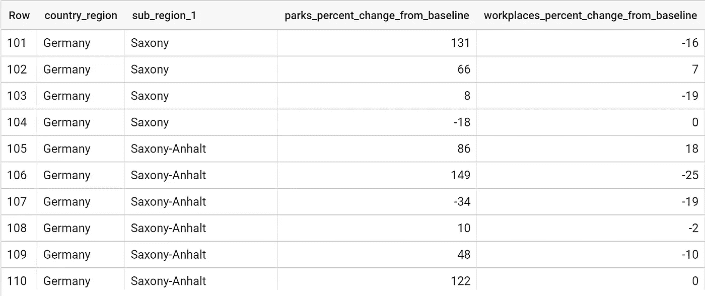
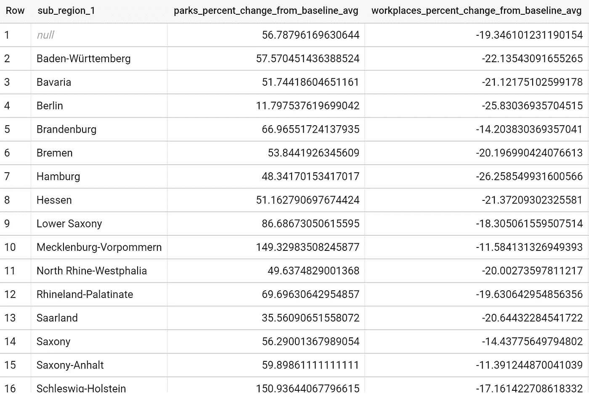
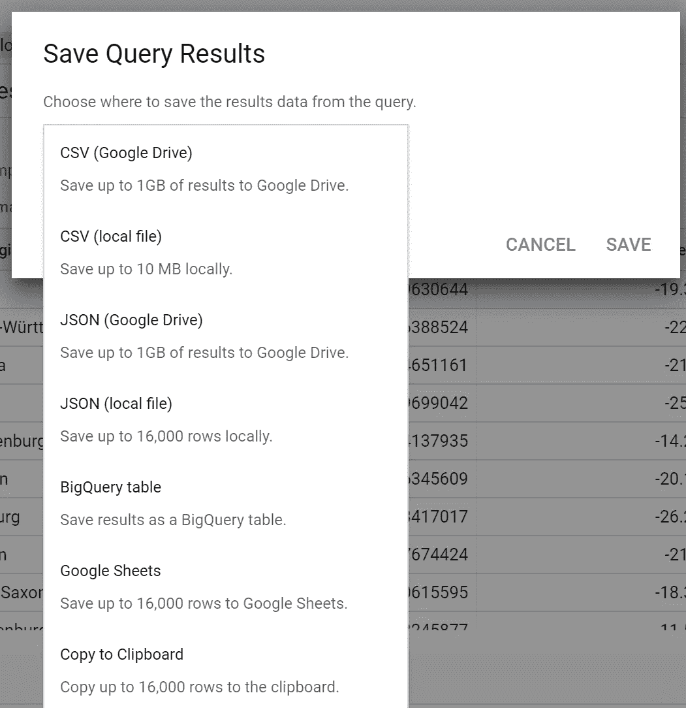
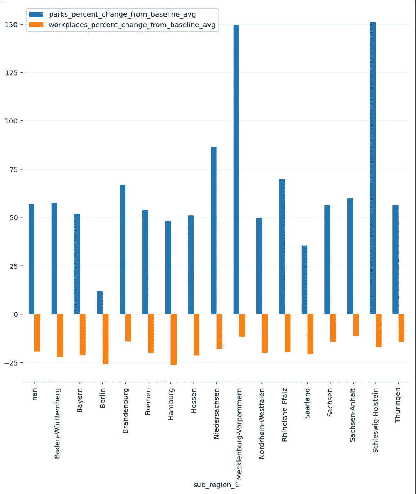
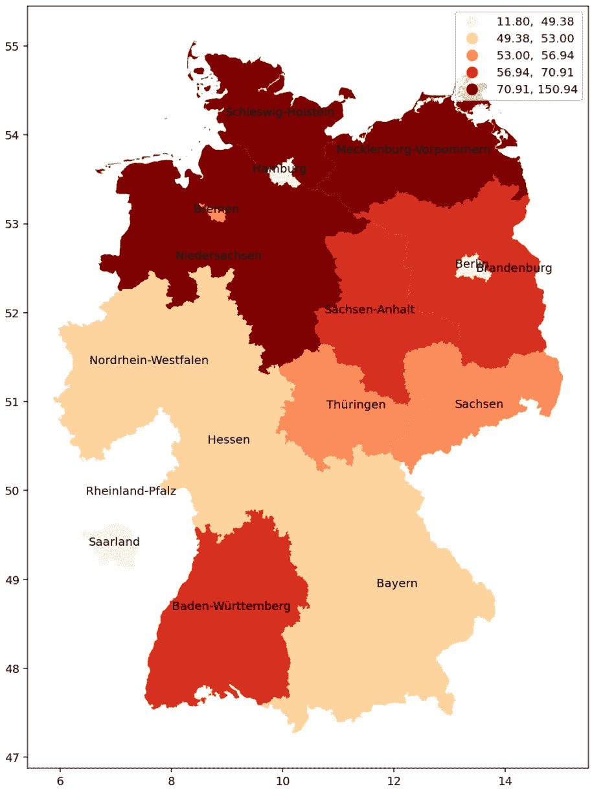
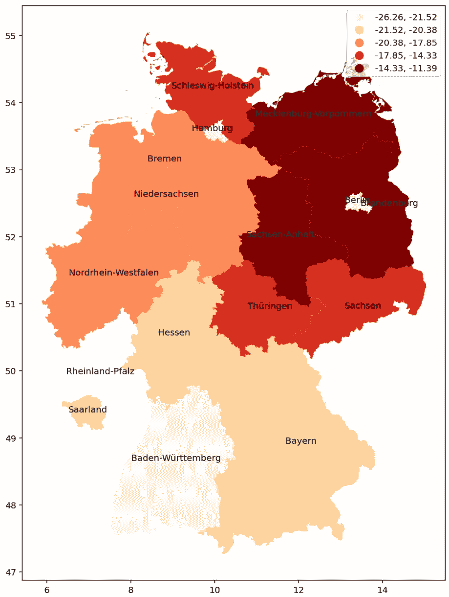

# 使用 Google Cloud BigQuery 进行数据分析

> 原文：<https://levelup.gitconnected.com/data-analysis-with-google-cloud-bigquery-197e3c4caba1>

## 案例研究:新冠肺炎社区流动性报告



**作者图片**

Google BigQuery 已经为您提供了公共数据集来访问和集成到应用程序中。大多数时候，研究人员将大部分时间和资源浪费在数据收集和存储、数据清理和数据处理上。

## 从 BigQuery 中释放数据集

你可以在这里获得几个免费的数据集，如谷歌社区移动报告、新冠肺炎事件、疫苗接种统计、犯罪统计等等。



作者图片

这篇短文将展示 Google BigQuery 如何通过新冠肺炎社区移动性报告的用例来帮助您轻松获得所需的最终数据。

## 要求

*   Google Cloud [账号](https://cloud.google.com/) = >使用 Google BigQuery
*   SQL 基础知识= >查询数据集
*   Python 知识(可选)= >可视化数据

## 示例:使用 BigQuery 获取新冠肺炎社区移动性报告

首先，登录你的谷歌云控制台，打开 BigQuery。https://console.cloud.google.com/bigquery。然后，选择您想要的数据集。在这种情况下，我选择了`**covid19_google_mobility_eu**`



**在 BigQuery 上选择数据**(作者)

您可以通过单击“预览”选项卡快速浏览所选数据集。



`**Preview of covid19_google_mobility_eu dataset** (`作者`)`

现在，我们可以通过点击“查询”按钮来尝试一些查询。

## **示例问题**:在德国，每个地区去公园和工作场所的流动率变化百分比是多少？

**查询:**

```
**SELECT**
   country_region,
   sub_region_1,
   parks_percent_change_from_baseline,
   workplaces_percent_change_from_baseline
**FROM**
   `bigquery-public-data.covid19_google_mobility_eu.mobility_report`
**WHERE**
   country_region = "Germany"
**LIMIT**
   1000;
```



`**Query result from Covid19_google_mobility_eu dataset** (`作者`)`

**结果:**差不多了，但是我们得到了几个重复的`sub_region_1`行，所以我们需要使用 SQL 聚合函数将重复的`sub_region_1`分组在一起。所以，让我们再试一次！

**查询:**

```
**SELECT** sub_region_1,
   AVG(parks_percent_change_from_baseline)  parks_percent_change,
   AVG(workplaces_percent_change_from_baseline) work_percent_change,
**FROM** 
   `bigquery-public-data.covid19_google_mobility_eu.mobility_report`
**WHERE** country_region = "Germany"
**GROUP BY**
   sub_region_1
**LIMIT** 
   1000;
```



`**Query result from Covid19_google_mobility_eu dataset** (`作者`)`

## 导出结果

现在，我们可以以我们需要的格式导出这些数据。



`**Export Query result from Covid19_google_mobility_eu dataset** (`作者`)`

## 探索结果可视化

我们可以使用任何工具进行简单的可视化，例如 Google Data Studio、Excel 或任何软件。在本文中，我将使用 Python 和 matplotlib，因为它们是我最喜欢的工具。您可以使用任何 Python idle/ Jupyter 笔记本来遵循这个示例。

```
# import modules **import pandas as pd
import matplotlib.pyplot as plt**# load query result **query_data = pd.read_csv("/content/drive/MyDrive/bq-results-20220218-140017-rcae0my456p2/bq-results-update.csv")**# Plot **fig, ax = plt.subplots(1, 1, figsize=(10,10))
query_data.plot.bar(x="sub_region_1", ax=ax)**# Some plot decoration
**ax.spines['top'].set_visible(False)
ax.spines['right'].set_visible(False)
ax.spines['left'].set_visible(False)
ax.spines['bottom'].set_color('#DDDDDD')
ax.set_axisbelow(True)
ax.yaxis.grid(True, color='#EEEEEE')
ax.xaxis.grid(False)**
```



**德国各分区参观公园/工作场所的人数百分比变化**(作者)

为了更好地可视化，我们可以在 GeoPandas 模块的帮助下使用地图来说明该数据集。首先，我们需要地图数据。在这种情况下，我们可以从这个[回购](https://github.com/isellsoap/deutschlandGeoJSON)中获得德国 GeoJSON 数据。然后，我们可以做一个简单的连接(左连接)来

```
**import pandas as pd
import numpy as np
import geopandas as gpd
import matplotlib
import matplotlib.pyplot as plt**## Load Germany Map Data
**germany = gpd.read_file("https://raw.githubusercontent.com/isellsoap/deutschlandGeoJSON/main/2_bundeslaender/2_hoch.geo.json")** ## Load Query Result
**query_data = pd.read_csv("/content/drive/MyDrive/bq-results-20220218-140017-rcae0my456p2/bq-results-update.csv")**## Merge Query result to the map data**df_merge = pd.merge(germany, query_data, how="left", left_on='name', right_on='sub_region_1')**## Draw MAP
**fig, ax = plt.subplots(1, 1, figsize=(12,12))
df_merge.plot(ax=ax,
              column='parks_percent_change_from_baseline_avg',
              cmap='OrRd',
              scheme='quantiles',
              legend=True,
              linewidth=1.5,);**
```

运行脚本后，我们得到地图可视化，以查看德国公园游客的平均百分比变化。从可视化中，我们可以发现，来自北方的人比其他州的人更倾向于外出。



疫情 2008 年 9 月 19 日之后，参观公园的人的百分比变化

这是另一个结果——人们去工作场所的百分比变化。我们可以清楚地看到，来自南德国的人倾向于更多地呆在家庭办公室。



**疫情 2019 年奥运会后，参观公园的游客比例变化**(作者)

# 结论

本文提供了从 BigQuery 获取访问和查询数据的分步教程，随后是一些使用条形图和 choropleth 图的数据可视化技术的示例。我希望这篇文章对您有所帮助，并且能够将这种技术应用到您的项目中。

**平安健康！**