# 使用 Strava 进行数据分析

> 原文：<https://levelup.gitconnected.com/data-analysis-with-strava-7251327698e3>

## 如何利用数据和机器学习提高跑步成绩？

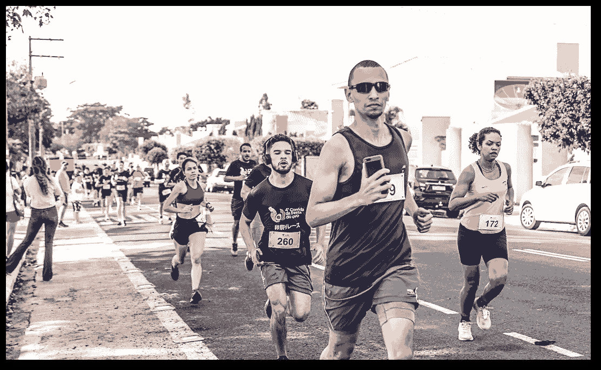

我一直非常喜欢跑步，从很小的时候我就参加比赛，目的是提高我的速度和距离，但是有几个因素影响着跑步，从心理因素到外部因素。然而，随着小工具、可穿戴设备和应用程序(如 [Strava](https://strava.com/) )的使用，已经有可能捕捉指标并执行有助于性能提升的分析。

# 摘要

*   访问数据；
*   数据清洗；
*   见解；
*   特征选择；
*   机器学习；
*   结论；
*   参考文献。

# 访问数据

作为一个数据源，我们将使用 Strava，它是一个 Fremium 应用程序，有一个 API，允许轻松捕获数据。

这里提到的在 API 中插入的步骤也可以从官方文档中获得，但是如果您想客观一些，本文将描述主要步骤。

[](https://developers.strava.com/docs/getting-started/) [## Strava 开发商

### 欢迎来到 Strava API！这是如何使用我们的 API 的简要概述。任何流汗的人都是运动员，所以…

developers.strava.com](https://developers.strava.com/docs/getting-started/) 

访问数据的第一步是创建一个 Strava 帐户，登录然后创建一个应用程序，可以使用[这个链接](https://www.strava.com/settings/api)来完成。

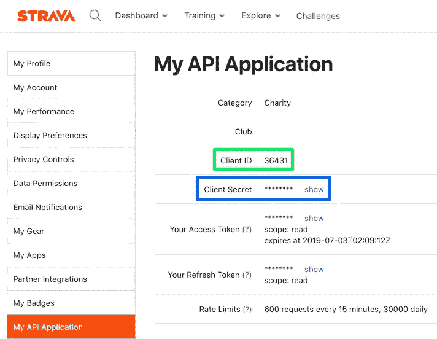

Strava API 仪表板，客户端 id 字段以绿色突出显示，客户端密码字段以蓝色突出显示。

创建应用程序后，我们将主要使用**客户端 ID** (以绿色突出显示)和**客户端秘密**(以蓝色突出显示)。它将被放在项目将被执行的存储库或文件夹的一个`.env`文件中。

然后，您需要访问以下链接，将[CLIENT_ID]字段更改为您的应用程序中可用的值，在上图中以绿色显示。

> [http://www.strava.com/oauth/authorize?CLIENT _ ID =[CLIENT _ ID]&response _ type = code&redirect _ uri = http://localhost/exchange _ token&approval _ prompt = force&scope = profile:read _ all，activity:read_all](http://www.strava.com/oauth/authorize?client_id=[CLIENT_ID]&response_type=code&redirect_uri=http://localhost/exchange_token&approval_prompt=force&scope=profile:read_all,activity:read_all)

访问此链接时，选择您希望应用程序有权访问的数据(如下图所示)，然后单击授权。

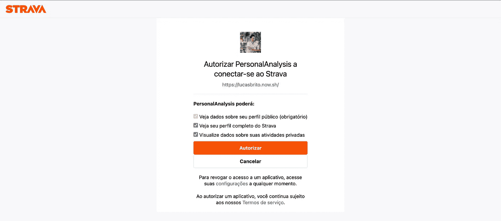

Strava 应用程序授权仪表板。

该操作将生成一个不同的 URI，需要从**代码**参数中复制代码并粘贴到前述的`.env`中。下面是 URI 授权后，以及。env 文件应该是这样的。

> [http://本地主机/exchange_token？state =&code = 2e 9 Fuhe F9 F2 JD 293 jqd 0g 8 erqt 84 r 802 jqd 0137 q&scope = read，activity:read_all，profile:read_all](http://localhost/exchange_token?state=&code=2e9fuhef9f2jd293jqd0g8erqt84r802jqd0137q&scope=read,activity:read_all,profile:read_all)

```
client_id=36431
client_secret=fasfjsfajfjie8293u2jf2j92jf232ije0jje92j
strava_code=2e9fuhef9f2jd293jqd0g8erqt84r802jqd0137q
```

执行完这些步骤后，有必要在与`.env`文件相同的环境中运行下面的 Python 脚本。这个脚本将更新捕获数据所需的令牌，并将使用请求返回的数据生成一个 JSON 文件。我把这个脚本命名为`create_token.py`。

```
import os
import json
import requests
from dotenv import load_dotenv

load_dotenv()

response = requests.post(
    url='https://www.strava.com/oauth/token',
    data={
        'client_id': int(os.environ.get('client_id')),
        'client_secret': os.environ.get('client_secret'),
        'code': os.environ.get('strava_code'),
        'grant_type': 'authorization_code'
    }
)
strava_tokens = response.json()
with open('strava_tokens.json', 'w', encoding='utf-8') as outfile:
    json.dump(strava_tokens, outfile)
print(strava_tokens)
```

更新了令牌和环境变量后，只需运行代码从 API 中捕获数据，如下所示。这里可能会注意到捕获是按页进行的，所以会执行一个循环，直到响应为空或出现错误。值得一提的是，在运行脚本之前，我在同一个工作区创建了两个文件夹，分别名为**数据**和**结果**来存储捕获的 CSV，下面的脚本命名为`get_activities.py`。

```
import os
import json
import glob
import time
import requests
import pandas as pd
from dotenv import load_dotenv

load_dotenv()

def main():
    url = "https://www.strava.com/api/v3/activities"
    access_token = get_credentials()
    page = 1
    print('Getting data from Strava')
    while True:
        response = get_data(url, access_token, 200, page)
        if 'message' in response.columns:
            raise Exception('Authorization Error')
        if response.empty:
            break
        save_csv(response, f'data/strava_activities_page_{page}.csv')
        page += 1
    merge_files('data/', 'result/strava_all_activities.csv')
    print('Done Successfully')
def get_credentials():
    with open('strava_tokens.json', encoding='utf-8') as json_file:
        strava_tokens = json.load(json_file)
    if 'expires_at' not in strava_tokens.keys() or strava_tokens['expires_at'] < time.time():
        strava_tokens = refresh_credentials(strava_tokens)
    return strava_tokens['access_token']
def refresh_credentials(strava_tokens):
    response = requests.post(
        url='https://www.strava.com/oauth/token',
        data={
            'client_id': int(os.environ.get('client_id')),
            'client_secret': os.environ.get('client_secret'),
            'grant_type': 'refresh_token',
            'refresh_token': strava_tokens['refresh_token']
        }
    )
    strava_tokens = response.json()
    with open('strava_tokens.json', 'w', encoding='utf-8') as outfile:
        json.dump(strava_tokens, outfile)
    with open('strava_tokens.json', encoding='utf-8') as check:
        data = json.load(check)
    return data
def get_data(url, access_token, numb_item_page, page):
    print(f'Getting data from page {page}')
    response = requests.get(
        f'{url}?access_token={access_token}&per_page={numb_item_page}&page={page}'
    )
    response = response.json()
    dataframe = pd.json_normalize(response)
    return dataframe
def save_csv(dataframe, filename):
    print(f'Saving {filename}')
    dataframe.to_csv(filename)
def merge_files(path, filename):
    print('Merging files')
    csv_files = [pd.read_csv(_file)
                 for _file in glob.glob(os.path.join(path, "*.csv"))]
    final_df = csv_files.pop(len(csv_files)-1)
    final_df = final_df.append(csv_files)
    save_csv(final_df, filename)
if __name__ == '__main__':
    main()
```

有了数据，让我们开始分析，为了完成这一壮举，我们将使用 Jupyter 笔记本。

# 数据清理

第一步是导入将用于执行数据分析的库，这些库可以分为用于支持脚本的通用库、用于分析和绘制数据帧的库，以及最后用于执行机器学习技术的库。

```
# general
import subprocess
import calendar
from geopy.geocoders import Nominatim

# df and plotting
import pandas as pd
import numpy as np
import seaborn as sns
import matplotlib.pyplot as plt
import matplotlib.dates as mdates

# machine learning
from sklearn import preprocessing
from sklearn import metrics
from sklearn.cluster import KMeans
from sklearn.feature_selection import chi2
from sklearn.feature_selection import SelectKBest
from sklearn.feature_selection import RFE
from sklearn.linear_model import LinearRegression
from sklearn.linear_model import SGDClassifier
from sklearn.metrics import accuracy_score
from sklearn.metrics import confusion_matrix, ConfusionMatrixDisplay
from sklearn.model_selection import train_test_split
from sklearn.pipeline import make_pipeline
from sklearn.preprocessing import StandardScaler

df = pd.read_csv('result/strava_all_activities.csv')
print('Dataframe Shape:', df.shape)
df.head()
```

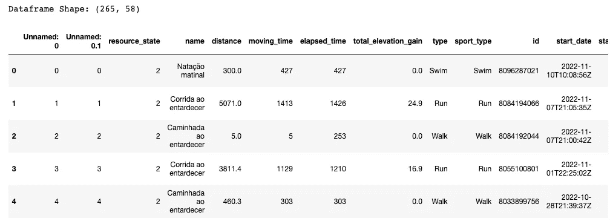

数据集形状和包含数据集数据的表。

第一次接触后，阅读产生的 CSV 显示，我们的数据框架有大约 58 列和一些行，可以根据每个运动员的记录变化。但是当我们查看数据质量时，我们注意到许多数据是空的或者对分析没有贡献，所以我们将只选择研究感兴趣的列。

```
null_df = [[col, df[col].isnull().sum()] for col in df.columns]
print('Null Data:', df.isnull().sum().sum())
list(filter(lambda x: x[1]>0, null_df))
```

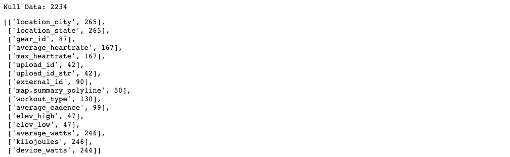

空数据的总量和按数据集列。

```
selected_columns = ['distance', 'moving_time', 'elapsed_time',
                    'total_elevation_gain', 'type','sport_type', 'id', 'start_date',
                    'start_date_local','location_country', 'achievement_count', 'kudos_count',
                    'comment_count','athlete_count', 'start_latlng',
                    'end_latlng', 'average_speed', 'max_speed', 'average_cadence',
                    'average_heartrate', 'max_heartrate', 'elev_high','elev_low',
                    'upload_id', 'external_id', 'pr_count', 'map.summary_polyline']
df = df[selected_columns]
```

首先，我决定提取数据集提供的最大值，并尝试删除尽可能少的数据，因此我根据日期生成了一些数据，用零值、未知标签或平均值填写了一些空字段，最后，我生成了一些数据，标准化了以公里为单位的距离和以分钟为单位的时间。

```
df['start_date_local'] = pd.to_datetime(df['start_date_local'], errors='coerce')
df = df.sort_values(by='start_date_local')

df['weekday'] = df['start_date_local'].map(lambda x: x.weekday)
df['start_time'] = df['start_date_local'].dt.time
df['start_time'] = df['start_time'].astype(str)
df['start_date'] = df['start_date_local'].dt.date

df = df.drop('start_date_local', 1)
df.head()
```

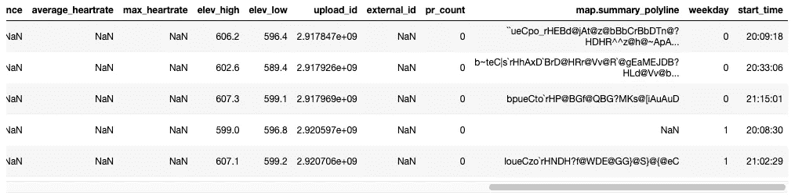

转换产生的数据集。

```
df = df.drop(df[(df.distance < 1) & (df.type == 'Run')].index)
df = df.drop(df[(df.distance < 1) & (df.type == 'Ride')].index)
df = df.drop(df[df.average_speed > 30].index)
df = df.reset_index(drop=True)

df['elev_high'] = df['elev_high'].fillna(value=0)
df['elev_low'] = df['elev_low'].fillna(value=0)
df['upload_id'] = df['upload_id'].fillna(value='unknown')
df['external_id'] = df['external_id'].fillna(value='unknown')
df['map.summary_polyline'] = df['map.summary_polyline'].fillna(value='unknown')
df['average_cadence'] = df['average_cadence'].fillna(value=df['average_cadence'].mean())
df['average_heartrate'] = df['average_heartrate'].fillna(value=df['average_heartrate'].mean())
df['max_heartrate'] = df['max_heartrate'].fillna(value=df['max_heartrate'].mean())

df['moving_time_minutes'] = round(df['moving_time']/60, 2)
df['distance_km'] = round(df['distance'] / 1000, 2)
df['pace'] = df['moving_time_minutes'] / df['distance_km']
df['avg_speed_kmh'] = round(60/df['pace'], 2)
df['max_speed_kmh'] = round(df['max_speed']*3.6, 2)

df['elev'] = df['elev_high'] - df['elev_low']
df['year']= df['start_date'].map(lambda x: x.year)
```

需要强调的一个例子是，我想要完成城市和州字段，因为在最初的训练中，列中还有纬度和经度字段。所以在这种情况下，使用了 [geopy](https://geopy.readthedocs.io/en/stable/) 库。

```
def get_city_state_from_value(value):
    value = value.replace('[','').replace(']','').split(',')
    if value != ['']:
        location = geolocator.reverse(', '.join(value))
        result = f'{location[0].split(",")[1]}, {location[0].split(",")[4]}'
    else:
        result = 'unknown'
    return result
```

```
geolocator = Nominatim(user_agent="strava_exploration_data")
df['location'] = df['start_latlng'].map(get_city_state_from_value)
```

最后，创建了一个基于低于 5 分钟/公里的配速的过滤器，也就是说，创建了一个显示所有平均速度为 12 公里/小时的比赛的列，并可以在未来的分析中使用该列作为响应变量。

```
df['pace_sub_5'] = np.where(df['pace']<=5, True, False)
df.head()
```

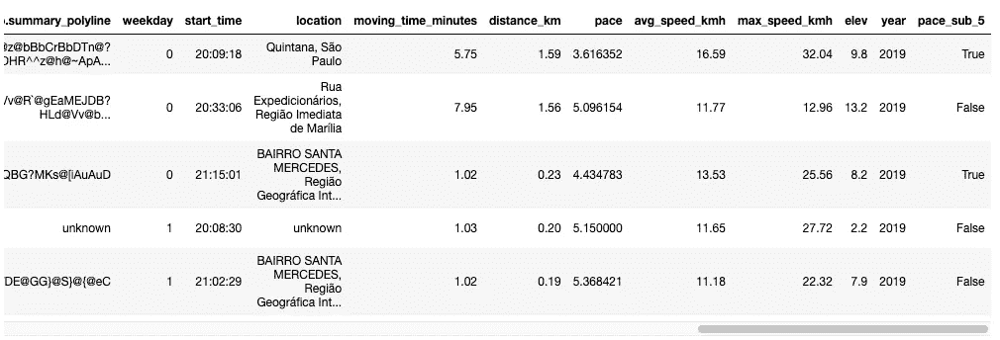

列 pace_sub_5 位于最后一个位置的数据集。

当我们运行`df.info()`和`df.describe().transpose()`时，可以获得以下数据:

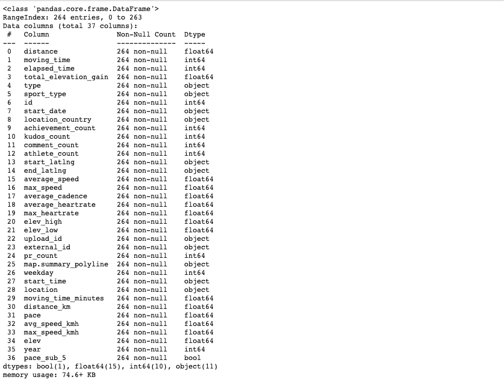

关于数据集的信息。

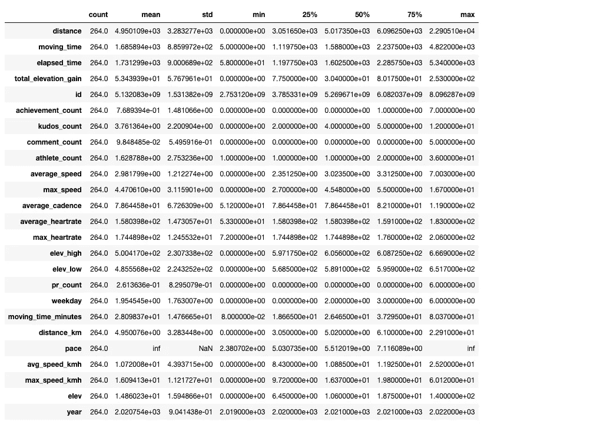

数据集描述。

# 洞察力

现在，有了干净和充分的数据，我们可以进行一系列的分析，试图回答这样的问题:每年注册的数量是多少？根据下面的方框，有可能回答这个问题。

```
fig = sns.catplot(x='year', hue='type', data=df, kind='count')
fig.fig.suptitle('Exercices by Years')
fig.set_xlabels('Year')
fig.set_ylabels('Effortments')
fig
```

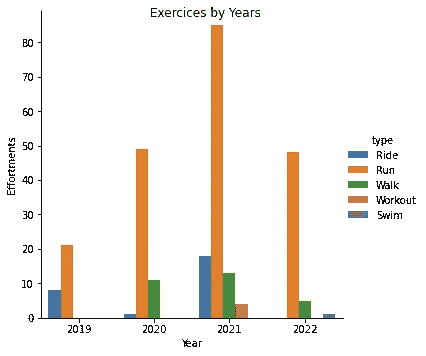

每年练习量的柱状图。

记住，Strava 记录不同类型的活动，但在这种情况下，我们将**仅强调跑步**，因此在影响跑步表现的变量(本质上)中，我强调海拔、心率和与速度相关的因素，所以我想将它们与其他领域联系起来。

第一项分析是将活动时间与道路的海拔高度相关联，其中可以得出结论，海拔高度往往会根据活动时间甚至根据距离而上升。

```
runs = df.loc[df['type'] == 'Run']
sns.regplot(x='moving_time_minutes', y = 'elev', data=runs).set_title("Exercice Time vs Elevation")
```

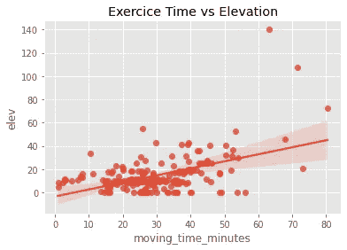

运动时间与海拔高度的回归分布图。

```
sns.regplot(x='distance', y = 'elev', data=runs).set_title("Distance vs Elevation")
```

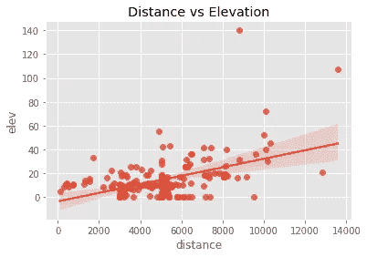

距离和海拔之间的回归分布图。

但这不应被视为一种规则，因为在一些情况下，无论活动时间或距离如何，都会出现低海拔，这在赛道上进行训练时非常常见。

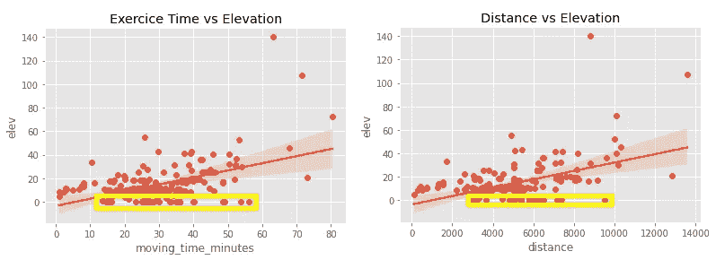

图形高亮显示以低海拔运行。

关于运动时间和距离的另一个观察，值得一提的是，最长和最耗时的训练日通常发生在周日，因为训练的时间更长。

```
runs.groupby('weekday').mean()['moving_time_minutes'].plot.bar()
```

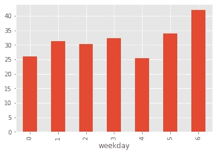

显示一周中每天锻炼时间的图表。

```
runs.groupby('weekday').mean()['distance'].plot.bar()
```

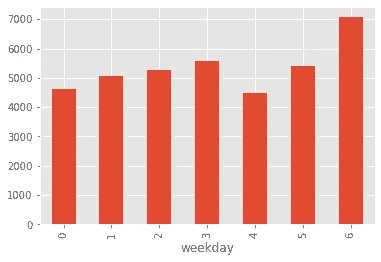

按一周中的每一天显示距离的图表。

关于平均速度(km/h)，可以观察到活动时间越长，平均速度越低，因为疲劳等因素开始影响表现，但当我们观察平均速度与距离的关系时，可以说这种趋势有所增长，即使规模很小。

```
sns.regplot(x='moving_time_minutes', y = 'avg_speed_kmh', data=runs).set_title("Average Speed vs Moving Time")
```

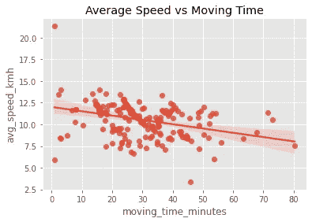

平均速度和锻炼时间之间的回归分布图。

```
sns.regplot(x='distance', y = 'avg_speed_kmh', data=runs).set_title("Average Speed vs Distance")
```

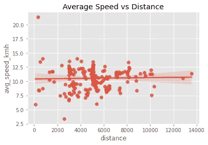

平均速度和距离之间的回归分布图。

最后，在我的情况下，值得一提的是，平均速度随着时间的推移而增加，这是训练和所有致力于这项运动的努力的结果，如下图所示。

```
fig = plt.figure()
ax1 = fig.add_subplot(111)

x = np.asarray(runs.start_date)
y = np.asarray(runs.average_speed)

ax1.plot_date(x, y)
ax1.set_title('Average Speed over Time')

x2 = mdates.date2num(x)
z=np.polyfit(x2,y,1)
p=np.poly1d(z)
plt.plot(x,p(x2),'r--')
fig.autofmt_xdate(rotation=45)
fig.tight_layout()
fig.show()
```

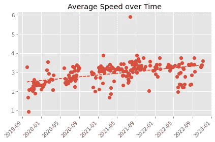

多年平均速度之间的回归分布图。

# 特征选择

至于特征选择，值得一提的是，这是后面机器学习模型应用的重要一步。统计方法可用于选择，这将揭示对于模型的良好性能来说哪些是最重要的特征(或特性)。这样，我们也将能够确认经验引用的特征是否真的好。

了解更多关于特征及其如何与响应变量交互的第一种方法是通过相关矩阵，在 pandas 中使用以下命令可以轻松访问相关矩阵。

```
corr = runs.corr()
plt.figure(figsize = (12,8))
sns.heatmap(corr, fmt=".2f");
plt.title('Correlation between dataset variables')
plt.show()
```

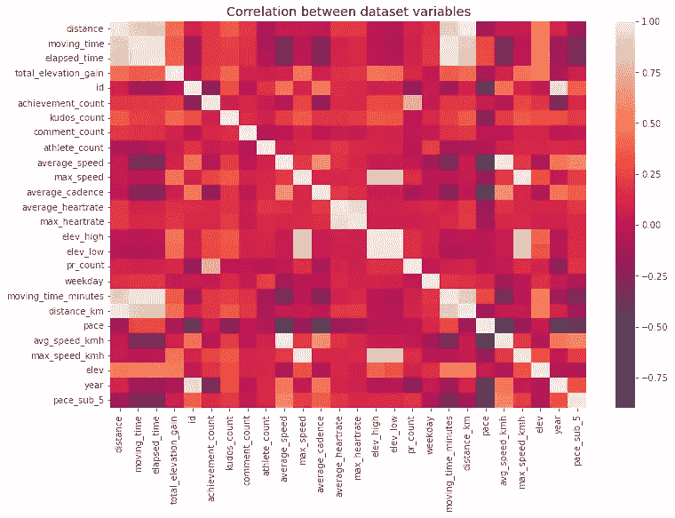

运行数据集变量之间的相关矩阵。

根据该矩阵，可以定义最接近+1 的值具有正相关性，最接近-1 的值具有负相关性。

为了继续分析，运行的数据帧将被打乱，从而防止与偏差和数据帧序列学习相关的问题。此外，分类特征以及运行的`id`将从分析中移除，因为这些字段对于模型训练无效，并且这些字段不会对预测有所贡献，因为它们是在运行结束后形成的。

```
runs = runs.sample(frac=1).reset_index(drop=True)

categorical_cols = [col for col in runs.columns if runs[col].dtypes == 'O']

useless_vars = ['id', 'achievement_count', 'kudos_count', 'comment_count', 'pr_count']
tweak_runs = runs.drop(categorical_cols+useless_vars, axis=1)
tweak_runs
```

此时，响应变量和那些将用于训练的变量将被分离，因此在此操作之后，可以应用使用`chi2`(或其他单变量统计测试)的`SelectKBest`方法来选择最重要的 K 特征，以获得良好的模型性能。

```
y = tweak_runs['pace']
X = tweak_runs.drop('pace',1)

best_features = SelectKBest(chi2, k=7).fit_transform(X, y.astype(int))
best_features
```

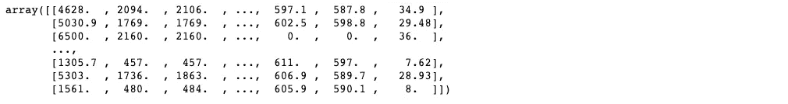

由 SelectKBest 选择的特性值。

特征选择的另一种选择是递归特征消除(RFE)的应用，它训练所选择的模型，并根据特征重要性的缺乏递归地消除特征。但是如上所述，此时必须已经为本次运行选择了模型，因此我们将运行一个模型来执行线性回归，另一个模型来执行随机梯度下降(SGD ),因此这两个模型的响应变量是不同的。

值得一提的是，RFE 对于高维数据集来说是一个沉重的方法，所以一个替代方案是使用 [SelectFromModel](https://scikit-learn.org/stable/modules/generated/sklearn.feature_selection.SelectFromModel.html) 。下面是执行 RFE 的函数的定义，以及它分别用于线性回归和 SGD 的情况。

```
def get_best_rfe_features(X,y, model):
    rfe = RFE(model, step=0.05).fit(X, y)
    selected_features = [i for i, j in zip(X.columns, rfe.support_) if j]
    return selected_features
```

```
y = tweak_runs['pace']
X = tweak_runs.drop('pace',1)

encoded_y = preprocessing.LabelEncoder().fit_transform(y)
model = LinearRegression()
linear_feats = get_best_rfe_features(X, encoded_y, model)
```

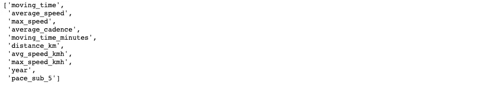

为回归选择的最佳变量。

```
y = tweak_runs['pace_sub_5']
X = tweak_runs.drop('pace_sub_5',1)

model = SGDClassifier(loss="hinge", penalty="l2", max_iter=5)
class_feats = get_best_rfe_features(X, y, model)
```

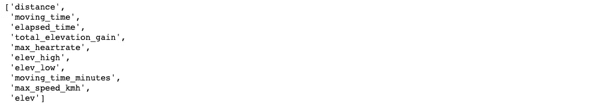

为分类选择的最佳变量。

可以应用的其他方法和组合，例如，改变 SGD 模型的`loss`或者甚至改变 RFE 中的`steps`的数量，但是由于本文的目的不是要深入研究这种方式，所以这些方法的介绍足以为我们带来好的结果

# 机器学习

在机器学习技术中，我们将在这个项目中使用三种，用于聚类、回归和分类。

## 使聚集

在可以实现的机器学习技术中，我们提到一种用于执行聚类的无监督学习领域，称为 K-means。因此，在实践中，这种技术会将相似的比赛记录分组。值得一提的是，这种方法是随机的，所以每次执行可能会产生不同的结果。

要运行 K-means，只需将响应变量与其他变量分开，其中我们将使用熊猫函数`get_dummies`来利用分类变量，分类变量将被转换为其他虚拟变量。分离变量后，只需选择聚类的数量，然后继续进行 K-means 类，以及特征数据集中的拟合。为了找出每个样本属于哪个分类，我们将复制原始运行数据集，并向记录中添加一个分类标识符。

```
X = runs.drop('pace',1)
X = pd.get_dummies(X)

model = KMeans(n_clusters=4).fit(X)
clusterin_runs = runs.copy()
clusterin_runs['Cluster'] = model.labels_
```

完成后，我们可以查看每个分类中的记录数、平均值、标准偏差、记录数等指标，如下例所示。

```
clustering_runs['Cluster'].value_counts()
```

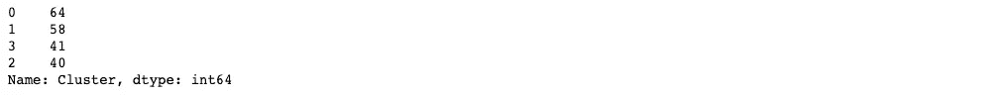

集群的划分及其各自的数量。

```
clustering_runs.groupby('Cluster').mean()
```

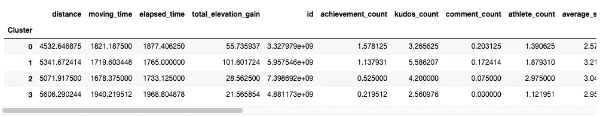

每个聚类中的平均值。

```
clustering_runs.groupby('Cluster').std()
```

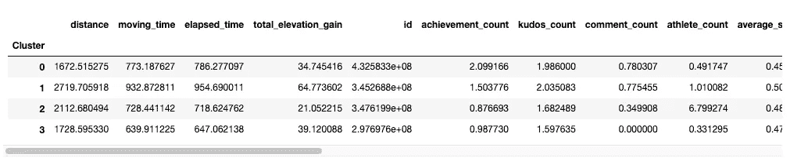

每个聚类中的标准差。

```
clustering_runs[clustering_runs['Cluster'] == 2]
```

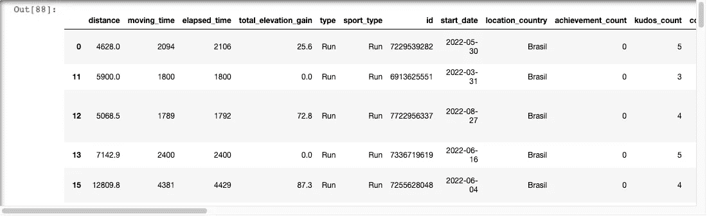

分类 2 中的记录。

## 回归

在进行回归时，模型会在给定一组要素 x 的情况下预测值 y，也就是说，模型会了解哪些值构成了线的方程，从而调整要素图中的几条线并返回两点之间误差最小的线。

对于线性回归的应用，我们将只使用在先前选择中获得并存储在`linear_feats`变量中的特征。此外，我们将数据集分为 80%用于训练阶段，20%用于测试阶段，以便我们可以在训练阶段之后测量算法的性能。

```
y = runs['pace']
X = runs[linear_feats]
X_train, X_test, y_train, y_test = train_test_split(X, y, test_size=0.2)
```

一旦划分完成，只需将训练数据集提交给线性回归拟合函数，并执行与测试基础相关的预测。

```
model = LinearRegression()
model.fit(X_train,y_train)
y_pred = model.predict(X_test)
```

有了预测值和实际值，就可以计算均方误差(MSE，或均方误差)来证明模型有多大的误差，也可以通过下面的代码以图形方式查看预测值与实际值的关系。均方误差为 0.271。

```
print('MSE:', metrics.mean_squared_error(y_test, y_pred))

plt.figure(figsize=(10,10))
plt.scatter(y_test, y_pred, c='crimson')
plt.yscale('log')
plt.xscale('log')

p1 = max(max(y_pred), max(y_test))
p2 = min(min(y_pred), min(y_test))
plt.plot([p1, p2], [p1, p2], 'b-')
plt.xlabel('True Values', fontsize=15)
plt.ylabel('Predictions', fontsize=15)
plt.axis('equal')
plt.show()
```

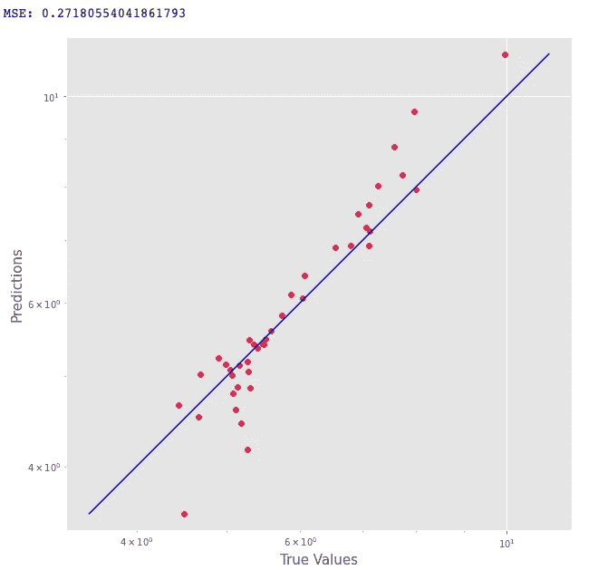

MSE 值以及预测值和实际值分布图。

举例来说，假设我在 2022 年以 1488 秒(24.8 分钟)跑完 5 公里，平均速度为 4 米/秒(14.4 公里/小时)，最大速度为 5.6 米/秒(20.16 公里/小时)，节奏为 84，配速低于 5，我的配速预计等于 **4.1752 分钟/公里**。

```
model.predict(
    pd.DataFrame(data={
        'moving_time': 1488,
        'average_speed': 4.0,
        'max_speed': 5.6,
        'average_cadence': 84.0,
        'moving_time_minutes': 24.8,
        'distance_km': 5.0,
        'avg_speed_kmh': 14.4,
        'max_speed_kmh': 20.16 ,
        'year': 2022,
        'pace_sub_5': True},
    index=[0]
    )
)
```

## 分类

反过来，分类用于区分类别，也就是说，响应变量具有标记样本的特征，因此我们可以根据其特征来预测给定样本将接受哪个标记。

为了执行此操作，我们将执行与回归阶段类似的操作，将基础分为 80%用于训练，20%用于测试，以及具有推荐特征和响应变量的样本划分，在这种情况下，响应变量将是二元的，表示比赛速度是否低于 5。

```
y = runs['pace_sub_5']
X = runs[class_feats]
X_train, X_test, y_train, y_test = train_test_split(X, y, test_size=0.2)
```

在进行了基底的划分之后，我们将拟合来自 SKLearn 库的`SGDClassifier`分类器，该分类器使用随机梯度下降以迭代方式进行参数优化来实现线性模型的正则化，旨在最小化感兴趣的函数。在下面的代码片段中，预测也是针对测试数据集执行的。

```
model = SGDClassifier()
model.fit(X_train,y_train)
y_pred = model.predict(X_test)
```

与回归不同，对于分类系统，我们可以使用其他指标，如精度，这是正确精度与执行的总精度之间的比率，在我们的情况下是 95.12%。要了解真阳性(实际值为正，预测为正)、真阴性(实际值为负，预测为负)、假阳性(实际值为负，预测为正)和假阴性(实际值为正，预测为负)，我们可以开发一个混淆矩阵，如下面的代码所示。

```
print('Accuracy:', accuracy_score(y_test, y_pred))

cm = confusion_matrix(y_test, y_pred, labels=model.classes_)
disp = ConfusionMatrixDisplay(confusion_matrix=cm,display_labels=model.classes_)

disp.plot()
plt.show()
```

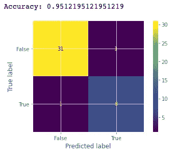

精度值和混淆矩阵。

因此，为了举例说明实际情况，假设我跑 5000 米，总活动时间等于 1488 秒(24.8 分钟)，运动时间为 1440 秒，高度增益为 25 米，高度差为 10 米(最大高度为 547 米，最小高度为 237 米)，最大速度为 25 公里/小时，最大速度为 210 bpm，**我可以以低于 5 分钟/公里的平均配速进行比赛。**

```
model.predict(
    pd.DataFrame(data={
        'distance': 5000 ,
        'moving_time': 1440,
        'elapsed_time': 1488,
        'total_elevation_gain': 25,
        'max_heartrate': 210,
        'elev_high': 547,
        'elev_low': 537,
        'moving_time_minutes': 24.8,
        'max_speed_kmh': 25,
        'elev': 10
    },
        index=[0]
    )
)
```

# 结论

当数据存在时，探索数据和应用不同类型的模型的可能性是无数的。在本文中，有可能对其中一些进行测试，并获得与比赛的见解和预测相关的出色结果，需要考虑的一点是，数据基于单个运动员，即，为了使结论更具一般性，需要与组成数据集的运动员相关的更大的多样性，但是，如果遵循初始步骤，每个运动员都可能有与他们自己的数据相关的预测和想法。

如果您想要检查所使用的测试和代码，请随意访问下面的存储库:

[](https://github.com/Lucs1590/strava-analysis) [## GitHub-lucs 1590/strava-analysis:使用 strava 进行个人分析并练习数据…

### 使用 strava 进行个人分析并练习数据科学家技能。更新环境上的 strava 代码。运行…

github.com](https://github.com/Lucs1590/strava-analysis) 

# 参考

[1]拉马丁，S. [线性回归研究:概念与应用](https://medium.com/@lamartine_sl/regress%C3%A3o-linear-com-sklearn-modelo-de-previs%C3%A3o-de-custos-com-plano-de-sa%C3%BAde-5e963e590f4c) (2020)。中等。

[2] Stojiljkovi，M. [用 Python 和 NumPy 实现的随机梯度下降算法](https://realpython.com/gradient-descent-algorithm-python/) (2020)，Real Python。

[3] Vasconcellos，p .[Como sele cionar as melhores features para seu modelo de Machine Learning](https://paulovasconcellos.com.br/como-selecionar-as-melhores-features-para-seu-modelo-de-machine-learning-2e9df83d062a)(2019)，Paulo Vasconcellos-Cientista de Dados Brasileiro，

# 分级编码

感谢您成为我们社区的一员！在你离开之前:

*   👏为故事鼓掌，跟着作者走👉
*   📰查看[升级编码出版物](https://levelup.gitconnected.com/?utm_source=pub&utm_medium=post)中的更多内容
*   🔔关注我们:[Twitter](https://twitter.com/gitconnected)|[LinkedIn](https://www.linkedin.com/company/gitconnected)|[时事通讯](https://newsletter.levelup.dev)

🚀👉 [**加入升级人才集体，找到一份神奇的工作**](https://jobs.levelup.dev/talent/welcome?referral=true)