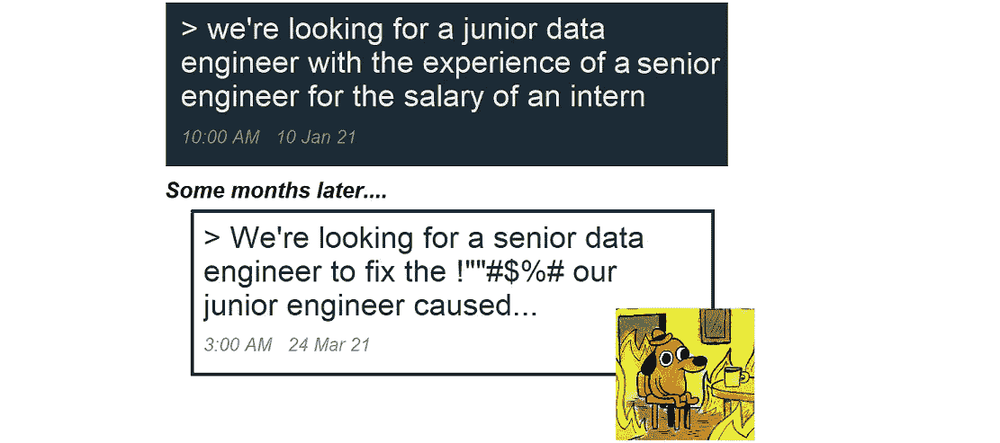

# 年轻创业公司的数据分析

> 原文：<https://levelup.gitconnected.com/data-analytics-for-young-startups-d35313f0309d>

## 因为你迈向分析的第一步很重要

开始尝试数据分析可能会让人不知所措:这可能比你想象的更难、更贵、更复杂。但也不尽然！

照片由 photos-public-domain.com[[提供，如图所示](https://www.photos-public-domain.com/2011/09/14/simplify/)

有幸与处于不同增长和融资阶段的多家初创公司合作，我可以体会到平衡投资与雄心有多么困难，以及正确进行数据分析投资有多么棘手。

> 数据分析对任何公司来说都是一项昂贵的能力，维护起来甚至更昂贵。

招聘极其困难，资源稀缺，验证候选人的技能绝非无足轻重，生态系统如此复杂，以至于它需要一个专业的面试官来淘汰“*高级行话装腔作势者*”*。*

更糟糕的是，技术堆栈是如此广泛和复杂，以至于数据之旅充满了主观决策和技术陷阱。同一个工具既可能是完美的选择，也可能是灾难，这取决于您的使用情况，除非您完全理解这种情况，否则过一段时间后您才会发现自己做得好不好。

创业公司的情况变化非常快，所以无论你今天可能会抄近路，都要确保你为未来保留一些选项，并且能够在这个过程中尽可能多地重复使用工作。你应该找一个你信任的人，他可以在旅途中指导你，告诉你哪些地方值得抄近路，未来会有什么后果。

在帮助初创公司时，我总是试图专注于今天的需求，但总是确保我们不会在任何时候把自己逼入困境。然而，要成功地做到这一点，你必须在此之前多次看到它的成功，并直接了解什么可行，什么不可行:这需要经验。

这不是一个人能在一篇文章中解决的问题，因为每个案例都是不同的，但我会尽量涵盖你想考虑的一些要点，并给出一些建议。让我们接着干吧。

# 开局好

当开始他们的第一个数据平台实施时，初创公司通常试图解决一个仍然相当“小”且容易解决的问题:也许你试图向投资者证明价值，或者也许你已经有了第一批几千个客户，是时候多了解他们一点了…

> 但是数据平台就像任何生物一样，它们都是从很小开始的…

有个小问题是好事，对吗？嗯，是的，但是数据平台是有生命的，有时直到问题出现才变好…也许您的客户群像您一直希望的那样呈指数级增长，您发现您的数据平台到处都在吱吱作响。甚至可能你为你以前拥有的小卷选择了“正确的”平台和架构，但是由于缺乏规划或者可能因为你不理解该技术的警告，它没有带你走远，并且你被留在一个糟糕的地方。

现在，你已经超越了你的数据平台，你没有一个计划…有点像这只猫，但不那么有趣和可爱！

你的箱子已经装不下了…(我*被*[*mscheviousat*](https://www.reddit.com/user/Ms_Chevious_Cat/))法师

幸运的是，这并不完全是悲观的:只要有合适的预算、资源和时间，所有的数据架构问题最终都是可以解决的…

> 不要低估您的第一个数据平台实现的重要性:希望它将为未来的迭代奠定基调和基础。希望…

# 要求

对于一家初创公司来说，世界发展速度极快，业务量可能会在毫无预警的情况下突然激增。另一方面，您不希望提前花费大量资金来期待业务的到来…您希望在正确的时间花费正确的金额，您希望平台在您的业务证明价值或孕育阶段开始时价格低廉，但随后能够随着您的业务在能力和成本方面的增长而增长。
这些是我反复看到的核心需求:

**【1】**架构应该灵活
**【2】**平台应该能够快速适应增加的容量
**【3】**成本应该基于容量或基于使用
**【4】**尽可能避免开发成本大幅增加

然而，这些要求还有更进一步的含义。在这个阶段，大多数公司都希望保持苗条，正如我们已经提到的，数据团队的建立和维护都很昂贵。通常的解决方案是与第三方合作进行开发和支持，比如外包公司或像我这样的承包商。但是，拥有一支灵活的员工队伍意味着您可能无法始终获得相同的专业人员，因此拥有一个具备以下特点的平台非常重要:

**【5】**易于开发和维护*(至少在业务增长之前)*
**【6】**一旦出现问题，能够快速理解并解决*(在任何时候，你都可能需要与尚不了解你的平台的新工程师合作)*

正如您所料，这些需求非常普遍，但是它们提出了非常有趣的设计挑战。

# 设计和架构考虑事项

针对这些需求有许多解决方案，根据您拥有的数据源、您选择的云提供商以及您可能拥有的所有其他特定需求，这些解决方案会有很大不同。虽然有些建议在大多数情况下都适用，但理解它们并评估它们是否适用于你取决于你自己...

## 不要重新发明轮子

在这一点上，通常你会找到一些适合你需求的工具。

> 我看到许多公司开始了漫长而疲惫的旅程，试图用花哨的工具建立定制的摄取系统，但由于雄心与预算和技能不匹配，他们最终以(昂贵的)拙劣的工作告终。

如果他们购买现成的东西，他们就可以省钱、省心、缩短上市时间。

保持你的创业精神，务实一点。专注于你今天需要的东西，并找到一个能帮你做到的工具。当明天到来的时候，你可以随时调整*(只要你为此做好计划……但是稍后会有更多的介绍)。*

## “免费的”开源工具有时…很贵

(图片由 [memegenerator](https://memegenerator.net/instance/65804375/ackbar-its-a-trap-its-a-trap) 提供)

认为开源工具便宜或免费是一种误解。开源**许可**很便宜，但是它们通常需要一个数据工程团队来恰当地部署和维护它们。当你有一个准备就绪的团队时，这很好，但当你是一家试图建立其第一个数据平台的初创公司时，情况可能就不一样了。

> 软件许可一开始可能看起来很贵，但是提醒你自己，它们在薪水、猎头、失败的雇佣、拙劣的工作等等方面为你省钱。你付了钱，它就工作了:这正是你所需要的。

## 招数据工程师不要贱

*(图片作者)*

你雇了一个数据工程师来帮忙，你对自己超级满意，因为你廉价得到了他！他告诉你这个工具 *XYZ* 是多么神奇:每个人都在使用它，它超级便宜，而且正是你所需要的。你确实记得以前人们谈论它，在网上看后，它看起来真的很酷:他必须知道他的东西！

他没有告诉你的是，一旦达到适当的数据量和复杂性，XYZ 就很难调整。他不知道，因为他自己从来没用过…

> 有使用某些开源工具(如 Spark 和 Hadoop)经验的专业人士是市场上最贵的，这有时足以激励人们去尝试，即使(他们不知道)它不适合你的用例

如果你有一个高级工程师给你建议，这就不会发生，但你没有聘请，所以你只能靠自己了。廉价的工程团队(*或者更糟，廉价的独角戏*)，如果没有资深人士带路，可能会变得相当昂贵。

# 太好了，接下来呢？

坏消息是没有一个单一的解决方案适合所有的情况…不过好消息是一些设计最佳实践和良好的技术堆栈决策可以走很长的路。他们可以帮助你保持灵活性，并通过“*小*”的调整来发展。但是我将把它留给我的下一篇文章！