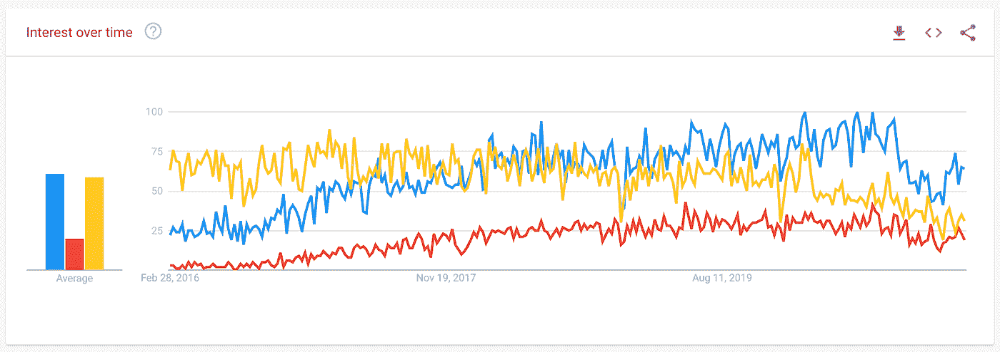

# 流行的 JavaScript 框架中的数据绑定

> 原文：<https://levelup.gitconnected.com/data-binding-in-popular-javascript-frameworks-84d205e03de6>

当您探索不同的 JavaScript 框架时，您会注意到主题和它们解决常见问题的不同方式。对于前端框架，数据绑定是需要完成的最重要的任务之一。在这篇文章中，我将探讨当今最流行的三个框架是如何处理这一问题的，以及在从一个框架转移到另一个框架时，您可能希望寻找什么。



在过去 5 年里，谷歌搜索了 React(蓝色)、Angular(黄色)和 Vue(红色)

# 各种类型的装订

大多数框架以几种不同的方式支持动态属性和数据绑定:

*   插入文字
*   属性绑定
*   自定义指令

# 有角的

说到前端框架，Angular 是我的初恋。我最初使用 AngularJS，并在 Angular 2.0 首次发布时经历了升级(重写)我的一些应用程序的痛苦。我喜欢他们的数据绑定方法，因为我一直认为当你试图通过他们的显式语法使用双向绑定时，他们推动了对正在发生的事情的理解。

**插补**

通过插值，您将使用标准的 HTML 属性，并让 Angular 将您的变量处理到模板中。类似于:

```
<div class=”{{myClassName}}”>…</div>
```

不像某些选项那样干净，但我发现自己在某些情况下会这样做。

**属性绑定**

在这里，您将真正开始发现其他框架之间的许多相似之处。在 Angular 中，要将一个属性绑定到一个变量，您将使用方括号`[]`，它看起来像这样:

```
<div [class]=”myClassName”>…</div>
```

**自定义指令**

Angular 还带有许多特殊的内置指令，包括 [NgClass](https://angular.io/api/common/NgClass) 和 [NgModel](https://angular.io/api/common/NgModel) 。当您需要一种切换类的快捷方式(NgClass)或者用双向数据绑定来绑定表单值(NgModel)时，这些非常有用。

为了实现双向数据绑定，您将使用不同的语法，例如在 NgModel 指令上，如下所示:

```
<input [(ngModel)]=”myValue” />
```

看到那个不靠谱的`[( )]`了吗？这是因为 Angular 在幕后处理这个问题，并产生两个不同的属性，一个用于绑定数据，另一个用于在事件发生时更新数据。因此，使用 ngModel 指令，您实际上会得到这样的结果:

```
<input [ngModel]=”myValue” (ngModelChange)=”myValue = $event” />
```

查看[文档](https://angular.io/guide/two-way-binding)。

# 反应

在 React 中，你通常用 JSX 编写，会发现绑定更加简单，因为你可以用花括号`{ }`绑定任何 html 属性。

**插补**

这是 React 中增强模板的主要方式。因为使用了 JSX 和编写组件的反应式方法，所以不需要修饰 HTML 属性和传递值。相反，您将获得本机 HTML 属性，并直接传递您的变量。

我们上面的例子可以写成:

```
<div className={this.myClassName}>…</div>
```

请注意这里的一些差异:

*   使用`className`而不是`class`，因为我们是用 JSX 编写的，属性将通过它们的 JavaScript 名称来访问。
*   这类似于将数据值放在花括号`{ }`中的插值。

**属性绑定**

为了在 React 中实现双向数据绑定，您将拥有两个独立的声明。大概是这样的:

```
<input value={myValue} onChange={myChangeFunction} />
```

在这里，您将在更新``myChangeFunction`中的输入时设置 myValue。我喜欢这个，因为与 Angular 类似，它向您展示了事件和数据绑定之间的区别。事件增多，数据减少。

因为 React 有一个清晰、一致的模式，所以您可以以同样的方式将其应用于任何属性，这使得将数据和模板结合起来变得非常容易。

查看[完整文档](https://reactjs.org/docs/two-way-binding-helpers.html)了解更多信息。

请注意，React 中没有与 NgModel (Angular)或 v-model (Vue)等效的自定义指令或帮助器。

# 某视频剪辑软件

在 Angular 之后，我开始很好地使用 Vue，但是发现它的语法很简单，使用起来很有趣。我已经在 Vue 中构建了一些非常强大的应用程序，并且很容易理解和掌握。

**插补**

尽管 Vue 像其他框架一样支持字符串插值，但是您不能对 HTML 属性使用插值，而是必须使用数据绑定。

**属性绑定**

在 Vue 中绑定属性再简单不过了，语法是我迄今为止最喜欢的例子，即使整个库本身并不简单。使用冒号`:` *、*(T5 的缩写)作为属性名来绑定数据，将事件绑定到普通事件名前面有`@`符号(T7 的缩写)的方法。

以我们上面的标准示例为例，这将是:

```
<div :class=”myClassName”>…</div>
```

此外，您也可以在这些声明中使用 JavaScript 表达式，它不必是简单的变量名。

**自定义指令**

与 Angular 类似，Vue 也给出了一个方便的自定义指令，允许以 v-model 的形式对输入进行双向绑定。这将允许您设置一个与上述角度示例几乎相同的输入:

```
<input v-model=”myValue” />
```

很简单，对吧？

在内部，Vue 正在做 Angular 正在做的事情，也是 React 中您被迫要做的事情，它设置输入的*值*并跟踪*输入*事件。更明确地说，是这样的:

```
<input :value="myValue" @input="myValue = $event" />
```

在[他们的文档](https://vuejs.org/v2/guide/forms.html)中阅读更多关于 Vue 如何处理这个问题的信息。

# 摘要

这些框架中的每一个都以非常相似的方式处理数据绑定。最初，包括 AngularJS 在内的许多框架都非常低效地处理双向绑定。这些年来，随着对性能的关注，它们都采用了类似的模式来实现类似的结果。在上述每个框架之间进行交换将显示相似的模式，只是语法略有不同。熟悉它们背后的概念，你会发现在它们之间转换非常容易。