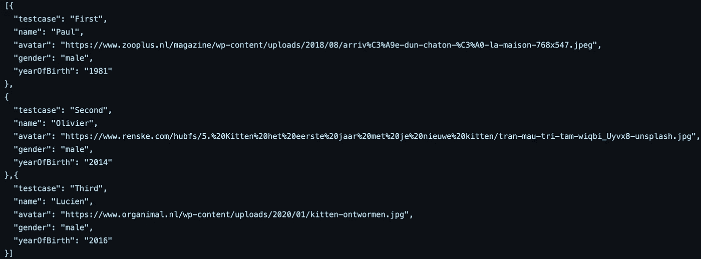
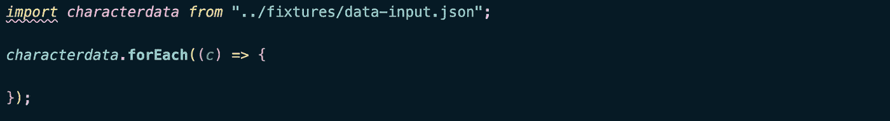
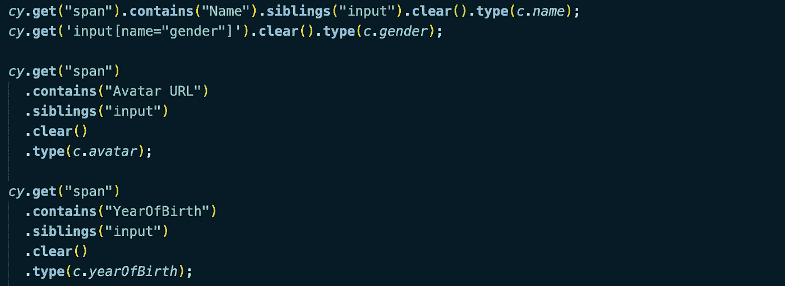
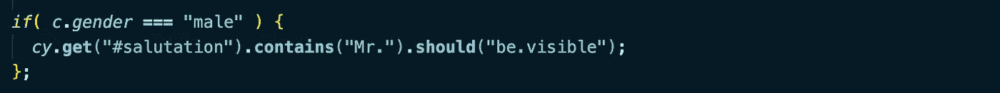
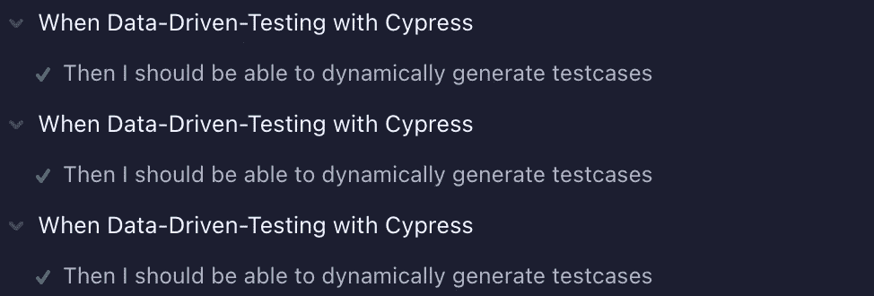
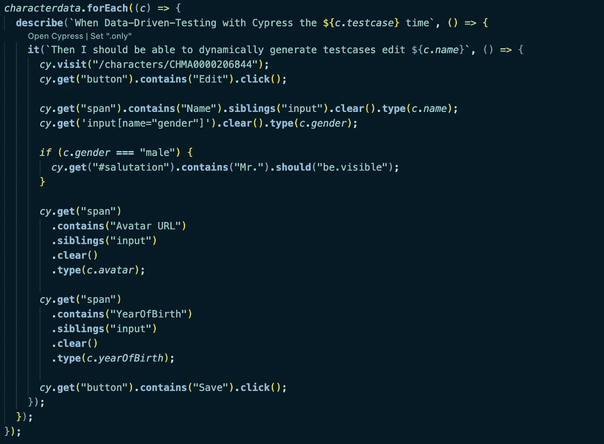
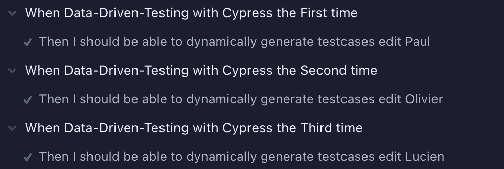

# 用 Cypress 进行数据驱动测试

> 原文：<https://levelup.gitconnected.com/data-driven-testing-with-cypress-cf4ac76ea8fc>

如何编写动态测试

佩德罗·洛佩斯在 [Unsplash](https://unsplash.com?utm_source=medium&utm_medium=referral) 拍摄的照片

数据驱动测试，也称为参数化测试或动态测试，专注于预先定义不同测试用例的输入和输出数据。使用 Cypress，您可以[基于您的测试数据集自动生成](https://learn.cypress.io/advanced-cypress-concepts/using-data-to-build-dynamic-tests)您的测试用例。对我们来说幸运的是，这在 Cypress 非常容易实现。

# 我们来分解一下。

首先，我们需要定义我们想要测试的场景。然后，我们可以为不同的测试用例收集必要的输入数据，并指定预期的结果。

我们将把数据放在 fixtures 文件夹的 JSON 文件的数组中。

testdata.json

# 现在，我们将编写您的规范。

创建您的 test.cy.js(或者。ts)文件。这里我们将编写一个测试用例。我通常带着快乐的心情开始写这篇文章。如果幸运的话，对于所有场景都足够了。但是有些场景会改变应用流程吗？别担心，我会掩护你的。稍后会详细介绍。

但是现在，我们需要确保 spec 使用带有测试数据的 fixture 文件。所以我们需要导入、声明和定义它。

导入夹具

现在最酷的部分来了。

# 我们将围绕测试编写一个 forEach 循环。

我们将从夹具中迭代不同的数据集。这将导致多个测试用例的生成。

现在，您可以开始添加动态变量，如下所示:

如前所述，某些输入变量可能会触发不同的应用程序行为，从而导致测试失败。例如，当我选择一个车辆变量并注入一辆汽车时，我可能需要填写一个牌照字段。但是对于一辆自行车，我不必。因此，最好根据导致不同行为的变量值创建一个条件语句:

这听起来可能不像是 Cypress 的最佳实践，但是如果您不这样做，您的测试将会失败。另一个解决方案是为各种路径创建多个规格和装置。这是一个很好的选择，尤其是当一切变得太大太复杂的时候。但是当处理循环时，您不必管理重复的(测试)代码。因为您的测试数据存储在一个单独的文件中，这里也没有“代码”重复。这听起来很像我们在遵循面向对象的开发方法。

# 我们来做测试。

测试的所有迭代都出现在 Cypress 中。

固定测试描述

但是正如您所看到的，您的测试并不是那么可读，因为所有的测试都有相同的名称。

幸运的是，我们可以解决这个问题。我们将通过注入一个变量来改变测试的名称并使其动态化。如果您愿意，您可以为每个测试用例添加一个场景名称。

所有东西放在一起

动态测试描述

# 现在您已经用 Cypress 创建了一个数据驱动的测试方法！🥳

# 我们做了什么？

我们总结一下:

1.  我们已经用 Cypress fixture 文件中的所有测试数据集创建了一个数组，
2.  我们已经编写了一个规范文件，
3.  然后我们导入 fixture 并创建 for-each 循环来迭代它，
4.  在这之后，我们在测试脚本中注入了动态变量，
5.  此外，我们需要开发 if 循环，其中应用程序行为会因某些变量的特定值而改变。
6.  最后，我们通过在标题中注入变量，使测试用例的名称动态化。

因此，通过六个简单快捷的步骤，我们在 Cypress 中创建了一个参数化测试框架！

## **快乐动态测试🙂**