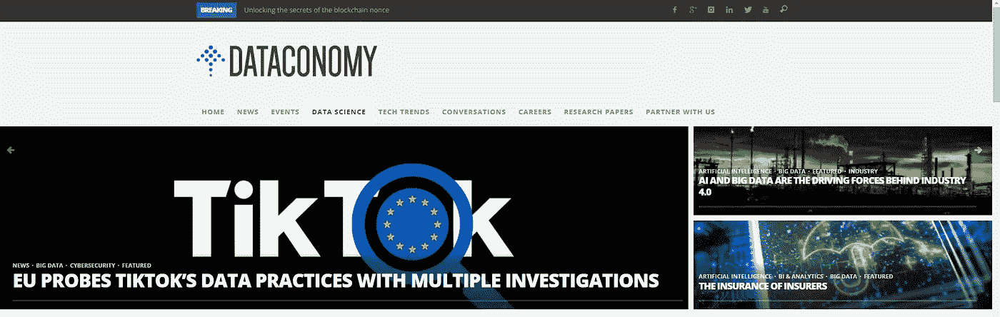
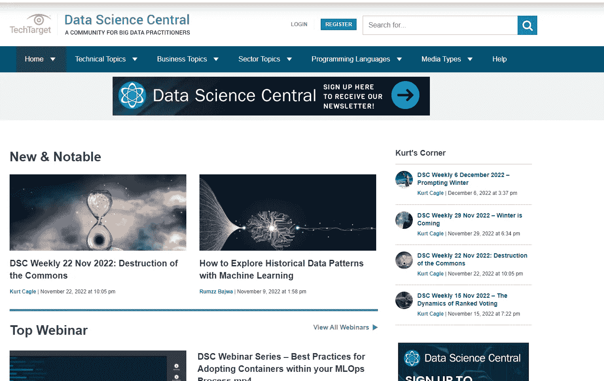
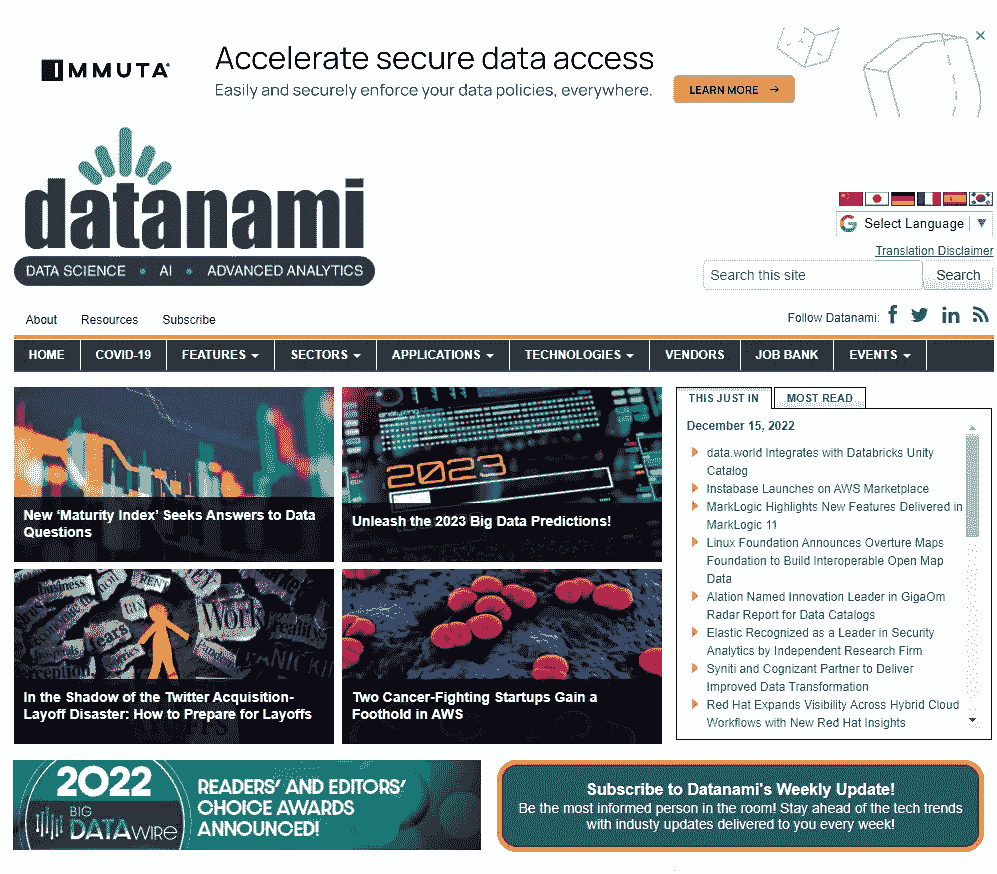
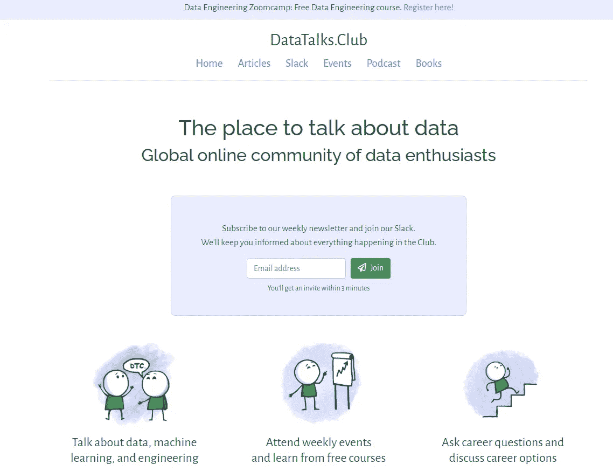
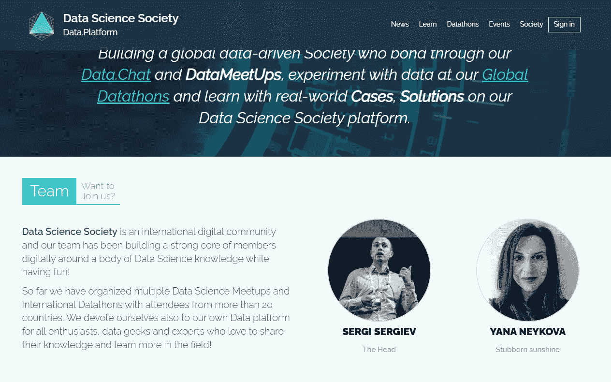
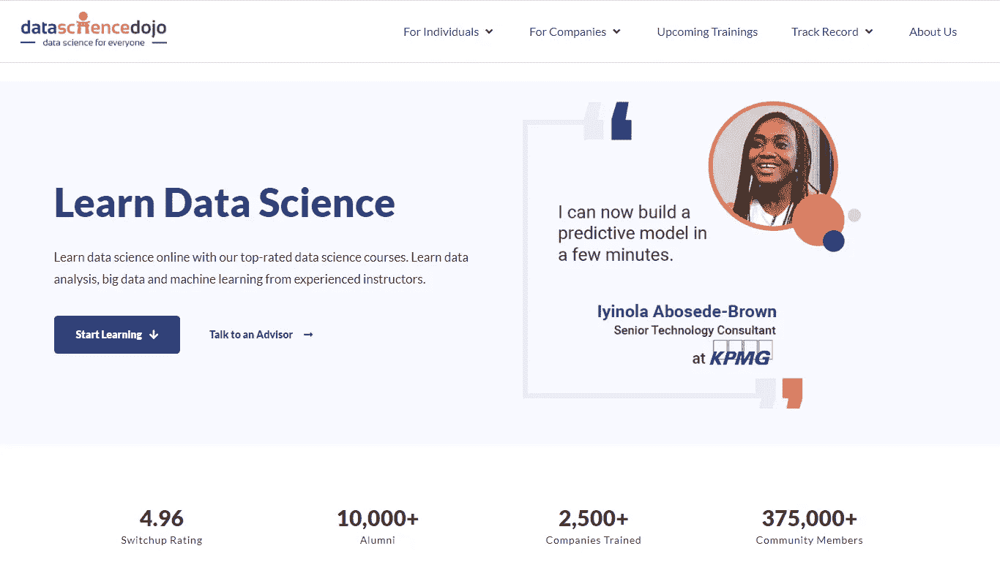

# 你可能不知道的数据工程和数据科学网站

> 原文：<https://levelup.gitconnected.com/data-engineering-and-data-science-websites-that-you-probably-didnt-know-7adcb1476869>

您必须在浏览器中设置书签

来源[杰洛特](https://pixabay.com/illustrations/monitor-binary-binary-system-1307227/)在皮沙贝

您是否正在努力跟上数据工程和数据科学领域的最新和最大发展？不要再看了！👀在这篇文章中，我将向您介绍一些鲜为人知但**非常有价值的**网站，内容涉及数据工程和数据科学。这些隐藏的宝石绝对应该添加到您的浏览器书签中，以供将来参考。从行业新闻和职位空缺到有用的教程和资源，这些网站应有尽有。

> 无论你是刚开始涉足这个领域，还是经验丰富的专业人士，你都不会想错过这些网站提供的有价值的信息。所以事不宜迟，让我们深入了解一下您可能不知道(但肯定应该知道)的数据工程和数据科学网站。

# 1.数据经济

[数据经济](https://dataconomy.com/data-science/big-data/)是一个专注于数据科学和数据工程资源的网站。

根据他们的主要网站“Dataconomy 是数据驱动技术领域的新闻、事件和专家意见的领先门户。我们成立于柏林，一个数据科学创新的中心，我们提供了一个遍布欧洲的行业知名贡献者和当地社区的全球网络。

我们关注行业巨头和颠覆性创业公司，只关注最有趣的数据技术应用。"

它的特点是:

*   新闻；
*   文章；
*   主办活动和会议；
*   工作列表和职业资源

# 2.数据科学中心

[数据科学中心](https://www.datasciencecentral.com/)是一个网站，为数据科学家和相关领域的专业人士提供一个平台，以连接和共享信息和资源。

它的特点是:

*   博客的文章和链接；
*   视频；
*   论坛；
*   在线课程和培训材料等职业资源；
*   活动和网络研讨会。

# 3.数据波

根据关于部分"[*" Datanami*](https://www.datanami.com/)是一个新闻门户网站，致力于提供有关大数据新兴趋势和解决方案的见解、分析和最新信息。

该门户揭示了所有前沿技术，包括网络、存储和应用，以及它们对商业、工业、政府和研究的影响。

该出版物研究了前所未有的海量数据，以及高端数据爆炸对 IT、企业和商业市场的影响。"

我非常喜欢这个网站的特色[“值得关注的人”](https://www.datanami.com/people-to-watch-2022/)🙂

# 4.数据谈话俱乐部

[数据会谈俱乐部](https://datatalks.club/)是一个简单而有效的“全球数据爱好者在线社区”网站。这是“谈论数据”的正确位置。😉

它是由我的同事和数据影响者[阿列克谢·格里戈里耶夫](https://medium.com/gitconnected/my-data-science-and-data-engineering-influencers-on-linkedin-ddc54c7fe732#:~:text=My%20OLX%20colleague%20Alexey%20is%20the%20founder%20of%20the%20DataTalksClub%2C%20a%20community%20meant%20to%E2%80%A6%20talk%20about%20Data%20%F0%9F%99%82This%20community%20has%2C%20currently%2C%20more%20than%2023%20k%20users%20(join%20the%20community%20here).)创建和维护的，它有一个超过 25 k 用户的 Slack 社区。🚀

它有它的原创性:

*   文章；
*   事件和
*   播客；

但也分享其他作者的数据科学和数据工程书籍。

# 5.数据科学学会

"[数据科学协会](https://www.datasciencesociety.net/)是一个国际数字社区，我们的团队在享受乐趣的同时，围绕大量数据科学知识构建了一个强大的数字成员核心！"

这个社区有以下特点:

*   新闻和文章；
*   案例或课程等学习资源；
*   几个数据通；
*   事件。

# 6.数据驱动的投资者

[数据驱动投资者](https://www.datadriveninvestor.com/)是一个非常特别的数据科学网站，因为它也专注于投资、股票等。

这个网站主要由文章组成，但文章的多样性非常广泛。

# **7。数据科学道场**

[Data Science Dojo](https://datasciencedojo.com/) 更专注于学习部分，根据主页显示，它“成立于 2013 年，但在正式推出之前很久，它还是一个免费的 Meetup 群组。为了将数据科学的知识带给每个人，我们开始举办包含最全面课程的短期训练营。

2019 年，新墨西哥大学(UNM)将我们的[数据科学训练营](https://datasciencedojo.com/data-science-bootcamp/)加入了他们的继续教育部门。从那以后，我们启动了各种其他培训，如针对数据科学的[Python](https://datasciencedojo.com/python-for-data-science/)、[Power BI 简介](https://datasciencedojo.com/introduction-to-power-bi/)以及针对经理和业务领导的[数据科学](https://datasciencedojo.com/data-science-for-managers/)。

迄今为止，我们已经为 10，000 多名个人和 2000 多个组织提供了服务。"

# 摘要

所以如果你想成为数据工程或数据科学忍者🥷，别忘了在你的浏览器书签中设置这些网站！

只要确保在你的老板经过之前清除你的浏览历史，否则他们可能会认为你在偷懒，看猫视频而不是工作。

浏览愉快！😉

[阅读路易斯·奥利维拉(以及媒体上成千上万的其他作家)的每一个故事](https://medium.com/@lgsoliveira/membership)

# 分级编码

感谢您成为我们社区的一员！在你离开之前:

*   👏为故事鼓掌，跟着作者走👉
*   📰查看[升级编码出版物](https://levelup.gitconnected.com/?utm_source=pub&utm_medium=post)中的更多内容
*   🔔关注我们:[Twitter](https://twitter.com/gitconnected)|[LinkedIn](https://www.linkedin.com/company/gitconnected)|[时事通讯](https://newsletter.levelup.dev)

🚀👉 [**加入人才集体，找到一份令人惊喜的工作**](https://jobs.levelup.dev/talent/welcome?referral=true)