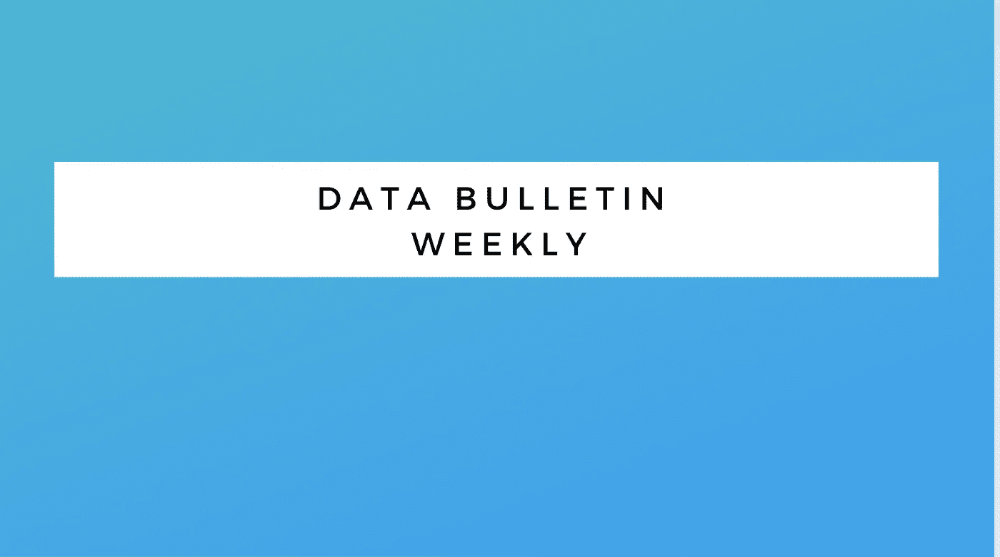

# 数据工程通报——文摘#3

> 原文：<https://levelup.gitconnected.com/data-engineering-bulletin-digest-3-4eec9df9b8cc>

## 本周的更新涵盖了高效数据加载、流式最佳实践、数据实时遥测、洪水预测、迁移等更多内容

## 介绍

*   作为一名数据工程师，我总是很想知道其他人在这个领域做什么。了解其他公司正在发生的事情的最好方法是阅读他们的技术博客，并为我的下一个项目获得灵感。
*   数据工程公告过滤版，我觉得可能对我的数据工程社区有帮助。数据列表涵盖了最重要的内容。

> 如果你喜欢这个简讯，可以考虑 [***订阅这个简讯并与他人分享。***](https://databulletin.substack.com/subscribe?)

# 谷歌云

*   [使用云运行作业运行数据库迁移](https://cloud.google.com/blog/topics/developers-practitioners/running-database-migrations-cloud-run-jobs/)
    当我们需要执行管理任务、命令之一或迁移等复杂任务时，云运行作业非常有用。在云运行的情况下，进程像 web 服务器或 api 服务一样启动并持续运行，但是当我们需要执行命令或管理任务时，却没有具体的方法来实现。云运行作业允许用户以无服务器方式执行作业。
*   [钢铁经销商如何通过 Vertex AI](https://cloud.google.com/blog/products/ai-machine-learning/how-steel-distributor-reinvents-its-data-science-ml-workflows-vertex-ai/) 重塑其数据科学& ML 工作流程
*   在这篇博客文章中，您将了解 Klö ckner 如何使用 Google Cloud Vertex AI 服务，如 AutoML 和 Vertex AI Pipelines，通过机器学习来改善内部流程，包括提高 ML 模型构建的速度，缩短生产时间，以及为生产级 ML 挑战提供解决方案，如版本化、沿袭和可复制性。
*   [data proc 持久历史服务器的最佳实践](https://cloud.google.com/blog/products/data-analytics/running-persistent-history-servers/)
*   Spark 的临时集群和 Dataproc 无服务器的挑战是，当集群机器在作业**之后被删除时，您将丢失应用程序日志。**持久历史服务器支持访问在不同临时集群或无服务器 Spark 上执行的作业的完整 Hadoop 和 Spark 应用程序详细信息
*   [云 SQL 的商业价值:公司如何加快部署、降低成本和提高灵活性](https://cloud.google.com/blog/products/databases/the-business-value-of-cloud-sql/)
    谷歌云分享与使用基于云的数据库的好处相关的资源，以及如何使用云 SQL 谷歌的托管数据库(MySQL、PostgreSQL、SQL Server)节省成本
*   [将数据加载到 BigQuery 的性能考虑](https://cloud.google.com/blog/products/data-analytics/performance-considerations-for-loading-data-into-bigquery)
*   当将数据加载到 Google BigQuery 时，以压缩格式加载数据不会获得性能提升。事实上，在某些情况下，非压缩格式比压缩格式更快。如果数据被压缩，那么最好使用 256MB 或更少的内存来并行加载，以加快进程。

# 支流

*   [在中构建事件流应用。通常，当我们想到 Apache Kafka 及其生态系统时，我们可以找到的所有开发和文档都是用 Java 编写的，因为 Apache Kafka 本身就是使用 Java 构建的。但是也支持其他语言/框架，比如](https://www.confluent.io/blog/build-streaming-applications-with-apache-kafka-dotnet/)
*   。NET 来构建客户端库，这是在这篇博客中从合流解释。
*   [完全托管的连接器如何让 Apache Kafka 变得更容易](https://www.confluent.io/blog/fully-managed-connectors-make-apache-kafka-easier/)
    在这篇博客中，confluent 分享了虽然开发人员运行的连接器生态系统是免费的，但是管理基础设施来运行它们并不是而且总是需要故障排除、知识等。因此，合流管理连接器可以轻松连接不同的源和接收器，而无需担心基础设施管理和深厚的专业知识水平，以管理源和接收器到 Kafka 集群的连接。

# 数据砖

*   [生产中的流式处理:收集的最佳实践](https://www.databricks.com/blog/2022/12/12/streaming-production-collected-best-practices.html)
    Databricks 分享了在生产环境中部署流式处理应用程序时的最佳实践。单元测试，触发器，容错，以及更多的内容。
*   [宣布数据沿袭在 Unity 目录中正式发布](http://Announcing General Availability of Data lineage in Unity Catalog)
    Databricks 在 Unity 目录中增加了数据沿袭功能。它现在可以实时跟踪列和表级别的沿袭。它还可以跟踪笔记本、工作簿和仪表板的沿袭。
*   [Databricks 如何为 Stantec 的洪水预测引擎提供动力](http://How Databricks Powers Stantec's Flood Predictor Engine)
    Stantec 的客户故事，解释了 data bricks 如何帮助他们构建洪水预测产品。洪水预测需要地理空间数据的大量计算，他们使用 Databricks delta live 表来解决计算需求。
*   [我们为何从 Apache Airflow 迁移到 YipitData 的 Databricks 工作流](http://Why We Migrated From Apache Airflow to Databricks Workflows at YipitData)
    YipitData 团队在 Databricks 集群上使用 Apache Airflow 的定制安装，因为 Databricks 上没有托管数据编排解决方案。工作流发布后，YipitData 团队计划并创建了一个迁移脚本来将 Airflow Dags 转换为工作流配置。对他们来说，总体过渡是平稳的。

# 雪花

*   [雪花的原生应用如何为我的数据网点客户简化技术流程](https://www.snowflake.com/blog/how-native-apps-simplified-mdo-customers-tech-orchestration/)
    雪花的客户我的数据网点(MDO)分享了他们的雪花原生应用使用案例，这些应用帮助他们通过应用代码向客户共享投资数据，同时维护安全性、计算成本等。
*   [Canada Drives 借助 Snowflake 和 ruder stack 降低 20%的客户获取成本(CAC)](https://www.snowflake.com/blog/canada-drives-improves-customer-acquisition-costs-snowflake-rudderstack/)
    Canada Drives 利用 Snowflake 和 ruder stack 构建客户数据平台，以降低客户获取成本、降低 SaaS 支出和缩短汽车销售时间。
*   [开放数据回归商业](https://www.snowflake.com/blog/open-data-back-in-business/)
    Authot 谈到了开放数据的承诺，以及在当前情况下目的和定义是如何变化的。开放数据不仅是为了透明，也是为了它的开放的全新经济，同时说大部分政府数据是不可访问的、不可标记的、不可分类的和不可自助的。因此，雪花市场通过其工具生态系统在提供开放数据的访问和自我发现方面发挥着重要作用。

# 开源代码库

*   使用 QueryBuilder 组件创建可访问的搜索体验
    GitHub 团队解释了他们与 QueryBuilder 相关的工作，query builder 帮助他们处理不同类型的查询问题，例如讨论、操作、自动完成、跳转等。他们将为其他开发者开源这个组件。

# 自动警报系统

*   [注意:亚马逊 S3 将于 2023 年 4 月进行安全变更](https://aws.amazon.com/blogs/aws/heads-up-amazon-s3-security-changes-are-coming-in-april-of-2023/)
    S3 将进行两项安全变更。这些更改是:默认情况下将启用 S3 块公共访问，默认情况下将禁用 ACL。到目前为止，已经推荐了这些更改，从 2023 年 4 月起将默认为这些更改。

# 格拉夫纳

*   [如何使用 Azure Data Explorer 和 Grafana cloud 构建 F1 实时分析堆栈](https://grafana.com/blog/2022/12/09/how-to-build-a-formula-1-real-time-analytics-stack-with-azure-data-explorer-and-grafana-cloud/)
    Grafana 团队分享并解释了 F1 比赛实时遥测数据的设计，以及我们如何利用 Azure Data Explorer 和 Grafana Cloud 构建实时数据分析。

# Cloudera

*   [机构如何利用智能数据解决方案获得网络优势](https://blog.cloudera.com/how-agencies-can-gain-the-cyber-edge-with-smart-data-solutions/)
    Cloudera 分享了我们如何利用 Cloudera 数据平台构建智能数据解决方案，帮助组织在类似 Solarwinds 遭遇的网络攻击中获得优势。
*   [介绍 Cloudera DataFlow Designer:自助式无代码数据流设计](https://blog.cloudera.com/introducing-cloudera-dataflow-designer-self-service-no-code-dataflow-design/)
    Cloudera 团队解释了他们的新产品 DataFlow Designer 如何帮助开发人员通过可视化界面和最少的无代码管理任务构建数据管道。

# 一周的课程

*   [使用 AWS 数据分析的数据工程](https://click.linksynergy.com/link?id=FAaRt1BJn8w&offerid=1060092.4242194&type=2&murl=https%3A%2F%2Fwww.udemy.com%2Fcourse%2Fdata-engineering-using-aws-analytics-services%2F)
*   [使用 SQL、Python 和 PySpark 的数据工程基础](https://click.linksynergy.com/link?id=FAaRt1BJn8w&offerid=1060092.3848374&type=2&murl=https%3A%2F%2Fwww.udemy.com%2Fcourse%2Fdata-engineering-essentials-sql-python-and-spark%2F)

> 如果你喜欢这个简讯，可以考虑 [***订阅这个简讯并与他人分享。***](https://databulletin.substack.com/subscribe?)