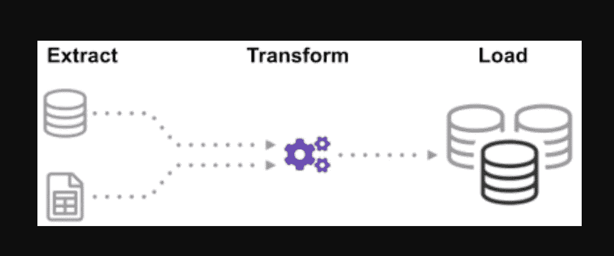

# Python 数据工程分步指南——每个人都应该知道的脚本

> 原文：<https://levelup.gitconnected.com/data-engineering-made-easy-attached-python-scripts-to-head-startyour-etl-tasks-960e766f3ae3>

# 概述:

假设数据工程师的工作是从多个文件格式源中提取数据，将其转换为特定的数据类型，并将其加载到单个源中进行分析。阅读完本文后，借助几个实际例子，您将能够通过实现 web 抓取和使用 API 提取数据来检验您的技能。借助 Python 和数据工程，您将能够开始从许多来源收集庞大的数据集，并将它们转换为单一的主要来源，或者开始收集有用的商业见解。


# 简介:

*   为什么数据工程更可靠？
*   ETL 周期的过程
*   逐步提取、转换、加载函数
*   关于数据工程
*   结论

# 为什么数据工程更可靠？

在当代，这是一个更可靠、发展最快的技术职业，因为它更专注于网络抓取和爬取数据集。

# 流程(ETL 周期):

您是否曾想过如何将来自多个来源的数据集成在一起，以创建一个单一的信息源？批处理是一种收集数据的方法，了解有关“如何探索一种称为提取、转换和加载的批处理”的更多信息。


ETL 是从各种来源和格式中提取大量数据，并在将其放入数据库或目标文件之前将其转换为单一格式的过程。

一些数据存储在 CSV 文件中，而另一些存储在 JSON 文件中。你必须将所有这些信息收集到一个文件中，以便人工智能读取。因为你的数据是英制单位，但人工智能需要公制单位，你需要转换它。因为 AI 只能读取单个大文件中的 CSV 数据，所以您必须首先加载它。如果数据是 CSV 格式的，让我们用 python 实现下面的 ETL，并通过一些简单的例子来看看提取步骤。

通过查看. json 和. csv 文件列表。glob 文件扩展名在输入中以一个星号和一个点开头。返回一个. csv 文件列表。对于. json 文件，我们可以做同样的事情。我们可以创建一个以 CSV 格式提取姓名、身高和体重的文件。. csv 文件的文件名是输入，输出是数据框。对于 JSON 格式，我们可以做同样的事情。



# 第一步:

导入功能和所需模块

```
import glob 
import pandas as pd 
import xml.etree.ElementTree as ET 
from datetime import datetime
```

使用的数据:在这里下载源文件[并解压 zip 文件](https://cf-courses-data.s3.us.cloud-object-storage.appdomain.cloud/IBMDeveloperSkillsNetwork-PY0221EN-SkillsNetwork/labs/module%206/Lab%20-%20Extract%20Transform%20Load/data/datasource.zip)

文件`dealership_data`包含二手车数据的 CSV、JSON 和 XML 文件，这些文件包含名为`car_model`、`year_of_manufacture`、`price`和`fuel`的特征。因此，我们将从原始数据中提取文件，并将其转换为目标文件，然后加载到输出中。

设置目标文件的路径:

```
tmpfile    = "dealership_temp.tmp"               # store all extracted datalogfile    = "dealership_logfile.txt"            # all event logs will be storedtargetfile = "dealership_transformed_data.csv"   # transformed data is stored
```

# 第二步(提取):

该函数将批量从多个来源提取大量数据。通过添加此函数，现在它将发现并加载所有 CSV 文件名，CSV 文件将随着循环的每次迭代添加到数据框中，首先附加第一次迭代，然后是第二次迭代，从而产生提取数据的列表。收集完数据后，我们将进入流程的“转换”步骤。
注意:如果“忽略索引”设置为真，每一行的顺序将与这些行被附加到数据帧的顺序相同。

**CSV 提取功能**

```
def extract_from_csv(file_to_process): 
    dataframe = pd.read_csv(file_to_process) 
    return dataframe
```

**JSON 提取函数**

```
def extract_from_json(file_to_process):
    dataframe = pd.read_json(file_to_process,lines=True)
    return dataframe
```

**XML 提取函数**

```
def extract_from_xml(file_to_process): dataframe = pd.DataFrame(columns=['car_model','year_of_manufacture','price', 'fuel']) tree = ET.parse(file_to_process)    root = tree.getroot()     for person in root:         car_model = person.find("car_model").text         year_of_manufacture = int(person.find("year_of_manufacture").text) price = float(person.find("price").text)        fuel = person.find("fuel").text         dataframe = dataframe.append({"car_model":car_model, "year_of_manufacture":year_of_manufacture, "price":price, "fuel":fuel}, ignore_index=True)         return dataframe
```

提取函数():

现在使用它对 CSV、JSON、XML 的函数调用来调用 extract 函数。

```
def extract():
       extracted_data = pd.DataFrame(columns=['car_model','year_of_manufacture','price', 'fuel']) 
    #for csv files
      for csvfile in glob.glob("dealership_data/*.csv"):
          extracted_data = extracted_data.append(extract_from_csv(csvfile), ignore_index=True)
    #for json files
      for jsonfile in glob.glob("dealership_data/*.json"):
          extracted_data = extracted_data.append(extract_from_json(jsonfile), ignore_index=True)
    #for xml files
      for xmlfile in glob.glob("dealership_data/*.xml"):
          extracted_data = extracted_data.append(extract_from_xml(xmlfile), ignore_index=True)
      return extracted_data
```

# 步骤 3(转换):

收集完数据后，我们将进入流程的“转换”阶段。该函数将把以英寸为单位的列高度转换为毫米，把以磅为单位的列磅转换为千克，并以变量数据的形式返回结果。在输入数据框中，列高度以英尺为单位。转换列，将其转换为米，并四舍五入到两位小数。

```
def transform(data):
       data['price'] = round(data.price, 2)
       return data
```

## 步骤 4(加载和记录):

既然我们已经收集并指定了数据，现在是时候将数据加载到目标文件中了。在这种情况下，我们将熊猫数据框保存为 CSV。我们现在已经完成了从各种来源提取、转换和加载数据到单个目标文件的步骤。在完成工作之前，我们需要建立一个日志条目。我们将通过编写一个日志记录函数来实现这一点。

加载功能:

```
def load(targetfile,data_to_load):
    data_to_load.to_csv(targetfile)
```

日志功能:

当添加“a”时，写入的所有数据将被附加到当前信息中。然后，我们可以为流程的每个阶段附加一个时间戳，通过生成这种类型的条目来指示它开始和结束的时间。在我们定义了对数据执行 ETL 过程所需的所有代码之后，最后一步是调用所有函数。

```
def log(message):
    timestamp_format = '%H:%M:%S-%h-%d-%Y'
    #Hour-Minute-Second-MonthName-Day-Year
    now = datetime.now() # get current timestamp
    timestamp = now.strftime(timestamp_format)
    with open("dealership_logfile.txt","a") as f: f.write(timestamp + ',' + message + 'n')
```

## 步骤 5(运行 ETL 过程):

我们首先调用 extract_data 函数。从该步骤接收的数据然后将被传送到转换数据的第二步骤。完成后，数据将被加载到目标文件中。另外，请注意，在每一步之前和之后，都添加了开始和完成的时间和日期。

您已经开始 ETL 过程的日志:

```
log("ETL Job Started")
```

您开始和结束提取步骤的日志:

```
log("Extract phase Started")
extracted_data = extract() 
log("Extract phase Ended")
```

您开始和结束转换步骤的日志:

日志(“转换阶段开始”)

transformed_data =转换(extracted_data)

```
log("Transform phase Ended")
```

您已经开始和结束加载阶段的日志:

```
log("Load phase Started")
load(targetfile,transformed_data)
log("Load phase Ended")
```

ETL 周期结束的日志:

```
log("ETL Job Ended")
```

通过这个过程，我们讨论了一些基本的提取、转换和加载函数

*   如何写一个简单的提取函数？
*   如何写一个简单的转换函数？
*   如何编写一个简单的加载函数？
*   如何编写一个简单的日志记录函数？

> *“没有大的* ***数据*** *，你又瞎又聋，在高速公路中间。”——杰弗里·摩尔。*

**最多，我们已经讨论了所有的 ETL 过程。更进一步，让我们看看，“数据工程师工作的好处是什么？”。**

# 关于数据工程:

数据工程是一个有许多名字的广阔领域。在许多机构中，它甚至可能没有正式的名称。因此，通常最好从定义数据工程工作的目标开始，这些目标会导致预期的输出。依赖数据工程师的用户就像数据工程团队的才能和成果一样多种多样。无论你从事哪个行业，你的消费者将永远决定你处理什么问题，如何解决这些问题。

# 结论:

我希望您能在本文中找到一些帮助，并在开始学习数据工程的过程中对使用 Python 进行 ETL 有所了解。想了解更多信息吗？我鼓励你看看我的其他文章，关于你如何使用 python 类来改进数据工程过程。我还演示了[如何使用 **pydantic** 在数据管道的第一步也是最重要的一步改进数据验证](https://medium.com/@caopengau/python-data-pipeline-first-and-foremost-step-data-validation-e15017b7ef8d)。如果您对数据可视化感兴趣，请查看[这个分步指南，用 Apache 超集创建您的第一个图表](https://medium.com/@caopengau/data-visualisation-with-apache-superset-a-step-by-step-guide-e5b0c150f358)。

**行动呼吁**

如果你觉得这个指南有帮助，请鼓掌并跟我来。通过[链接](https://medium.com/@caopengau/membership)加入 medium，获取我和所有其他优秀作家在 medium 上发表的所有优质文章。

# 分级编码

感谢您成为我们社区的一员！在你离开之前:

*   👏为故事鼓掌，跟着作者走👉
*   📰查看[升级编码出版物](https://levelup.gitconnected.com/?utm_source=pub&utm_medium=post)中的更多内容
*   🔔关注我们:[Twitter](https://twitter.com/gitconnected)|[LinkedIn](https://www.linkedin.com/company/gitconnected)|[时事通讯](https://newsletter.levelup.dev)

🚀👉 [**加入升级达人集体，找到一份惊艳的工作**](https://jobs.levelup.dev/talent/welcome?referral=true)