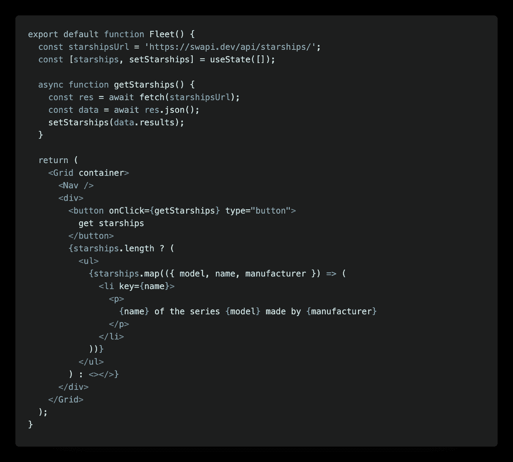
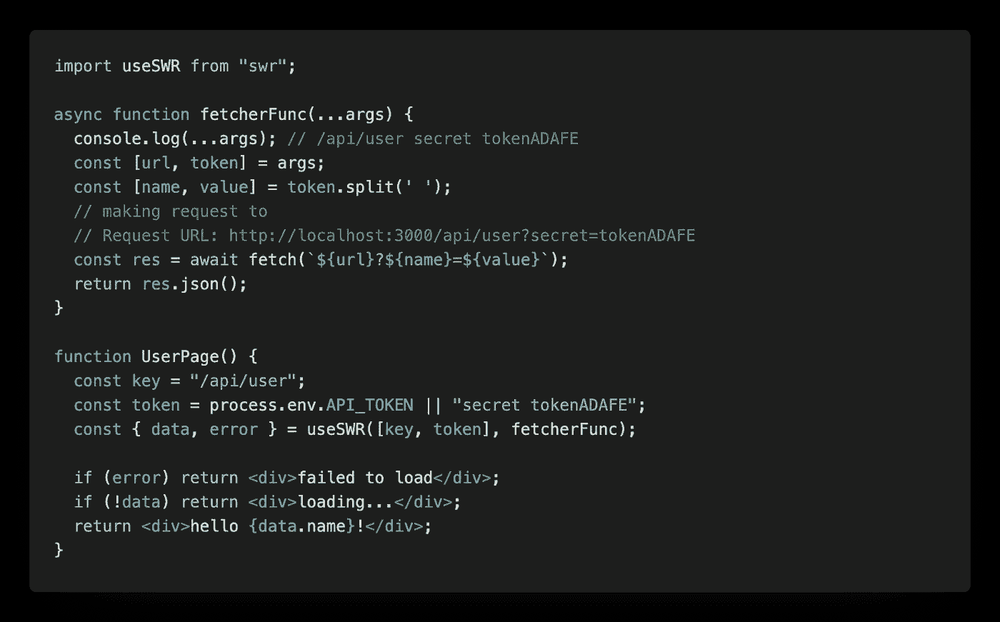
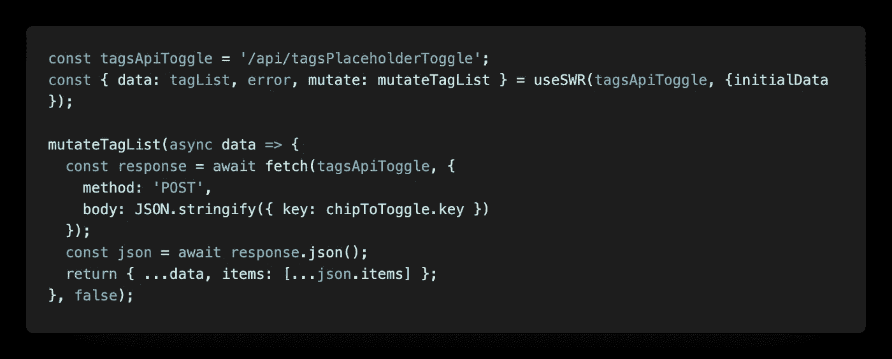
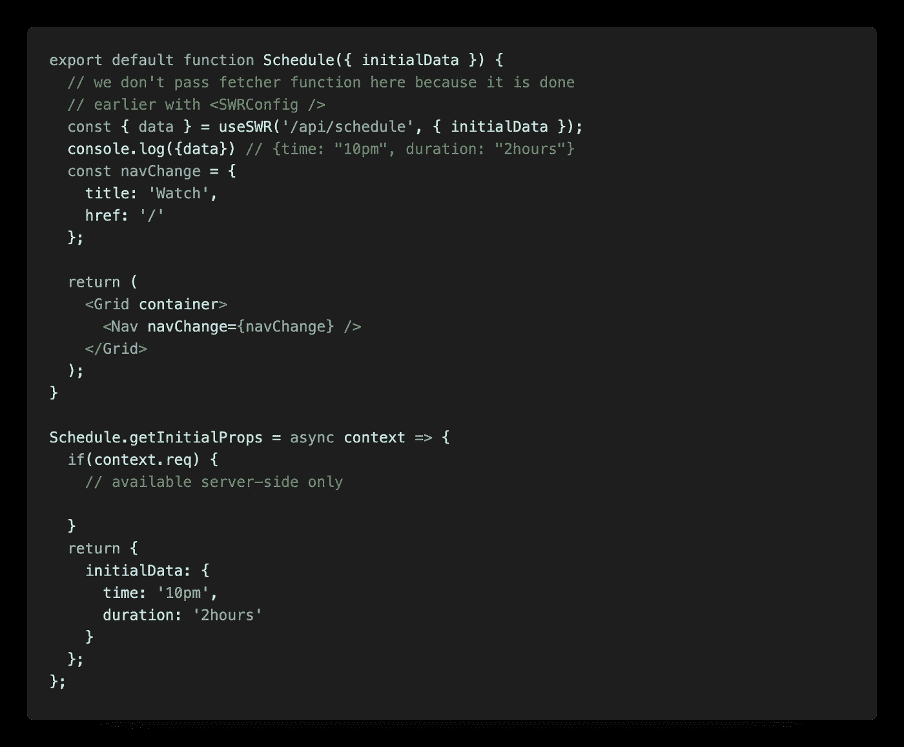
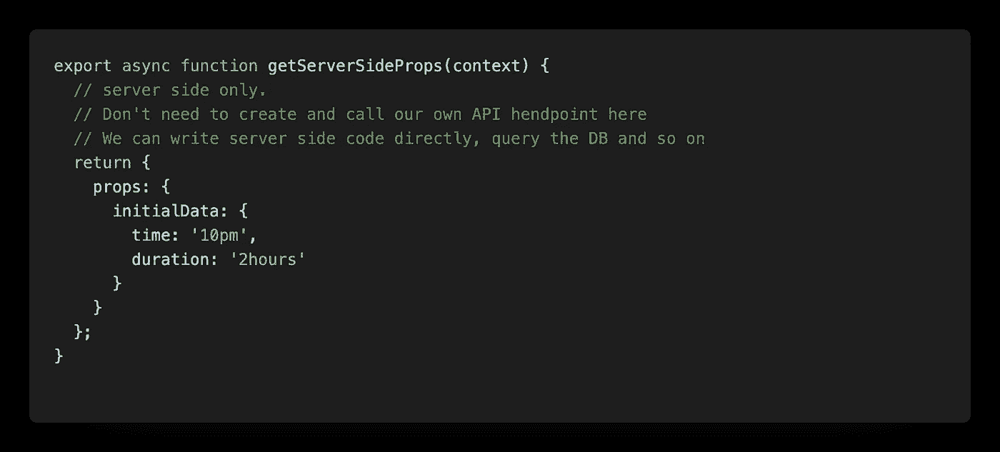
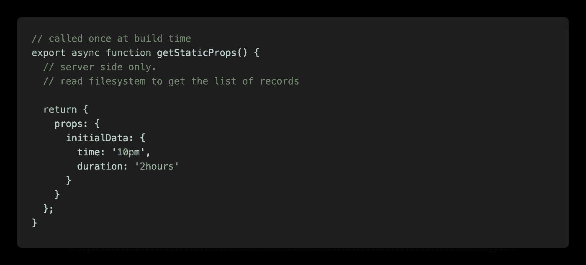

# React 和 Next.js 中的数据获取使用 SWR 在聚会上给朋友留下深刻印象

> 原文：<https://levelup.gitconnected.com/data-fetching-in-react-and-next-js-with-useswr-to-impress-your-friends-at-parties-ec2db732ca6b>


弗兰基·查马基在 [Unsplash](https://unsplash.com?utm_source=medium&utm_medium=referral) 上拍摄的照片

我们都同意:在 [Next.js](https://nextjs.org/) app 中取数据的方法有很多种。正因为如此，参加聚会的人不容易被你的组件有数据这一事实所打动。因此，我们最好开始讨论一些方法来改善用户体验，渲染时间，并可能在此过程中节省一些 API 请求。

在本文中，我们将讨论:

1.  客户端数据提取。
2.  `useWR`的好处、用例以及方法。
3.  下一次用`getInitialProps`取数据
4.  接下来`getServerSideProps`的好处和坏处。
5.  下一个`getStaticProps`

**但首先要做的是——在 Next.js 之前，在 React 中我们使用了`fetch`、`axios`或类似的库来发出 API 请求。这允许我们跟踪加载或错误状态，获取数据，然后保存到组件的状态、redux 存储或上下文中。这种方法简单明了，效果很好，但也有缺点。**



用户每次导航到页面，页面都没有准备好；应用程序发出一个 API 请求，用户查看装载微调器等待数据。与任何 React 应用程序一样，页面是空的，直到 JavaScript 在客户端运行并创建 HTML。这对 SEO 不好；这使得页面的索引更加困难，因为没有页面，只有 JS 来创建页面。

假设应用程序维护一些项目列表，如待办事项或星舰。在等待更新的同时，用稍微旧一点的数据呈现页面，用户体验会好得多。一旦有新数据从服务器传来，页面就会更新。

这正是`[useSWR](https://swr.now.sh/)` [hook 背后的想法，](https://swr.now.sh/)来自为我们带来 Next.js 的同一个优秀团队。然后，继续呈现页面，同时在后台向服务器请求新数据。



这是一个基本用例的一个小变化:第一个参数有两个目的。首先，它将被用作 useSWR 维护其缓存的键；其次，它将被传递给一个 fetcher 函数。我们可以传递给 fetcher 函数的不仅仅是一个 URL。通常我们可能需要其他东西—例如，身份验证令牌或查询参数。

由于是后端不可知的，useSWR 要求我们传递给它一个 fetcher 函数；它可以是任何返回承诺的函数。这也能很好地工作。

```
async function promiseFetcher() {return Promise.resolve({name: 'Heisenberg'})}
```

我们可以通过传递一个适当的 fetcher 函数和一个 GraphQL 查询(作为第一个参数)来使用 SWR 和 graphQL。

SWR 是一座伟大的图书馆，它让复杂的事情变得简单。它允许我们删除或避免自己编写全部代码。它维护外部缓存，当调用发生时，SWR 首先通过键检查缓存(`useSWR`的第一个参数)以立即获取数据；然后，它对服务器进行重新验证，以确保我们拥有最新的数据。useSWR 附带了许多很酷的功能，例如标签焦点跟踪、间隔重取、重复数据删除间隔、节流、错误跟踪和许多其他功能。

**请注意，**即使我们只是在谈论 React 应用程序和客户端获取，为了获得这里讨论的好处，仍然值得花时间去了解 useSWR。

## 一些使用我们的功能

在每个组件中一遍又一遍地传递 fetcher 函数和其他可能的选项会变得重复。因此，useSWR 带有全局配置组件。它的工作原理类似于对上下文的反应。我们所需要的就是将我们的应用程序包装在`SWRConfig`中，并传递给它一个包含所有所需选项的对象。之后，useSWR hook 只需要第一个参数—密钥。如有必要，我们可以根据个人使用情况覆盖这些设置。

```
<SWRConfig value={{ fetcher: fetcherFunc, dedupingInterval: 1000, onSuccess: onSuccessFunc, refreshInterval: 1000, revalidateOnFocus: false}}> <Component {...pageProps} /></SWRConfig>
```

useSWR 最大的威力来自缓存和缓存管理。我们可以直接在缓存中存储和更新数据，而不是获取数据并将其存储在状态中。这就是变异和触发函数发挥作用的地方。有两种方法可以得到它们:我们可以直接从`swr`包中导入或者从单个`useSWR`钩子中导入。在第一种情况下，我们每次都需要提供一个密钥；在后者中，函数将被“绑定”到返回它们的 useSWR 的键上。

```
import useSWR, { mutate, trigger } from 'swr';ORconst {data: robotData, mutate: mutateRobot, trigger: triggerRobot } = useSWR(key, fetcher, { initialData });
```

正如你从名字中可以猜到的，`mutate`用于直接改变所提供的键的缓存，这将导致 UI 的立即改变，并允许我们构建一个乐观的 UI。`trigger`用于数据的重新验证(重新获取)。useSWR 不允许我们发送 POST 请求，因此，如果我们需要添加一个新元素，比如一个 to-do，典型的流程如下所示。

```
await mutate(key, {...data, todo: newTodo});
await fetch(key, {method: 'POST',body: JSON.stringify({ todo: newTodo })})
```

在这种情况下，SWR 将立即更新用户界面。然后，`fetch`将向服务器发送数据，SWR 将使用新请求自动重新验证数据。如果我们想推迟重新验证并在以后手动触发它，我们可以将一个`false`作为第三个参数传递给`mutate`，并在需要时使用`trigger`。

```
mutate(key, {...data, todo: newTodo}, false);
await fetch(key, {method: 'POST',body: JSON.stringify({ todo: newTodo })});
// ... some other actions
trigger(key)
```

我们甚至可以使用当前缓存的数据，并通过向`mutate`传递一个函数来更新它，如下所示:



在这个例子中，我们使用服务器的响应来更新我们的缓存。虽然这种方法通常允许很大的灵活性，但我认为这个特殊的例子可能不是最好的方法。使用该示例的方法，我们可以保存一个潜在的 API 请求，代价是由于网络故障或服务器错误而与服务器失去同步。这就是为什么“改变 UI ->获取‘POST’->触发”这三个步骤对我来说是更好的选择。

**请注意，**由于缓存`data`很容易获得，并且有`mutate`和`trigger`函数供我们使用，我们很可能在大多数时候不需要 React.useState 来保存和操作我们的数据。

使用`mutate`的另一个有趣的用例是数据预取。简而言之，我们甚至可以在用户导航到特定页面之前就开始加载数据——比如说，当用户将鼠标悬停在指向所需页面的链接上时。这可以很容易地给我们额外的 200 毫秒-400 毫秒的加载时间。查看 Sergio Xalambrí的文章中的[以获得有关数据预取的示例和更多详细信息。](https://sergiodxa.com/articles/next-swr-prefetch/)

## Next.js 的更多选项

我们在 React 中所能做的就是在运行时从客户端获取数据，但是使用 Next.js 会变得更有趣，它允许在服务器或客户端以及在构建或请求时运行代码*。在 Next.js 中，我们应该始终以静态生成的页面为目标，只有在别无选择的情况下，我们才能实现服务器端呈现的页面。静态页面超快有两个主要原因。它们是在构建时生成的，可以被 CDN 缓存。这意味着我们的页面很可能来自同一个城市或者潜在用户所在的街道，而不是来自同一个大陆。*

在本节中，我们将讨论 Next.js 的关键异步函数`getInitialProps`、`getStaticProps`、`getServerSideProps`、客户端数据获取，以及所有这些如何与`useSWR`相结合。

## [getInitialProps](https://nextjs.org/docs/api-reference/data-fetching/getInitialProps)

`getInitialProps`从这份名单中脱颖而出，那就让它滚蛋吧。如果你有 Next.js 及更高版本，不建议使用*。`getInitialProps`将禁用[自动静态优化](https://nextjs.org/docs/advanced-features/automatic-static-optimization)并启用[服务器端渲染](https://nextjs.org/docs/basic-features/pages#server-side-rendering)。这个函数有一个棘手的行为。根据 Next.js 文档:*

> 对于初始页面加载，`getInitialProps`将只在服务器上运行。当通过`[next/link](https://nextjs.org/docs/api-reference/next/link)`组件或使用`[next/router](https://nextjs.org/docs/api-reference/next/router)`导航到不同的路线时，`getInitialProps`将在客户端上运行。

这意味着，如果用户通过直接链接导航到页面，例如浏览器自动建议的链接，这将导致 getInitialProps 在服务器上运行，而不是在客户端上运行。因此，我们应该不断地意识到这一点，并仔细选择我们放在那里的代码。我们并不经常有一段代码到处运行，所以不要忘记从像`isomorphic-unfetch`这样的包中导入`fetch`，否则你将无法在服务器上找到它。如果您 console.log 了什么东西，一定要查看正确的控制台。



getInitialProps 的要点是进行初始数据填充。

这对 SEO 有好处，因为它从一开始就让页面充满了实际内容。此外，它关闭了很酷的优化部分，总而言之，有时调用比我们需要的更多。那么，我们能有更精细的控制吗？

## [getServerSideProps](https://nextjs.org/docs/basic-features/data-fetching#getserversideprops-server-side-rendering)

如果你用的是 Next.js 9.3 及以上版本，那么答案是肯定的！我们肯定可以。

有`getServerSideProps`把页面从静态生成变成服务器端呈现。这意味着这个函数将在每个请求时被调用*，然后结果将被服务器用来在运行时呈现一个 HTML。之后，页面将被发送到客户端。实际上，Next.js 将第一次只计算整个页面一次；之后，如果用户导航到带有`next/link`或`next/router`的页面，getServerSideProps 将被调用——其结果将作为 JSON 发送到客户端并用于更新页面。*



**注意`getServerSideProps`和`getStaticProps`的几件事**:

1.  我们需要导出一个异步函数，而不是将其定义为页面对象属性。
2.  此功能只允许在页面上使用，不能用于单个组件。
3.  返回对象的形状与`getInitialProps`相比略有不同。

```
// getServerSideProps and getStaticProps return
return {
   props: {
     stars: 33, 
     upVotes: 54, 
     type: 'repo'
   }
}// getInitialProps return
return {
     stars: 33, 
     upVotes: 54, 
     type: 'repo'
   }
```

与静态页面相比，使用服务器端渲染会更慢，因为页面不能被 CDN 缓存，但预渲染的页面将始终是最新的。第一字节时间(TTFB)将比`getStaticProp`慢，因为服务器必须计算每个请求的结果，如果没有额外的配置，CDN 无法缓存结果。

加上 SWR，这将是我们最有活力的选择。该页面将在请求时间从服务器获得最新数据，之后将保持最新状态，SWR 更新选项卡焦点重新获得，间隔或任何其他我们想要的用户交互。这种类型的页面将包含最新的数据，而不管用户如何导航到它。

如你所见，`getServerSideProps`与`getStaticProps`相似。不同之处在于`getServerSideProps`在每次请求时运行，而不是在构建时运行。

## [getStaticProps](https://nextjs.org/docs/basic-features/data-fetching#getstaticprops-static-generation)



让我们想象一个场景:我们有一个页面，显示标签/类别列表；我们希望用户能够订阅这些标签来过滤播放列表。在这种情况下，标签和与其相关联的播放列表都是动态的，并且依赖于外部数据。


然而，可能的标签列表不会像仪表板统计数据、instagram 赞或股票交易平台上的图表那样频繁变化。因此，我们可以说我们在用户请求之前就知道了可能的标签*。可能的标签列表可以公开缓存(不是特定于用户的),页面将快速加载，因为 HTML 和 JSON 都将在构建时生成，而 CDN 可以缓存它们。之后，我们使用 SWR 来确保页面的交互性和最新的内容，就像我们之前讨论的一样。*

如果你的网站内容不断变化，比如博客、产品网站、电子商务、营销网站、帮助和文档网站，这种情况也很好，因为网站无论如何都会重新构建新的内容。

至此，我们完成了一个完整的循环，回到了客户端数据获取。有了 Next.js，使用 getStaticProps 真的没有坏处。一点陈旧或不完整的数据仍然可以更好地理解页面内容，而不是没有数据。我能想到的下一步退回到仅客户端数据获取的唯一原因是*，如果数据是用户特定的或私有的，并且 SEO 是不相关的*。用户配置文件和仪表板是一个很好的用例。

它是这样工作的:

> 首先，立即显示没有数据的页面。可以使用静态生成预先呈现页面的各个部分。您可以显示缺失数据的加载状态。与等待服务器首先加载数据，然后计算并发送页面相比，用户将更快地看到页面的加载状态。这种策略更适合细节经常更新的仪表板，而不是内容丰富但更新频率较低的页面。然后，在客户端获取数据，并在准备就绪时显示出来。

以上总结了我在 React 和 Next 中获取数据的一些方法和用例。在本文中，我们讨论了:

*   useSWR 以及它如何通过使网站速度更快、内容更丰富、互动性更强来改善 SEO 和用户体验
*   使用 Next.js 异步方法预取数据的利弊

感谢您的阅读，我希望这篇文章扩展了您对 Next.js 应用程序中数据获取选项的理解。

继续向用户提供出色的体验和快乐的编码！