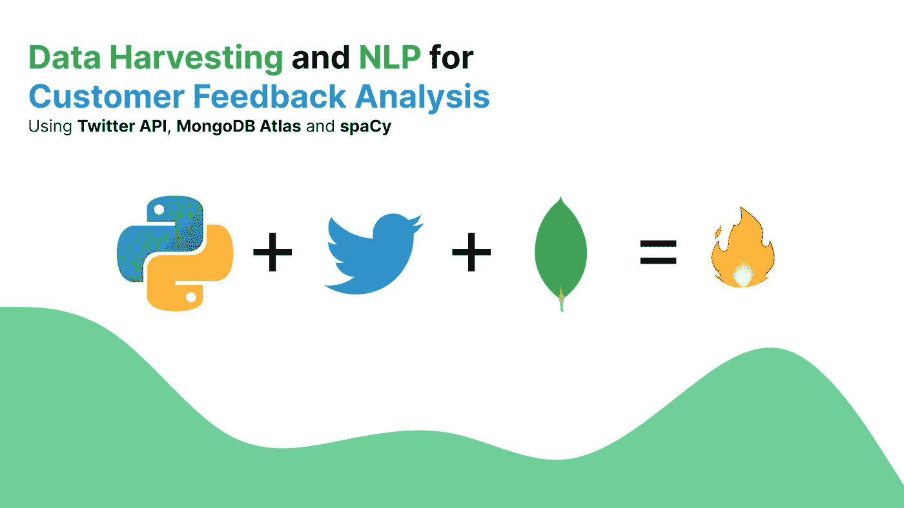
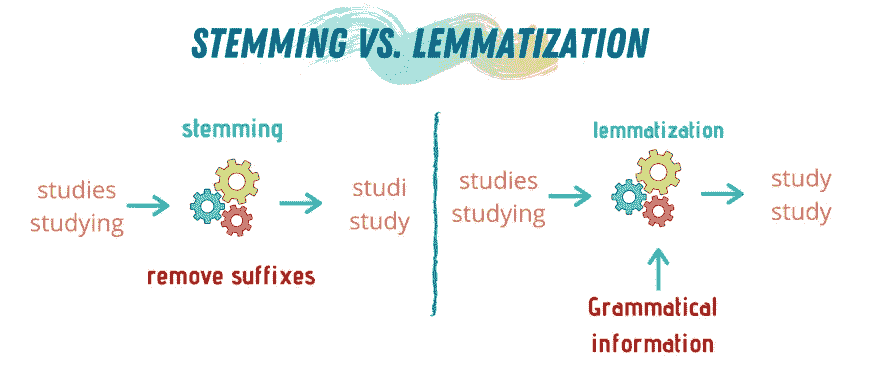
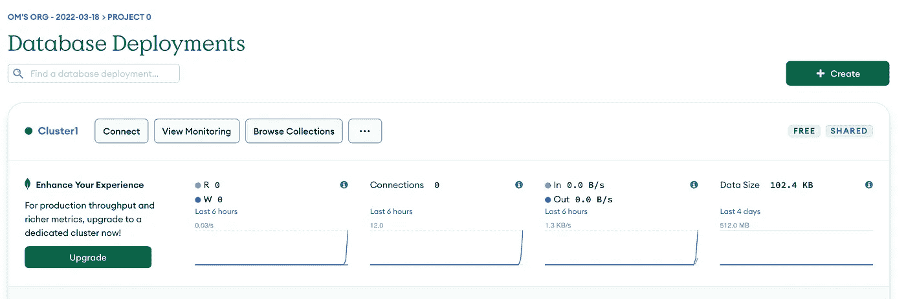
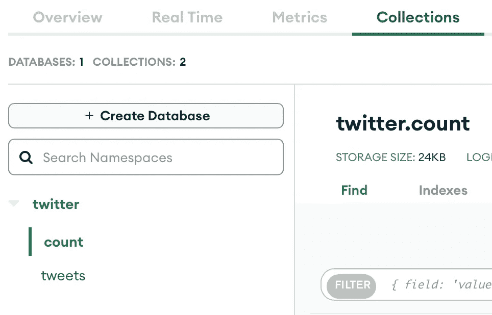
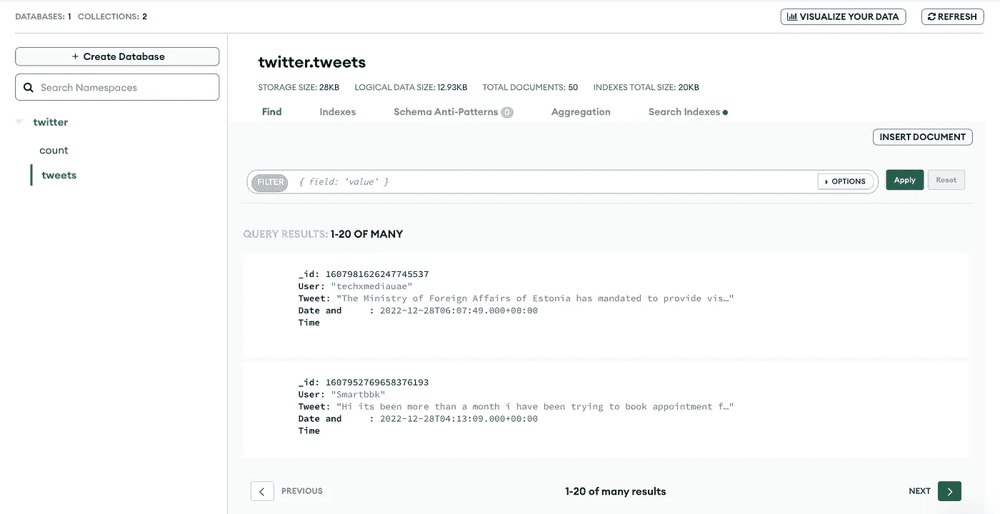
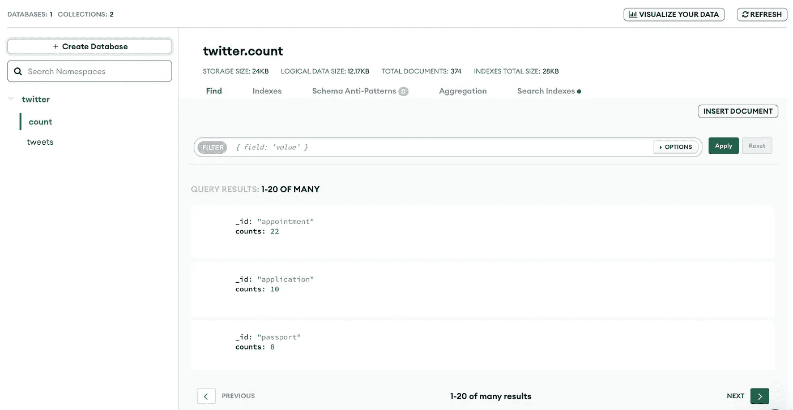
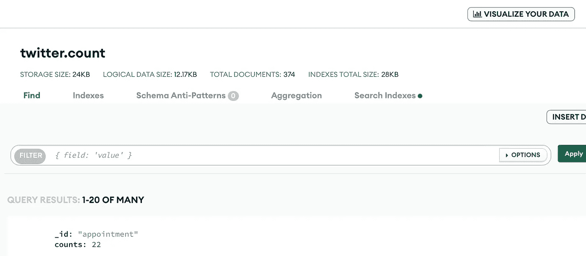
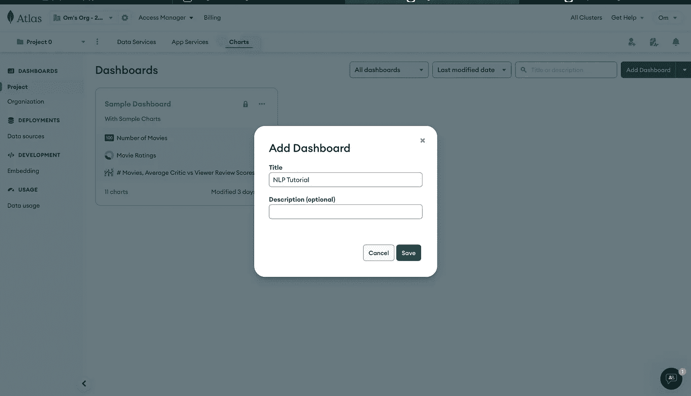
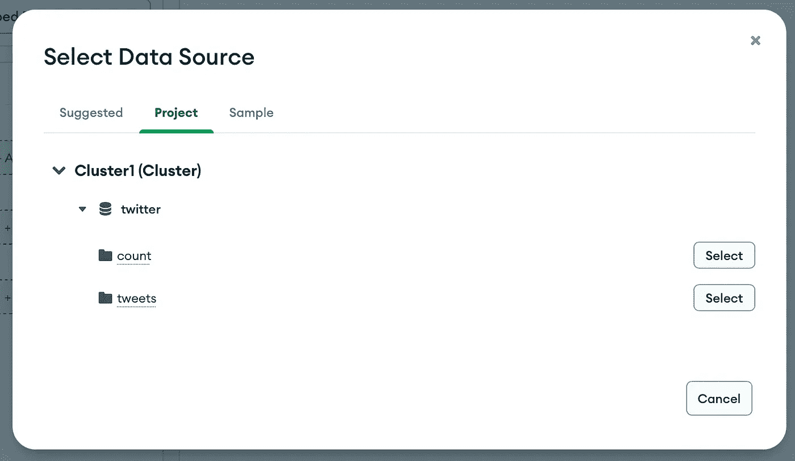
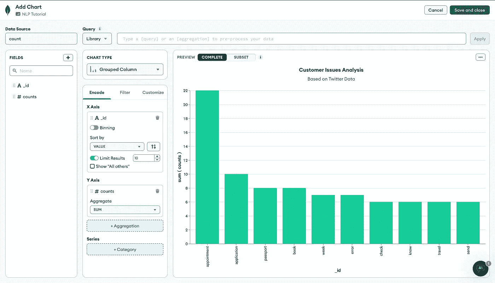

# 用于客户反馈分析的数据收集和自然语言处理

> 原文：<https://levelup.gitconnected.com/data-harvesting-and-nlp-for-customer-feedback-analysis-a8725ebe57a7>

## 使用推特应用编程接口、MongoDB Atlas 和 spaCy。



在本教程中，我们将构建一个数据挖掘管道，使用 Twitter API 提取和分析客户反馈。本文面向希望使用 Python 开始 NLP 之旅的人或希望改进 EDA(探索性数据分析)过程的数据分析师。

我已经将管道划分为 **4 个阶段**:

1.  **使用*推特应用编程接口*** 获取推特
2.  **使用 Python 的 *spaCy 库*分析并提取推文中的关键词。**
3.  **使用 *MongoDB 图集*在云上存储推文和关键词。**
4.  **在 *MongoDB Atlas* 上创建数据可视化。**

# 使用推特应用编程接口获取推特

首先，您将需要一个 [Twitter 开发人员帐户](https://developer.twitter.com/en/docs/twitter-api/getting-started/getting-access-to-the-twitter-api)来获取 API 凭据。您可以观看此[视频](https://www.youtube.com/watch?v=Lu1nskBkPJU&t=854s)了解更多详情。一旦你成功创建了一个开发者帐户，创建一个名为`config.ini`的文件，将你所有的证书保存在一个地方。

```
[twitter]
api_key = APIKEY
api_key_secret = APIKEYSECRET
access_token = ACCESSTOKEN
access_token_secret = ACCESSTOKENSECRET
bearer_token = BEARERTOKEN
```

在继续获取推文之前，我们需要验证 API。我们将使用`tweepy`库来简化流程。

```
import tweepy
from configparser import ConfigParser

#configuration
config = ConfigParser()
config.read('config.ini')

#twitter credentials
api_key = config['twitter']['api_key']
api_key_secret = config['twitter']['api_key_secret']
access_token = config['twitter']['access_token']
access_token_secret = config['twitter']['access_token_secret']

#authentication
def twitter_auth():
    auth = tweepy.OAuthHandler(api_key,api_key_secret)
    auth.set_access_token(access_token,access_token_secret)
    return auth

#api
def twitter_api():
    auth = twitter_auth()
    api = tweepy.API(auth)
    return api
```

对于这个项目，我将获取标有“@ VFSGlobal”(因为那是我目前实习的公司)的推文，关键词为“紧急”或“帮助”。我们会忽略所有的转发。同样的查询将是:`@VFSGlobal OR @Vfsglobalcare AND urgent OR help -filter:retweets`。

`Cursor()`是一个 tweepy 函数，允许我们更改参数以获取所需的 tweets。

最后一个功能:

```
#fetching tweets
def fetch_df_tweets():
    api = twitter_api()
    query_topic = '@VFSGlobal OR @Vfsglobalcare__ AND urgent OR help -filter:retweets'
    tweets = tweepy.Cursor(api.search_tweets, q=query_topic,count=200,tweet_mode='extended',result_type='recent').items(200)
    return converting_to_df(tweets)
```

`converting_to_df()`是将所有推特信息转换成熊猫数据帧的功能。数据框架使存储和操作数据项变得更容易。由于我们将使用 MongoDB 来存储推文(稍后会有更多内容)，我们可以很容易地将数据帧发布到集合中。

`converting_to_df()`功能:

```
columns = ['_id','User','Tweet','Date and Time']
data = []
for tweet in tweets:
    text = tweet.full_text.split() #split tweets into words
    resultwords  = filter(lambda x:x[0]!='@', text) #remove all @mentions
    result = ' '.join(resultwords) #merge all words
    data.append([tweet.id,tweet.user.screen_name,result.capitalize(), tweet.created_at])
df = pd.DataFrame(data,columns=columns)
return df
```


样本数据帧输出

# **使用 Python 的 *spaCy 库分析并提取推文中的关键词。***

我们将使用 spaCy 模型来处理推文。NLP 过程将包括:标记化和引理化。分析将基于关键词的总体频率。

NLP 步骤:

1.  **句子标记化(将推文分解成句子)。**
2.  **消除停用词(不重要的词)。**
3.  **词汇化(将一个词的词形变化组合起来，以便作为一个项目进行分析的过程)。**



来源:业务流程孵化器

首先，第一步是用`spacy.load("en_core_web_lg")`导入空间模型。您可能需要使用`spacy.cli`下载模型。

```
import re
import spacy
from spacy.lang.en.stop_words import STOP_WORDS
import pandas as pd

# spacy.cli.download("en_core_web_lg") #download the model only once
nlp = spacy.load("en_core_web_lg")

def chunking(df):

    df = df['Tweet']
    all_sentences = []

    #sentence tokenization
    for sentence in df:
        all_sentences.append(sentence)

    #lemmatization
    lemma=[]
    for line in all_sentences:
        line = re.sub(r'[^\w\s]', '', line) #filtering the @mentions and punctuations
        if line !='':
            doc = nlp(line.lstrip().lower())
            for token in doc:
                lemma.append(token.lemma_)

    #Removing all stopwords
    lemma2 = []
    custom_stop_words = ['please','try','vfs','day','need','hi','apply','visa',' ']

    for word in lemma:
        if word not in custom_stop_words:
            lexeme = nlp.vocab[word]
            if lexeme.is_stop==False:
                lemma2.append(word)

    df2 = pd.DataFrame(lemma2)

    #skipping the search keywords
    searchfor = ["urgent","help"]
    df2 = df2[df2[0].str.contains('|'.join(searchfor)) == False]
    df2 = df2.value_counts().rename_axis('_id').reset_index(name='counts')

    print(df2)
    return df2
```

`value_counts()`会统计每个单词的出现次数，并保持跟踪。这将有助于我们理解频率。这句话将会是`_id`。

`custom_stop_words`是我不想数的一串单词。

整个 NLP 过程很简单，因为我不想深入研究它，使流程变得复杂并增加本文的长度。

# **使用 *MongoDB Atlas* 在云上存储推文和关键词。**

这一步你需要一个 [MongoDB Atlas](http://cloud.mongodb.com) 账号。MongoDB 允许你免费创建一个共享集群。



MongoDB 仪表板

单击连接>连接您的应用程序>选择 Python 并复制连接字符串。

将连接字符串添加到之前创建的`config.ini`文件中。

```
[mongodb]
connection_string = CONNECTIONSTRING
```



在 MongoDB Atlas 中创建一个数据库，包含两个集合:count 和 tweets。

为了连接到 MongoDB，我们需要使用`pymongo`库。

```
from pymongo import MongoClient, errors
from configparser import ConfigParser

#configuration
config = ConfigParser()
config.read('config.ini')

# Connect to MongoDB
def get_database():

   # Provide the mongodb atlas url to connect python to mongodb using pymongo
   CONNECTION_STRING = config['mongodb']['connection_string']

   # Create a connection using MongoClient. You can import MongoClient or use pymongo.MongoClient
   client = MongoClient(CONNECTION_STRING)

   # Create the database for our example (we will use the same database throughout the tutorial)
   return client['twitter']
```

我们将使用 2 个函数插入数据，即。`insert_df_tweets()`和`insert_df_count()`。`insert_df_tweets()`将插入推文，`insert_df_count()`将插入关键词的数量。

```
def insert_df_tweets(df):
    # Get the database
    dbname = get_database()
    # Get the collection
    collection_tweets = dbname['tweets']
    # Insert dataframe into collection
    try:
        collection_tweets.insert_many(df.to_dict('records'),ordered=False)
    except errors.BulkWriteError:
        print("Skipping duplicate tweets")

def insert_df_count(df2):
    # Get the database
    dbname = get_database()
    # Get the collection
    collection_count = dbname['count']
    #Inserting dataframe into collection
    try:
        collection_count.insert_many(df2.to_dict('records'),ordered=False)
    except errors.BulkWriteError:
        print("Skipping duplicate values")
```

为了避免重复插入多条推文，我们将使用`try except`块来处理错误。

将一切整合在一起:

```
if __name__ == "__main__":  
    #fetch tweets in dataframe 
    df = fetch_df_tweets()
    #insert dataframe into mongodb
    insert_df_tweets(df)
    #chunking tweets 
    df2 = chunking(df)
    #insert dataframe into mongodb (chunks with counts)
    insert_df_count(df2)
```

祝贺您，您已经成功地将所有值插入到您的 MongoDB 中。



您的仪表板应该是这样的。



# **在 *MongoDB Atlas* 上创建数据可视化。**

由于 MongoDB Atlas 的内置数据可视化特性，这是最有趣和最容易的部分。

点击右上角的`Visualize Your Data`。



点击`Add Dashboard`创建一个新的仪表板。



添加一个新图表，并选择当前集群作为数据源。



选择“计数”,因为我们将分析关键词的频率。

将`_id`添加到 X 轴，将`count`添加到 Y 轴。



最终仪表板

瞧啊。您很快就创建了数据可视化。改进可视化还有很多工作要做，但我希望这篇教程能让你对如何使用从 Twitter 收集的数据构建仪表板和图表进行反馈分析有一个基本的了解。

希望本教程对你有所帮助。如果您有任何疑问或建议来改进整个流程，请在评论中告诉我。

## 链接:

1.  [GitHub](https://github.com/Om-Kamath/Twitter_CFA)
2.  [MongoDB 图集](https://www.mongodb.com/atlas/database)
3.  [空间](https://spacy.io/)
4.  [Twitter 开发者平台](https://developer.twitter.com/en)

如果你喜欢我的博客，你可以给我买杯咖啡。

# 分级编码

感谢您成为我们社区的一员！在你离开之前:

*   👏为故事鼓掌，跟着作者走👉
*   📰查看[升级编码出版物](https://levelup.gitconnected.com/?utm_source=pub&utm_medium=post)中的更多内容
*   🔔关注我们:[Twitter](https://twitter.com/gitconnected)|[LinkedIn](https://www.linkedin.com/company/gitconnected)|[时事通讯](https://newsletter.levelup.dev)

🚀👉 [**加入人才集体，找到一份令人惊喜的工作**](https://jobs.levelup.dev/talent/welcome?referral=true)