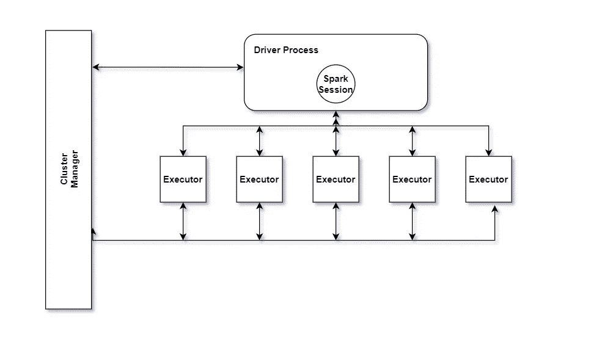
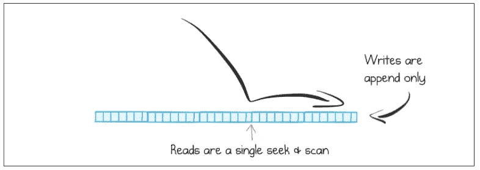

# 批处理与流处理

> 原文：<https://levelup.gitconnected.com/data-intensive-series-batch-vs-stream-7d58fcb43018>

# **系列之三:** [数据密集型应用](https://medium.com/@r-arias/data-intensive-applications-series-38e257aeeb1a)

当我们遇到拥有大量数据的系统时，有两种主要方法可以处理这些数据，将其转化为对我们组织有用的东西。

其中一种方法是批处理，该过程获取一段时间内积累的大量数据，并应用操作将这些数据转换成其他数据。

第二种方法是流处理，其中数据流经事件流，处理(接近)实时发生。

这两种方法都很重要，因为它们解决了组织的不同需求。

# 成批处理

这是一种经典的方法，可能自计算机出现以来就存在了。在数字计算机发明之前，穿孔卡片制表机实现了半机械化的批处理，从大量输入中汇总统计数据。

在现代应用程序中，批处理要么在数据仓库中执行，要么使用 MapReduce 操作聚集大量数据。

无论哪种方式，该处理的目标都是获取静态数据，并以某种方式转换它以产生某种效用，例如，计算总收入、销售预测、赌博统计等。

传统的数据仓库方法通常在一个地方使用大量的处理能力来处理大量数据。当然也有分布式数据仓库，但是策略非常相似。

Hadoop 或 Spark 等工具中的 MapReduce 方法创造了以分布式方式存储数据的新方法，允许分布式系统利用分布式文件系统来实现更好的性能和可扩展性。

如今，我们可以使用小型 Spark 集群在几分钟内处理大量数据，而传统方法可能需要几天。

Apache Spark 的典型设置如下所示:

阿帕奇火花简化版

在这种设置中，数据处理是跨集群中的所有节点规划和分布的，从而允许超快速批处理。

总之，Spark 将数据划分成块，并发送给执行器并行执行操作。

这种方法在当今世界仍然非常重要，并且考虑到我们似乎正在收集越来越多的数据，这些系统随着处理需求的发展而发展是至关重要的。

# 流处理

另一方面，流处理是一种更新的方法，它基于这样一个事实(除非发生意外)，数据不会停止流入，因此数据集永远不会完整。

批处理需要在逻辑上分割数据，以便设置边界和应用转换。

在流处理中，我们的工作前提是数据集是不完整的，并且数据将继续以恒定的方式进入系统，因此我们需要在数据到来时对其进行处理。

这样做的主要好处是我们可以立即得到反馈。我们应用的转换会被立即处理，我们可以立即看到结果。这种设置还可以让我们摆脱功能较弱的机器，因为处理传入的较小数据集可能需要每个节点较少的资源。

# 传动装置ˌ[机]变速器

在批处理中，存储单位是一个文件，其中包含一系列项目。在处理这些文件时，这些文件被分解成单独处理的项目。

在流处理中，这些项目是单独到达的，它们通常被称为“事件”，但它们实际上是相同的，是一个自包含的、不可变的对象，它存储发生的事情的细节，通常还有时间戳。

因此，事件流是指这些事件的传输，通常由“生产者”生成，并由“订户”或“消费者”读取。

典型的事件可以是用户在网上商店中执行的操作，例如下订单。

# 信息系统

通常情况下，这些事件是使用消息传递系统(如 Kafka)传输的。生产者将把包含事件的消息发送到消息传递系统，该系统将负责把这些事件推送给消费者。这也称为发布/订阅模式。

# 消息日志

在传统的流系统中，我们会在中间找到一个数据结构，通常称为日志。这往往是一个队列，它存储所有到达的事件。

消息日志

日志是磁盘中仅附加的记录序列。生产者追加一个新事件，消费者按顺序跟上新追加的事件。

为了进一步扩展这种设置，一些系统实现了分区日志，其中不同的分区可以驻留在不同的机器上，使每个分区成为一个独立的日志，可以相互独立地读写。这是卡夫卡主题背后的主要思想。

这就是你在[事件驱动架构设计](https://medium.com/p/event-driven-architectures-in-software-design-757d92b85df5)中发现的大部分内容。

# 哪里有关系？

流处理有许多用例，它在现代架构中扮演着重要的角色。一些使用案例包括:

*   欺诈检测。真实类型欺诈检测已经成为现代体系结构的主要内容，并且在每个组织中都扮演着重要的角色。能够获得关于潜在欺诈的实时反馈可以为您的组织省去许多麻烦。
*   交易系统。根据定义，如今的股票交易是一种流处理实践。毫无疑问，能够实时分析金融市场的价格变化是一项重要的功能。
*   军事和情报。这些系统实时跟踪潜在的危险活动，对于防止恐怖袭击和其他非法活动至关重要。

同时，任何系统分析的实时处理对于现代系统也是至关重要的，在现代系统中，对故障的快速反应是非常重要的。

# 结论

批处理和流处理在日常应用中都起着至关重要的作用，每个都针对一个特定的用例。

然而，现在的趋势是越来越实时。随着像 Kafka 这样的系统变得越来越强大，处理能力和存储变得越来越便宜，公司往往开始将数据流作为其不可或缺的主干来设计他们的系统，并几乎完全放弃批处理过程。

在这一节中，我将结束我的数据密集型应用程序系列。

我希望你喜欢它，如果你有任何问题，请联系我。

快乐建筑？🤔