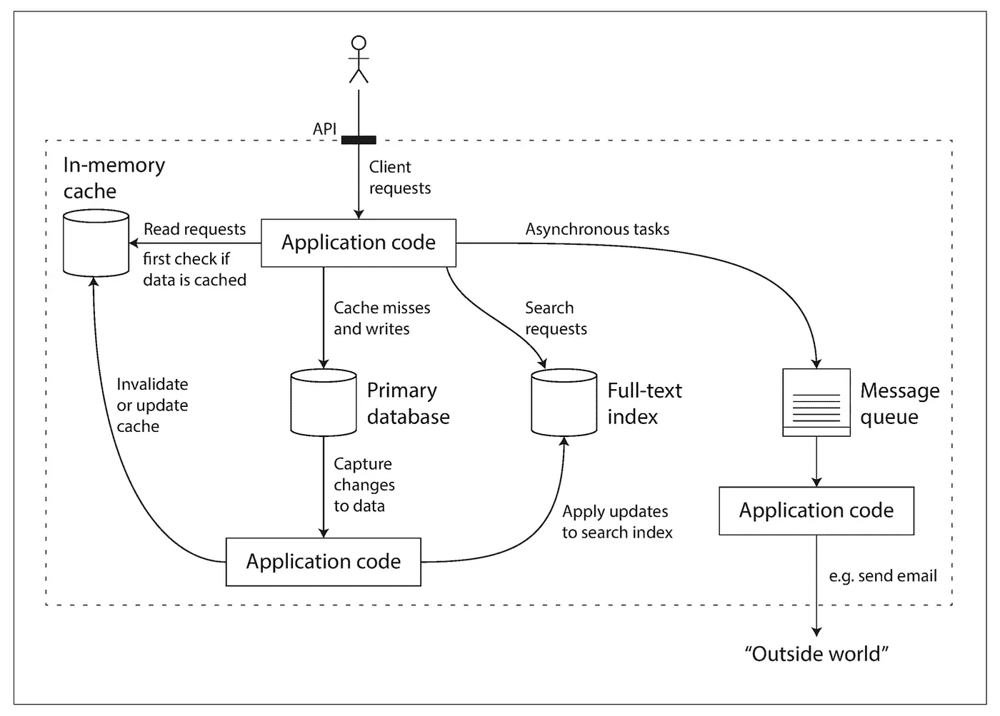

# 数据系统基础

> 原文：<https://levelup.gitconnected.com/data-intensive-series-foundations-of-data-systems-20cbe4f7d9b3>

# **系列之一:** [数据密集型应用](https://medium.com/@r-arias/data-intensive-applications-series-38e257aeeb1a)

每一个复杂的系统都有一系列的基础，这些基础造就了它们。我们建立在这些基础之上，以确保我们的应用程序能够相应地处理未来的增长，并在没有太多挫折的情况下解决我们的问题。

我们对相关原则的理解和应用得越好，建立的基础越好，就越容易扩展，以后遇到的问题就越少。

大多数复杂的应用程序都是由简单的构建块组成的。特别是，数据密集型应用程序通常具有以下部分或全部构造块:

*   数据存储:我们需要在某个地方存储数据/状态，通常是一个数据库。
*   缓存:为了提高性能/速度，我们使用缓存来存储最常访问的数据，或者昂贵操作的结果。
*   搜索索引:允许用户快速搜索和索引数据的方法。
*   流处理:跨服务传递异步消息。
*   批处理:定期对存储的数据进行操作，以便获得洞察力，或者将其转换为相关的子集。

在每一种工具中，都有另一个选择的空间，一般的经验法则是为工作选择正确的工具。一个适应你的特殊需求，没有别的。例如，如果存储关系数据，关系数据库可能比图形数据库工作得更好。

我们可以在 Kleppmann 书中的一个例子中看到所有这些组件的作用

通用数据系统架构— Martin Kleppmann

在这里，您可以识别所有不同的简单组件，这些组件可以参与形成一个通用的复杂系统。

在挑选相关的构件时，有我们想要实现的基本目标。

根据 Kleppmann 的说法，成功的数据系统需要可靠、可伸缩和可维护，因此我们应该仔细选择组件以满足这些标准。

# 可靠性

“即使在逆境中，该系统也应继续正确运行”。

每个系统都应该以具有良好的可靠性为目标。不幸的是，我们无法防范每一种情况，因此我们的系统很可能会在某个时间点以故障的形式遇到可靠性问题。

相反，我们不能保护自己免受每一个错误，但我们可以使我们的系统尽可能容错。如果我们的目标是自动恢复或自愈，那就更好了。

我们可以从一些错误中恢复，而另一些则更加困难，例如，可以通过更好的工程来防止的安全漏洞就是后者的一个很好的例子。

我们可以从中恢复的一些常见故障包括硬件和软件故障，以及人为错误。

硬件故障通常与机器丢失有关。大多数现代应用程序将通过增加冗余来创建对这些的容忍度。多 A-Z 和多区域部署是一个常见的例子。如果整个可用性区域出现故障，我们可以安全地访问另一个区域，可能只有一点延迟，但可以继续运行。

软件故障更难计划，因为根据定义，它们是通过系统中的错误引入的，如果我们意识到这些，它们就可以被完全消除。这些问题甚至可能在某些情况发生之前处于休眠状态，或者可能会影响特定的关键服务，这些服务在达到某个阈值之前一直很好。防止这些的最好方法是通过广泛的测试。

人为错误是影响可靠性的第三个因素，天哪，我们会把事情搞砸的！如果你不相信我，看看最近在脸书发生的大规模网络中断。有趣的是，人为错误更容易处理。理想情况下，你不要让人们陷入可能会搞砸的境地，要有监控机制来快速发现问题，要有恢复机制，总体上要努力实施良好的工程实践，尽可能减少危险情况。

可靠性是一个非常重要的优化标准。在某些情况下，如空中交通管制，它可能会危及人们的生命，但即使不是这样，不可靠的系统也可能会导致收入损失，从而使公司处于危险之中，甚至有可能迫使它们陷入困境。

# 可量测性

“随着系统的增长，应该有合理的方法来处理这种增长”。

在不断发展的系统中，今天的性能不能保证明天的性能。随着更多的流量、更多的数据、更多的地区、更多的用户等，假设所有这些新的交互将暴露出关键的瓶颈，在这些瓶颈中，仅仅增加更多的金属(处理能力)是不够的。

实现良好的可伸缩性是一个难题，当平衡“提前考虑”和“避免提前过度花费”时。

如今，云解决方案可以无限扩展以满足您的需求，并随着您的增长为您分配资源。然而，系统的某些部分不能简单地以这种方式扩展。

为了弄清楚你的系统有多大的可伸缩性，你需要对它进行压力测试，并且总是知道你能把它推进多远。

首先要做的是计算出系统的当前负载，然后开始运行负载增加的测试，看看会发生什么。您需要提前定义 KPI，以便获得可靠的成功度量。例如:如果测量资源；CPU 利用率、内存使用等。如果测量等待时间；平均响应时间、吞吐量等。使用第 95、99 百分位观察异常值。

一旦你确定了突破点，你就可以开始制定一个策略来处理潜在的失败或者相应的发展计划。

# 可维护性

随着时间的推移，许多不同的人将在这个系统上工作，他们都应该能够高效地工作

大部分软件成本投入到持续的维护中(修复错误、解决技术债务、添加新功能等)，这使得构建可维护的系统成为优先事项。

当设计系统时，我们应该以前瞻性的方式来做，试图将未来的痛苦最小化。

我曾经在某处读到过，你应该把维护你的代码的人当成一个知道你住在哪里的精神病患者来编码。不幸的是，我记不起在哪里读到的，但我觉得它既有趣又真实。

Kleppmann 建议我们关注 3 个设计原则:

*   可操作性，让您的操作人员可以轻松运行软件。
*   简单，通过去除复杂性，让未来的工程师更容易理解。
*   可进化性，让工程师可以轻松地进行更改和添加功能。

在这三个标准(可靠性、可伸缩性和可维护性)的指导下，我们可以增加构建更好系统的机会，并在处理数据密集型应用程序时获得良好的结果。

可以想象，这不足以构建复杂的数据密集型系统，但这是一个开始。许多设计和工程决策都发挥了作用。更有可能发生的是，你的系统会随着时间的推移而发展，你不必立刻做出所有这些决定，但你会有时间考虑你的选择。

选择的时候记住这些原则，你会有一个好的开始。

接下来，我们将探索分布式系统中的复制和分区。