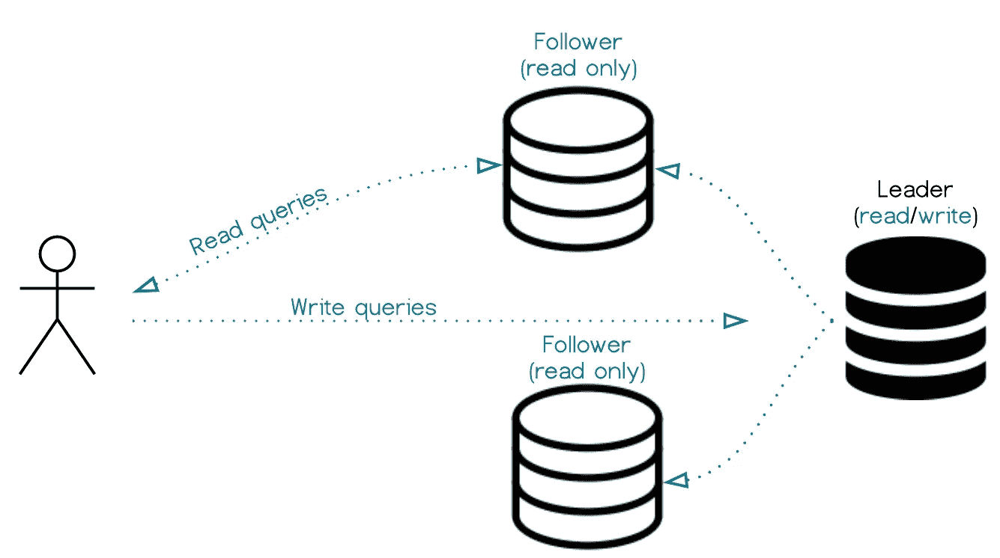
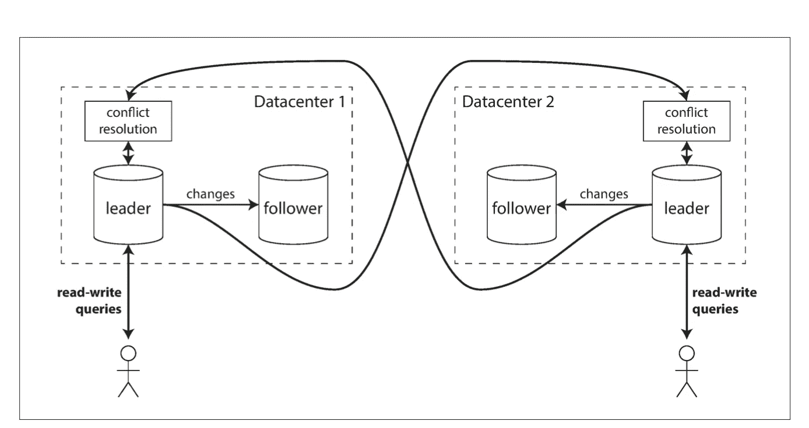

# 分布式系统中的复制和分区

> 原文：<https://levelup.gitconnected.com/data-intensive-series-replication-partitioning-4d6c32fcc65e>

# **系列之二:** [数据密集型应用](https://medium.com/@r-arias/data-intensive-applications-series-38e257aeeb1a)

为了构建现代的数据密集型应用程序，分发这些应用程序几乎是一个强制性的要求。在每个分布式系统中，数据复制和分区在其设计中起着至关重要的作用。

复制意味着在通常通过网络连接的多台机器上保存数据集的副本。

你想这么做的原因有很多:

*   让数据在地理位置上靠近您的用户，以最大限度地减少延迟。
*   在某些节点出现故障的情况下，提高可用性和容错能力。
*   通过允许多个节点分担负载并整体处理更多请求，提高吞吐量和性能。

另一方面，分区意味着将数据分割到不同的节点上。分区的主要原因是可伸缩性。当我们有大型数据集，而这些数据集在物理上不能放在同一台机器上，或者这样做效率很低时，我们通常会对其进行分区。

一个简单的分区用例是在地理上分割数据，其中只有特定区域的用户需要数据来进行操作，例如，在订单系统中，亚洲订单只在亚洲需要，而欧洲订单只在其他区域需要。

复制和分区并不相互排斥。事实上，它们通常结合在一起以实现更好的性能，其中跨不同的节点存储和复制大数据集的副本或较小部分。这意味着部分数据存储在多个位置，从而提高了容错能力。

# 复制策略

如果您正在存储的数据没有发生变化，您就不需要复制策略，您只需要将它存储在不同的位置，然后忘记它。但是你可以想象，这种情况很少发生。

复制的主要挑战是在发生更改时保持数据最新。对此，有许多流行的策略:

# 单一领导者

顾名思义，这种策略由一个领导者和多个跟随者处理复制组成。每个节点将存储数据的副本，其中一个节点将被选为领导者。应用程序写入将发送到该领导者，追随者将接收复制的写入以保持最新。

从这里开始，有一个无限可能的世界。最常见的情况是，跟随者是只读副本，其中客户端可以以只读模式连接到。

数据复制可以同步进行，也可以异步进行，这两种方式各有利弊。

在同步复制的情况下，领导者会等到跟随者确认拥有数据后再报告成功，而在异步复制中，领导者不会等待跟随者的确认。

同步复制的优点是一致性。您可以保证在所有节点上都有最新的数据。如果领导者节点失败，任何追随者都可以取代它。缺点是这个过程依赖于所有的跟随者同步，这会降低性能。同时，如果追随者失败，领导者需要停止写，直到追随者恢复并运行。

另一方面，异步复制的优势在于，即使从服务器宕机，主服务器也可以继续处理写入。当他们重新上线时，他们可以继续玩游戏。然而，缺点当然是我们最终可能会得到不同步的读取副本，这取决于您存储的数据是否有问题。需要余额检查的过期银行交易可能确实有问题，但过期的脸书状态可能没有那么糟糕。

单头复制

# 多重领导

为了解决单领导者设置中的一些问题，出现了另一种策略，即多领导者，其中存在多个领导者。

在这种设置中，方法类似于单个领导者，但是不止一个节点接受写入，并且每个领导者同时是其他领导者的跟随者。

正如您所想象的，这是一个更复杂的设置，有其自身的优点和问题。

主要优势是，我们现在可以继续写入数据，即使其中一个领导者失败，但缺点是很难保持这些领导者同步，在出现冲突时解决冲突。想想协作编辑应用程序，如 Google Docs 或 conception，其中每个本地副本中的编辑可能会在某些需要解决的领域引起冲突。

有许多处理冲突的策略，从避免冲突到向组成状态收敛，并且将取决于多领导者拓扑。在马丁·克莱曼的书中有冗长的解释。

多领导者复制

# 无领袖的

无领导方法当然放弃了领导节点的概念，而是允许客户端写入每个节点。DynamoDB 和 Cassandra 等数据库采用这种方法。

这种方法越来越复杂，大多数时候它依赖于大多数节点达成共识，其中大多数节点需要就写什么达成一致。

解决冲突，也有多种策略。复制系统应该确保最终所有数据都被复制到每个副本。

读取-修复策略允许客户端在从多个节点读取时检测状态值，并相应地更新过时的状态值。

反熵策略有一个后台进程，它不断地在副本中寻找过时的数据，并跨副本进行复制。

# 划分方案

所有复制策略同样适用于分区的复制。这意味着分区数据可以用与前面提到的相同的方式和策略进行复制。

数据分区的主要区别当然是我们决定如何进行分区。

为此，有多种分区方案可供选择。

我们的主要目标是将数据均匀地分布在所有节点上。如果分区不均匀，我们可能会落后于分区，或者不得不将不均匀的资源分配给某些节点。

# 按键范围分区

一种策略是为每个项目分配一个键，并在每个分区中连续存储一系列这样的项目。一些数据集将有自然出现的键，例如用户的创建时间或 uuids。

通过了解每个分区的边界，只需用给定的键访问节点，就可以找到包含要查找的数据的节点。在每个分区中，您还可以应用排序策略，以便使用高效的搜索算法。

这种方法的缺点可能是，根据键的性质，我们仍然可能以热点结束，其中一些分区比其他分区工作得更努力。

# 通过键的散列进行分区

为了尝试解决这个问题，许多分布式数据存储使用散列函数来确定给定键的分区。

一个好的散列函数接受倾斜的数据，并使其均匀分布。一旦有了好的分区算法，就可以将每个散列范围分配给一个分区，并从那里开始。

这种方法的缺点是无法在分区内进行有效的范围查询

如您所见，复制和分区是一个复杂的世界。幸运的是，大多数工程师不必处理这个话题的内在本质。然而，很重要的一点是，你要很好地理解它，因为基于这些概念，你可以设计出利用你的设置的正确属性的系统，并使它们更有效。

与此同时，了解如何为分布式系统优化大型数据集在当今世界变得越来越重要。

接下来，我们将看到[批处理和](https://medium.com/@r-arias/data-intensive-series-batch-vs-stream-7d58fcb43018)流处理的区别。