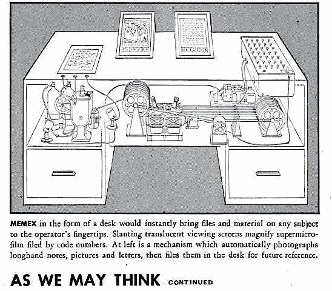
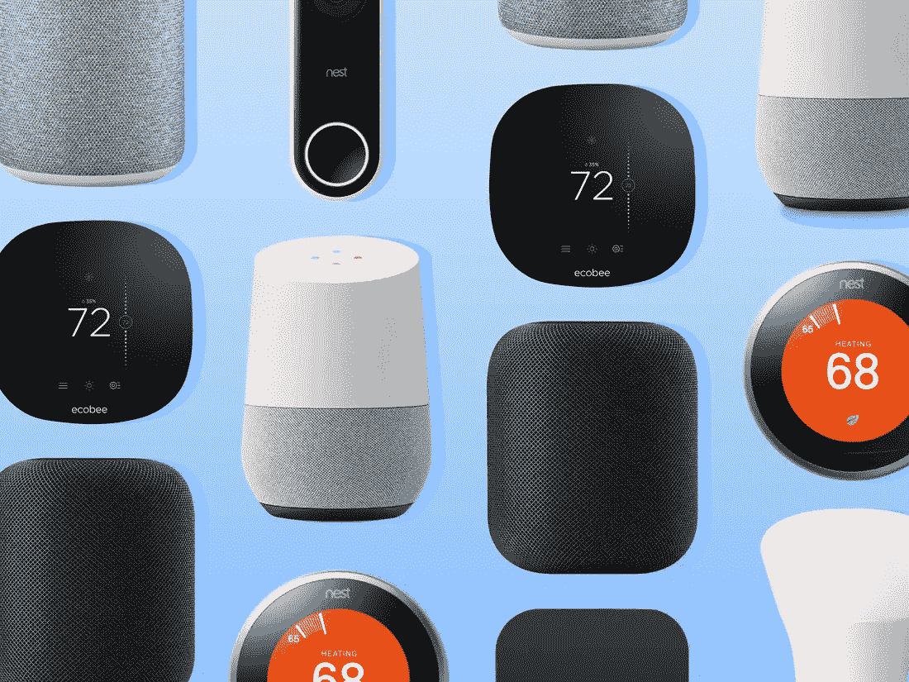
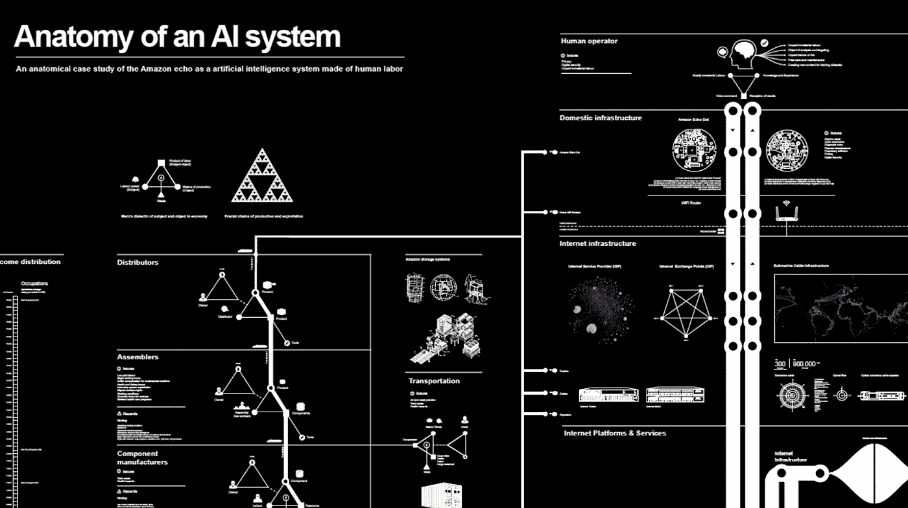
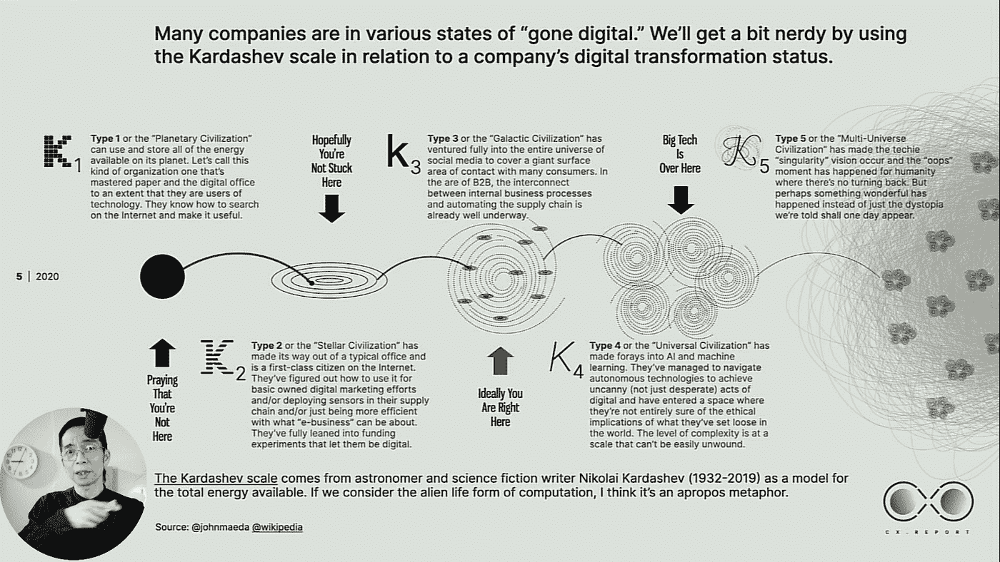

# 数据是新的接口

> 原文：<https://levelup.gitconnected.com/data-is-the-new-interface-8fb273c4d63f>

从前面的章节中，我们了解到界面在我们的人工现实中以不同的尺度存在；界面设计师将社会的技术、意识形态和经济现实内化到界面设计哲学中。基于这种理解，我们可以进一步拓宽人机交互学科中界面和界面设计者的定义，重新想象界面之外的设计的未来。

1945 年 7 月，Vanevar Bush 博士在大西洋杂志上发表了一篇文章，这篇文章改变了我们今天的生活方式。在论文中，他设想了一种存储集体记忆的新方法。人类将得到增强，因为人们可以通过将信息存储在一台名为 *Memex* 的机器中来扩展他们的记忆。这个想法演变成了我们今天都在使用的连接到互联网的计算设备。

**图 10。Memex。图片来自互联网。**

然而，有一件事 Vannevar Bush 博士没有预测到“数据的力量。数据是“可以传输或处理的数字形式的信息”，其无形的性质使其在计算时代之初看起来是一种无害的、琐碎的实体(Bush，2019)。然而，现实是今天的数据已经发展成为一个强大的媒介，一个多维度的界面，涉及利益相关者，包括决策者、商人、科学家、工程师、设计师和消费者。在人机交互学科中，数据已经彻底改变了人与机器交互的原则和框架。

> 在人机交互领域，数据已经彻底改变了人与机器交互的原则和框架。

在互联网发明之前，HCI 专注于改善一个封闭的人机回路。今天，云计算的发明允许数据在机器之外流动。人机交互已经成为一个更大的生态系统的研究，其中数据作为一个接口正在促进人与人的交互、人机交互、机器与机器的交互、人与系统的交互等。

**图 11。家庭物联网设备。图片来自互联网。**

为了说明数据作为接口的复杂性，我们可以看看家庭物联网设备:没有互联网，“智能扬声器”是哑的。之所以感觉智能，是因为音箱有收发数据的能力。实时地，语音数据可以被发送到云基础设施，并翻译成机器理解的语言。智能扬声器根据命令访问在线信息，并将这些信息以数据的形式打包并发送给扬声器。这些数据由另一个数据库中的算法进行虚拟训练。数据隐喻性地存在于云中，但实际上存在于远离居民的沙漠中的机器中。作为接口，数据将用户连接到一个虚拟的信息中心；它们将模拟的语义信息与数字信号联系起来；他们将信息集成到大规模数据中心基础设施中(“人工智能解剖学”，未注明)。

**图十二。人工智能系统的剖析。图片来自互联网。**

在《2020 年 CX 报告》中，约翰·梅达指出，我们正在见证云的第四次工业革命，在这场革命中，人和技术以前所未有的方式结合在一起(John，2020)。为了解释当今商业领域的数字化转型，约翰使用了*卡尔达舍夫等级*的类比，这是一种基于能量水平预测宇宙文明水平的模型(约翰，2020)。

他认为，今天的大多数公司都处于 Kardashev 3[见图 13]，在这里，社交媒体使人们能够与消费者联系，自动化供应链连接 B2B 服务。大型科技公司在卡尔达舍夫 4，“宇宙文明”。他们已经“涉足人工智能和机器学习”，并设法“导航自主技术以实现神秘的……数字行为，并进入了一个他们不完全确定他们在世界上释放的东西的道德影响的空间。”(约翰，2020 年)

**图十三。2020 年 CX 科技设计报告。图片来自互联网。**

即使我们可能无法从这个简单的图表和类比中完全理解数字化转型的前景，但至少我们有两点关于数据作为接口的信息。首先，数据已成为科技行业资本链中的关键组成部分。第二，数据作为一种接口，改变了产品和消费者之间的关系。

> *首先，数据已经成为科技行业资本链中的重要组成部分。第二，数据作为一种界面，改变了产品和消费者之间的关系*

Azure、AWS、Salesforce 和 Google Cloud 等领先的云服务利用了数据存储和云计算的潜力。然而，这些云服务本身只是集中服务的更大业务战略的一部分。大型科技公司通过慢慢建立一个更大的生态系统来实现这一更大的目标，通过智能、混合“大脑”将接触点扩展到不同的物联网设备，在设备上本地和通过云远程提供计算能力。

莫尔斯定律成倍地加快了积分过程。微软的云计算服务 Azure 仅用了 10 年时间就将云服务整合到其现有的企业工具和其他服务中。根据微软 2020 年 1 月 29 日发布的季度报告，Azure 云计算平台将该公司的智能云部门收入推高至 119 亿美元，约占该公司截至 12 月的季度总收入的三分之一(“新闻稿”，2020 年)(“Azure 收入”，2020 年)。收益反映了数据的力量，以及如何利用数据作为连接分散客户和企业的接口，将计算能力连接到过时的基础设施。

**图十四。微软 Azure。图片来自互联网。**

然而，这种新的以数据为中心的商业模式是基于市场和客户之间的关系(John，2020)。公司运送坏掉的数字产品，但客户喜欢它们(Schulte，2019)。在过去，界面体验就像一场婚姻，但今天的体验更像是与产品约会。这些尚未完成，但令人喜爱的数字产品的秘密是它们能够快速适应和响应不同的客户原型(Schulte，2019)。是什么让这些成为可能？数据作为界面，界面设计者让体验更加舒适。

> *数据已经演变成一种界面，不仅影响着当今企业的运营方式，还成为设计师和外部系统中隐藏的洞察力之间的新工具。*

对于今天的界面设计师来说，处理数据是不可避免的。对许多人来说，这也可能会带来新的机会，让他们在更大的尺度上理解跨越时间线的界面的外部环境。Spotify design 副总裁 Rochelle King 举例说明了用数据进行设计的三种方法:数据驱动、数据通知和数据感知。数据驱动的设计遵循数据作为优化效率和增长的途径。基于数据的设计透过量化数据的镜头，描绘出一幅遥不可及的用户体验图。数据感知设计基于对数据的直观解释(King n.d .)，确定问题空间的范围。因此，数据已经演变成一个接口，不仅影响今天企业如何运营，而且成为设计师和外部系统中隐藏的洞察力之间的新工具。

如果我们把数据算作一个界面，那么谁是围绕它发展的新界面设计师？数据科学家从数据中构建、收集、解析、分析和产生见解。他们是界面设计师吗？如今，大多数企业家致力于通过挖掘客户数据来提供免费产品体验的商业模式。他们是界面设计师吗？

*这是一章关于“* [*设计超越界面*](https://docs.google.com/document/u/1/d/1Mx_R0D8r_DkrjnVdL_p0UmlxHO_ToEdjc5fmvqHBft0/edit) *”的思考。*如果你有兴趣阅读更多，你可以在这里找到目录[。](https://medium.com/@xb285/design-beyond-interface-8d439c9b4076)

> *我是一名交互设计师。你可以在*[*https://mikibin.design/*](https://mikibin.design/)*找到我。*

# 参考

人工智能系统的剖析。(未注明)。从 https://anatomyof.ai/[取回](https://anatomyof.ai/)

随着云技术不断推高收入，Azure 是微软增长最快的产品。(2020).检索自[https://www . biz journals . com/Seattle/news/2020/01/29/azure-is-Microsoft-fast-growing-product-as . html](https://www.bizjournals.com/seattle/news/2020/01/29/azure-is-microsofts-fastest-growing-product-as.html)

布什五世(2019 年 1 月 9 日)。正如我们可能认为的。检索自[https://www . theatlantic . com/magazine/archive/1945/07/as-we-may-think/303881/](https://www.theatlantic.com/magazine/archive/1945/07/as-we-may-think/303881/)

约翰·梅达:科技报道中的设计。(2020).从 https://designintech.report/[取回](https://designintech.report/)

金河。在 UX，数据和设计之间的复杂关系。检索自[https://www . ted . com/talks/rochelle _ king _ the _ complex _ relationship _ between _ data _ and _ design _ in _ UX](https://www.ted.com/talks/rochelle_king_the_complex_relationship_between_data_and_design_in_ux)

新闻稿和网络广播。(2020).检索自[https://www . Microsoft . com/en-us/Investor/earnings/FY-2020-Q2/新闻稿-网络直播？lat=47.6833，47.6833 & long=-122.1231，-122.1231&navItemId = m-stock-information](https://www.microsoft.com/en-us/Investor/earnings/FY-2020-Q2/press-release-webcast?lat=47.6833,47.6833&long=-122.1231,-122.1231&navItemId=m-stock-information)

舒尔特 E. (2019 年 11 月 19 日)。是时候停止设计“最小可行产品”了。检索自[https://www . fast company . com/90425331/its-time-to-stop-designing-minimum-livable-products](https://www.fastcompany.com/90425331/its-time-to-stop-designing-minimum-viable-products)