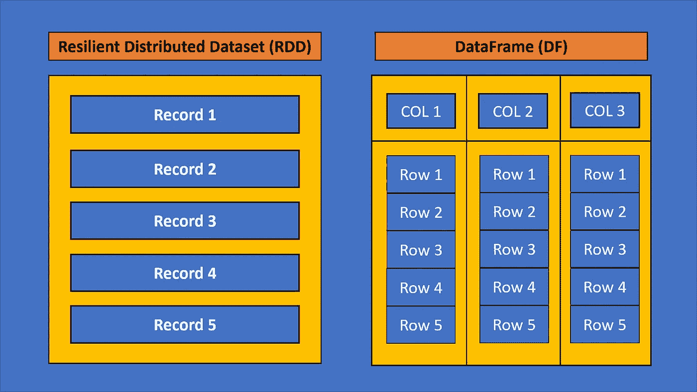

# 使用 Pyspark 在 10 个步骤中进行数据操作

> 原文：<https://levelup.gitconnected.com/data-manipulation-with-pyspark-in-10-steps-ac9d4a0f96f9>

## 我将逐步指导您如何使用 PySpark 对真实世界的数据进行数据操作。


由[安东尼诺·维萨利](https://unsplash.com/@_visalliart?utm_source=medium&utm_medium=referral)在 [Unsplash](https://unsplash.com?utm_source=medium&utm_medium=referral) 上拍摄的照片

Spark 是一个多语言引擎，用于在单节点机器或集群上实现数据工程、数据科学和机器学习项目。您可以使用它来处理批处理和实时数据处理工作负载。它还允许您通过分布式系统以高速和健壮的机制处理大量数据集。分布式系统帮助你使用一组独立的计算机。在本文中，我将通过 10 个步骤向您展示如何使用 PySpark 执行数据操作，并涵盖以下主题:

*   PySpark 是什么？
*   阅读和理解数据
*   选择列和数据过滤
*   添加新列
*   将数据分组并应用用户定义的函数
*   删除和写入数据

让我们开始吧！

# PySpark 是什么？

Spark 主要是用 Scala 编写的，但是你可以用 Python 来使用 Spark。Python 是一种动态的通用语言。Pyspark 是一个用于 spark 的 Python API，Spark 是一个强大的数据处理和分析工具。它允许您使用 Python 的灵活性和 Spark 的分布式处理能力。在 PySpark 发布后，Spark 的受欢迎程度在最近几年有了显著提高。

以下是 PySpark 的一些优点:

*   PySpark 易于使用，因此您可以将其与基于 Python 的数据科学库集成。
*   它是可扩展的，所以你可以用它来处理大量的数据。
*   它是如此的高效，以至于你可以用它在分布式处理系统中处理数据。
*   它非常灵活，因此您可以使用它来处理来自各种来源的数据。

您可以在 jupyter 笔记本中安装以下命令。

```
!pip install pyspark
```

让我们看看如何用 PySpark 的 10 个步骤进行数据操作。

# 1.创建 SparkSession

要使用 PySpark，首先需要创建 SparkSession。SparkSession 是 PySpark 功能的入口点。运行 Spark 应用程序时，会启动一个具有主要功能的驱动程序。之后，这个驱动程序在 worker 节点上运行执行器内部的操作。让我们实例化 SparkSession 来使用 PySpark。

PySpark 使用带有 SparkSession.builder 对象的构建器模式，该模式提供了一组方法。您可以使用`appName`方法给应用程序命名。`getOrCreate`方法用于在交互和批处理模式下工作，如果已经存在 SparkSession，则避免创建新的 spark session。

# 2.读取数据

本文中我将使用的数据是 CSV 格式的糖尿病数据集。数据集的目的是基于数据集中包含的某些诊断测量结果，诊断性地预测患者是否患有糖尿病。数据集由几个医学预测变量和一个目标变量`Outcome`组成。预测变量包括患者的怀孕次数、身体质量指数、胰岛素水平、年龄等。你可以在这里找到这个数据集[。](https://www.kaggle.com/datasets/uciml/pima-indians-diabetes-database)

PySpark 在执行操作时提供了两种主要的数据存储结构:RDD 和数据帧。



RNN vs 数据框

您可以将 RDD 视为对象(或行)的分布式集合。你可以把 DataFrame 想象成一个表格。请注意，数据帧按列组织记录。让我们以 DataFrame 的形式读取数据集。

我将 inferSchema 参数设置为 True。所以后台的 Spark 会自己推断数据集中值的数据类型。

# 3.理解数据

理解数据是数据分析中最重要的步骤之一。让我们用`show`方法来看看数据集的前十行。

您可以用`columns`方法打印数据集的列名。

您可以使用`count`方法获得数据帧中的记录总数。`len`方法允许你查看数据帧中的列数。让我们用`count`和`len`方法来看看数据集的形状。

要获取数据集的架构信息，可以使用 printSchema 方法，该方法通常用于通过数据分析中的 show 方法来理解数据。

您可以使用`describe().show()`来查看数据集的描述性统计数据。我将使用`truncate`参数只看到 8 个字符。

# 4.选择列

您可以使用`select`方法来选择特定的列。让我们用`select`方法从数据集中提取怀孕和年龄列。

还可以使用 pyspark.sql.functions 模块中的`col`函数来选择列。让我展示给你看。

# 5.数据过滤

若要清理数据集并仅保留所需的记录，可以执行基于条件筛选记录。过滤数据有两种方法:`filter()`和`where()`。让我们用`filter`方法过滤年龄列的值小于 40 的数据。

您可以使用`select`方法执行进一步的过滤，只查看特定的列。

您还可以应用基于条件的过滤记录。让我们找到 60 岁以上的人和生病的人的记录。

您可以使用像`&`和`|`符号这样的操作符来应用多个过滤条件。让我们用`&`来筛选生病和怀孕 10 次或以上的人。

要计算过滤后的记录数，可以使用`count`方法。

您也可以像使用`filter`方法一样使用`where`方法过滤数据。让我向您展示如何使用前面的命令。

您也可以将`where`方法与`count`方法一起使用。

# 6.添加新列

您可以使用`withColumn`方法添加一个新列。让我们使用 age 列创建一个新列。为此，我将把年龄值添加到十个值中。

# 7.分组数据

当处理大量数据时，我们通常会使用`groupBy`方法来汇总数据。将数据分组后，可以对每个数据应用聚合函数。让我们看看结果列中每个分类值的总和。

您还可以使用`distinct`和`count`方法来查找列中的不同值。让我们看看怀孕一栏中的地区值。

您可以使用其他聚合函数，如`sum`、`mean`或`min`。让我们在对结果列进行分组后，找出年龄的平均值。注意，`alias`方法用于命名新列。

# 8.应用用户定义的函数

您也可以在 pyspark.sql.functions 模块中使用 UDF(用户定义函数)将自己的函数应用于分组数据。为了说明这一点，让我们首先创建一个名为 diabete 的函数。

现在让我们声明 UDF 及其返回类型(本例中为 StringType)。之后，我将使用 withColumn 创建一个新列，然后传递相关的 Dataframe 列(output):

# 9.删除数据

要删除一列或多列，可以使用 PySpark 中的`drop`方法。让我们用`drop`方法删除`Insulin`列。

要从数据帧中删除重复记录，可以使用`dropDuplicates`方法。

如您所见，数据集中没有重复的记录。

# 10.写入数据

在执行数据操作之后，您通常会想要导出您的结果。您可以使用`write`方法将干净的数据帧以所需的格式写入所需的位置。让我们将结果写在 CSV 文件夹中。

让我们看看这个文件夹的前五行。

```
$ls data/my_dataset.csv | head -5Output:
_SUCCESS 
part-00000-2b5e0da4-fab1-4141-ae6f-1f89eea9818f-c000.csv part-00001-2b5e0da4-fab1-4141-ae6f-1f89eea9818f-c000.csv part-00002-2b5e0da4-fab1-4141-ae6f-1f89eea9818f-c000.csv part-00003-2b5e0da4-fab1-4141-ae6f-1f89eea9818f-c000.csv
```

如您所见，这个文件夹包括许多分区。为了减少分区的数量，您可以使用具有所需分区数量的`coalesce`方法。

现在让我们再看一下这个文件夹

```
$ls data/my_dataset.csv | headOutput:
_SUCCESS
part-00000-53da5401-5d0a-4fad-a7e3-0114833b68d8-c000.csv
```

如您所见，这个文件夹中只有一个 CSV 文件。

# 结论

Pyspark 是一个与 spark 一起工作的 Python API，Spark 是一个强大的数据处理和分析工具*。*它允许您使用 Python 的灵活性和 Spark 的分布式处理能力。在这本笔记本中，我谈到了使用 PySpark 从读取数据到导出数据的数据操作。你可以在这里找到这本笔记本。

感谢阅读。我希望你喜欢它。别忘了关注我们的[YouTube](https://jovian.ai/outlink?url=http%3A%2F%2Fyoutube.com%2Ftirendazacademy)|[Medium](https://jovian.ai/outlink?url=http%3A%2F%2Ftirendazacademy.medium.com)|[Twitter](https://jovian.ai/outlink?url=http%3A%2F%2Ftwitter.com%2Ftirendazacademy)|[GitHub](https://jovian.ai/outlink?url=http%3A%2F%2Fgithub.com%2Ftirendazacademy)|[Linkedin](https://jovian.ai/outlink?url=https%3A%2F%2Fwww.linkedin.com%2Fin%2Ftirendaz-academy)|[ka ggle](https://jovian.ai/outlink?url=https%3A%2F%2Fwww.kaggle.com%2Ftirendazacademy)😎

[](https://heartbeat.comet.ml/three-tree-based-machine-learning-models-b69504af12d6) [## 三种基于树的机器学习模型

### 关于如何使用 Scikit 实现决策树、随机森林和 XGBoost 的指南-学习和优化超参数…

heartbeat.comet.ml](https://heartbeat.comet.ml/three-tree-based-machine-learning-models-b69504af12d6) 

# 资源

*   [使用 Python 和 PySpark 进行数据分析](https://www.amazon.com/Analysis-Python-PySpark-Jonathan-Rioux/dp/1617297208)
*   [用 PySpark 进行机器学习](https://www.amazon.com/Machine-Learning-PySpark-Processing-Recommender/dp/1484277767)

如果这篇文章有帮助，请点击拍手👏按钮几下，以示支持👇

# 分级编码

感谢您成为我们社区的一员！在你离开之前:

*   👏为故事鼓掌，跟着作者走👉
*   📰查看[级编码出版物](https://levelup.gitconnected.com/?utm_source=pub&utm_medium=post)中的更多内容
*   🔔关注我们:[推特](https://twitter.com/gitconnected) | [LinkedIn](https://www.linkedin.com/company/gitconnected) | [时事通讯](https://newsletter.levelup.dev)

🚀👉 [**加入升级人才集体，找到一份惊艳的工作**](https://jobs.levelup.dev/talent/welcome?referral=true)