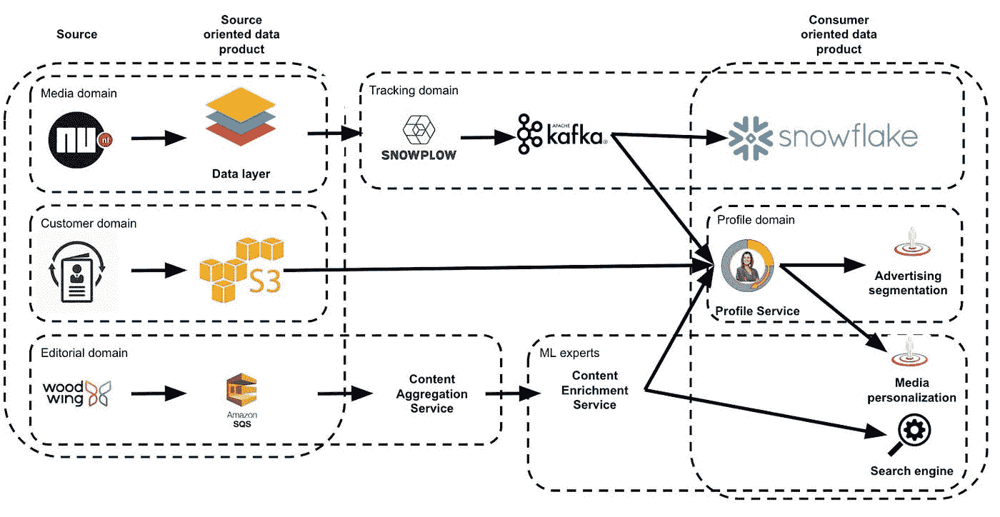
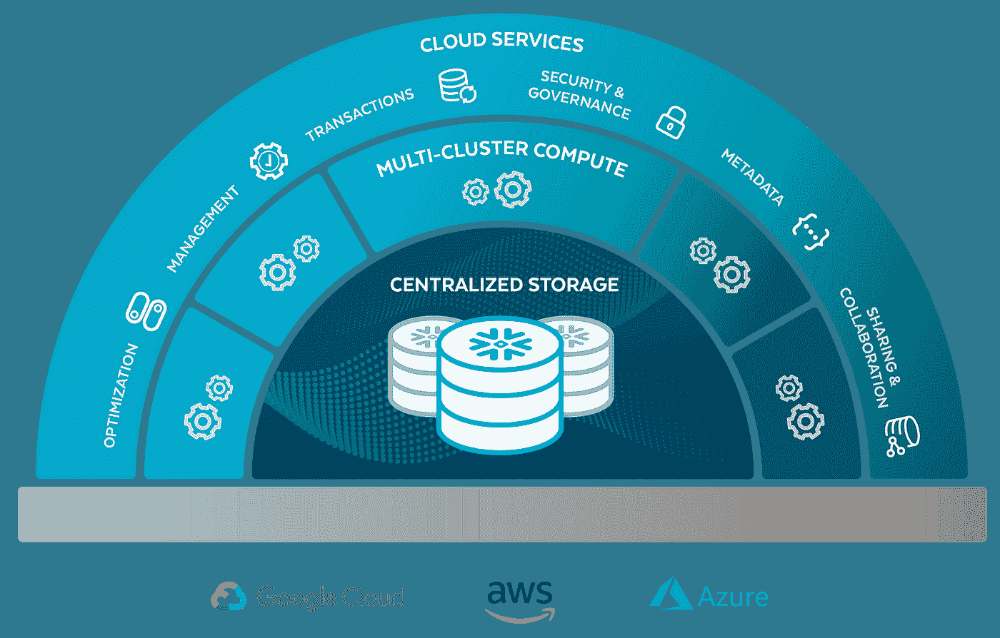
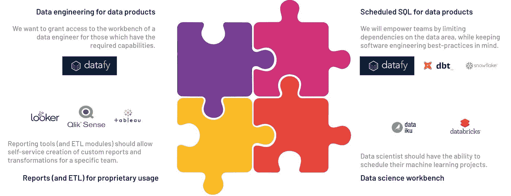

# 数据网格——DPG 媒体公司的自助服务基础设施

> 原文：<https://levelup.gitconnected.com/data-mesh-a-self-service-infrastructure-at-dpg-media-with-snowflake-566f108a98db>

*由 Ludmila Von Thun(雪花)和 Wannes Rosiers (DPG 媒体)制作*

— — — — — — — — — — — — — — — — — — — -

在过去的几十年里，公司一直在努力寻找从数据中获取最大价值的方法。他们正在用数据仓库和数据湖构建数据平台。将所有数据都放在数据湖中并不意味着数据得到了正确的处理，也不意味着数据能够发挥应有的价值。相反，将数据孤立于特定用例将导致忽略许多机会，并且不会给出影响和驱动公司的全貌。

[Zhamak Dheghani](https://martinfowler.com/articles/data-monolith-to-mesh.html) 讨论了这些大数据平台带来的架构失败，并谈到了一个新的视角，该视角来自分布式域驱动架构、自助服务平台设计和数据产品思维，她称之为数据网格。数据网格是目前广泛讨论的一个概念，据说是数据架构中新的架构和组织转变。

然而，如何创建一个自助式数据平台，使不同领域的团队能够创建有价值的数据产品呢？

数据网格方法的早期采用者 DPG 媒体和雪花正在探索如何使用雪花结合和 DBT(数据构建工具)等其他工具来创建自助服务数据平台，以便在建立数据网格架构时利用雪花的能力。

# **首先要做的事情:简单回顾一下我们是如何进入数据网格的**

正如 Max Schulte 和 Arif Wider 在他们的技术演讲中描述的那样，数据湖被视为数据仓库的继承者。它能够处理随着互联网的兴起而出现的所有不同的数据量、种类和速度。尽管如此，公司往往最终会失去对持续不断的数据洪流的控制，从而导致数据沼泽。原因之一是数据和最终产品的所有权不明确。

为了解决所有权问题， [Zhamak Dehghani](https://martinfowler.com/articles/data-monolith-to-mesh.html) 引入了数据网格。她写道:“面向领域的分布式数据产品，由独立的跨职能团队拥有，这些团队拥有嵌入式数据工程师和数据产品所有者，使用**公共数据基础设施**作为平台来托管、准备和服务他们的数据资产。”简而言之:向数据网格的转变更多的是一种组织上的转变；以领域为中心的团队拥有数据所有权，并拥有安全和受控的访问。

基础设施是实现数据网格结构的核心部分。 [David Vellante](https://siliconangle.com/2020/11/14/snowflake-plans-change-flawed-data-warehouse-model/) 写了雪花的数据云如何让用户“围绕数据构建赚钱的服务和产品”,因为它的全球数据网格简化了数据访问，打破了孤岛，并实现了全球范围内的实时数据共享。但是我们想集中精力在一家公司内用一种部署来构建这种结构，以展示如何为全球数据网格奠定基础。

# **让我们从本地角度来看这个问题。**

当第一次阅读数据网格时，会出现几个问题。如何创建一个不需要多个数据副本就能让多个域使用它的环境？域如何使用给定的基础设施而不为其他域造成资源争用？如何获得治理、安全性和可操作性的最佳组合？

DPG 媒体是比荷卢地区数据网格的早期采用者，结合了领域驱动设计(DDD)和大规模 Scrum (LeSS)的方法。 [Wannes Rosiers](https://dpgmedia-engineering.medium.com/ddd-data-area-at-dpg-media-f0130e4d9766) 在一篇博客文章中清晰地描述了 DPG 媒体的历程。这一过程中遇到的困难之一是多个略有不同的数据副本和数据治理。其他人则在缓解资源争用并保持性能。

# **DPG 媒体是如何开始它的旅程的？**

我们不要从“如何”开始，而要从“为什么”开始。DPG 媒体集中了所有的数据工作:一个中央数据工程团队建立了一个中央数据湖，产生了大型数据仓库。尽管这种集中化提高了交付速度并引入了标准化，但仍有一些关键问题需要解决。

第一个是:数据在链条的末端。谁没有遇到过操作系统的更新导致报告系统失败的情况，因为数据团队没有及时了解情况？如果您忘记联系他们，每一次 IT 变革都有可能在您的数据环境中引发灾难。即使您及时适应了变化，IT 项目在开始时也不会有分析数据的使用。

其次，你不能指望数据工程师了解每个系统和业务领域。举一些 DPG 媒体的数字:期望 33 名数据工程师了解全部 19 个平台(反映业务领域)是不合理的，这些平台由 500 名 it 人员构建，以支持 5000 多名员工，并且每天覆盖 80%的佛兰德人和 90%的荷兰人。

有一个单一的解决方案可以解决这两个问题:分散数据所有权！因此，数据网格的关键信息。然而，我们不能简单地说，分析数据的所有权不再是集中的，而是分散的。此外，尽管数据网格的概念主要是在已经有数据湖的情况下对组织产生影响，但是它仍然需要引入一些支持治理的技术组件。这就是为什么 DPG 媒体开始在两个业务领域进行概念验证:客户领域和跟踪领域(在线用户行为)。

DPG 媒体的技术组织基于领域驱动的设计划分为多个区域，这意味着一个区域(应该被视为一个团队)负责实现一个业务领域的解决方案。值得一提的是，由于跟踪团队是该公司所有媒体平台的核心，因此跟踪团队与数据工程师共同位于他们所谓的数据区。然而，客户领域是一个独立的领域，有一个独立的经理……因此，分析数据所有权是真正分散的。

最近，DPG 媒体与数据部门和客户服务部门召开了一次回顾会议，讨论将数据分散到数据网格设置中的问题，包括组织和治理方面的问题。结果是这样的:

*   一个业务领域拥有自己的数据工程师的附加值是巨大的。用例的新世界蓬勃发展。
*   然而，它要求领域专家对所有系统中的所有数据有深入的了解，包括遗留系统，这通常被认为是“数据人员需要解决的问题”一个人不能简单地推卸责任！
*   当构建数据网格的单个域时，缺少某种治理是可以的。尽管如此，当有雄心在整个组织中扩展这一点时，这将产生技术影响。

如前所述，DPG 媒体关注的第二个领域是应用数据网格范式，即跟踪。典型的数据组织从源应用程序开始，一直构建到面向消费者的数据产品。DPG 媒体一直致力于将追踪数据的所有权放在追踪团队中。不仅用于报告目的，甚至用于个性化目的！

将端到端所有权转移到跟踪意味着团队的重大技术转变和责任增加。之前，该团队与谷歌标签管理器和 Snowplow 这样的数据收集器合作；现在，他们拥有一个 Kafka 主题，在报告环境中实现管道，甚至构建自己使用的报告。DPG 媒体通过辅导团队并在团队中安排一名专业的数据工程师取得了成功。其次，重要的是限制技术壁垒，提供一个遵循数据网格的 [DATSIS 原则](https://martinfowler.com/articles/data-monolith-to-mesh.html)的自助服务平台。

# **技术设置**

如前所述，DPG 媒体认为，利用你的数据(并成为其所有者)的技术壁垒应该尽可能低。他们也认为软件工程的最佳实践应该被带到数据工程中。简而言之:请允许 SQL，但要确保它在版本控制中，并且它通过 CI/CD 管道运行。

这就是雪花介入的地方。雪花的平台支持许多工作负载，使公司能够加载所有结构化、半结构化和非结构化数据，并向用户提供这些数据。雪花的架构提供了 DPG 媒体的可扩展性。如下图所示，雪花有四层，我们将快速浏览一下:云不可知层、存储层、计算层和云服务层。

*雪花建筑*

雪花将存储和计算、计算和计算分开。这对域有多种含义。首先，DPG 媒体可以在需要时获得所需的存储。计算能力也是如此，包括纵向扩展性能和动态增加计算集群的能力，无需等待时间。第二部分是计算与计算的分离，这允许 DPG 媒体为每个领域提供自己的计算资源，同时可以访问它们所有的数据。最外层是云服务层，正如我们喜欢说的，神奇的事情正在这里发生。有了雪花，DPG 媒体可以更专注于让他们的领域使用该平台，而不是保持其运行。

DPG 传媒不相信瑞士刀可以解决所有问题，并认为其数据团队的核心任务是建立数据管道，而不是维护数据平台的组件。我们故意编写组件，因为我们不认为应该有一个平台服务于所有用例，然而一个松散耦合的低维护工具构建到该数据平台。集成这些不同的组件是团队的责任；我们稍后将深入讨论细节。粗略地说，公司的发展前景是这样的:

DPG 媒体使用 Datafy，它在 Kubernetes 上提供了 Spark 和 Airflow 的组合，并有一个像 Airflow 这样的调度程序的简单界面。但是，主要目标是为非数据工程师，即不编写 Scala 或 Python 代码的人提供一个低门槛。这就是 SQL——结构化查询语言，或者在这种情况下，可能是简单的查询语言——介入的地方，还有雪花。

在数据网格故事之外，雪花已经有很多东西可以提供给 DPG 媒体，即:

*   性能提升
*   维护费用减少
*   实时摄取能力
*   半结构化数据的 SQL 接口(例如点击流数据的 JSON 格式)

除此之外，DPG 媒体的数据网格设置中还突出了其他功能。其中包括时间旅行、零拷贝克隆和数据共享。

*   时间旅行允许现在使用云数据平台的每个人在没有严重影响的情况下犯错误，因为数据可以很容易地恢复和设置，而不必关心备份。它给想要的数据网状组织一个健康的学习文化。
*   零拷贝克隆不是物理复制数据，而是创建数据库或表的逻辑副本。因此，一个测试环境可以用一个命令启动，并自由地用于测试、开发和其他目的，而不会使数据加倍或干扰数据产品。
*   数据共享是全球数据网的基础。它使公司能够与其他业务部门、合作伙伴和公司共享实时数据并随时进行查询，而不会失去数据的权威性。这也是雪花数据云的动力所在，但这是另一个话题，目前还谈不上。使用 Snowflake 的一个优点是，您不会将自己局限于一个平台或地区，而是可以跨平台和地区进行全球扩展。你可以在 Eric Poilvet 或 David Vellante 的相关文章中找到更多关于全球数据网格的信息。

回到 DPG 媒体的故事:在数据网格设置中，雪花带来了更多与数据/气流和 DBT(数据构建工具)相结合的优势。DPG 媒体有一个设置，可以通过可扩展的基础架构(雪花)对 SQL 代码进行版本控制(DBT)、部署(数据)、调度和监控(气流)。基础设施可以专用于团队或部门(雪花)，并设置行级访问管理(雪花)。

从技术角度来看，这个工具集只缺少一项，即数据目录或字典，使数据可以被发现和寻址(来自 DATSIS 的 DA)。目前，DPG 媒体正在使用包装 AWS 胶水，但也期待阿蒙森或科利布拉。

# **组织影响**

大多数部门通过提供 SQL 接口并允许在其首选的报告工具中进行自定义转换来实现。然而，这主要包括构建我们称之为面向消费者的数据产品的团队。如果您查看面向源的数据产品，如 IT 团队构建的第一批数据集，SQL 接口已经不够用了。你需要更多的数据工程知识。DPG 媒体首先集中了数据团队。但是，要完全遵守数据网格的设置，您将再次需要分散它。因此，DPG 媒体采取了更灵活的方式。

您仍然需要一个中央数据团队来维护数据平台。然而，如前所述，DPG 传媒不相信纯粹的平台团队，因为平台不是公司的核心任务。DPG 媒体 IT 部门的结构涵盖了特定的业务领域。面临巨大数据挑战的业务领域获得了专门的数据工程资源，这些资源被安排在负责该领域的区域中。他们仍然需要遵守中央数据治理规则。同时，数据量较少的领域可以从一个中央池中借调数据工程师，负责为遵守治理规则和定义治理规则的各个领域构建数据管道，并维护支持它们的工具集。然而，重要的是要提到这个池不应该覆盖所有的域；例如，DPG 媒体专注于数据工程师，让 4 名数据工程师负责 4 个领域，另外 4 名负责另外 3 个领域。接下来，他们对他们的工作进行优先级排序，以便在整个开发冲刺阶段为一个单独的领域工作。

通过这种方式，DPG 媒体引入了一种实用的数据网格方法，仍然覆盖了一些痛点。作为总结，我们提到他们已经解决的问题:

*   数据工程师掌握的业务领域数量有限，并且在组织上尽可能靠近业务领域所有者。
*   有一个使用数据平台的低级入口。
*   软件工程最佳实践被带到了数据领域。
*   有一个中心团队管理和支持治理规则。

这(希望)不会是我们最后一次谈论 DPG 媒体的数据网格方法。我们将一起继续这一旅程，试图找到将两者结合起来的最佳方式，即由自助式数据平台支持的组织转变。