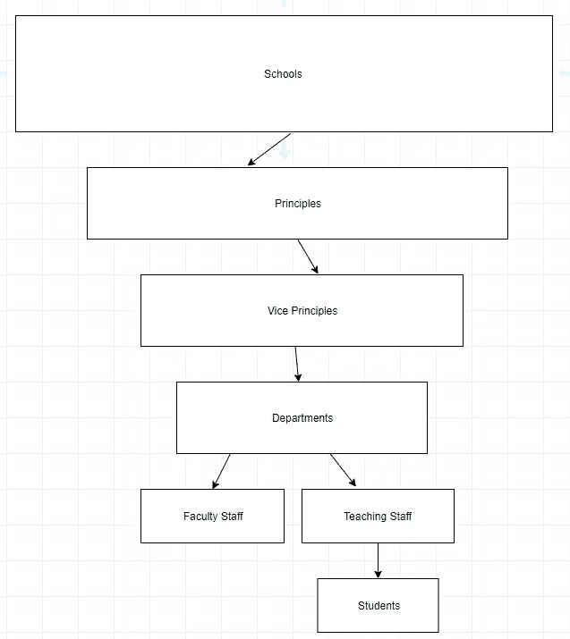
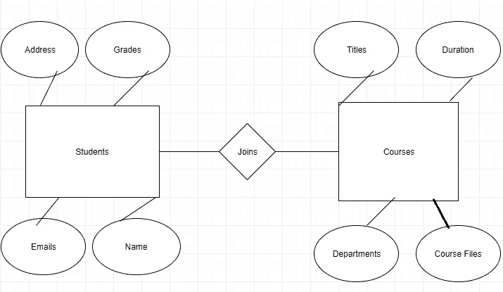

# 数据建模:什么是数据建模？

> 原文：<https://levelup.gitconnected.com/data-modeling-series-what-is-data-modeling-73c1c6b85e1f>

图片由[蒂亚戈·贝雷佐斯基](https://www.shutterstock.com/g/icomicstudio/video)拍摄

**目录:**

*   什么是数据建模？
*   为什么重要？
*   数据建模的步骤
*   数据建模基础设施的类型
*   结论

**什么是数据建模？**

数据建模是确定和概念化数据如何存储在数据存储系统中的过程。数据存储系统可以是您的 SQL 或 NoSQL 数据库、数据仓库或数据湖等。它可以帮助您概念化您的表、查询甚至系统，以便创建适当的管道来帮助您的企业接收、处理和存储数据。数据建模基于命名约定、规则和语义，对需要如何治理的数据强加了结构。

**为什么重要？**

在项目开发过程中实现数据建模实践非常重要，因为它可以确保一致性、安全性、消除冗余，并保持数据库结构的完整性。一旦构建了数据库，数据模型就成为数据如何流入和流出数据库或数据存储系统以及如何存储的在线文档。

**数据建模步骤:**

**第一步。概念数据模型:**

这个模型给出了一个非常高层次的概述，它回顾了各种概念、规则和关系。请将此视为您的数据应该流入和流出您的系统、应用程序或组织的内容和方式的“大画面”。最终它定义了你的系统应该包含什么。

**第二步。逻辑数据模型:**

这个模型决定了数据库的内容。它在数据库中放置概念模型结构的蓝图。它有助于建立实体或表之间的关系和属性。

**第三步。物理数据模型:**

该模型指出了如何通过 DMBS(数据库管理系统)实现逻辑数据模型。这是设置数据库之前的最后一步。完成概念模型和逻辑模型后，将它应用到模式中，然后使用模式将结构设置到新的数据库或 DBMS 中。使用模式建立数据库可以确保它不会超出您在概念和逻辑规划阶段设置的规则和规定。

**数据建模基础设施的类型:**

**层次模型:**

这是最古老的数据模型。它是由 IBM 在 20 世纪 50 年代开发的。层次模型将数据组织成树状结构。在这个模型中，数据被看作是表的集合，以及这些表如何形成层次结构。层次结构由一个组成。通常这些模型被用作语义模型。这种模型的主要缺点是它限制了表之间一对一或一对多的关系，并且缺乏灵活性。

→这里我们有一个学校系统的层级模型。我们有学校，每个学校有一个校长，副校长，一系列的系，每个系的教师和教学人员，最后是学生团体。我们可以看到一对一的关系沿着链条往下走。

**网络型号:**

创建网络数据模型是为了解决分层数据库的问题。这里，一个子节点可以链接到多个父节点。分层模型不支持这一点。父节点是所有者，子节点称为成员。这个模型的优点是它支持多对多的关系。缺点是它比层次模型更复杂、更难维护、更灵活，但仍然存在灵活性问题。

→这里我们有一个简单商店系统的网络数据模型。我们在每个学校都有商店，包括经理和顾客。经理监督助理经理，助理经理监督销售助理、收银员和客服助理。客户、销售和现金助理都监督项目，而客户服务助理和客户监督订单。这里我们可以看到一个子节点(项目)被多个父节点(收银员、销售人员、客户)访问。

**实体关系模型:**

ER 模型定义了数据库的概念视图。它充当现实世界的实体以及它们彼此之间的关系。开发人员很容易理解这个图表，从而知道系统中发生了什么。查看阿尔图时，有三个组成部分:

实体:可以是人、地方、事物或概念。它可以是戴夫、麦迪逊广场花园、本田，或者像金融公司评级这样的概念。

属性:
实体具有的品质叫做属性。假设你是一个名为 Dave 的人(实体), Dave 将拥有身高、体重、收入、员工 id、位置等属性

关系:
关系告诉观察者两个属性是如何关联的。例如，如果一个学生要去一所特定的学校或学院。

→这里我们有两个实体，学生和课程。我们实体之间的关系是，学生都在努力加入各自的课程。对于我们的两个实体，每个实体都有四个属性。学生们有地址，分数，电子邮件和名字。课程有属性标题，持续时间，部门和课程文件。

**结论:**

弄清楚如何设计数据库是构建 DBMS 的一个非常重要的步骤。应该有一个良好的思考过程，因为其他系统最终将依赖于您的数据库获取数据。为生产做好准备的可靠数据库需要对其数据源进行排序，以便将其接收到不同的表中，并且需要一个模式来涵盖数据应该如何操作的所有业务逻辑，并设置不同表之间的关系。

**相关内容:**

*   [关系数据库](https://thedatascape.medium.com/data-modeling-series-relational-databases-sql-databases-94834ca146d6)
*   [非关系数据库](https://medium.com/learning-sql/data-modeling-series-non-relational-databases-nosql-85fdc8d0d5bf)