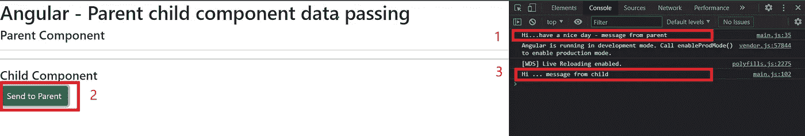

# 带角度的父组件和子组件中的数据传递

> 原文：<https://levelup.gitconnected.com/data-passing-in-parent-and-child-component-with-angular-652e7fd43626>

## @Input、@Output 和 EventEmitter


卡斯帕·卡米尔·鲁宾在 [Unsplash](https://unsplash.com/s/photos/angular?utm_source=unsplash&utm_medium=referral&utm_content=creditCopyText) 上的照片

在开发应用程序时，我们需要在几个事件中将数据从一个组件传递到另一个组件。在本文中，我将尝试提供关于如何使用 Angular @Input、@Output decorators 和 EventEmitter 在父组件和子组件之间传递数据的详细信息。因此，我确定了实现这一目标的两个主要标准:

1.  从父母到子女的数据交换
2.  从子到父的数据交换

现在我将解释我们如何使用@Input、@Output 和 EventEmitter 来实现上述标准。在这种情况下，我创建了一个名为“parent-child”的 Angular 项目，它有两个组件，一个是作为 AppComponent 的父组件，另一个是作为 child component 的子组件。

@Input Decorator:这用于定义一个输入属性，并用于将数据从父组件发送到子组件。

@Output Decorator:这用于绑定 Angular EventEmitter 类类型的属性，并用于将数据从子组件传递到父组件。

[EventEmitter](https://angular.io/api/core/EventEmitter) :用于在组件中发出事件。在组件中使用@Output 指令同步或异步发出自定义事件，并通过订阅实例来注册这些事件的处理程序。

在简要了解了@Input、@Output 和 EventEmitter 术语之后，让我们来关注实现。

## 将数据从父组件交换到子组件

正如我之前提到的，AppComponent 是父组件，你可以根据自己的意愿定制 app.component.html。在这里，我创建了子组件的一个实例。

* * *

标签将父组件和子组件分开。

```
<h1>Angular - Parent child component data passing</h1>
<h4>Parent Component</h4>
<hr><hr>
<app-child></app-child>
```

之后，使用 app.component.ts，我通过在名为“inputText”的参数下传递一个字符串来向孩子发送消息。

```
import { Component } from '@angular/core';
@Component({
selector: 'app-root',
templateUrl: './app.component.html',
styleUrls: ['./app.component.css']
})
export class AppComponent {
inputText: string = 'Hi...have a nice day - message from parent';}
}
```

父组件(AppComponent)发送的消息将由子组件(ChildComponet)接收。然后，app.component.html 将这个变量传递到子组件实例中，这个子组件实例传递到父组件中。我们需要在@Input Decorator 下和 child.component.ts 中创建一个名为“inputfromparant”的字符串变量，这个“inputfromparant”将帮助从父节点获取消息。

```
<app-child [inputFromParent] = "inputText"></app-child>
```

通过使用@Input Decorator(从@angular/core 导入),它将被子组件捕获。它将使用 console.log 显示。因此，child.component.ts 代码应该如下所示。

```
import { Component, EventEmitter, Input, OnInit, Output } from '@angular/core';
@Component({
selector: 'app-child',
templateUrl: './child.component.html',
styleUrls: ['./child.component.css']
})
export class ChildComponent implements OnInit {
@Input() inputFromParent : string;
constructor() { }
ngOnInit() {
console.log(this.inputFromParent);}
}
```

幸福的😊！！！！现在，您已经使用@Input Decorator 成功地完成了从父组件到子组件的数据传递。你的控制台将打印“嗨…祝你愉快——来自父母的信息”。

## 从子组件到父组件交换数据

使用@Output Decorator 和 EventEmitter(从@angular/core 导入)子组件将数据发送到父组件。首先，我们需要用@Output Decorator 创建一个名为“outputFromChild”的变量，还需要另一个名为“outputText”的变量来存储消息并将其传递给 child.component.ts 中的父组件。

```
@Output() outputFromChild : EventEmitter<string> = new EventEmitter();
outputText : string = "Hi ... message from child";
```

然后，为了在我们的控制台中显示该消息，我们需要在我们的 ChildComponent 中有一个按钮，并将其添加到 child.component.html。要激活点击，我们需要一个名为“sendDataToParent”的方法。

```
<button class="btn btn-success" (click)="sendDataToParent()">Send to Parent</button>
```

“sendDataToParent”方法将通过在 ChildComponent 中发出“outputText”来实现。

```
sendDataToParent() {
this.outputFromChild.emit(this.outputText);
}
```

现在我们需要在 app.componet.ts to 中实现一个名为“receiveChildData”的方法来接收来自 ChildComponent 的消息。

```
receiveChildData(data){
console.log(data);
}
```

要获取该值，app.component.html 必须如下所示。

```
<app-child [inputFromParent] = "inputText" (outputFromChild) = "receiveChildData($event)"></app-child>
```

然后，如果我们单击子组件中的“创建”按钮，将触发“sendDataToParent()”方法，父组件将接收来自子组件的数据，并且控制台显示“Hi … message from child”

现在，我们成功地完成了从子组件到父组件的数据发送。

输出的摘要；



这里是到 GitHub 库的链接。

感谢您的阅读🤗！！！如果这篇文章对你有帮助，请鼓掌。

## 参考

*   [*@Input()和@Output()装饰器内角*](https://www.c-sharpcorner.com/article/input-and-output-decorator-in-angular/)