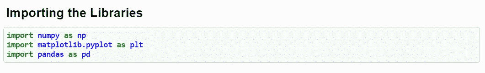
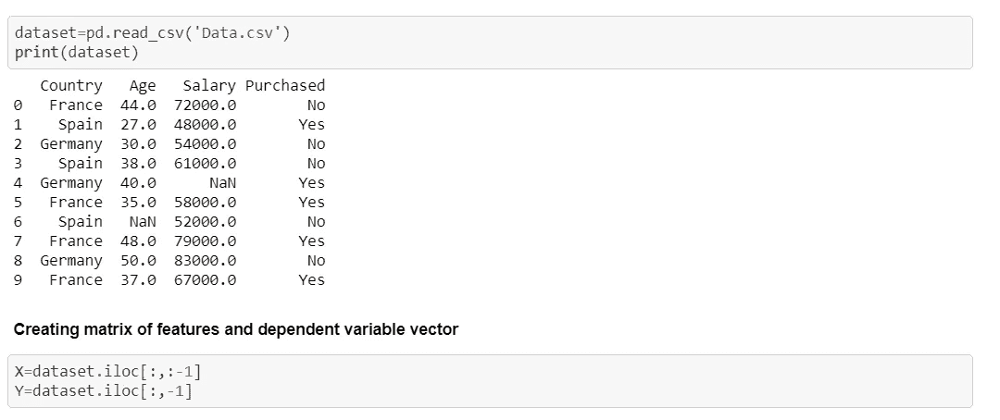
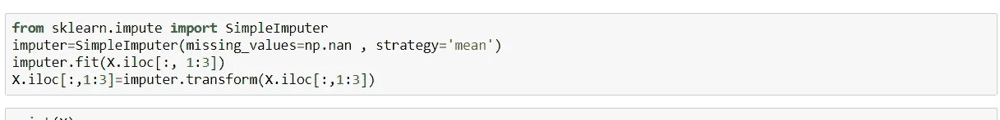
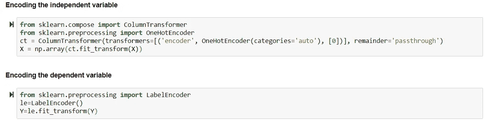
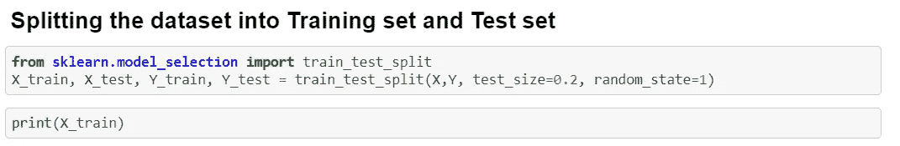
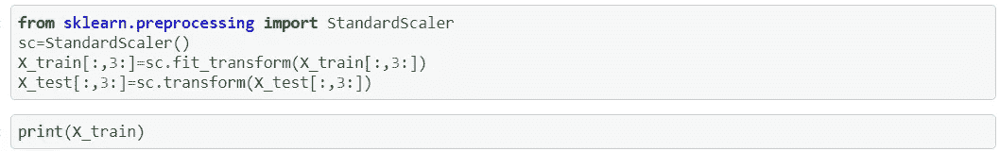

# 机器学习中的数据预处理

> 原文：<https://levelup.gitconnected.com/data-preprocessing-in-machine-learning-d3a48d2aab2b>

数据预处理是机器学习中不可或缺的一步，因为数据的质量和从中获得的有用信息会直接影响模型的学习能力；因此，在将数据输入模型之前，对数据进行预处理是非常重要的。

每次你建立一个 ML 模型，你总是有一个预处理阶段要做。所以你要建立的 ML 模型可以用正确的方式对数据进行训练。

我将在本文中介绍的概念是-

1.  导入库
2.  导入数据集
3.  处理丢失的数据
4.  编码分类数据
5.  将数据集分为训练集和测试集
6.  特征缩放

您可以获得完整的代码(。ipynb) [此处](https://github.com/InternityFoundation/MachineLearning_Priyankaparashar54/tree/master/Day%204)。

步骤的详细分析如下

# **导入库:**

我们导入了三个库 Numpy，Matplotlib，Pandas。库是包含函数和类的模块的符号，使用这些函数和类可以执行一些动作和操作。基本上，库在构建机器学习模型方面非常有用。

**Numpy:** 它允许我们使用数组。

Matplotlib: 它允许我们绘制一些漂亮的图表和图形。我们使用模块 **pyplot** 来绘制图表。

**Pandas:** 它允许我们导入数据集，也有助于创建特征矩阵和因变量向量。

用于导入库的 Python 代码。

# 导入数据集:

我们必须创建一个新的变量来存储数据集。该函数将读取数据集的所有值，并创建一个**数据帧**。我们必须创建两个新实体:-

**(i)特征矩阵/自变量:**这些包含了您可以用来预测因变量的信息。

**(ii)因变量:**这些是你要预测的值。

用于导入数据集的 Python 代码。

## 为什么我们创造了这些实体？

我们要建立未来机器学习模型的方式，就是在它们的输入中期待这两个实体。

# 处理丢失的数据:

丢失数据会导致机器学习模型出错。因此你必须处理它。

**方法(一):**通过删除忽略观察。只有当您有一个大型数据集和 1%的缺失数据时，这种方法才有效。去掉 1%的数据不会影响模型的学习质量。对于大量缺失的数据，这不是正确的方法。

**方法(ii):** 用数据缺失列中所有值的平均值替换缺失值。您必须根据您的数据集更改索引位置。

用于处理缺失数据的 Python 代码。

**→拟合方法:**为了将该估算器类应用于特征矩阵，它将连接特征。

**→转换:**这将把缺失值替换为平均值。

> I **重要提示:**仅将缺失值函数和方法应用于**数字列数据**而非字符串和所有其他数据。如果你想应用它们，你必须首先转换它们。

# **编码分类数据:**

**思路一:**将每个字符串编码为 1，2，3，…同样的。但这是不公平的，因为像国家这样的特征将被排名，我们可以这样做的特征，如大小 M，L，S，XS 等。

**想法 2:一个热编码器**

将一列转换成单独的列。它包括为每一列创建二元向量。

**(i)编码分类自变量。**

使用两个类别:(a) **列变压器** (b) **一个热编码器**

**(二)因变量编码。**

使用的类别:

→ **标签编码器:**它会把是和否编码成 0 和 1。

编码分类数据的 Python 代码。

# 将数据集分为训练集和测试集:

**训练集**是你要根据现有的观察来训练你的机器学习模型的地方。**测试集**是你在新的观察上测试你的模型的性能的地方。

用于将数据集分为训练集和测试集的 Python 代码。

# **特征缩放:**

它把我们所有的特征放在同一个尺度上。您不必对虚拟变量应用特征缩放。

两种技术:

(一)**标准化**

(二)**正常化**

使用的类别:→ **标准标量**

用于要素缩放的 Python 代码。

说到这里，我们已经到了这篇文章的结尾。非常感谢你的阅读。

您可以获得完整的代码(。ipynb) [此处](https://github.com/InternityFoundation/MachineLearning_Priyankaparashar54/tree/master/Day%204)。

如果你愿意，你可以鼓掌。它是免费的。