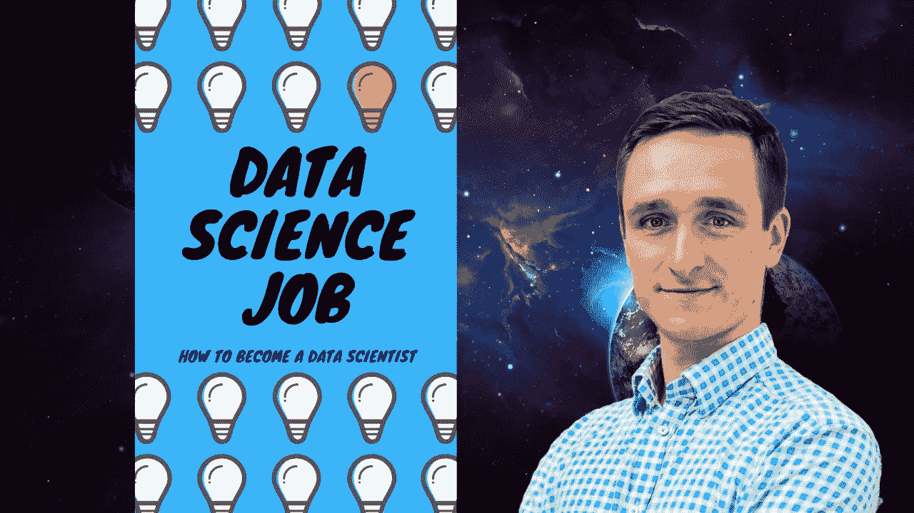
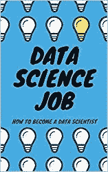

# 2020 年的数据科学工作

> 原文：<https://levelup.gitconnected.com/data-science-job-in-2020-f4e887ea5b1d>

## 如何成为新十年的数据科学家？

我们生活在一个数字世界。我们全球经济的大部分都是数字化的，数据量惊人。现在是 2020 年，我们生活在未来。

数据科学家是目前市场上最热门的工作之一。对数据科学的需求是巨大的，而且只会增长，而且它的增长速度似乎比数据科学家的实际数量要快得多。

因此，如果你想改变职业生涯，成为一名数据科学家，现在正是时候。

数据科学工作:如何成为一名数据科学家

我作为项目经理、数据科学顾问或 CTO 与多家公司合作过，我能够看到雇用数据科学家和建立数据科学团队的过程。我知道作为一名数据科学家，获得第一份工作的重要因素是什么，你应该获得什么技能，你应该在求职面试中展示什么。

看着市场上全球知识的现状，我很快想到，我们真的错过了从更多社会角度成为数据科学家的材料。

Coursera 上有[众多免费或收取少量费用的](https://www.youtube.com/channel/UCEq0oQsS-voRnSWbcviIDGA?sub_confirmation=1)[数据科学课程](https://towardsdatascience.com/best-data-science-courses-on-coursera-in-2020-f7de4ab414ff)。[有很多很好的书籍](https://towardsdatascience.com/data-science-books-you-should-read-in-2020-358f70e1d9b2)可以学习数据科学的技术方面，但没有太多关于数据科学的社会方面或商业方面的内容，比如:

*   作为一名数据科学家意味着什么，
*   你需要具备什么技能，
*   你的职业生涯会是怎样的，
*   如何在数据科学领域找到第一份工作

当一个人考虑开始一份新的职业时，有太多自然的问题浮现在脑海中，而且没有一个地方可以去。

这就是为什么我决定在一本[书中](https://amzn.to/31jXMAS)分享我的知识，这样你也可以加入一个美妙的数据科学世界——真正的未来市场。

这是一本书本身，[现在在亚马逊](https://amzn.to/31jXMAS)上既有[电子书](https://amzn.to/2Sg0Utz)又有[平装本](https://amzn.to/31jXMAS):

数据科学工作

如果你想快速总结如何成为一名数据科学家，这里有 3 个步骤:

*   在 GitHub 上构建您的存储库，并启动一个开源项目。你可以从 Kaggle 获取一个数据集，然后围绕它构建一些东西。通常分类问题往往更容易。这将让你磨练自己的技能，并向潜在雇主展示你的参与度。
*   参加脸书和 LinkedIn 关于数据科学和机器学习的小组。尝试寻找你附近的聚会和会议，并参加它们以认识更多的人。有人指导总是好的。
*   多写代码！数据科学最终是一种实用技能。在你的社交媒体上分享它——更新你的 LinkedIn 个人资料，以便有更好的机会找到工作。

从技术角度来看，您需要知道:

*   统计学和线性代数基础
*   数据可视化方法(plotly)
*   数据处理和存储算法(pandas，NumPy)
*   聚类和分类方法(KNN、k 均值、DBSCAN、决策树、XGBoost)
*   如何应用降维(PCA)
*   神经网络基础

就是这样！

如果你觉得有趣，那么我强烈推荐你这本书。我计划在 Medium 上发表更多文章，解释数据科学工作的不同方面，因为我对更多人加入数据科学世界并提升他们的技能充满热情。

让我们开始冒险吧！