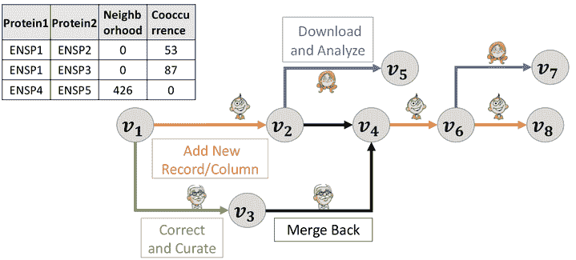
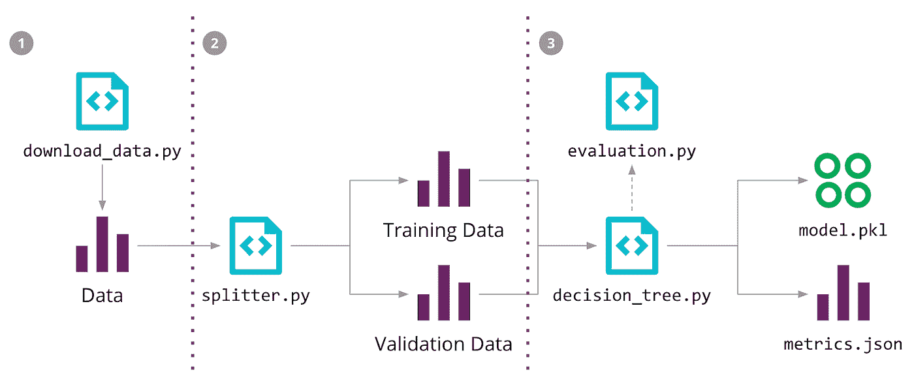

# 高效实施的数据科学实践

> 原文：<https://levelup.gitconnected.com/data-science-practices-for-efficient-implementation-c8119f774c05>

[照片](https://unsplash.com/photos/JKUTrJ4vK00)由[卢克·切瑟](https://unsplash.com/@lukechesser?utm_source=unsplash&utm_medium=referral&utm_content=creditCopyText)在 Unsplash 上拍摄

在自动化环境中，数据科学是基础或重要的组成部分，因为组织需要它来将手动操作推向自动化，同时对收集的数据执行分析。它综合了几个领域，包括人工智能、统计学、数据分析等等。从用户、组织和客户端收集的信息用于确定需要从数据中检索哪些值，以及如何生成描述各种员工角色的图表。

数据科学家可以从各种来源收集信息，包括客户、传感器、智能手机、网络以及那些能够提供有意义见解的人。[数据科学](https://www.ibm.com/cloud/learn/data-science-introduction)分析通过聚合数据、改变数据，然后处理已获得的数据来识别模式并向组织高管提供明智的见解，从而检查数据。数据科学利用方法、工具和程序为高度可变的数据提供有意义的信息；然而，结果并不总是符合标准。

# 数据科学最佳实践

让我们讨论一下我们可以实施的一些最佳实践。

# 数据版本化

[来源](https://medium.com/data-people/painless-data-versioning-for-collaborative-data-science-90cf3a2e279d)

对于数据的可重复性、可信度和审计来说，使用[数据版本控制](https://lakefs.io/data-versioning/)非常有帮助。因为数据版本是随时间存储的数据集的唯一可识别的修订版，所以这些数据集的消费者可以确定数据集在特定时期内是否以及如何发生了变化。拥有大量的历史数据使我们能够轻松地完成各种事情，例如预测组织在不同时间段的表现以及组织的效率。

此外，数据版本化系统有助于履行监管职责。即使在机器学习中，当我们必须教会机器不同类型的对象和数据处理时，如果我们对数据有很多见解，并且我们可以教会机器同样的东西，这也会有所帮助。因此，拥有不同版本的数据非常重要。

数据版本化甚至可以帮助开发人员检查数据库的过去版本，并确定自上一次发布以来发生了什么变化。这允许他们在适当的时候组合调整。此外，版本控制使得跟踪应用程序的变化并确保它们正常运行变得更加容易。它还使新成员能够从第一天起就快速检测并跟踪版本。

# 识别和隔离业务指标

为了进行评估，必须收集和分析许多不同类型的数据和指标。我们必须根据我们的业务需求选择业务模式。但是我们也可以调整特定模型的度量，这也将改善结果，并因此改善组织的性能。

例如，在[指标](https://www.investopedia.com/terms/m/metrics.asp)中，每个人花费的时间和他们完成任务的精度是自动确定的。手动流程和自动化流程之间有一些相似之处和不同之处。因此，我们可以很容易地评估数据，这使得掌握它们变得非常简单。组织可以看到自动化与手动流程相比节省了多少时间。

在简单过程中，我们只关心计算每天和每周花费的时间，而不考虑手动过程的自动化。

虽然我们将划分花费在人工工作和自动化上的时间，但由于数据科学模型的修改和实施，我们将能够更好地掌握统计数据或指标。模型的输出将指示组织是否应该过渡到更加手动的模型或者继续实现自动化。它确定了组织通过过渡到生产和分销的自动化模式可以节省多少时间和金钱。因此，组织很容易理解所讨论的 KPI。

# 重复并继续适应变化

[来源](https://martinfowler.com/articles/cd4ml.html)

数据驱动的计划受到限制，因为它们不能无限期使用，因为业务优先级可能随时发生变化，需要数据科学家从头开始重新创建模型。

例如，在新冠肺炎之前，大多数组织更喜欢员工在办公室工作。然而，最近，组织更喜欢员工在家工作。因此，他们必须修改先前的模型，因为它解决了其他独特的问题。既然人们不能来工作，新的模式要么已经建立，要么需要修改以适应新的现实。

需要进行监控以确定新算法的有效性，并在性能阈值的基础上进行设置，即用于生成可操作信息的[可接受阈值](https://www.tandfonline.com/doi/abs/10.1080/00039896.1962.10663127)，之后需要执行额外的回合。从商业角度来看，创造有利可图的项目的能力是必不可少的。因此，每次数据科学家被要求理解新的业务目标时，他们都需要提供新的模型，这种循环还在继续。

# 多种算法的比较

虽然算法基本上是解决问题的一步一步的过程，但它们最常用于编程语言。当开发人员解决一个问题时，可以有多种方法，但是应该总是使用最佳的方法。应该使用在最短时间内产生有效结果的算法，这也是数据科学家遵循的方法。

在不同的机器学习算法之间进行比较非常有用，因为这种比较可以让数据科学家从根本上了解哪种算法最适合他们的业务目标，或者在提供结果方面更准确。有各种方法可用，包括随机对象、决策树、图像标识符等。因此，对于相同的数据输入，数据科学家可能会检查堆栈的性能，然后在比较结果后从中选择最佳方法。在数据科学中，这是实现高效成果的一个极其重要的阶段。然而，同样的方法不会是所有情况下的最佳解决方案。因此，总是建议对各种任务使用各种算法来实现最有效的结果。例如，我们可以通过采用各种技术来计算图像处理的精度，最终输出如下所示。

# 基于不同算法的图像处理精度

随机对象算法— 92.15%

决策树算法的准确率为 94%

图像识别算法的准确率为 99%

鉴于我们可以清楚地看到“[图像标识符算法精度](https://www.iiste.org/Journals/index.php/JNSR/article/viewFile/17620/17622)方法产生了最佳结果，数据科学家可能会使用该算法来检索图像处理的结果。

# 结论

有许多方法可以提高数据科学过程的效率，但在这里，我们研究了一些最伟大的技术，这些技术无疑将提高处理和效率，为数据科学家带来最佳结果。数据科学很难，因为它依赖人工智能来计算结果和应用算法。因此，根据业务需求正确选择算法，因为它会影响输出并提供可能的最佳结果。