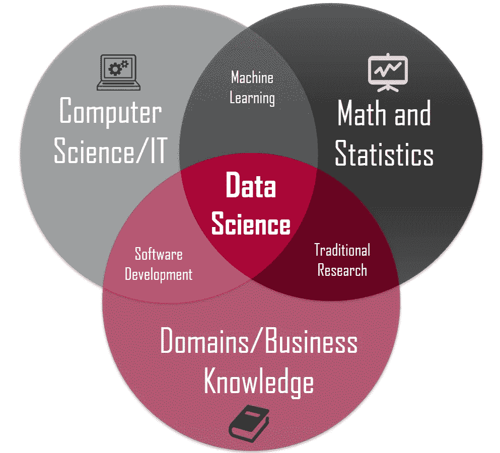
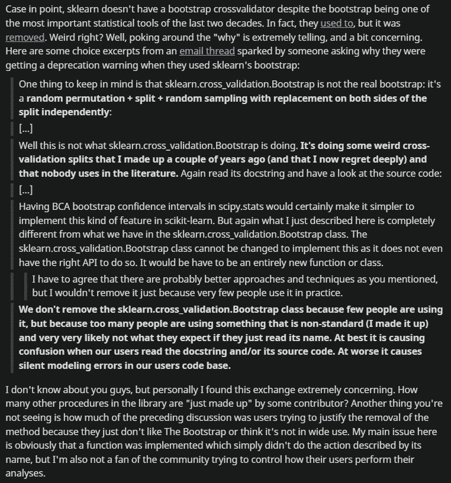

# 如果 Python 不存在，数据科学会变成什么样

> 原文：<https://levelup.gitconnected.com/data-science-without-python-466f1ad5e473>

## Python 不存在的数据科学世界


照片由[商场制作](https://www.pexels.com/@mart-production/)在[像素](https://www.pexels.com/)上拍摄

Python 是如何统治数据科学的令人着迷。

从我对数据科学大开眼界的那天起，Python 就是我的首选语言。

Python 拥有的多功能性、语法和坚如磐石的社区一直吸引着我。更不用说，我很不幸地没有找到 Python 无法完成的数据科学任务。

出于绝望，我问我的数据科学教授:

> "有什么数据科学是 Python 无法实现的吗？"

他挠了挠头。打开了一个笔记本。注意到这个问题，说:

> "我会调查此事，并随时通知你。"

目前没有收到任何答复。我想我已经得到答案了。

也许，如果有一项任务不能用 Python 来执行，它就不会与数据科学相关(很高兴阅读您在这方面的意见)。

那么 Python 在数据科学中有多重要呢？

要回答这个问题，我认为最好的方法是研究一个没有 Python 的数据科学世界。

这是这篇文章的重点。

## R 能晋级吗？

Python 的继任者和它最接近的[匹配](https://www.datacamp.com/blog/top-programming-languages-for-data-scientists-in-2022)无疑是 R，来源于 [S](https://en.wikipedia.org/wiki/S_(programming_language)) 语言，R 只不过是一个视觉效果很酷的统计工具。

作为一个艰难地学会了写代码的人，我不能像使用 Python 那样沉迷于 R。

与许多人不同，我是最近才开始接触数据科学的(3 年)。

当时，围绕数据科学的炒作吸引了我，所以我最终选择了 r。我发现语法怪异，编码过程无聊透顶。所以，我转向了 Python，并一直坚持到现在。

事实是，除了语法之外，我放弃 R 而使用 Python 还有几个原因，我很乐意详细说明:

首先是`data science` `statistics`而 `statistics` ⇏ `data science`。数据科学是一门互动性更强的学科。为了让数据说话，它结合了几种科学方法、过程和算法。

下面的图片形式更好地展示了我的观点:



[来源](https://towardsdatascience.com/introduction-to-statistics-e9d72d818745)

别误会我的意思。统计学仍然是数据科学的基石。然而，我经常有这样的印象，自从 Fisher 和 Bayes 的工作以来，统计学并没有太大的变化。

具体来说，我感觉数据科学更多的是统计学的高级版本。

> “数据科学=统计学 2.0”

其次，R 是一个高度学术性的统计工具。r 的库往往是由统计研究人员编写的，以支持他们在统计软件杂志上冬眠的研究论文。

这实际上是促进循证工作的一个非常有力的方法。然而，作为一名程序员，我确实相信开源范式——从更广泛的编程社区接收贡献的能力。

Linus Torvald——Linux 独角戏——可能是开源模式在软件发展中的重要性的最佳例证。他[承认](https://www.youtube.com/watch?v=o8NPllzkFhE&ab_channel=TED)虽然他不是一个“人”的人，他讨厌团队合作，但他欣赏公开贡献的想法。

我同意他的观点。

我同意他的观点，因为这就是软件的伟大之处。

我的数学教授曾经告诉我:

> “如果你从头开始一个项目，那你就太傻了。这简直就是重新发明轮子。相反，如果你想做大事，可以考虑把别人的工作和你的结合起来。”

这就是处理项目的方式。我总是研究样板代码，我可以在其上构建、修改，或者至少从中获得灵感。如果没有，那我就从头开始。

很明显，无论你做得多好，总会有人比你做得更好。

我确实相信我们人类容易犯错误。这就是为什么我更愿意相信由许多人而不是一个人构建的代码。

因此，我不信任 R 库。

然而，值得注意的是，编程语言是一个非常主观的话题。我早期说的“无聊”可能是某人的“刺激”。显然，有些事情 R 做得比 Python 好得多。例如，这个 Redditor 暴露了一个在 Python 中使用`sklearn`比 r 执行得差的函数。



[来源](https://www.reddit.com/r/statistics/comments/8de54s/is_r_better_than_python_at_anything_i_started/)

总的来说，R 并没有针对生产级代码进行优化。这就是为什么它很少用于大规模数据科学项目的原因。从数学统计的角度来看，r 仍然是解决问题的首选语言。但在算法和计算机科学为中心的环境中，它很难取代 Python。

## 编译后的系列(C、C++、JAVA……)

由于显而易见的原因，这类编程语言通常不太适合数据科学。

第一个原因是数据科学图书馆的不足。在我们得出结论性的结果之前，数据科学管道涉及大量的指令。数据科学企业应用程序需要大量工作(例如，数据清理、超参数调整……)。Python 通过其丰富的库简化了这个工作流程。

试着用 C 和它的冗长来做同样的事情，不用助手库和祝贺！你正处在噩梦的边缘。

我能想到的第二个原因是缺乏人才。这又回到了相对于 JAVA 和 C++等中级编程语言缺乏足够的数据科学资源。

正如我们所知，数据科学渗透市场的速度如此之快，以至于人们没有时间坐下来按照自己的节奏学习。这就是为什么大多数有才华的数据科学家最初都是软件开发人员。因此，由于它们的用户友好性，像 Python 这样的高级编程语言只有在容易进入数据科学时才有意义。

也就是说，我相信没有 Python，我们仍然可以做数据科学，但不会更容易。

也许，我们甚至可以做得更好！

由于大多数涉及大量数学计算的 Python 库(例如:`numpy`和`scipy`)都是用 C 语言编写的，直接用 C 语言编码将通过一级公民访问赋予我们更多的灵活性。

此外，Scala 正迅速成为数据处理和分布式计算领域的 T2。有趣的是，Scala 和 Java 有相似的语法，使得从 Java 到 Scala 或者从 Scala 到 Java 的转换变得轻而易举。

所以对于数据科学家来说，学习 Java 毕竟还不错。

谁知道呢，一旦你面对大量需要 Scala 的数据，你的努力可能会有回报。那时，当你的 Pythonistas 同事还在阅读文档的时候，你已经在编码了。

## 下一个殡仪员

我偶尔会提到 Julia，她是 Python 在数据科学领域的有力竞争对手。现在我觉得是时候对此进行扩展了。

Julia 是一种相当新的编程语言，出现在 2012 年的[上。它是为了](https://en.wikipedia.org/wiki/Julia_(programming_language))[进行](/02/why-we-created-julia/)科学计算、机器学习、数据挖掘和分布式计算而创建的。好好干。

为了实现这一点，Julia 必须具备 Python 的用户友好性、Ruby 的动态性和 c 的速度。

这是否完全实现了？

我不这么认为。否则，我们应该抛弃其他语言，只使用 Julia。我认为前面提到的承诺只是夸大了描绘完美编程语言的画面。

> “我们很贪婪，我们想要更多”——茱莉亚团队

但尽管如此，随着每一次更新，Julia 正在逐渐弥合 Python 和 c 之间的鸿沟。

对于一门相当新颖的编程语言来说，这已经不错了。

老实说，我不是朱莉娅硬核。好奇心是促使我尝试 Julia 之水的唯一原因，因为 Python 从未让我失望过。然而，尽管 Julia 的语法不一定是最好的(至少对我来说)，我偶然发现了一些让我大吃一惊的特性。

**多次派单。**一个分派就是在一个函数调用中选择调用哪个方法。传统编程语言调用方法的过程仅仅基于第一个参数，我们可以称之为“单一分派”。然而，朱莉娅更认真地对待这件事。通过使用所提供的参数的数量和类型来运行调度，可以实现多次调度。

Julia 的[文档](https://docs.julialang.org/en/v1/manual/methods/)中多次派单的代码示例:

```
**julia>** f(x::Float64, y::Float64) = 2x + y
f (generic function with 1 method)**julia>** f(2.0, 3.0)
7.0**julia>** f(2.0, 3)
ERROR: MethodError: no method matching f(::Float64, ::Int64)
Closest candidates are:
  f(::Float64, !Matched::Float64) at none:1**julia>** f(Float32(2.0), 3.0)
ERROR: MethodError: no method matching f(::Float32, ::Float64)
Closest candidates are:
  f(!Matched::Float64, ::Float64) at none:1
```

多重派遣有过多的使用案例。例如，使用强参数类型跟踪 bug，通过改变类型使代码更具可回收性。

**速度。**与 Python 不同，Julia 变量不是对象，这允许更快的迭代。这是对基于 LLVM 的 JIT(实时)编译的补充。当谈到数组操作时，`numpy`得益于它在 c 中的实现，在加载数据方面表现良好，这是相当大的数据，用 Python 几乎不可能处理。这正是 Julia 大放异彩的时候，因为我们越是走向未来，我们面对的数据就越多。

就像早期的技术一样，Julia 仍然被困在学术界。这个社区非常棒，有非常能干的人，他们通常是数学和统计学博士。因此，这对于数学举重来说很方便。例如，有人目睹 Julia 在解一组微分方程(ODE)时[甚至比](https://www.reddit.com/r/Julia/comments/6h22bk/reasons_you_use_julia/)更胜一筹。

> 朱莉娅脱离学术界的时候。我们可能会以全新的眼光看待它。

就数据科学而言，包生态系统没有 Python 的丰富。此外，为了充分受益于 Julia 的，应该采用一种新的软件方法。Julia 的首席开发人员 Christopher Rackauckas 暗示的一种既不是基于数组也不是基于 OOP 的方法。

> “我对任何 Julia 新手的建议是，不要把它当作基于数组的语言(通过 NumPy/SciPy 的 MATLAB 或 Python)，也不要把它当作面向对象的语言。改变你的想法，充分利用朱莉娅的类型，你会看到美丽的结果(大部分朱莉娅会为你做)。”— [来源](https://www.reddit.com/r/Julia/comments/6h22bk/reasons_you_use_julia/)

## 外卖食品

这一次，我试图描绘一个没有关键参与者 Python 的数据科学世界。

当然，人们不能将整个行业与一种编程语言联系起来，因为每种语言都是为解决一个问题而设计的，因此认为一个问题只有一种解决方案是荒谬的。

然而，通过将 Python 与一组非常不同的编程语言进行比较，我们设法收集了有价值的见解，这些见解可以总结如下:

*   r 是面向繁重的统计计算和闪亮数据的[。从软件开发的角度来看，它与 Python 相比有所欠缺。](https://www.ibm.com/cloud/blog/python-vs-r)

> 比如，我甚至不愿意想象用 r 来构建一个结合 API 调用和机器学习的人脸识别 app。

*   我们仍然可以使用中级编程语言进行数据科学研究。通过降低性能开销，我们甚至可以做得更好。然而，学习曲线会更陡，这个过程会很耗时，因为编写代码可能需要更长的时间。
*   Julia 似乎是数据科学领域的一个强有力的竞争者。它的优势在于，它在设计时考虑了数据工作负载。另一方面，Python 由于其充满活力的社区，已经逐渐适应了数据科学。这使得 Python 完全有能力应对数据科学的挑战，而 Julia 仍在悄悄地成长，以赶上甚至超越它。

**判决**

Pythonic 数据科学肯定会被取代。然而，我们会错过**简洁性**、**低准入门槛**，以及**丰富的数据科学包生态系统。**

你同意吗？

让我知道你的想法！

*如果你觉得这很有见地，可以考虑成为* [*高级*](https://ayarmohammed96.medium.com/membership) *会员，每月 5 美元。如果你用这个* [*链接*](https://ayarmohammed96.medium.com/membership) *，我会得到一个小切口。*

[](https://ayarmohammed96.medium.com/membership) [## 通过我的推荐链接加入媒体-穆罕默德·阿亚尔

### 作为一个媒体会员，你的会员费的一部分会给你阅读的作家，你可以完全接触到每一个故事…

ayarmohammed96.medium.com](https://ayarmohammed96.medium.com/membership) 

祝你有美好的一天！