# 管理咨询中的数据科学家:如何解决技术作业

> 原文：<https://levelup.gitconnected.com/data-scientist-in-management-consulting-how-to-solve-the-technical-homework-3cc51115103>

## MBB 典型的数据科学和咨询技术作业(麦肯锡、贝恩、BCG)是什么样子的？让我们开始着手解决问题吧。


波罗的海美景(作者拍摄)

麦肯锡、贝恩或波士顿咨询集团等公司是许多求职者的梦想。他们的招聘过程是出了名的艰难、漫长，而且成功率很低。在这篇文章中，我想分享(并解答)我从一位 MBB 那里得到的一份课后作业，它包含在三轮技术面试的第一步中。但事不宜迟，让我们开始吧！

小注意:第一步通过了本文中共享的解决方案

# 简介:

因为不可能分享最初的家庭作业，所以我准备了一份总结，并更改了一些变量。

我是旨在提高 ABC Telco ARPU 的转型计划的一部分。分配给我的任务是通过高级分析提高 ABC Telco 营销活动的有效性，特别是，分配给我的最终目标是从营销活动中获得最大利润，利润定义为:

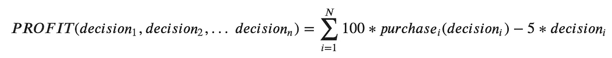

`pilot.csv`包含过去进行的一项研究的信息，每一行代表一位客户及其特征，以及购买/不购买该服务的最终决定。除此之外，还联系了 A/B 测试，可见于列`treatment`。该文件可用作算法的训练集，该算法旨在预测在给定一组特征的情况下，哪些来自`CustomerBase.csv`的客户可能会购买该服务。

# 限制和细微差别:

*   联系一个用户的平均价格是 5 个单位
*   该算法的输出是提供二元决策
*   购买该服务将产生 100 个单位的增量折扣客户终身价值
*   处理-> 0 代表对照组，1 代表接触人群
*   通话次数被限制在整个客户群的 1/4

# 任务:

*   从营销活动中获取最大利润
*   开发至少两个模型(其中一个是集合模型),并根据我选择的标准进行比较

# 攻击计划:

为了执行这项任务，使用了典型的数据科学框架，整个分析包括以下步骤:

*   1.0 探索性数据分析(EDA)
*   2.0 数据准备
*   3.0 建模和评估
*   4.0 结论

# 1.0 探索性数据分析(EDA)

本节旨在理解`pilot`数据集和`CustomerBase`中包含的数据。它首先探索以前的数据集，进行不同的基本统计和分析，评估 A/B 测试的影响，并提供支持性的可视化。

此外，由于数据量允许，使用`pandas_profiling`包生成了两份报告，这是一个非常有用的包，可以对 pandas 数据框架进行快速探索性数据分析。

```
pilot = pd.read_csv(‘../data/pilot.csv’)
customer_base = pd.read_csv(‘../data/CustomerBase.csv’)
```

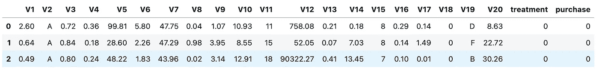

飞行员数据集的视图

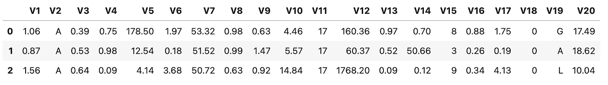

customerBase 数据集的视图

```
# Check for differences in purchase between control and treatment
control = pilot[pilot[‘treatment’] == 0]
treatment = pilot[pilot[‘treatment’] == 1]# Calculate total percentage (in relative terms) of customer who purchased for both groups
control_pct = (len(control[control[‘purchase’] == 1]) / len(control) * 100)treatment_pct = (
 len(treatment[treatment[‘purchase’] == 1]) / len(treatment) * 100)print(f'The pilot consists of {len(pilot)} customers')
print(
    f'The total amount of customers contacted in treatment is {len(treatment)} customers')
print(f'The total amount of customers in control is {len(control)} customers')
```

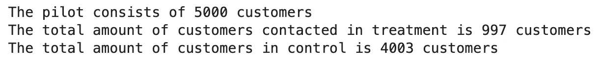

```
print(
 f’Absolute percentage of customer who purchased in pilot: {(len(pilot[pilot[“purchase”] == 1]) / len(pilot)) * 100}%’)
```

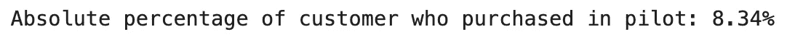

```
conversion_rates = pilot.groupby(‘treatment’)[‘purchase’]
# Std. deviation of the proportion
def std_p(x): return np.std(x, ddof=0)# Std. error of the proportion (std / sqrt(n))def se_p(x): return stats.sem(x, ddof=0)conversion_rates = conversion_rates.agg([np.mean, std_p, se_p])
conversion_rates.columns = [‘conversion_rate’, ‘std_deviation’, ‘std_error’]
conversion_rates.style.format(‘{:.3f}’)print(conversion_rates)plt.figure(figsize=(8, 6))
sns.barplot(x=pilot[‘treatment’], y=pilot[‘purchase’], ci=False)
plt.ylim(0, 0.17)
plt.title(‘Conversion rate by group’)
plt.xlabel(‘Group’)
plt.ylabel(‘Converted (proportion)’)
plt.show()
```

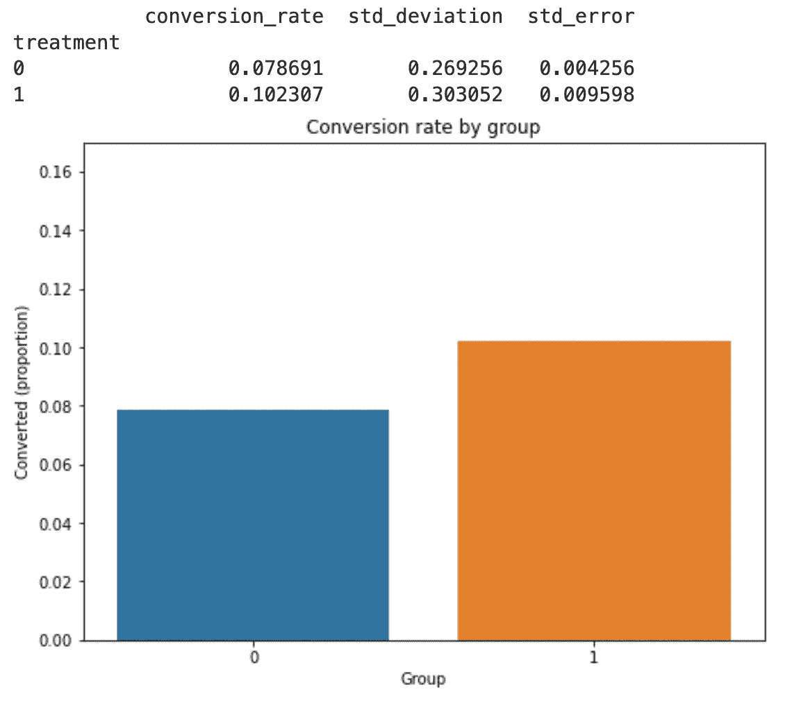

根据一些基本统计数据，在治疗组购买的客户似乎略有增加，但是，为了证实这一点，应进行更合适的测试，如 Z-test。

试点项目的总成本、收入和利润:

```
# cost of contacting a customer:
total_costs = len(treatment) * 5# discounted (future) revenues for all customer who purchased
total_revenues = len(pilot[pilot[‘purchase’] == 1]) * 100profit = total_revenues — total_costsprint(f’Total cost of contacting customer is {total_costs} units’)
print(
 f’Total revenues (incremental discounts) will be of {total_revenues} units’)
print(
 f’Total profit for pilot is: {profit} units, based on {len(pilot)} customers of which {len(pilot[pilot[“purchase”] == 1])} purchased’)
```

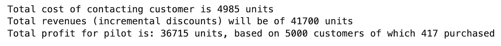

对于`customerBase`，考虑到约束条件，最大可能总利润为:

```
max_amount_contactable_customers = (len(customer_base) * 0.25)
cost_of_contact = 5
profit = 100max_profit = max_amount_contactable_customers * \
 profit — (max_amount_contactable_customers * 5)
print(
 f’Maximum possible profit (assuming 100% of contacted customers purchase): {max_profit} units’)
```

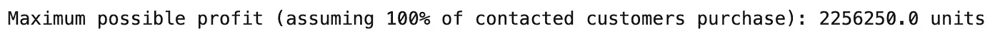

接下来，使用`pandas_profiling`创建一个报告，这有助于在数据中寻找有趣的模式。

从报告中可见的诊断结果来看，`V19`列中的不同值存在差异:

```
pilot[‘V19’].value_counts().sort_values(ascending=False).plot(kind=’bar’)
```

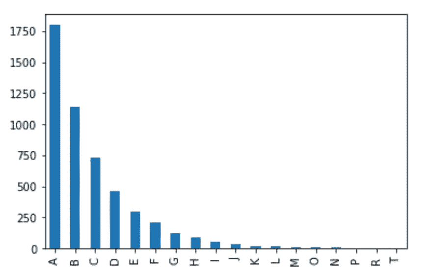

试点数据集中的大多数观察值属于 V19 列的 A 类

```
customer_base[‘V19’].value_counts().sort_values(
 ascending=False).plot(kind=’bar’)
```

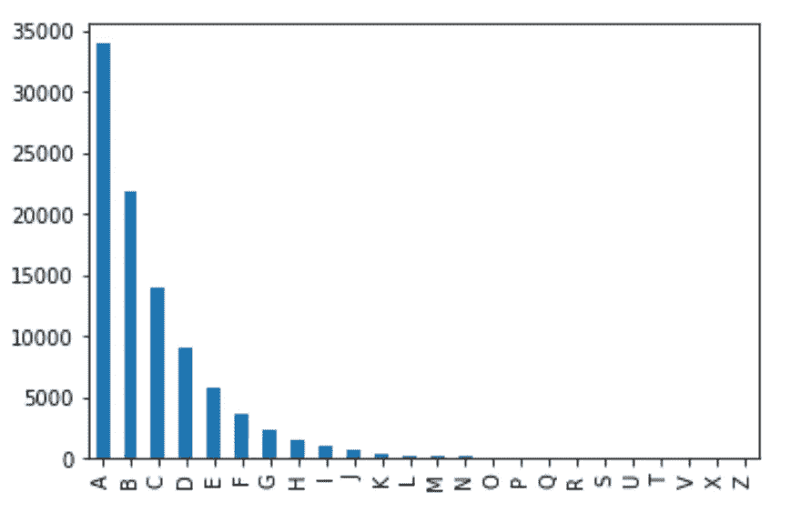

客户基础数据集也存在非常相似的模式

这种差异可能是由不同的因素造成的，例如，试点仅针对一组特定的客户(例如，拥有特定设备的客户类别，或属于特定类别的客户类别)。

为了了解如何处理这种情况，有必要量化客户群中有多少记录受到影响:

```
print(f’Customer base contains {len(customer_base)} records.’)affected_records = len(
 customer_base[customer_base[‘V19’].isin(pilot[‘V19’].unique())])print(f’Number of record affected by category mismatch is: {affected_records}’)print(f’{100 — (affected_records / len(customer_base) * 100)}%’)
print(f’count of affected records: {len(customer_base) — affected_records}’)
```

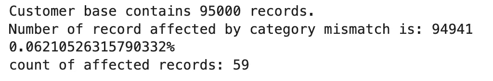

由于该任务中受影响的记录数量很少(59 条),是否决定根据`V19`变量下试点数据集中的相同类别跳过并过滤客户群。

```
customer_base = customer_base[customer_base[‘V19’].isin(pilot[‘V19’].unique())]
```

理解数据的另一个重要步骤是绘制每个变量的分布图，这次是通过重叠两个决策的数据:

```
# distribution of features
features = sorted(
 [i for i in pilot.columns if pilot.dtypes[i] != ‘object’])plt.figure(figsize=(12, 28*4))
gs = gridspec.GridSpec(28, 1)for i, cn in enumerate(pilot[features]):
 ax = plt.subplot(gs[i])
 sns.distplot(pilot[cn][pilot.purchase == 1], bins=50, label=’Purchased’)
 sns.distplot(pilot[cn][pilot.purchase == 0],
 bins=50, label=’Not purchased’)
 ax.set_xlabel(‘’)
 ax.legend()
 ax.set_title(‘histogram of feature: ‘ + str(cn))
plt.show()
```

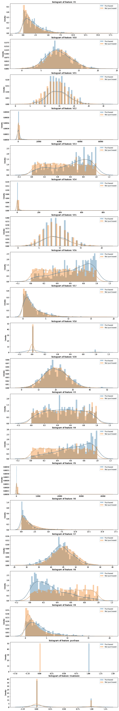

作者的图表

根据图表，一些变量，如`V7`、`V20`、`V10`看起来有点像高斯，这表明了一种可能性，例如，尝试使用具有 RBF 核的支持向量机建模。

此任务的目标是拟合一个二元分类器，这有助于检查目标变量中的类别不平衡:

```
pilot[‘purchase’].value_counts().plot(kind=’bar’)
print(pilot[‘purchase’].value_counts())
```

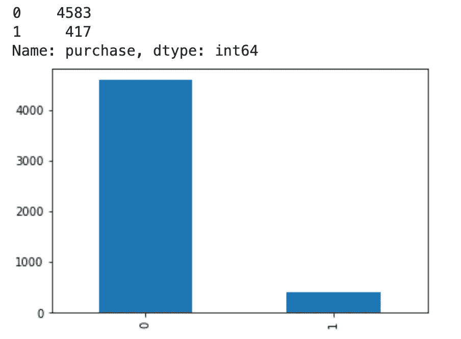

目标变量具有非常强的不平衡，大约为 9:91。

# 结论:

根据这种探索性的数据分析，有可能得出以下结论:

*   在治疗组和对照组之间存在约 2.3%的差异
*   除了连续变量外，数据集还包含两个分类变量和一个二元变量。出于建模目的，需要记住这一点
*   最大(可行)利润为 2，256，250 单位
*   目标变量中存在强烈的不平衡

 [## 5-bullet 数据科学与技术📡

### 编辑描述

无情-创造者-2481.ck.page](https://relentless-creator-2481.ck.page/68d9def351) 

# 2.0 数据准备

本节旨在拟合第一个模型(随机梯度推进集合)之前准备数据。

出于模型拟合的目的，正在使用飞行员数据集。然而，不会使用`treatment`列，因为它不是给定用户的固有特性，而是随机分配的组。

```
pilot = pilot.drop(‘treatment’, axis=1)
```

如前一节所述，在目标变量`purchase`中可以观察到强烈的阶级不平衡。有许多方法来处理类不平衡(过采样、欠采样、Tomek 链接、SMOTE...)，并且考虑二进制分类器，仅仅通过预测多数类来获得相当高的准确度是常见的，而它未能捕获少数类，这通常是首先创建模型的目的。

此外，从商业角度来看，具有更保守的分类器具有经济意义，这意味着相对于假阴性具有高比率的真阳性的分类器。这一选择背后的基本原理是，联系潜在客户是有成本的，我们只对有高购买机会的潜在客户感兴趣。

对于这项任务，使用的采样技术是 SMOTE。该技术的工作原理是从少数类中随机选取点，并计算该点的 k-最近邻。

然而，为了实现该算法，在需要将数据集分割成特征和目标，并通过获取虚拟变量对分类变量进行编码之前，需要使用`imblearn`库:

这种选择背后的基本原理是，这种方法不会导致信息损失(过采样)，但是，有必要注意，过采样或欠采样并不总是最佳选择:在处理真实世界的数据时，一些现象本质上是不平衡的，因此，操纵目标类会扭曲数据的真实性质(即欺诈检测、流失、信用违约……)

```
# get dummies of categorical variables for both datasetspilot = pd.get_dummies(pilot, columns=[‘V2’, ‘V19’], drop_first=True)customer_base = pd.get_dummies(customer_base, columns=[
 ‘V2’, ‘V19’], drop_first=True)# set aside 150 random records from pilot and remove them
test_set = pilot.groupby('purchase').apply(
    lambda x: x.sample(frac=0.035, random_state=42))
# get list of indices to drop
drop_indices = [i[1] for i in test_set.index]# reset index and shuffle
test_set = test_set.reset_index(drop=True)
test_set = test_set.sample(frac=1)# drop indices from original dataset (to avoid training on them)
pilot = pilot.drop(drop_indices)# shuffle data
pilot = pilot.sample(frac=1)# select all columns but purchase
features = pilot.loc[:, pilot.columns != 'purchase']
targets = pilot['purchase']# make sure input data has the same shape as customer baseassert len(features.columns) == len(customer_base.columns)
```

预处理中一个常见的，但并不总是必要的步骤是标准化，当操作决策树时，它并不总是必要的，但它确实是支持向量机的推荐步骤

```
from sklearn.preprocessing import StandardScalerscaler = StandardScaler()
features_scaled = scaler.fit_transform(features.values)# get a list of categorical columns indexes to fit SMONTENC
cat_columns = [features.columns.get_loc(i)
               for i in features.columns if '_' in i]from imblearn.over_sampling import SMOTENCsm = SMOTENC(categorical_features=cat_columns, k_neighbors=10)
X, y = sm.fit_resample(features_scaled, targets)
```

# 3.0 建模和评估

为了训练/验证的目的，使用 k-fold 交叉验证来分割数据集，此外，应用网格搜索来搜索最佳参数，这些参数然后用于在整个训练数据上拟合模型。这个策略是根据[这个](https://stats.stackexchange.com/questions/11602/training-on-the-full-dataset-after-cross-validation)问题和引用的论文选择的。

在没有应用任何过采样(或欠采样)的情况下，更有意识的选择将被分层 k 倍。

# 3.1 建模— SVM

```
# get test data (unseen by the algorithm)X_test = scaler.transform(test_set.drop([‘purchase’], axis=1).values)
y_test = test_set[‘purchase’].values
```

为了便于拟合多个模型，快速迭代返回最佳参数的专用函数变得非常有用:

```
def fit_gs_model_w_report(model, scores, param_grid, X_train, y_train, X_test, y_test, n_jobs):
 ‘’’
 Fit a model, generate classification report, and return best model params.
 ‘’’for score in scores:
 print(“# Tuning hyper-parameters for %s” % score)
 print()model = GridSearchCV(model, param_grid, scoring=score, n_jobs=n_jobs)
 model.fit(X_train, y_train)print(“Best parameters set found on development set:”)
 print()
 print(model.best_params_)
 print()
 print(“Grid scores on development set:”)
 print()
 means = model.cv_results_[“mean_test_score”]
 stds = model.cv_results_[“std_test_score”]
 for mean, std, params in zip(means, stds, model.cv_results_[“params”]):
 print(“%0.3f (+/-%0.03f) for %r” % (mean, std * 2, params))
 print()print(“Detailed classification report:”)
 print()
 print(“The model is trained on the full development set.”)
 print(“The scores are computed on the full evaluation set.”)
 print()
 y_true, y_pred = y_test, model.predict(X_test)
 print(classification_report_imbalanced(y_true, y_pred,
 target_names=[‘Not purchased’, ‘Purchased’]))
 print()return model.best_params_
```

让我们使用网格搜索拟合第一个模型，并解释输出结果:

```
scores = [“roc_auc”]param_grid_svc = {“kernel”: [“rbf”],
 “gamma”: [1e-2, 1e-3, 1e-4],
 “C”: [1000, 10000],
 “class_weight”: [‘balanced’]
 }
svc_best_params = fit_gs_model_w_report(model=SVC(),
 scores=scores,
 param_grid=param_grid_svc,
 X_train=X,
 y_train=y,
 X_test=X_test,
 y_test=y_test,
 n_jobs=-1)
```

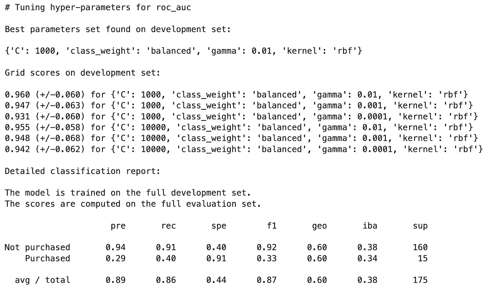

根据`Purchased`类别的精确度和召回分数，当模型声称观察确实是购买时，它有 29%的时间是正确的，并且它能够检测到 40%的购买，但是重要的是要注意测试集中有很大的不平衡(160 个阴性样本，只有 15 个阳性样本)

现在，使用整个数据集拟合具有最佳参数的最终 SVC 模型:

```
best_svc = SVC(probability=True)
best_svc.set_params(**svc_best_params)best_svc.fit(X, y)y_scores_svc = cross_val_predict(
    best_svc, X, y, cv=10, method='predict_proba', n_jobs=-1)# since predict_proba returns predictions for each class, we need to focus on the positive class
y_scores_svc = y_scores_svc[:, 1]precisions_svc, recall_svc, thresholds_svc = precision_recall_curve(
    y, y_scores_svc)
```

为了将该分类器与另一个模型进行比较，可以使用 F1 分数，但是，F1 分数倾向于具有相似精度和召回率的分类器。

理想情况下，对于此任务，最好使用召回率稍低但精确度较高的分类器，这意味着 ABC Telco 联系的客户购买该计划的可能性较高。

为了进一步调整这一点，可以访问模型的决策得分，然后可以选择适当的阈值:

```
def plot_precision_recall_vs_threshold(precisions, recall, thresholds):
 plt.plot(thresholds, precisions[:-1], “b — “,
 label=”Precision”, linewidth=2)plt.plot(thresholds, recall[:-1], “g-”, label=”Recall”, linewidth=2)
 plt.xlabel(“Threshold”, fontsize=16)
 plt.legend(loc=”upper left”, fontsize=16)
 plt.ylim([0, 1])
 plt.grid()
 plt.legend()plot_precision_recall_vs_threshold(precisions_svc, recall_svc, thresholds_svc)
```

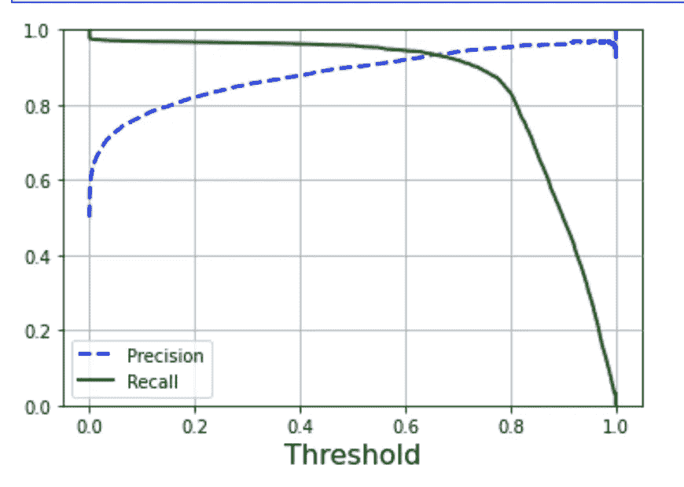

从图中可以看出，在阈值约为 0.70 时，精度会下降到 90%以下。

另一种选择最合适阈值的常用方法是直接绘制精度与召回率的关系图:

```
plt.plot(precisions_svc, recall_svc)
plt.grid()
plt.xlabel(‘Precision’)
plt.ylabel(‘Recall’)
```

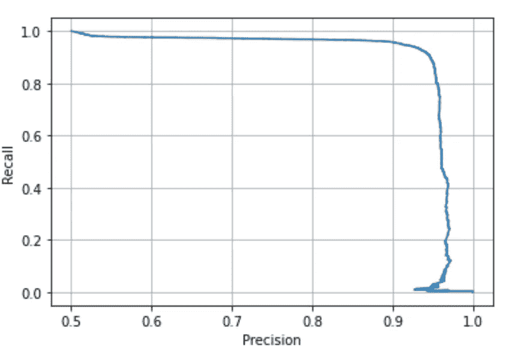

从图表中可以看出，在大约 90%的召回率时，准确率开始急剧下降。这意味着，对于这个任务，将选择在该投放之前的精度/召回折衷。

```
# get the threshold at which precision is 90%
threshold_90_precision_svc = thresholds_svc[np.argmax(precisions_svc >= 0.9)]ps_svc = precision_score(y, y_scores_svc > threshold_90_precision_svc)
print(f’Precision: {ps_svc * 100}%’)
```


然而，召回分数太低的分类器也不是很有用，这就是为什么在调整之后还需要评估召回分数的原因:

```
rs_svc = recall_score(y, y_scores_svc > threshold_90_precision_svc)
print(f’Recall: {rs_svc * 100}%’)
```


# 3.2 梯度提升分类器

本节试图拟合第二个(理想情况下性能更好的)模型。拟合的模型是基于 LightGBM 库的梯度提升分类器。正在进行网格搜索，以找到最佳参数，特别是添加了`reg_alpha`、`reg_lambda`、`min_data_in_leaf`和`num_leaves`，试图防止过度拟合(在基于树的方法中非常常见)

```
scores = [“roc_auc”]param_grid_lgbm = {
 ‘learning_rate’: [0.5],
 ‘n_estimators’: [96],
 ‘num_leaves’: [64, 128],
 ‘boosting_type’: [‘gbdt’],
 ‘objective’: [‘binary’],
 ‘max_bin’: [416],
 ‘random_state’: [500],
 ‘colsample_bytree’: [0.32],
 ‘min_data_in_leaf’: [50],
 ‘subsample’: [0.3],
 ‘class_weight’: [‘balanced’],
 ‘reg_alpha’: [0.01, 0.05],
 ‘reg_lambda’: [0.01],
 ‘feature_fraction’: [0.2, 0.4]
}lgbm_best_params = fit_gs_model_w_report(model=lgbm.LGBMClassifier(n_jobs=1), 
 scores=scores,
 param_grid=param_grid_lgbm, 
 X_train=X, 
 y_train=y,
 X_test=X_test, 
 y_test=y_test,
 n_jobs=-1)
```

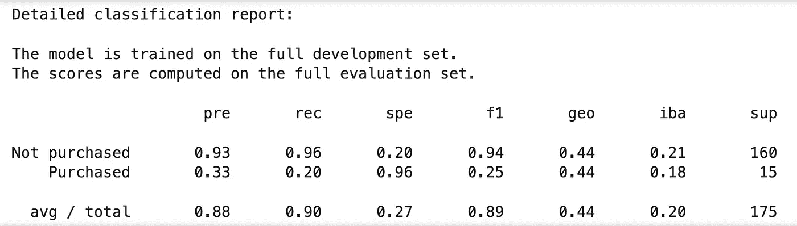

同样，使用来自网格搜索的最佳参数来拟合最终模型:

```
best_lgbm = lgbm.LGBMClassifier()
best_lgbm.set_params(**lgbm_best_params)best_lgbm.fit(X, y)
```

根据精度和召回指标，该模型似乎执行得更好，但是，必须记住，使用该算法家族可能导致严重的过度拟合。

```
y_scores_lgbm = cross_val_predict(
 best_lgbm, X, y, cv=10, method=’predict_proba’, n_jobs=-1)# since predict_proba returns predictions for each class, we need to focus on the positive class
y_scores_lgbm = y_scores_lgbm[:, 1]precisions_lgbm, recall_lgbm, thresholds_lgbm = precision_recall_curve(
 y, y_scores_lgbm)plot_precision_recall_vs_threshold(
    precisions_lgbm, recall_lgbm, thresholds_lgbm)
```

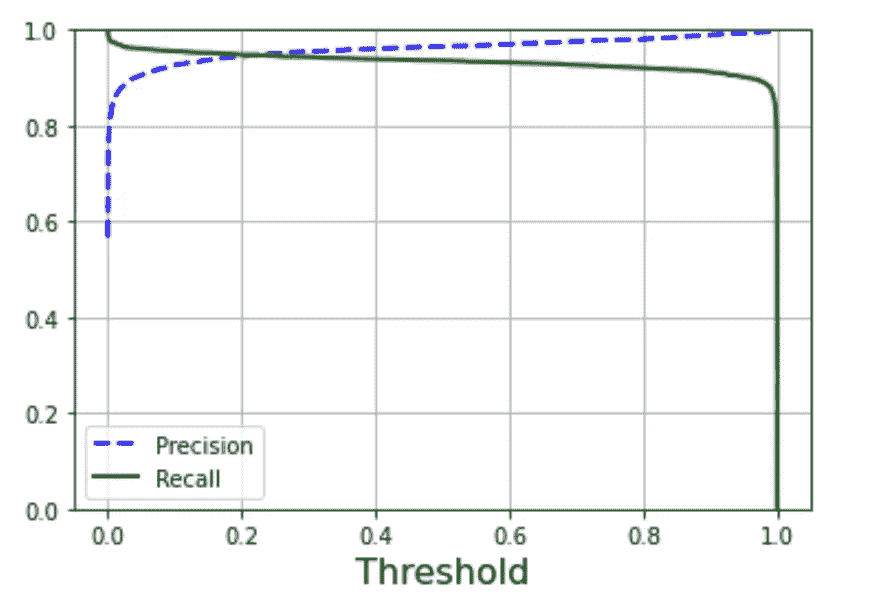

```
plt.plot(precisions_lgbm, recall_lgbm)
plt.grid()
plt.xlabel(‘Precision’)
plt.ylabel(‘Recall’)
```

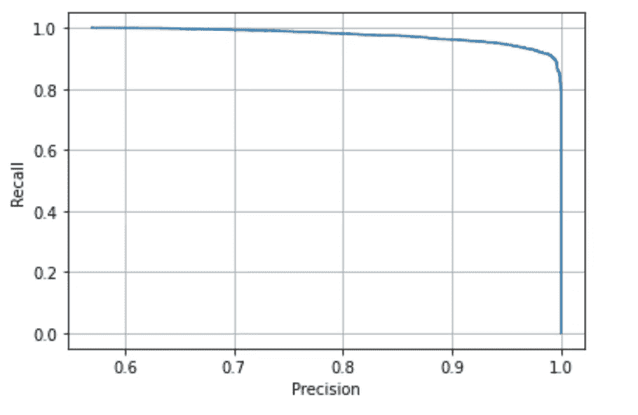

使用与 SVC 相同的方法选择模型的阈值。

```
# get the threshold at which precision is 90%
threshold_90_precision_lgbm = thresholds_lgbm[np.argmax(
 precisions_lgbm >= 0.90)]ps_lgbm = precision_score(y, y_scores_lgbm > threshold_90_precision_lgbm)
print(f’Precision lgbm model: {ps_lgbm * 100}%’)rs_lgbm = recall_score(y, y_scores_lgbm > threshold_90_precision_lgbm)
print(f’Recall: {rs_lgbm * 100}%’)
```

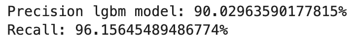

# 3.3 模型评估

本节根据评估集评估这两个模型，讨论它们之间的差异和细微差别，选择最终模型，并根据客户群计算预测。

# SVC:

```
# get test dataX_test = scaler.transform(test_set.drop([‘purchase’], axis=1).values)
y_test = test_set[‘purchase’].values# scale data in the customer base
customer_base_scaled = scaler.transform(customer_base)y_scores_svc = best_svc.predict_proba(X_test)# without threshold manipulation
evs_cm_svc = confusion_matrix(y_test, y_scores_svc[:, 1] > 0.5)
ConfusionMatrixDisplay(evs_cm_svc).plot()
```

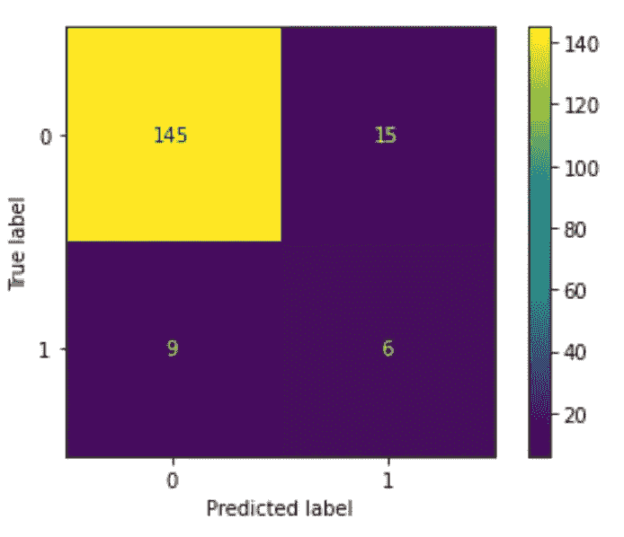

```
evs_cmt_svc = confusion_matrix(
 y_test, y_scores_svc[:, 1] > threshold_90_precision_svc)
ConfusionMatrixDisplay(evs_cmt_svc).plot()
```

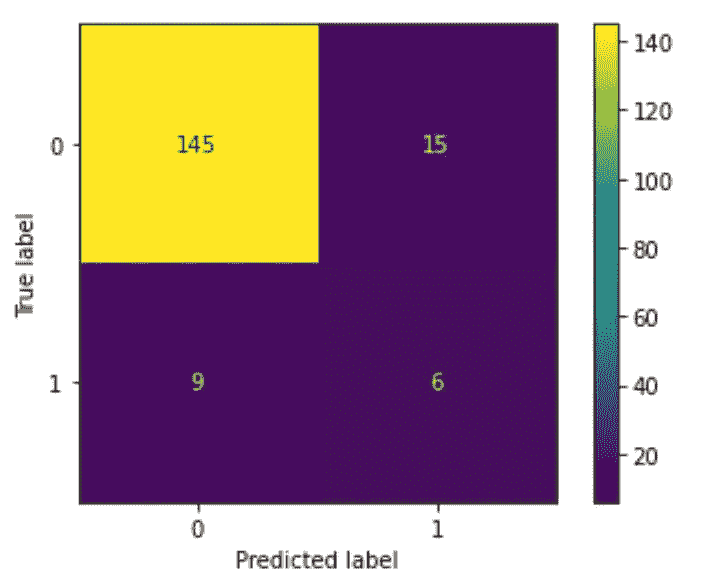

从混淆矩阵可以看出，根据期望的目标调整阈值可以减少假阳性的数量，从而导致成本的降低。

让我们看看这些预测是如何针对客户群的:

```
final_predictions_svc = best_svc.predict_proba(customer_base_scaled)constraint = int(len(customer_base) * 0.25)final_predictions_svc_df = pd.DataFrame(
    {'prediction': final_predictions_svc[:, 1] > threshold_90_precision_svc, 'probability': final_predictions_svc[:, 1]})# sort final prediction by score to then apply the 1/4 constraint in a safe way
final_predictions_svc_df = final_predictions_svc_df.sort_values(
    by='probability', ascending=False)final_predictions_svc_df = final_predictions_svc_df[final_predictions_svc_df['prediction'] == True]
print(
    f'The SVC model would decide to contact {len(final_predictions_svc_df)} customers out of a maximum of {constraint}')The SVC model would decide to contact 11618 customers out of a maximum of 23735
```

SVC 模型将建议联系呼叫中心可行的多个客户。

为了模拟估计有多少客户在接触后会实际购买该计划，假设概率为 50%，从分布中抽取一个二项式随机变量:

```
buy_decision_svc = binom.rvs(1, .5, size=len(final_predictions_svc_df))
final_predictions_svc_df[‘buy_decision_svc’] = buy_decision_svc# cost of contacting a customer:
total_positive_predictions_svc = len(final_predictions_svc_df)total_buying_decisions_svc = len(
    final_predictions_svc_df[final_predictions_svc_df['buy_decision_svc'] == 1])total_costs_svc = total_positive_predictions_svc * 5# discounted revenues for all customer who purchased
total_revenues_svc = total_buying_decisions_svc * 100profit_svc = total_revenues_svc - total_costs_svcprint(
    f'Total total cost of contacting selected customers is {total_costs_svc} units')
print(
    f'Total revenues (incremental discounts) will be of {total_revenues_svc} units')
print(
    f'Total profit for this scenario is: {profit_svc} units, based on {len(final_predictions_svc_df)} customers of which {len(final_predictions_svc_df[final_predictions_svc_df["buy_decision_svc"] == 1])} purchased')
```

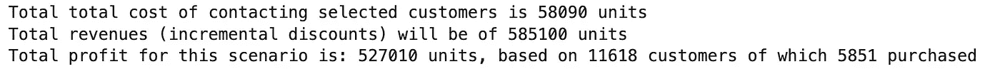

```
# save business result to a table
final_business_results = pd.DataFrame({
 ‘model’: ‘SVC’,
 ‘total_cost_contacting_customers’: total_costs_svc,
 ‘total_customer_base’: len(customer_base),
 ‘contacted customers’: len(final_predictions_svc_df),
 ‘amount_of_customers_who_purchased’: len(final_predictions_svc_df[final_predictions_svc_df[“buy_decision_svc”] == 1]),
 ‘total_revenues’: total_revenues_svc,
 ‘profit’: profit_svc
}, index=[0])
```

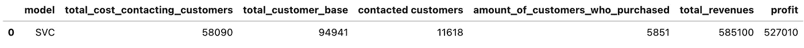

# LGBM:

```
# get test dataX_test = scaler.transform(test_set.drop([‘purchase’], axis=1).values)
y_test = test_set[‘purchase’].values# scale data in the customer base
customer_base = scaler.transform(customer_base)evs_pred_lgbm = best_lgbm.predict_proba(X_test)# without threshold manipulationevs_cm_lgbm = confusion_matrix(y_test, evs_pred_lgbm[:, 1] > 0.5)
ConfusionMatrixDisplay(evs_cm_lgbm).plot()
```

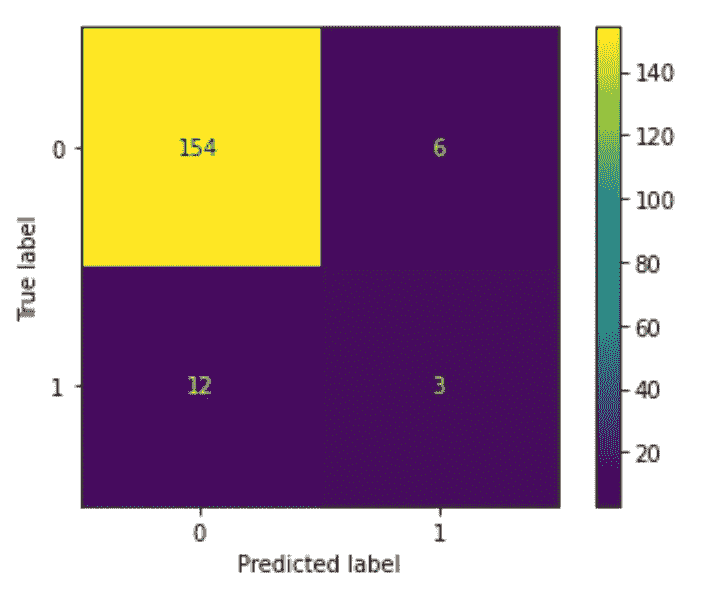

```
evs_cmt_lgbm = confusion_matrix(
 y_test, evs_pred_lgbm[:, 1] > threshold_90_precision_lgbm)
ConfusionMatrixDisplay(evs_cmt_lgbm).plot()
```

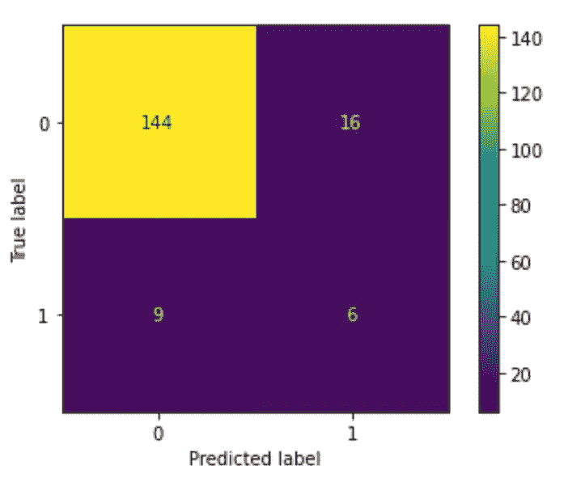

比较最终的精度和召回指标(调整阈值后)显示，第二个模型在召回方面显著增加，而精度保持不变。另一方面，在这个阶段，将两个模型的混淆矩阵放在一起绘图可能是有意义的:

```
fig, axs = plt.subplots(nrows=1, ncols=2, figsize=(18, 4))fig.suptitle(‘SVC VS LGBM — Confusion matrix’)
ConfusionMatrixDisplay(evs_cmt_lgbm).plot(ax=axs[0])
axs[0].set_title(‘LGBM’)ConfusionMatrixDisplay(evs_cmt_svc
 ).plot(ax=axs[1])
axs[1].set_title(‘SVC’)
```

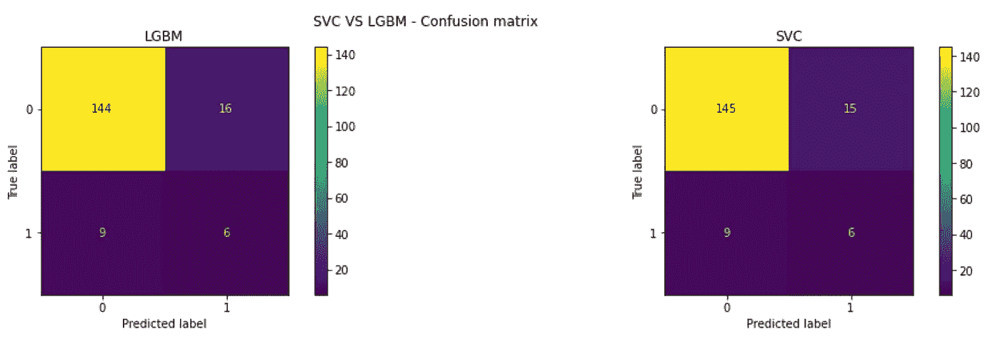

```
final_predictions_lgbm = best_lgbm.predict_proba(customer_base_scaled)
```

从图中可以观察到，LGBM 模型在捕捉真阳性方面确实更好，而假阴性的数量从 12 个减少到了 9 个。另一方面，假阳性的数量略有增加。然而，从商业角度来看，联系 4 个额外的潜在客户肯定会增加 20 个单位的成本，但从长远来看，瞄准 3 个实际购买该计划的潜在客户会带来更高的利润。

这就是为什么 LGB 模型被用作最终模型。

```
final_predictions_lgbm_df = pd.DataFrame(
 {‘prediction’: final_predictions_lgbm[:, 1] > threshold_90_precision_lgbm, ‘probability’: final_predictions_lgbm[:, 1]})# sort final prediction by score to then apply the 1/4 constraint in a safe way
final_predictions_lgbm_df = final_predictions_lgbm_df.sort_values(
 by=’probability’, ascending=False)final_positive_predictions_lgbm_df = final_predictions_lgbm_df[
 final_predictions_lgbm_df[‘prediction’] == True]
print(
 f’The LGBM model would decide to contact {len(final_positive_predictions_lgbm_df)} customers out of a maximum of {constraint}’)
```

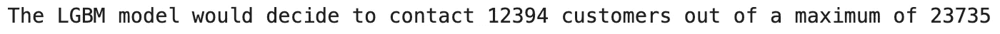

显然，LGBM 模型比 SVC 模型更慷慨。

根据二项式分布模拟最终决策:

```
buy_decision_lgbm = binom.rvs(
 1, .5, size=len(final_positive_predictions_lgbm_df))
final_positive_predictions_lgbm_df[‘buy_decision_lgbm’] = buy_decision_lgbm# cost of contacting a customer:
total_positive_predictions_lgbm = len(
 final_positive_predictions_lgbm_df[final_positive_predictions_lgbm_df[‘prediction’] == True])total_buying_decisions_lgbm = len(
 final_positive_predictions_lgbm_df[final_positive_predictions_lgbm_df[‘buy_decision_lgbm’] == True])total_costs_lgbm = total_positive_predictions_lgbm * 5# discounted revenues for all customer who purchased
total_revenues_lgbm = total_buying_decisions_lgbm * 100profit_lgbm = total_revenues_lgbm — total_costs_lgbmprint(
 f’Total total cost of contacting selected customers is {total_costs_lgbm} units’)
print(
 f’Total revenues (incremental discounts) will be of {total_revenues_lgbm} units’)
print(
 f’Total profit for this scenario is: {profit_lgbm} units, based on {len(final_positive_predictions_lgbm_df)} customers of which {len(final_positive_predictions_lgbm_df[final_positive_predictions_lgbm_df[“buy_decision_lgbm”] == 1])} purchased’)
```

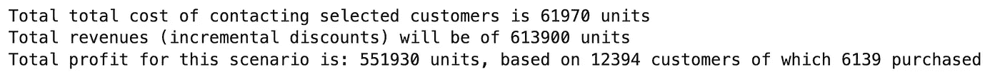

现在可以创建一个最终表来比较业务相关数据:

```
# save business result to a table
final_business_results = final_business_results.append({
 ‘model’: ‘LGBM’,
 ‘total_cost_contacting_customers’: total_costs_lgbm,
 ‘total_customer_base’: len(customer_base),
 ‘contacted customers’: len(final_positive_predictions_lgbm_df),
 ‘amount_of_customers_who_purchased’: len(final_positive_predictions_lgbm_df[final_positive_predictions_lgbm_df[“buy_decision_lgbm”] == 1]),
 ‘total_revenues’: total_revenues_lgbm,
 ‘profit’: profit_lgbm
}, ignore_index=True)
```

重要的是要知道，由于最终的购买决策是由随机函数模拟的，所以上面的估计值可能会有细微的变化(尽管出于再现性目的声明了一个种子)。

下表列出了预计的成本、收入和利润:

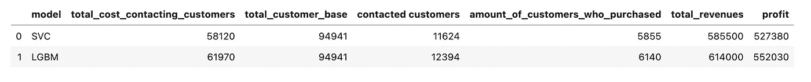

这个任务的目标是从这个活动中获得最大利润，因此 LGBM 模型被选为最终模型。

# 4.0 结论

考虑到这个任务是在笔记本电脑上完成的，我不想使用任何计算量太大的技术，比如更广泛的网格搜索。我相信提高这个模型准确性的关键在于更高级的数据预处理。在迭代不同的预处理技术时，我几乎立即注意到了规范化是如何提高模型输出的。

此外，获得更多数据(+100K 标记的观察值)将使前面提到的技术更加强大。

提高产量的可能方法:

*   获得更多的计算能力将使超参数优化更快、更容易实现
*   了解特性的商业意义将有助于变量选择/解释
*   更广泛的预处理试验和错误(以及快速迭代的计算能力)
*   更多训练数据

```
**I have a newsletter 📩.** Every week I’ll send you a brief findings of articles, links, tutorials, and cool things that caught my attention. If tis sounds cool to you subscribe. *That means* ***a lot*** *for me.*
```

 [## 5-bullet 数据科学与技术📡

### 编辑描述

无情-创造者-2481.ck.page](https://relentless-creator-2481.ck.page/68d9def351) 

# 分级编码

感谢您成为我们社区的一员！在你离开之前:

*   👏为故事鼓掌，跟着作者走👉
*   📰查看[级编码出版物](https://levelup.gitconnected.com/?utm_source=pub&utm_medium=post)中的更多内容
*   🔔关注我们:[Twitter](https://twitter.com/gitconnected)|[LinkedIn](https://www.linkedin.com/company/gitconnected)|[时事通讯](https://newsletter.levelup.dev)

🚀👉 [**加入升级达人集体，找到一份惊艳的工作**](https://jobs.levelup.dev/talent/welcome?referral=true)