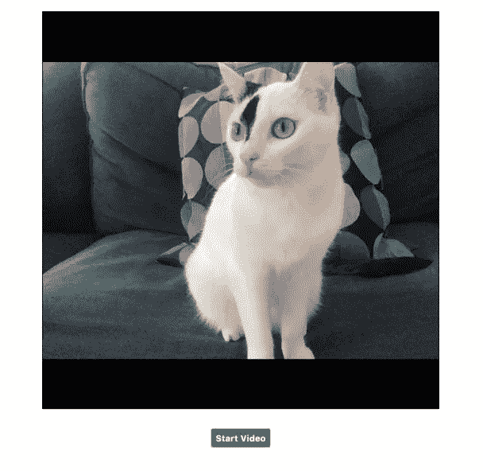
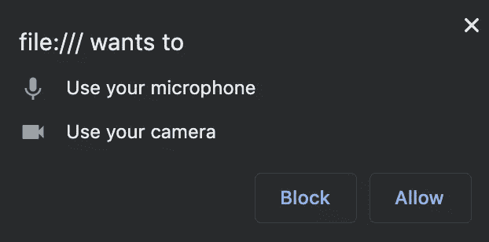
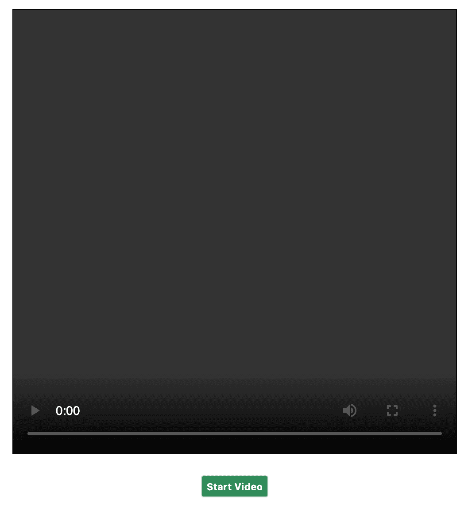

# 来自网络摄像头和麦克风的数据流:使用 WebRTC 进行视频通话步骤 1

> 原文：<https://levelup.gitconnected.com/data-stream-from-your-webcam-and-microphone-videochat-with-javascript-step-1-29895b70808b>


在 [Unsplash](https://unsplash.com/s/photos/chat-onlin?utm_source=unsplash&utm_medium=referral&utm_content=creditCopyText) 上由 [Austin Distel](https://unsplash.com/@austindistel?utm_source=unsplash&utm_medium=referral&utm_content=creditCopyText) 拍摄的照片

2011 年，WebRTC 使得浏览器之间的实时通信成为可能。这个 API 使您能够在两个用户之间创建 P2P 连接，并允许他们共享数据，例如通过视频聊天进行通信和共享他们的屏幕。在这一系列文章中，我们将创建这样一个视频聊天。您可以查看下一篇文章:

*   [第二步:通过 WebSocket 建立连接](/set-up-a-connection-over-websocket-videochat-with-javascript-step-2-f78c307c4fd3)
*   [第三步:建立 WebRTC 连接](/establishing-the-webrtc-connection-videochat-with-javascript-step-3-48d4ae0e9ea4)
*   [第三步:找到你的联系人](/find-your-contact-videochat-with-javascript-step-4-4d527576b8cf)

创建视频聊天的第一步是访问用户的设备，如网络摄像头和麦克风，以及他们的数据流。在第一篇文章中，我们将访问我们的设备并在浏览器中显示视频(带音频)。最终结果将如下所示:



# 访问用户音频和视频流

我们首先需要访问用户的网络摄像头和麦克风。导航器通过[媒体设备](https://developer.mozilla.org/en-US/docs/Web/API/MediaDevices)接口访问媒体设备。

```
window.navigator.mediaDevices
```

通过在控制台中调用，我们可以获得浏览器可以访问的所有设备的列表:

```
const devices = await window.navigator
                            .mediaDevices
                            .enumerateDevices();
```

在我的浏览器中，我得到了一个由五个设备组成的阵列，一个视频输入和五个音频输入。但我们对设备本身不感兴趣，我们想从它们那里获得数据流。

音频和视频等媒体内容由 [MediaStream](https://developer.mozilla.org/en-US/docs/Web/API/MediaStream) 接口表示。要访问数据流，您需要在 *mediaDevices* 对象上调用 *getUserMedia* 函数。我们需要给出我们想要的媒体类型作为参数，这里是音频和视频。我们可以给出一系列约束作为参数，不仅是媒体类型，还有我们想要的视频大小、方向……我们在这里保持简单:

```
const stream = await window.navigator.mediaDevices.getUserMedia(
  {
    video: true,
    audio: true,
  },
);
```

这是一个承诺，因为你必须允许访问你的设备。在 Google Chrome 上，你应该会看到这样一个对话框:



如果您说是，您将收到 MediaStream 对象。如果您的网络摄像头有此功能，您应该会看到它旁边有一个小灯，告诉您它现在已打开。

我们的 MediaStream 对象由两个轨道组成，一个轨道对应一种媒体类型。您可以通过调用来访问它们

```
stream.getAudioTracks();
stream.getVideoTracks();
```

这些方法返回音轨数组，每个音轨包含一些信息，如种类(例如音频或视频)、标签、想法，以及音轨是否启用、静音等。

# HTML5 视频标签

我们现在可以访问来自麦克风和网络摄像头的数据流，我们只想在我们的浏览器中显示它们，以确保它正常工作。这曾经是一件令人头疼的事情，但是 HTML5 视频标签允许我们非常容易地在页面中构建视频。

我们有一个带有控件(播放、静音和停止按钮)的视频标签和一个启动视频的按钮。单击之前，屏幕如下所示:



让我们看看 JavaScript 代码:

当您点击按钮时，我们就像在上一节中所做的那样创建流。你的浏览器应该请求你的许可才能开始视频(我们这里不处理用户拒绝的情况)。一旦流可用，它就被设置为视频标签的源对象，视频开始播放。你现在应该看到和听到你自己。

我们现在可以从浏览器访问数据流了。下一步是在想要视频聊天的用户的浏览器之间建立连接。在下一篇文章的[中，我们在两个客户端之间创建一个 WebSocket 连接。](/set-up-a-connection-over-websocket-videochat-with-javascript-step-2-f78c307c4fd3)