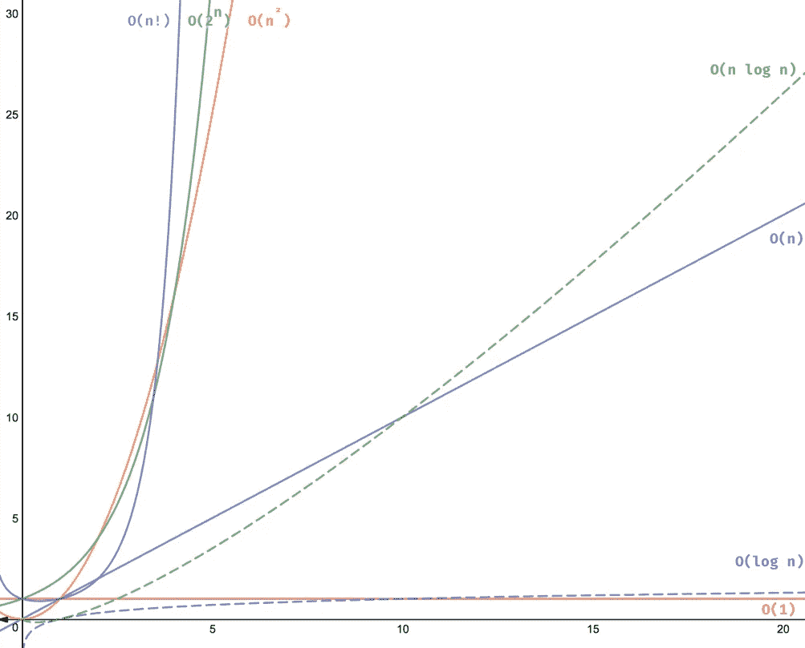

# 数据结构和算法概念:时间和空间复杂性

> 原文：<https://levelup.gitconnected.com/data-structures-algorithm-concepts-time-space-complexity-b1b5c5d6d87a>

*什么是时间复杂度？什么是空间复杂性？它们为什么重要？我将尝试在这篇博客中揭开 Big-O 符号的神秘面纱。*

照片由 [NeONBRAND](https://unsplash.com/@neonbrand?utm_source=medium&utm_medium=referral) 拍摄

用最简单的术语来说，时间复杂度就是算法运行的持续时间。类似地，空间复杂度是算法运行所需的空间量。当提到时间复杂性时，您通常会将其视为 Big-O 符号，如 O(n)、O(log n)、O(n)等。 *n* 代表输入，而 *O* 代表最坏情况增长率函数。

时间和空间的复杂性是技术面试中经常出现的重要话题，原因有很多。第一个原因是，每个公司都很看重自己的资源，拥有占用时间和空间更少的高效算法，总会帮助公司节省资源。第二个原因是展示您对可伸缩性的了解。随着算法被用于越来越大的数据集，它们的运行时间和空间需求会发生怎样的变化？

你对算法性能的理解可以帮助公司节省大量资源。如果一个算法需要一个小时来计算，而另一个需要 10 分钟，那么这 50 分钟就非常有价值，可以用来处理其他任务。此外，如果我们将算法需要处理的数据量和输入量增加一倍，第一个算法的时间可能会增加到两个小时，而第二个算法可能只需要 20 分钟。正如你所看到的，意识到算法的时间复杂度可以节省很多时间！

当涉及到更简单的面试问题，如字符串/整数反转，或检查回文时，运行这些算法所需的时间不一定会非常长。但是，想象一下传入一个 100，000 个字符长的字符串，而不是 10 个字符。现在所需的时间大大增加。因此，让我们稍微研究一下这个例子，并深入研究各种类型的运行时。

循环遍历一个字符串来反转字符将是**线性运行时**的经典例子，也称为 **O(n)** 。这意味着对于字符串中的每个额外字符，循环中都有一个额外的步骤要处理。在输入和处理所需的时间量之间有直接的一对一的关系。当算法必须遍历集合中的每个数据点一次时，线性运行时间经常是这种情况。

线性运行时是可以接受的，但是有两个时间复杂度甚至更高，其中一个是理想的。这些是对数运行时间和常数运行时间。**对数运行时间**，或 **O(log n)** ，通常是算法每次将工作分成两半的情况。一个经典的例子是在字典中搜索一个单词。当你第一次寻找一个单词时，你可能会随意打开字典，然后想想这个单词是在你翻到的左边还是右边。这本字典现在被分成两半。你继续这样做，直到你把搜索范围缩小到准确的单词。当输入量加倍并不总是使完成工作所需的时间加倍时，很可能是对数运行时间。许多搜索算法，如二分搜索法，都有这样的时间复杂度。

运行时最好的情况是**常量运行时**，也就是 **O(1)** 。之所以这是最好的情况，是因为不管 O 的增长率如何，运行它所需的时间将保持不变。例如，如果我实现了一个函数，它返回一个字符串中的第一个字符，即使这个字符串有 10，000 个字符长，它所花费的时间和我给出一个 10 个字符长的字符串所花费的时间是一样的。当然，并不是所有的一行程序都是常量运行时。观察它是如何实现的极其重要。虽然恒定的运行时间是最理想的场景，但它通常是最难实现的。

现在让我们看看一些不太理想的运行时。这些运行时间是准线性、二次、多项式、指数和阶乘的。我不会讲太多细节，因为解释起来会很复杂，需要理解一些非常有趣的排序方法(合并排序、快速排序等)。)

**准线性/线性时间运行**，或 **O(n * log n)** ，与对数时间非常相似。它的性能比线性运行时稍差，但仍明显优于二次运行时。如果您对利用这个运行时的算法感兴趣，可以研究一下 merge sort，但是为了简洁起见，我不会在这里深入研究。

**二次运行时**，或 **O(n )** ，意味着每增加一次输入，功的量就增加到二次方。当给定 3 个输入时，它进行 9 次运算。当给定 5 个输入时，它进行 25 次运算。使用此运行时的排序方法有冒泡排序、选择排序和插入排序。另一个例子是在同一个数组上迭代的两个嵌套循环。

如果在这两个循环中有另一个嵌套循环，并且它也迭代相同数组中的每个值，那么我们有**立方** **运行时**，或者 **O(n )** 。随着循环次数的增加，功率也增加。这被称为**多项式运行时**，或者**o(n^m**。

接下来我们有**指数运行时间**，或 **O(2** ^ **n)** 。一个很好的例子就是披萨店的配料。对于每一个额外的浇头，组合的数量呈指数增长。再比如握手问题。我们希望尽量避免这种情况，因为这些算法很容易开始花费大量的时间来处理。

最后，我们有**阶乘运行时**，或 **O(n！)**。阶乘就是把所有小于给定数字的正整数相乘，所以 4！等于 1 * 2 * 3 * 4。有一个涉及阶乘运行时的解决方案可以解决[旅行推销员问题](https://en.wikipedia.org/wiki/Travelling_salesman_problem)，但这显然不理想。如果你有时间，这是一个有趣的阅读问题！

这是阿德里安·梅希亚网站上的一张图表，它将所有的复杂性可视化了:

[阿德里安·梅希亚对时间复杂性的可视化](https://adrianmejia.com/most-popular-algorithms-time-complexity-every-programmer-should-know-free-online-tutorial-course/#O-n-Factorial-time)其中 X 是输入，Y 是时间。

很难总是准确地识别算法的时间复杂度，但是这里有一些帮助:

当涉及到一次循环迭代时，不管数据集的大小，都将是线性运行时。使用单独的 for 循环遍历两个不同的数据集的时间复杂度为 O(n + m)，但最终仍然是线性的。

用嵌套的 for 循环遍历相同的数据集是二次运行时。如果你迭代两个不同的集合，虽然类似于二次运行时，它将被写成 O(n * m)，因为我们想区分不同的数据集。

一般来说，随着您对数据结构越来越熟悉，并利用更多的算法，您将会对这些运行时类型越来越熟悉。

那么空间复杂性呢？与运行时复杂性类似，空间复杂性只是指增加输入时需要多少内存或空间。所有这些运行时复杂性类型也直接适用于空间复杂性。

当讨论空间复杂性时，它包括辅助空间，即算法执行时使用的临时或额外空间。由于算法的输入大小不同，空间复杂度取决于输入的大小。固定大小的输入将具有恒定的时间复杂度，即 O(1)。

时间和空间的复杂性对我来说是很难理解的概念，我仍然在学习更多关于它们的知识。即使在写这篇博客的时候，我也学到了很多关于时间和空间复杂性的知识。如果我犯了什么错误或者概念不清楚，一定要在 LinkedIn 上给我留言！我也非常乐意讨论复杂性——我想了解更多。

希望在阅读这篇博客的过程中，你能像我一样对时间和空间的复杂性有所了解。下周，我将深入探讨一个名为“最大字符数”的问题。这个更难，但是如果你想试一试的话，这里有个问题！

***给定一个字符串，返回该字符串中最常用的字符。例如，如果字符串是“apple”，函数将返回“p”。如果单词是“数据”，函数将返回“a”。***