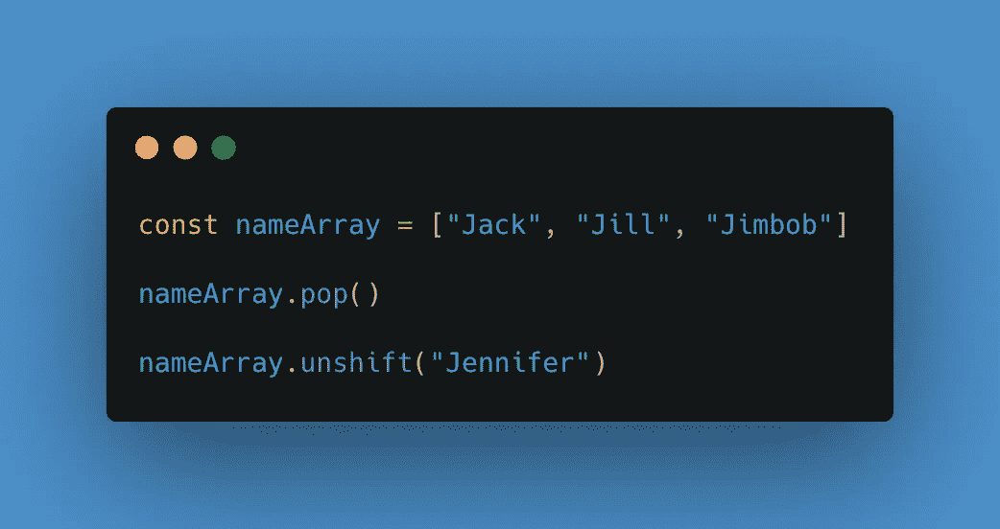
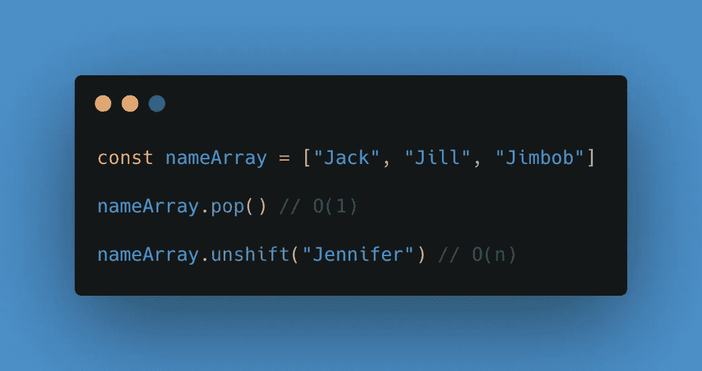
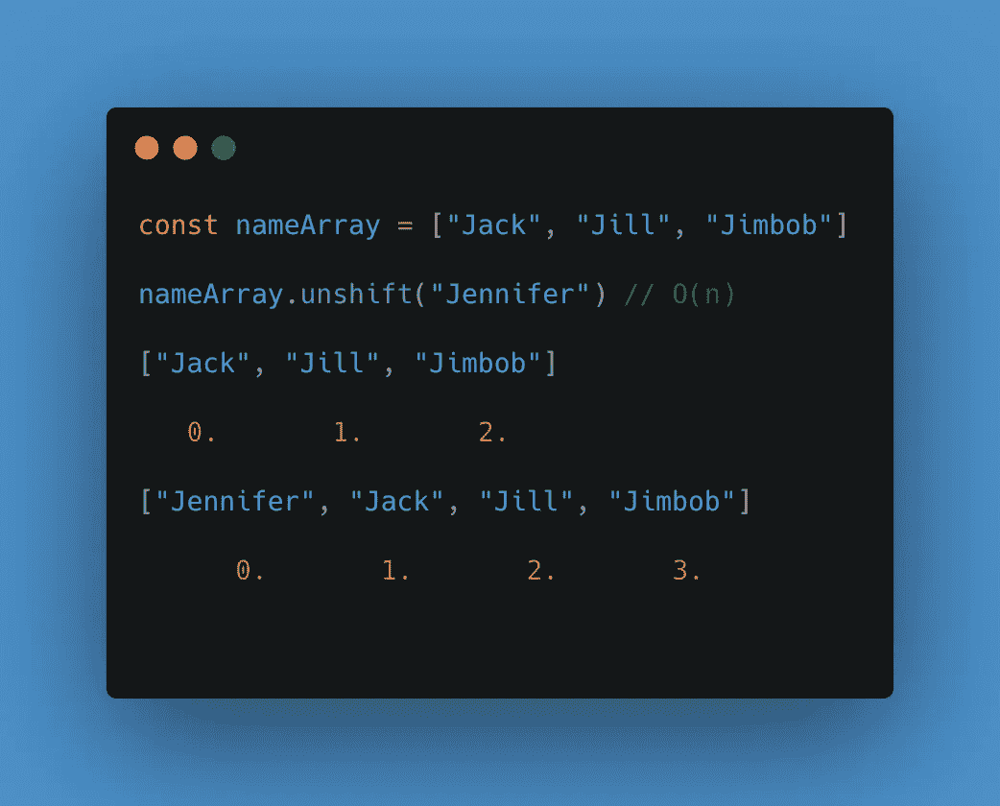
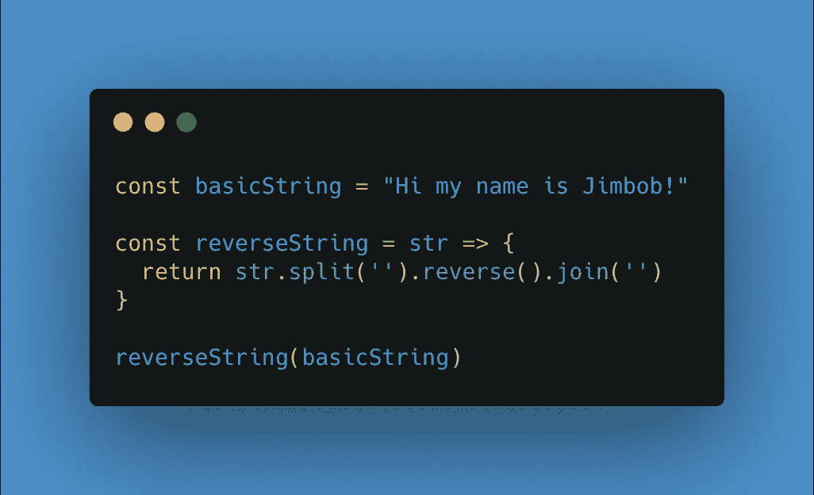

# 数据结构和数组

> 原文：<https://levelup.gitconnected.com/data-structures-and-arrays-dcb0745d2e4f>

首先，什么是数据结构？

它是值的集合，这些值之间可以有关系，并且可以应用函数。每种数据结构都很好，并且专门针对其自身的特定问题，以及快速存储和查找特定数据。

这里可以找到大量的数据结构:[所有的数据结构。](https://en.wikipedia.org/wiki/List_of_data_structures)

然而，只有几个主要的，你真正需要知道的，90%的时间都在使用。它们是:

*   数组
*   大量
*   行列
*   链接列表
*   树
*   努力
*   图表
*   哈希表

请记住，每种语言都有自己的数据结构，表格的例子可以在[这里](https://medium.com/omarelgabrys-blog/data-structures-language-support-5f70f8312e84)找到。但是如果您使用的语言不包含特定的数据结构，不要担心，因为您可以构建一个。例如，如果 Javascript 没有堆栈，您可以构建一个。

**阵列**

数组按顺序组织数据。因此，它们被一个接一个地存储在内存中。数组是最常用的数据结构之一，也是所有数据结构中占用空间最小的一种。

我来自一个编码训练营，我知道什么是数组以及如何使用它们，但是在我之前的博客[这里](/starting-my-big-o-journey-4425081bcb11)中已经学习了大 O 符号的基础知识，我已经意识到简单的内置方法实际上有各种不同的大 O 符号。

以下面这个简单的数组和两个内置的 pop()和 unshift()方法为例:

你认为他们的大 O 是什么？以前，我从来没有想过这个问题，认为…好吧。pop()取数组的最后一个元素，而 unshift 只是在开头插入一个元素。简单…

然而，现在你需要看看这个方法是如何工作的。

为什么？pop()很简单。不管输入的长度是多少，该方法只返回最后一个元素。因此它是不变的。

但是，unshift 会向数组中添加一个元素。但是呢？每次都只是在开头放一个元素，所以它肯定也是常量吗？

这部分是正确的，但是，数组的索引需要改变。因此:

Unshift 需要遍历数组，并为每个元素分配一个新的索引。从之前的博客中我们知道，一个简单的循环函数是 O(n)或线性时间。

这是一个例子，它会让你思考不同类型的数据结构是否更适合添加新元素。

这应该让你对为什么在数组中查找东西速度快 O(1)而在数组中添加东西速度慢 O(n)有一个基本的理解。

让我们用一个数组来解决一个简单的反转字符串的问题。

在这里，我们使用。split()方法。根据 MDN,`**split()**`方法将一个字符串分成有序的子字符串列表，将这些子字符串放入一个数组，然后返回该数组。

然后我们使用。join()方法。“Which”通过连接一个数组中的所有元素(或一个类似于[数组的对象](https://developer.mozilla.org/en-US/docs/Web/JavaScript/Guide/Indexed_collections#Working_with_array-like_objects))创建并返回一个新字符串，用逗号或指定的分隔符字符串分隔。如果数组只有一项，则该项将在不使用分隔符的情况下返回。

这只是使用数组数据结构实现特定输出的一个基本示例。我们将字符串放入一个数组中，然后让我们获得想要的结果。

数组非常适合于快速查找，访问您想要查找的索引，或者添加到数组末尾，或者从数组末尾删除一个元素，它在内存中也是有序的。然而，它对于插入和删除来说很慢，最后，如果你使用静态数组，那么它的大小是固定的。