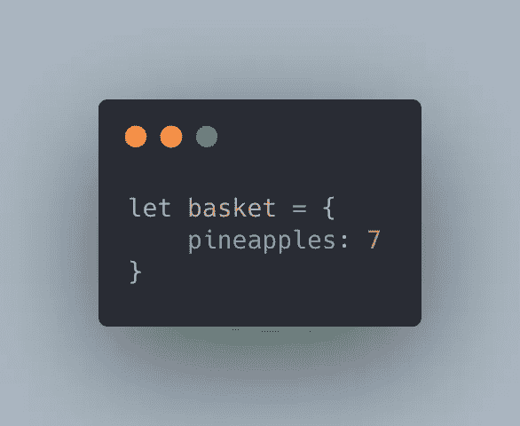
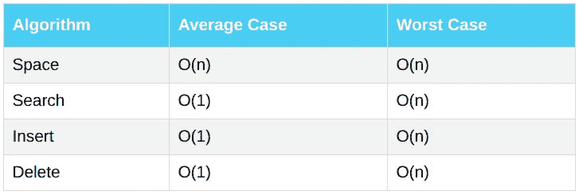
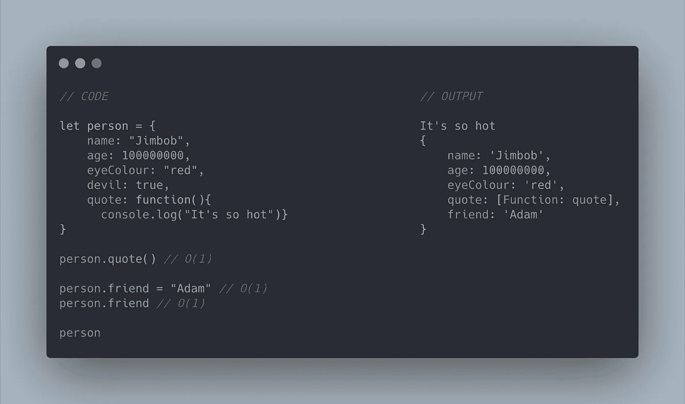
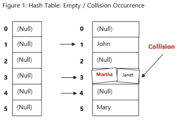
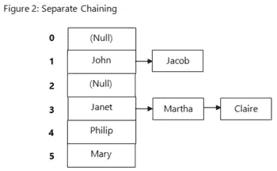

# 数据结构和哈希表

> 原文：<https://levelup.gitconnected.com/data-structures-and-hash-tables-b00ba556b02a>

哈希表或哈希映射或映射或字典或对象。哈希表有许多不同的名称。但它们非常相似，在某些语言中有一些微小的差异。

哈希使用键值对查找。密钥被发送到哈希函数，哈希函数对其执行算术运算。结果(通常称为*哈希值*或*哈希*)是哈希表中键值对的索引。如这里所解释的。【Yourbasic.com 链接】T4。

所以，我们来举个例子。如果你有一个购物篮，想在里面放 7 个菠萝。这对于数组来说有点困难，因为数组只存储索引和项，但是哈希表允许你存储项和值。例如，您可以将条目(菠萝)作为键，将数字 7 作为值。

从简单开始。

现在让我们看看 hash/objects 可以执行的函数的大 O 符号，以及它们可以多快地执行它们的功能。哈希表提供了高效的**查找**、**插入**和**删除**操作的组合。

不同数据结构的更完整表格可在此处找到[。](https://www.bigocheatsheet.com/)

使用哈希表或对象来插入或删除数据具有很大的 O(1)值。这是因为哈希表是无序的，所以当删除或添加数据时，其余的键/值对索引不需要更改。

当使用散列表进行搜索时，我们只是使用关键字来找到我们要找的东西，我们不需要遍历每个配对来找到它。

现在，使用散列表有优点也有缺点。其中一个缺点叫做碰撞。

我们的计算机系统空间有限，所以当我们创建哈希表时，系统会决定分配多少空间。哈希函数不会平均分配我们的数据，直到所有东西都满了。这意味着系统中相同的地址位置可以分配给许多不同的键/值对。

使用哈希表，你不能总是避免冲突，因为有足够的数据和有限的内存，我们总是会有它们。

碰撞降低了我们访问、插入或删除信息的能力。因此，理论上，当你有一个冲突时，大 O 符号变成 O(n/k ),其中 k 代表你的哈希表的大小。但由于大 O 的四个法则，我们简化为 O(n)。

***有趣的事实。*** *多少人要在一个房间里，两个人同一天生日的概率是 100%？答案:366。因为一年有 365 天，你只需要多一个人就可以保证穿越！但是，要有 50%的概率，房间里需要多少人？*

*答案只有 23。这是碰撞是多么容易的一个好概念！要了解更多，请点击这里查看 geeksforgeeks 上的生日悖论。*

有几种常见的处理冲突的方法，一种是 ***用链表*** 分开链接，我们将在下一篇博客中讨论，另一种是 ***开放寻址。*** 还有许多其他处理冲突的方法，可以在维基百科页面的[冲突解决下找到。](https://en.wikipedia.org/wiki/Hash_table#Collision_resolution)

**分离链接**被定义为“一种方法，当冲突发生时，通过该方法与哈希表中的每个位置相关联地构建值的链接列表。”[Study.com 链接](https://study.com/academy/lesson/separate-chaining-concept-advantages-disadvantages.html#:~:text=The%20concept%20of%20separate%20chaining,by%20the%20same%20hash%20function.)

所以代替这个的是:

我们得到这个:

哈希表/对象等。非常有用，可能是最常见的面试问题之一，你可以使用哈希表来优化你的函数。例如，您可能有一个函数，其中有一个循环中的循环，因此有一个 O(n)的大 O。通过使用哈希表，你可以使你的函数更有效，并减少大的 O 到 O(n)。

它们有利于快速查找(假设您有良好的冲突解决方案，尽管有些语言确实在幕后处理这个问题)、快速插入和灵活的键(取决于哈希表的类型，如 Javascript 中的映射)。

缺点是，它们是无序的，很难按顺序遍历所有的内容，如果你想获取所有的键，你必须遍历整个内存空间。

哈希表和数组是两种最常见的数据结构，我强烈建议在需要使用它们的时候使用它们。如果你对这个概念很陌生。我在 Codewars 上练习，在那里我会得到一个在循环中使用复杂循环的答案。然而，通过学习 Big O 的基础知识，我明白这不是一个有效或高效的函数，然后我会花时间将函数中的数据重新组织到哈希表中。

祝你好运！