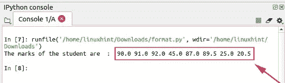
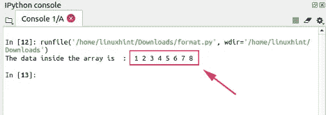
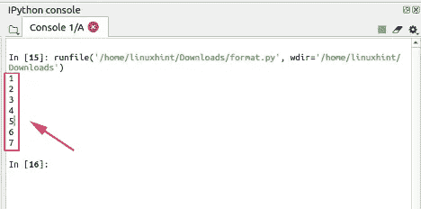
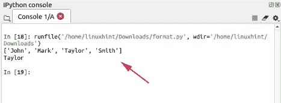
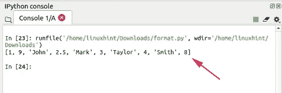
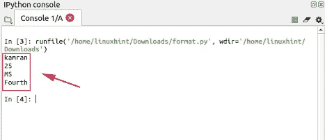
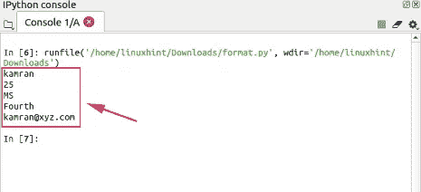
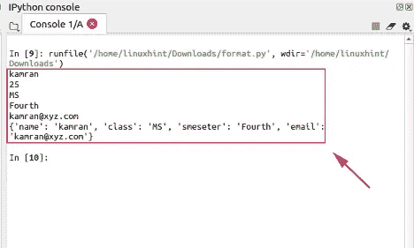
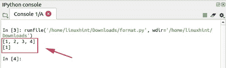
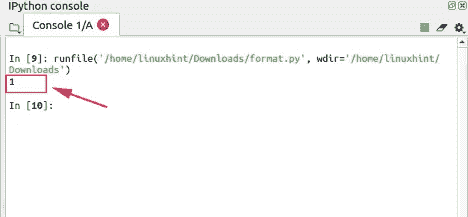

# 数据结构和 Python

> 原文：<https://levelup.gitconnected.com/data-structures-and-python-f0a220a616b8>

## 如何使用我们最喜欢的编程语言处理最流行的数据结构


莎伦·麦卡琴在 [Unsplash](https://unsplash.com/s/photos/knowledge?utm_source=unsplash&utm_medium=referral&utm_content=creditCopyText) 上的照片

数据结构是编程中最重要和最基本的概念之一。数据结构用于保存应用程序中的数据。

在设计和开发阶段，数据管理是所有软件系统和应用程序的重要任务。我们几乎可以在任何我们能想到的地方找到数据结构的应用。例如，如果我们正在构建一个学生管理系统，并希望将数据存储在应用程序中，我们将使用数据结构来实现这一目的。

数据结构帮助我们以更好的方式有效地组织数据。数据结构的使用使我们的程序更快更有效。就数据结构而言，Python 是最高效的编程语言。

与其他编程语言相比，Python 更有效、更容易地支持基本数据结构。我们将通过简单的例子学习使用数据结构。

如果你想从总体上了解更多关于数据结构的知识，以及它们在概念上是如何工作的，可以看看我写的关于 8 种基本数据结构的文章。

# **Python 中的数据结构**

编程中使用的数据结构有多种类型。一些数据结构是线性的，一些是非线性的。

线性数据结构遵循序列并顺序存储数据，而非线性数据结构不遵循任何结构。线性数据结构的常见例子是数组、链表和堆栈。

最著名和最常见的非线性数据结构是图、树和堆。数组、链表、队列、栈、图和树是最常见和最广泛使用的数据结构。

Python 也有一些特定的数据结构，如列表、元组和字典。

数组、列表、哈希表、链表和队列是 Python 中最常用的数据结构。让我们分别讨论一下 Python 中的这些数据结构。

# **数组数据结构**

数组用于顺序存储数据。几乎每种编程语言都提供了使用数组的便利。数组将相似类型的数据存储在一个容器中，稍后通过索引号访问数据。索引主要是存储项在数组中的位置。我们可以把数组想象成一个容器，里面有多个盒子按顺序排列。每个盒子存储一个特定的值。特定盒子的编号可以通过序列来识别。首先放置的盒子在第一个数字处，以此类推。Python 中的数组由数组模块支撑。相似类型的数据可以保存在一个数组中。数据不能是异类类型。

在创建或定义数组时，这意味着我们还想为它定义一个合适的数据类型。

让我们创建一个学生数组来存储学生的分数。数组索引值从 0 开始。

```
import array as arr# creating a float type array
marks = arr.array(‘d’, [90,91,92,45,87,89.5,25,20.5])# printing the array
print ("The marks of the student are  : ", end =" ")#using for loop to access the array indexes
for i in range (0, 8):
    #accessing the data stored at every index by using iterator i
    print (marks[i], end =" ")
```

**输出**

输出显示存储在数组中的数据。range 函数的参数是 0 和 8。这意味着应该从索引 0 到 8 提取数组中的数据。



```
import array as arr 
# creating an array of integer type 
num = arr.array('i', [1,2,3,4,5,6,7,8,9])# printing the array 
print ("The data inside the array is  : ", end =" ") #using for loop to access the array indexes
for i in range (0, 8): 
    #accessing the data stored at every index by using iterator i
    print (num[i], end =" ")
```

**输出**



我们也可以通过使用[]来访问数组的细节。它只会从指定的索引中返回一个条目。

```
import array as arr 
# creating an array of integer type 
num = arr.array('i', [1,2,3,4,5,6,7,8,9])# accessing the first element of array
print(num[0])
# accessing the second element of array
print(num[1])
# accessing the third element of array
print(num[2])
# accessing the fourth element of array
print(num[3])
# accessing the fifth element of array
print(num[4])
# accessing the sixth element of array
print(num[5])
# accessing the seventh element of array
print(num[6])
```

**输出**



# **列表**

列表是 Python 中最基本和最常用的数据结构之一。List 以有序的方式存储数据，它可以包含多种类型(整数、浮点、字符串)的数据。

我们可以使用方括号“[]”在 python 中正式创建一个列表。列表和数组的根本区别在于数组是静态的，而列表是一种动态数据结构。

一旦数组被声明和初始化，我们就不能在运行时将数据添加到数组中。另一方面，在列表中，数据可以动态添加。我们可以很容易地访问列表中的任何索引。

让我们创建一个 Python 列表。

```
#creating a list
students=["John","Mark","Taylor","Smith"]
#prinitng the list
print(students)
#accessing the specific index of list
print(students[2])
```

**输出**



让我们声明一个多类型的列表，并在声明和初始化列表后向列表中插入一些数据。append()函数将数据放在文件的末尾，但不会删除已经存在的数据。insert()函数将数据放在程序员给定的特定索引处。

```
#creating a list
students=[1,"John",2.5,"Mark",3,"Taylor",4,"Smith"]#appending the list
students.append(8)#inserting the number 9 at position 1
students.insert(1,9)#prinitng the list
print(students)
```

**输出**



# **哈希表**

哈希表是数据结构的重要类型之一。它使我们搜索数据更快。哈希表包含特定形式的键值对数据。关键是索引值。每种类型数据的索引值是不同的。因此，基于唯一索引值搜索数据更快更容易。同样，在哈希表中插入和删除数据也是一个更快的操作，因为索引值变成了键。

在 Python 中，哈希表的实现非常简单明了。哈希表是使用 Python 中的字典数据类型实现的。dictionary 数据类型以键值对的形式存储数据。在创建数据字典时，我们首先创建键，然后定义值。让我们使用数据字典数据类型在 Python 中创建一个散列表。我们正在创建一个学生的数据字典来存储学生的信息。在给定的示例中，姓名、年龄、班级和学期是关键字或索引值。

```
#declaring a hash table or data dictionary for student
student_dict={'name':'kamran','age':25,'class':'MS','smeseter':'Fourth'}#the data is accessed by using the key 
#printing the name of student
print(student_dict['name'])#printing the age of student
print(student_dict['age'])#printing the class of student
print(student_dict['class'])#printing the smeseter of student
print(student_dict['smeseter'])
```

输出



使用键可以很容易地访问该值。该键在一对方括号[]中指定，它返回值。

我们可以通过添加一个键值对来轻松地更新字典。让我们添加学生电子邮件。

```
#declaring a hash table or data dictionary for student
student_dict={'name':'kamran','age':25,'class':'MS','smeseter':'Fourth'}#the data is accessed by using the key 
#printing the name of student
print(student_dict['name'])#printing the age of student
print(student_dict['age'])#printing the class of student
print(student_dict['class'])#printing the smeseter of student
print(student_dict['smeseter'])#updating the dictionary
#adding new key value pair for email
student_dict['email'] = '[kamran@xyz.com](mailto:kamran@xyz.com)'#printing the student email
print(student_dict['email'])
```

**输出**



同样，我们可以使用 del 关键字从字典中删除数据。让我们删除年龄键值对。#为学生声明哈希表或数据字典

```
#declaring a hash table or data dictionary for student
student_dict={'name':'kamran','age':25,'class':'MS','smeseter':'Fourth'}#the data is accessed by using the key 
#printing the name of student
print(student_dict['name'])#printing the age of student
print(student_dict['age'])#printing the class of student
print(student_dict['class'])#printing the smeseter of student
print(student_dict['smeseter'])#updating the dictionary
#adding new key value pair for email
student_dict['email'] = '[kamran@xyz.com](mailto:kamran@xyz.com)'#printing the student email
print(student_dict['email'])#deleting age value
del student_dict['age']#printing the whole dictionary
print(student_dict)
```

**输出**
在输出中可以观察到年龄键值对被删除。



# **Python 中的队列**

队列是一种数据结构。它是线性数据结构的一种形式。队列根据先进先出的原则执行任务，也称为 FIFO。在队列中，数据项按顺序存储。

先放入的数据先送出。我们可以在日常生活中找到队列的应用。想象一下在任何一家银行或任何一个市场外面顾客排的队。首先伸出手的顾客将首先得到服务。最后来的顾客占据了队伍的最后一个位置。

我们可以使用队列来执行以下操作:

1.  **入队:入队操作将元素添加到队列中。**
2.  **出列:出列元素从队列中删除项目。**

Python 中的队列是使用 list 数据类型实现的。上面已经详细讨论了列表数据结构。现在让我们使用列表来形成队列。让我们编写一个简单的 Python 程序，通过使用 list 数据结构来实现 queue。append()函数用于将数据排入列表，而 pop()函数执行出队操作。元素将按照它们被放入的相同顺序被消除。

```
#declaring the queue
que = []#adding the data in queue.
que.append(1)
que.append(2)
que.append(3)
que.append(4)#printing the elements of
print(que)#removing the elements from que
que.pop()
que.pop()
que.pop()#printing the queue
print(que)
```

**输出**



# **链表**

链表是一种数据结构，它包含序列中的数据元素。链表是一种动态数据结构。与数组不同，我们不需要在创建时指定链表的大小。

链表中的数据存储在一个数据元素与另一个数据元素有联系的序列中。链表是使用 node 类实现的。Python 没有提供实现链表的内置数据类型或机制。我们创建节点类，然后用 Python 实现链表。一个节点包含数据和指向下一个节点的指针。

第一个节点称为头部，最后一个节点不包含任何其他节点的引用或指针。

该节点在一个单独的类中创建，并在另一个类中访问，该类通常称为链表类。让我们写一个简单的程序来理解链表的用法。

```
#create a node class
class Node: 

    # initializing the node object with data and the next node 
    def __init__(self, data): 
        self.data = data  
        self.next = None   

# creating the linked list class
class Linked_List: 

    # Initilizing the fisrt node (head) 
    def __init__(self): 
        self.head_node = None

  # printing the linked list
    def print_Linked_List(self): 
        temp_node = self.head 
        while (temp_node): 
            print (temp_node.data) 
            temp_node = temp_node.next

# declaring the mnain function 
if __name__=='__main__': 

    # Start with the empty list 
    linkedlist = Linked_List() 
    #declaring the first node as a head node
    linkedlist.head = Node(1) 
    #creating another node
    second_node = Node(2) 
    #creating the reference of second node with the head
    linkedlist.head.nex=second_node
    linkedlist.print_Linked_List()
```

**输出**

链表创建成功。输出显示节点的值。



# **结论**

数据结构是计算机科学和编程语言的基础。数据结构是存储和组织数据的有效机制。Python 支持所有类型的数据结构。然而，它有一些特定的数据结构，如列表、字典和元组。这些指定的数据结构用于各种目的，即用于组织数据和保存数据。本文用例子解释了 Python 中的数据结构。

本文由 Juan Cruz Martinez(Twitter:[@ bajcmartinez](https://twitter.com/bajcmartinez))撰写， [Live Code Stream 创始人兼发行人，](https://livecodestream.dev/)企业家、开发者、作者、演说家、实干家。