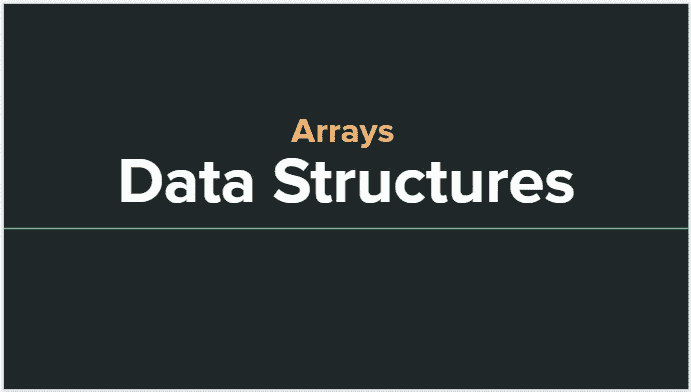
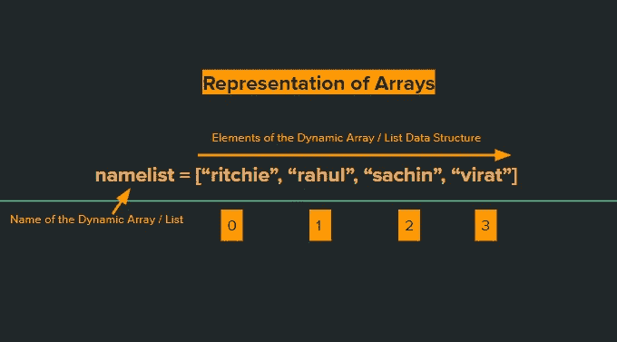
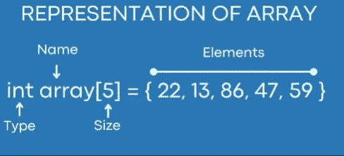
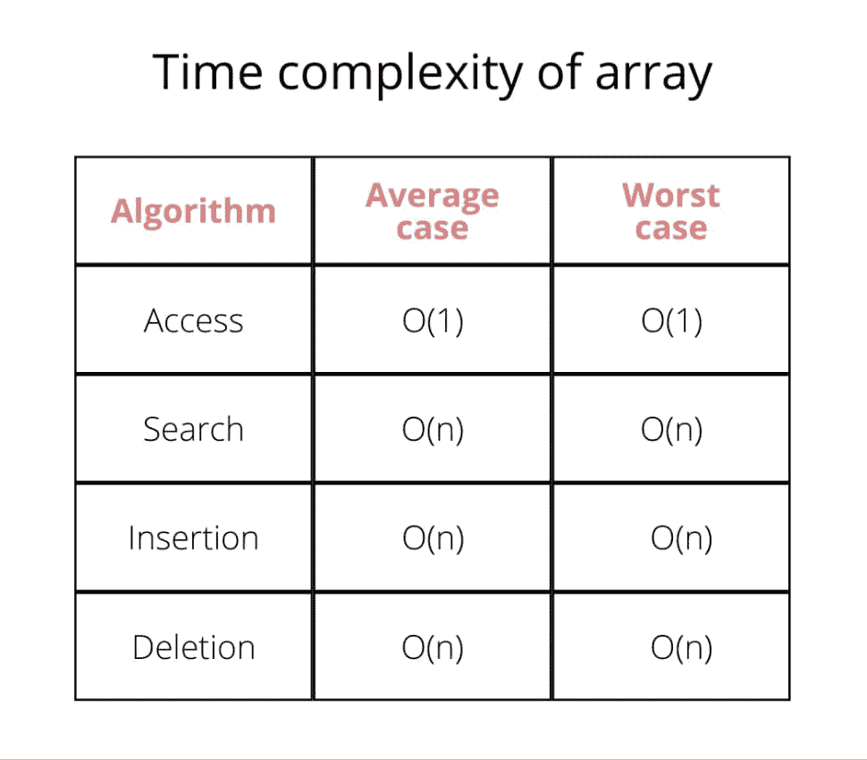
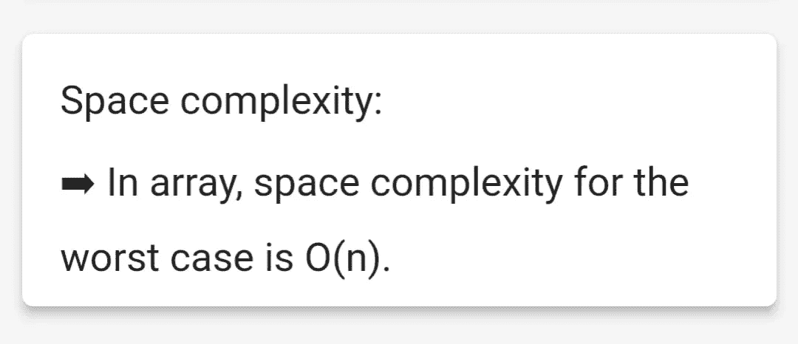

# 数据结构:数组

> 原文：<https://levelup.gitconnected.com/data-structures-arrays-e9925add4ff3>

欢迎回来！在我们之前的文章中，我们研究了数据结构的[基础。在本文中，我们将更进一步，查看我们系列中第一个数据结构的详细视图。所以，不多说了，让我们开始吧😁](https://ritchiepulikottil.medium.com/data-structures-overview-13ac8a02a880)



# 什么是数组？

➤相似类型数据项的顺序集合通常称为数组。

➤每个数据项称为数组的一个元素。

➤元素的数据类型可以是任何有效的数据类型，如 char、int、float 或 double。

➤数组可以是一维、二维或多维的。

# 数组的表示形式

➤数组可以用不同的编程语言来表示。

➤在这里，我们将遵循 Python 编程语言。

➤:虽然 Python 不能展示某些数据结构的真正本质，但我会尽力在这里说明它。

➤:回到数组，基本上有两种类型的数组:静态数组和动态数组。

➤静态数组是一种固定大小的数组数据结构。你可以手动选择这个大小，如果你试图做任何超过这个大小的操作，编程语言就会抛出一个错误。此外，与动态数组不同，它通常包含相似数据类型的元素。

➤:动态数组更像是一个可增长的数组或可自动调整大小的数组。如果你试图做任何超过数组大小的操作，编程语言不会抛出错误。与静态数组不同，它可以包含不同数据类型的元素。

➤静态数组出现在 c、C++等低级语言中，通常对内存管理有好处。静态数组通常提供对数据结构及其操作的手动和完全控制。

➤动态数组可以在 Python，GoLang 等高级语言中找到，它们实现起来更容易更快，编程语言负责内存管理和数据结构周围的一切，你不需要这样做。

➤:我在解释不同类型的数组，因为我们将在这篇文章中遵循 Python 编程语言，我想让你知道，我们将主要处理动态数组！我还将举例说明如何在 Python 中激活静态数组的技巧，所以振作起来:)

➤在 Python 中，列表是我们认为是数组的数据结构，它本质上是动态的。



➤正如你在上图的 Python 列表数据结构(动态数组)声明中看到的，有几点你必须注意。

➤:首先，指数从 0 开始。我希望你熟悉索引，如果你是初学者，索引不过是，让我们为数组中的每一个元素指定一个 ID，它从 0 开始。数组中的第一个元素的索引总是为 0，下一个元素的索引是 1，依此类推...

➤数组中的每个元素都可以用它的索引来访问。例如， **print(namelist[0])** ，将打印“**里奇**”作为输出。

➤，我希望你现在对动态数组有点熟悉了。此后，由于我们使用 Python，我将把它称为列表数据结构。

➤:但是静态数组呢，里奇？好吧，那我们也来看看。让我们暂时跳到 C 语言，zooooppp



上图所示的➤静态数组与动态数组非常相似，只是它需要用户手动设置一个固定的大小，而编程语言不允许它超过这个特定的大小。

以➤为例，如果你仔细观察，上面的数组是用固定的大小和数据类型定义的。上面定义的静态数组的大小固定为“5 ”,数据类型为“int”。因此，如果您试图添加另一个元素，超过从 5 到 6 的大小，或者如果您试图添加另一个不是整数的元素，编程语言就会抛出错误。

➤简而言之，上面的静态数组只能存储 5 个整数数据类型的元素。

# 数组的运算

正如我在我的[上一篇文章](/data-structures-overview-13ac8a02a880)中已经提到的，每个数据结构都可以执行各种操作，然而，我们将只研究下面提到的主要操作:

## 横越

该操作用于打印数组的元素。

## 插入

该操作用于在特定索引处插入一个元素。

## 删除

该操作用于从特定索引中删除一个元素。

## 搜索

该操作用于使用给定的索引或值搜索元素。

## 更新

该操作用于更新特定索引处的元素。

***放心吧！在文章的最后，我将提供上述所有操作的编程代码。现在，让我们先完成理论部分:)***

# 数组的属性

通常当你提到一个数组时，我们倾向于看它的底层。所以当有人问你一个数组时，默认情况下，它通常是一个静态数组。这只是一个小小的观察，在今天这个时代，这并不重要，您可以根据您的使用案例和兴趣来选择您的阵列。

## 通常，数组具有以下属性:

➤静态数组大小固定，存储相似数据类型的元素。

➤动态数组本质上是可调整大小的、非限制性的和动态的。

➤元素存储在连续的内存块中。

➤数组中存储的第一个元素是最小的内存位置。

➤数组使用数字索引。

➤数组索引从 0 开始，以(数组的大小)-1 结束。

➤数组可以是动态的，也可以是静态的。

可以使用数组的索引来访问数组的➤元素。

➤计算数组中每个元素的地址，使用了基地址和给定数据元素的大小。

# 需要使用数组

例如，如果您被指派存储公司所有员工的姓名，这将需要大量的变量。首先，很难为每个员工创建变量，其次，也很难记住变量的名称。在这种情况下，最好的做法是定义一个数组并在其中存储所有的元素，而不是用不同的名称命名所有的变量！

# 数组的复杂度



# 阵列的优势

➤静态数组具有固定的大小，并且只存储特定数据类型的元素，这使得它们更有内存效率和意识。您还可以比动态数组更好地控制静态数组。

另一方面，➤动态数组更容易使用。它是可调整大小的，没有任何内存/数据类型限制，本质上是动态的。

➤当处理大量的元素时，静态数组比动态数组使用更少的内存，有时执行速度也比动态数组快。

➤数组通常用于处理元素集合。例如，正如我们已经讨论过的，如果您需要存储公司中员工的姓名，那么为他们每个人创建变量名将会非常困难。在这种情况下，数组获胜。

可以使用索引直接访问数组中的➤元素。

➤遍历在一个数组中是非常容易的。

➤你可以在一个数组中执行各种操作。

# 数组的内存分配

数组的➤数据元素连续存储在主存储器中。

➤数组的名称代表基地址。

➤基地址也代表第一个元素的地址。

➤计算数组中每个元素的地址，使用了基地址和给定数据元素的大小。

➤数组中的每个元素都由一个索引号来表示。

➤ 0(从零开始的索引)是指数组的第一个元素。

➤ 1(从 1 开始的索引)引用数组的第二个元素。

➤类似地，n(以 n 为基数的索引)是指数组中的每隔一个元素，其中“n”是一个整数。

> ***编程代码段***

## 数组的语法

```
# PYTHON
name_list = ["richie", "sachin", "virat", "yuvraj"]
```

```
//C LANGUAGE
char name_array[4] = {"ritchie", "sachin", "virat", "yuvraj"}
```

```
//JavaScript
let name_array = ["ritchie", "sachin", "virat", "yuvraj"]
```

```
//Java
String[] name_array = {"ritchie", "sachin", "virat", "yuvraj"}
```

```
//PHP
$name_array = array("ritchie", "sachin", "virat", "yuvraj")
```

## 访问数组中的元素

```
 name_list = ["ritchie", "sachin", "virat", "yuvraj"]
print(name_list[2])

#OUTPUT: virat
```

## **数组的遍历操作**

```
name_list = ["ritchie", "sachin", "virat", "yuvraj"]
print("//The Elements of the Array are//")
for i in range(len(name_list)-1):
  print(name_list[i])
print("//Reached end of ther Array//")
```

## 数组的插入操作

```
name_list = ["ritchie", "sachin", "virat", "yuvraj"]
print("//Array elements before insertion//")
print(*name_list)
name_list.insert(2, "alien")
print("//Array elements after insertion//")
print(*name_list)

#Inserting elements towards the end of the Array is called as appending
name_list = ["ritchie", "sachin", "virat", "yuvraj"]
print("//Array elements before appending//")
print(*name_list)
name_list.append("alien")
print("//Array elements after appending//")
print(*name_list)

#Inserting multiple elements at the end of the Array is called as extending
#Elements to be inserted via extending must be given as a List
name_list = ["ritchie", "sachin", "virat", "yuvraj"]
print("//Array elements before extending//")
print(*name_list)
name_list.extend(["alien", "spiderman", "jeff bezoz"])
print("//Array elements after extending//")
print(*name_list)
```

## 数组删除操作

```
name_list = ["ritchie", "sachin", "virat", "yuvraj"]
print("//Array elements before deletion//")
print(*name_list)
name_list.remove("ritchie")
print("//Array elements after deletion//")
print(*name_list)

#Deleting elements towards the end of the Array is called as popping
name_list = ["ritchie", "sachin", "virat", "yuvraj"]
print("//Array elements before popping//")
print(*name_list)
name_list.pop()
print("//Array elements after popping//")
print(*name_list)

#BONUS (confusion alert!!)
#Pop can also be used to remove elements using index
name_list = ["ritchie", "sachin", "virat", "yuvraj"]
print("//Array elements before popping index//")
print(*name_list)
name_list.pop(1)
print("//Array elements after popping index//")
print(*name_list)
```

## 数组的搜索操作

```
name_list = ["ritchie", "sachin", "virat", "yuvraj"]
find = input("Enter the item to be searched: ")
count=0
for i in name_list:
  if i == find:
    print("element found")
    count=1
    break
if count == 0:
  print("element not found")

#alternate solution (better in terms of complexity)
name_list = ["ritchie", "sachin", "virat", "yuvraj"]
find = input("Enter the item to be searched: ")
if find in name_list:
  print("element found")
else:
  print("element not found")

#if you know the index of the element you are searching, then
name_list = ["ritchie", "sachin", "virat", "yuvraj"]
index = int(input("enter the index of the element: "))
if name_list[index]:
  print("element found --> ", name_list[index])
else:
  print("element not found")
```

## 数组的更新操作

```
name_list = ["ritchie", "sachin", "virat", "yuvraj"]
element = input("element to be updated: ")
what = input("updated to what? ")
print("//Array elements before updation//")
print(*name_list)
index= name_list.index(element)
name_list[index]=what
print("//Array elements after updation//")
print(*name_list)
```

## 数组的存取操作

```
 name_list = ["ritchie", "sachin", "virat", "yuvraj"]
index = int(input("enter the index of the element you want to access: "))
print("This is the element you asked for: ", name_list[index])
```

## 数组的清除操作

```
name_list = ["ritchie", "sachin", "virat", "yuvraj"]
print("//Array elements before clearing//")
print(*name_list)
name_list.clear()
print("//Array elements after clearing//")
print(*name_list)
```

## 数组的反向操作

```
name_list = ["ritchie", "sachin", "virat", "yuvraj"]
print("//Array elements before reversing//")
print(*name_list)
name_list.reverse()
print("//Array elements after reversing//")
print(*name_list)
```

## 数组的排序操作

```
 name_list = [123,345346,2,314,4,67]
print("//Array elements before sorting//")
print(*name_list)
name_list.sort()
print("//Array elements after sorting ascending//")
print(*name_list)
name_list.sort(reverse=True)
print("//Array elements after sorting descending//")
print(*name_list)

#or

name_list = [123,345346,2,314,4,67]
print("//Array elements before sorting//")
print(*name_list)
x = sorted(name_list)
print("//Array elements after sorting ascending//")
print(*x)
y = sorted(name_list, reverse=True)
print("//Array elements after sorting descending//")
print(*y)

"""

Difference between sort() and sorted() is that sort() is an Array operation.
Whereas sorted() is more of a common operation for all iterables.

sort() changes the original list, and returns nothing, does not create a copy
sorted() does not change the original list/iterable, but creates a copy
and returns a sorted list.

sort() as already mentioned only works on List @python
sorted() works for all kind of iterables like list, tuple, etc..

sort() can take 2 parameters max i.e key and reverse.
sorted() can take 3 parameters max i.e iterable, key, and reverse

""" 
```

我们讨论了 Python 中几乎所有的列表操作，如果你仍然好奇的话[访问这个链接](https://www.educba.com/list-operations-in-python/):)

## 好处 Python 中主要数组操作的实现

这可能有点奇怪，但是您有没有想过从头开始构建我们上面提到的所有操作？是啊！所有这些操作之前都是由一些极客开发人员硬编码的，所以让我向您展示幕后的主要数组操作。剧透:我将只讲述主要的操作，如果你熟悉 OOPS 就更好了，因为它将会是所有的类和函数:)

```
#Although arrays are pre-defined in Python in the form of lists, we can implement our own arrays.
#Here, we will implement our own array with some common methods such as access, push, pop, insert, delete

class MyArray():
    def __init__(self):
        self.length = 0 #We initialize the array's length to be zero
        self.data = {} #We initialize the data of the array using an empty dictionary. The keys will correspond to the index and the values to the data

    #The attributes of the array class are stored in a dictionary by default.
    #When the __dict__ method is called on an instance of the class it returns the attributes of the class along with their values in a dictionary format
    #Now, when the instance of the class is printed, it returns a class object with its location in memory.
    #But we know when we print the array we get the elements of the array as output
    #When we print the instance of the class, the built-in __str__ method is called. So we can modify the __str__ method inside the class
    #To suit our needs.
    def __str__(self):
       return str(self.__dict__) #This will print the attributes of the array class(length and dsata) in string format when print(array_instance) is executed

    def get(self, index):
        return self.data[index] #This method takes in the index of the element as a parameter and returns the corresponding element in O(1) time.

    def push(self, item):
        self.length += 1
        self.data[self.length - 1] = item #Adds the item provided to the end of the array

    def pop(self):
        last_item = self.data[self.length-1] #Collects the last element
        del self.data[self.length - 1] #Deletes the last element from the array
        self.length -= 1 #Decrements the length attribute of the array by 1
        return last_item #Returns the popped element. O(1) time

    def insert(self, index, item):
        self.length += 1
        for i in range(self.length-1, index, -1):
            self.data[i] = self.data[i-1] #Shifts every element from the index to the end by one place towards right. Thus making space at the specified index
        self.data[index] = item #Adds the element at the given index. O(n) operation

    def delete(self,index):
        for i in range(index, self.length-1):
            self.data[i] = self.data[i+1] #Shifts elements from the given index to the end by one place towards left
        del self.data[self.length - 1] #The last element which remains two times in the array is deleted
        self.length -= 1 #The lenght is decremented by 1\. O(n) operation

arr = MyArray()
arr.push(6)
#{'length': 1, 'data': {0: 6}}

arr.push(2)
#{'length': 2, 'data': {0: 6, 1: 2}}

arr.push(9)
#{'length': 3, 'data': {0: 6, 1: 2, 2: 9}}

arr.pop()
#{'length': 2, 'data': {0: 6, 1: 2}}

arr.push(45)
arr.push(12)
arr.push(67)
#{'length': 5, 'data': {0: 6, 1: 2, 2: 45, 3: 12, 4: 67}}

arr.insert(3,10)
#{'length': 6, 'data': {0: 6, 1: 2, 2: 45, 3: 10, 4: 12, 5: 67}}

arr.delete(4)
#{'length': 5, 'data': {0: 6, 1: 2, 2: 45, 3: 10, 4: 67}}

print(arr.get(1))
#2

print(arr)
#The outputs given after each function call are the outputs obtained by calling print(arr) and not by the function calls themselves
```

## 额外收获 2:用 Python 实现静态数组

```
#As promised before here is an implementation of static arrays in Python like C
#Python being a high level language does not have static arrays by default
#Although we can import array package and make it happen :)

# importing "array" for array creations
import array as arr

# creating an array with integer type
a = arr.array('i', [1, 2, 3])

# printing original array
print ("The new created array is : ", end =" ")
for i in range (0, 3):
    print (a[i], end =" ")
print()

# creating an array with double type
b = arr.array('d', [2.5, 3.2, 3.3])

# printing original array
print ("The new created array is : ", end =" ")
for i in range (0, 3):
    print (b[i], end =" ")
```

至此，我们已经详细介绍了数组数据结构。希望它对初学者友好，并且对你有所帮助。好吧，让我们在另一篇深入探讨 DSA 的文章中再见吧。在那之前保重:)

**❖** [***下一条 DSA***](https://ritchiepulikottil.github.io/mnc.github.io/)

**❖** [***往期 DSA 文章***](https://medium.com/@ritchiepulikottil/data-structures-overview-13ac8a02a880)

❖ [*GitHub*](https://github.com/ritchiepulikottil)

❖ [*领英*](https://www.linkedin.com/in/ritchie-pulikottil-6876341aa/)

❖ [*Youtube*](https://heylink.me/rp1/)

❖ [*接我*](https://ritchiepulikottil.netlify.app/) *！*