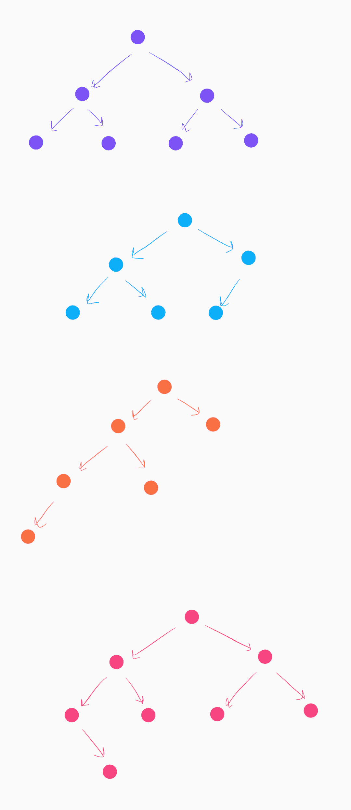
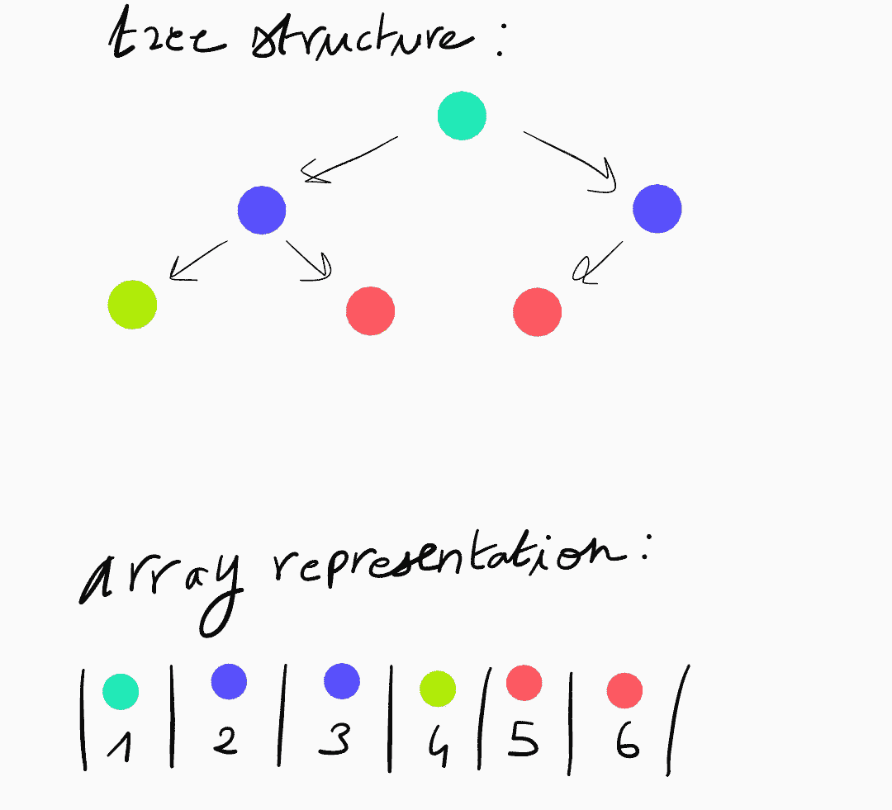
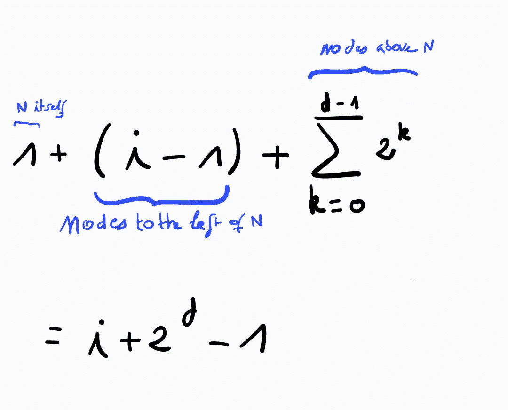
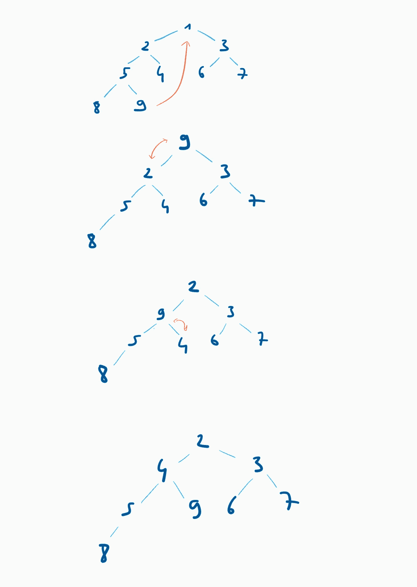

# 数据结构:堆以及如何实现它们

> 原文：<https://levelup.gitconnected.com/data-structures-heaps-and-how-to-implement-them-f7c3a0479f82>

本文介绍了堆，并展示了如何在 C++中实现它们以及它们支持的基本操作。

马库斯·斯皮斯克在 [Unsplash](https://unsplash.com?utm_source=medium&utm_medium=referral) 上的照片

# 动机

堆的目标是以优化以下操作的方式存储有序类型的元素:

*   访问并移除最小元素；
*   插入新元素；
*   移除元素。

许多经典算法可以使用堆来实现，比如 Dijkstra 的最短路径算法和 Huffman 代码。

# 结构实现

我们将堆实现为*近乎完整的二叉树*。非正式地(我们将满足于一个非正式的定义)，如果每一个深度级别都被完全填充，一个二叉树被称为*接近完全*，除了最底层，所有的节点都被分组在左边。

在上图中，紫色的树和蓝色的树都接近完成(紫色的树甚至*完成*！)但是橘子树和红树不是。因为倒数第二层没有填满，所以桔子树还没有完成。因为最后一级的节点没有被分组到左边，所以红树还没有接近完成。

几乎完全二叉树的一个优点是，它们的特点是节点排序良好、实用且易于存储。更准确地说，每一棵近乎完整的二叉树都可以表示为一个节点数组，其中包含了该树的所有信息。这种数组是通过从上到下、从左到右一个接一个地追加所有节点来构建的。这是一个近乎完整的二叉树及其数组表示的例子。

请注意，数组的索引集从 1 开始。我们稍后会看到为什么这很重要。

使用近乎完整的二叉树的数组表示和节点数量，我们可以检查索引 *i* 处的节点是否有父节点、左子节点和右子节点，如果有，则找到其索引。所有这些都需要持续的时间。

假设我们想找到某个节点 *N* 的左子节点，也就是深度 *d* 的第 *i* 个节点(从左到右编号)，假设它存在。我们首先计算节点在数组中的位置:

现在我们需要遍历数组的所有元素，直到找到 *N* 的左子元素。首先，我们消耗 n 右边的节点:有(2^d)-i 节点。因为 N 有一个左孩子，根据几乎完全二叉树的定义，我们知道 N 左边的每个节点(总共 i-1 个节点)都有两个孩子。因此，我们必须经过 2(i-1)个额外的节点。n 的左孩子位于下一个索引，即索引 i+(2^d)-1+(2^d)-i+2(i-1)+1 = 2 *(2^d+i-1).

总而言之，我们可以说，如果 *N* 位于索引 *k* 处，并且树中有 *n* 个节点，则:

*   如果 2 *k* ≤ n，那么 *N* 有一个左子，它位于索引 2*k*；
*   否则， *N* 没有左子。

该属性使得能够找到第 *k* 个节点的右子节点和父节点的索引:

*   如果 2 *k* + 1 ≤ *n* 那么 *N* 有一个右子，在索引 2*k*+1；
*   如果 2 *k* + 1 > n 那么它没有右子；
*   如果 *k* = 1 那么它没有双亲(显然！) ;
*   如果 *k*

近完全二叉树的另一个优点是，其高度的增长速度与其大小的对数一样快，即*h*=θ(*n*)，其中 *h* 是高度， *n* 是节点数。

考虑到这一点，我们可以定义一个结构 *Heap* ，它包含一个表示树的向量、一个包含树的大小的整数以及访问给定索引的节点的父节点和子节点的函数。

如果我们想在堆中存储`n`值，那么数组将至少包含`n+1`个元素:`array[0]`是未使用的，`array[1]`到`array[n]`是接近完整的二叉树的表示。其他元素， *k* > *n* 的`array[k]`没有使用。

我们使用标准库中的类`optional`来返回父节点或子节点的值(如果存在的话),以及一个指示符(如果存在的话，指示节点`i`没有父节点、没有左子节点或右子节点)。

# 查找并删除最小值

为了实现一个堆，我们希望我们将要使用的树满足一个额外的属性，我们称之为*堆属性*。它声明除了根之外的每个节点 *N* 的父节点必须小于或等于 *N* 。换句话说，树必须相对于祖先关系增加*:如果包含 *N* 的节点是包含 *M* 的节点的祖先，那么 *N* ≤ *M* 。*

根据堆属性，节点集的最小元素总是根。这允许我们在常数时间内执行`min-peek`，简单地通过索引访问数组的元素。

下面是我们用来删除最小值的算法的粗略描述:

*   用树中的最后一个元素替换树根；
*   当最后一个元素至少有一个子元素并且大于它的一个子元素时，将其与其最小的子元素交换。

下图显示了该算法执行过程中堆的配置。

该算法相对于堆的高度以线性时间运行，即相对于堆中元素的数量以对数时间运行。

为了在 C++中实现它，我们从定义函数`rearrangeDown`开始，该函数获取一个节点的索引，并在适当的时候将其与其最小的子节点交换(即，如果它还没有小于它的子节点)。它返回输入节点的新位置。

`m`表示位置`i`的节点、其左子节点(如果有)及其右子节点(如果有)之间的最小值。

如果`i`有两个子节点`X`和`Y`，并且根在`X`和`Y`的树都满足堆属性，那么可以证明在执行`i = rearrangeDown(i)`到`rearrangeDown(i) == i`之后根在`i`的树也满足堆属性。

我们现在如下实现`pop`:

# 插入元素

插入和删除非常相似。这一次，我们将使用一个子程序`rearrangeUp`,如果它能够维护堆属性，就将一个节点与其父节点交换。它的实现类似于`rearrangeDown`，除了只有一个值与节点进行比较。

我们可以用这个程序来实现`insert`。

# 使肥胖

我们可以使用`insert`在线性时间内将一个未排序的列表变成一个堆(复杂度可以利用以下事实推导出来:log( *k* ) for *k* 范围在 1 和 *n* 之间，即 log( *n* )！)，渐近等价于 *n* log( *n* ))。但是我们可以做得更好！本节展示了如何实现过程 *heapify* ，该过程在线性时间内将一个列表变成一个堆(相对于列表的长度)。

## 算法

先说个例子。考虑下面这个近乎完整的二叉树。树叶显然是成堆的根。如果我们想要填充的链表长度为 *n* ，那么节点 *k* 是一个叶子当且仅当 2*k*n，即当且仅当 *k* ≥ *n* /2 + 1(其中 *n* /2 指欧几里德除法)。

我们想让每隔一个节点成为一个堆的根。先说 3。3 小于 6，因此(3，6)满足堆属性。

移动到 4 楼。4 大于它的一个孩子(都是！)，所以我们跟它最小的孩子交换。4 现在是叶子，所以确实是堆的根。因为以 2 为根的树和以 1 为根的树都是堆，所以更新后的树中以 1 为根的树也是堆。

我们需要考虑的最后一个节点是 5。因为 5 > 3 > 1，所以我们用 1 交换 5。5 仍然大于它的子代(2 和 4)；所以我们用 2 换了 5。5 现在是一片叶子，整棵树成了一堆。

我们按如下方式实现它:

第 11 行到第 15 行与`insert`过程中的第 9 行到第 14 行完全相同，即它向下重新排列原来在`i`位置的节点，直到`rearrangeDown`不再改变它的位置。

## 分析

第 11 行到第 16 行中的子程序运行时间为 O(height( *i* ))，I 的范围为 1 到 n/2。设 *H* 为堆的高度，即 *H* = floor( *n* /2)。对于 1 和 *H* 之间的每一个高度 *h* (我们不考虑高度为 0 的节点)，都有高度为 *h* 的 2^{ *H* - *h* }节点。所以`heapify`的复杂度由 c(h)= 1≤h≤h 的 2^{H-h} h 之和给出，由于 h2^{-h}之和收敛，我们得到 C(h) = Theta(2^H)，即 c 相对于节点数是线性的。