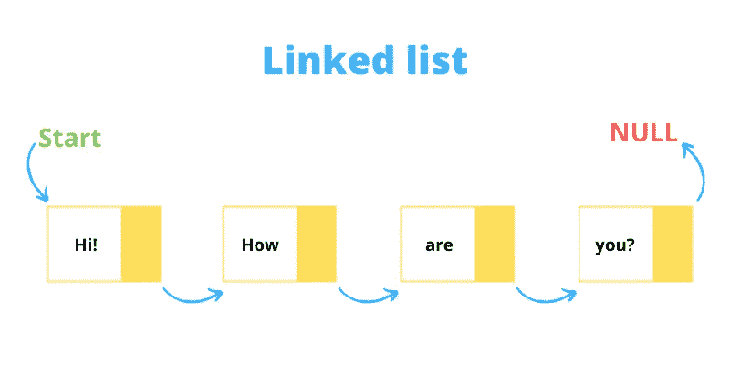
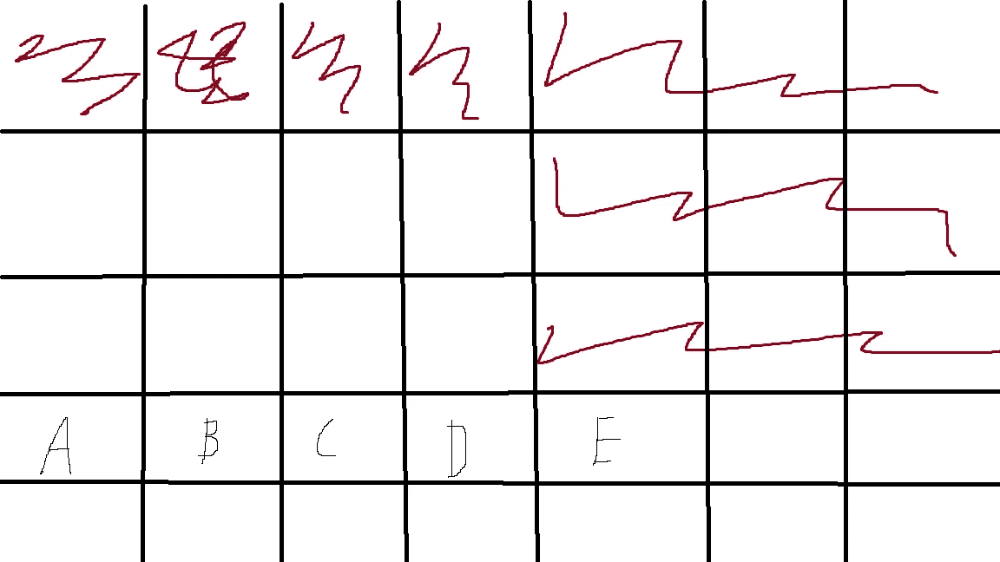
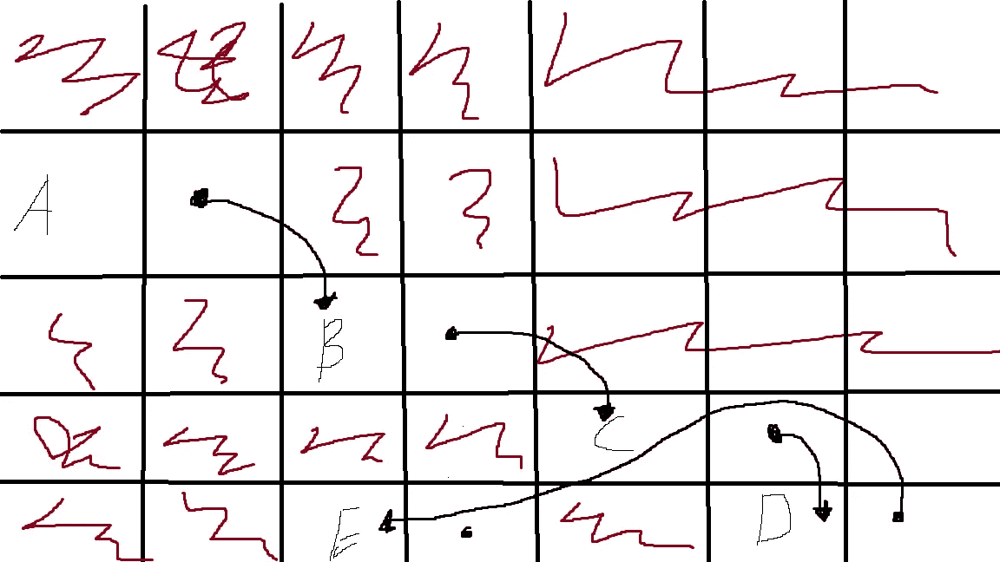

# 数据结构—链表

> 原文：<https://levelup.gitconnected.com/data-structures-linked-lists-a3cfb0b728ac>

链表的介绍和这种数据结构的一些常用方法。



来源:[https://www . programming simplified . com/c/data-structures/c-program-implement-linked-list](https://www.programmingsimplified.com/c/data-structures/c-program-implement-linked-list)

# **什么是链表？**

单链表是节点的集合，其中每个节点存储两条信息，一些值和指向下一个节点的指针。有双向链表，其中的节点包含指向下一个和上一个节点的指针。在单链表中，有一个头节点或根节点，链表就从这里开始。在双向链表中，有一个头尾节点。单向链表中最后一个节点的 next 指针将为空。

# 链表和数组有什么不同？

链表和数组的最大区别在于内存。

> 下面的解释将是对你的计算机内存分配方式的过度简化！

创建数组时，计算机必须分配内存来存储数组中的元素。特别是对于一个数组，你的计算机将总是寻找连续的内存空间。以包含以下元素的数组为例:`['A','B','C',D',E']`。您的计算机可能以这种方式存储这些元素:



每个方块可以被认为是你计算机中的一个内存地址。请注意，元素存储在连续的内存地址中。数组没有存储在上面的 4 个空方块中，因为它正好需要 5 个空内存地址。如果我们不断向数组中添加元素，并且没有连续的空内存槽，计算机将复制并移动整个数组来寻找更多的空间。这一过程可能非常繁重，想象一下，如果要处理包含超过 1，000，000 个元素的数组，您的计算机将需要找到 1，000，000 个连续的内存插槽！

这就是链表的魅力所在。对于单链表中的每个节点，我们需要两个内存槽，一个用于值，另一个指向链表中的下一个节点。现在，因为我们的节点有一个指向下一个节点的指针，所以节点不需要保存在连续的内存槽中。如果我们把初始数组转换成一个链表，它可以像这样存储:



现在我们的值存储在一个内存地址中，有一个指针包含下一个节点的内存地址，因此有了箭头。有了链表，我们的节点不必连续存储！

# 如何创建一个链表

我们必须以某种方式创建这些节点来存储一个值和一个指向下一个节点的指针。在 JavaScript 中做到这一点的一个好方法是使用类。我们将创建一个节点类和一个链表类。

```
class Node{
    constructor(val,next=null){
        this.val = val
        this.next = next
    }
}class LinkedList {    
    constructor(r=null){        
        this.root = r        
        this.size =0    
    }
}
```

现在我们有了自己的类，让我们给`LinkedList` 类添加一些方法。首先，我们将创建一个向链表添加节点的方法。通常，当我们向链表中添加节点时，我们会将它们添加到链表的前面或头部。这允许我们在 O(1)时间执行这个插入。

**添加节点:**

```
add(node){        
    if (this.root === null){            
        this.root = node        
    } else {            
        node.next = this.root            
        this.root = node        
    }        
    this.size++    
}
```

上面的代码在链表的前面添加了一个节点。我们首先检查是否已经有一个节点，如果有，更新新节点和前一个头的指针。如果不是，将新节点设置为链表的头部。

**寻找节点:**

为了找到一个具有特定值的节点，我们必须从链表的头部开始遍历它。

```
find(value){        
    let thisNode = this.root        
    let position = 1        
    while (thisNode !== null){            
        if (thisNode.value === value){                
            return position            
        } else {                
            thisNode = thisNode.next                
            position ++            
        }        
    }        
    return false    
}
```

我们使用 while 循环遍历整个链表，直到找到我们的值，否则返回 false，因为没有找到值。变量`thisNode`用于跟踪当前节点，我们通过访问`thisNode.next`来更新节点。这是一个 O(n)运算，因为它依赖于链表的长度。

**删除节点:**

从链表中移除一个节点有点棘手。我们不仅需要跟踪当前节点来遍历链表，还需要跟踪前一个节点。这是因为一旦我们找到想要的节点，我们必须更新前一个节点的指针，这样我们就不会丢失链表的其余部分。

```
delete(value){        
    let thisNode = this.root        
    let prevNode = null        
    let position = 1         
    while (thisNode !== null){            
        if (thisNode.value === value){                
            if (prevNode === null){                    
                this.root = thisNode.next                    
                thisNode.next = null                    
                return position                
               }                
            prevNode.next = thisNode.next                
            thisNode.next = null                
            return position             
         } else {                
              prevNode = thisNode                
              thisNode = thisNode.next                
              position++            
         }        
      }         
    return false    
}
```

**在位置:**插入节点

在特定位置插入节点的过程类似于删除节点。我们必须跟踪当前和先前的节点，但不是删除它，而是通过更新先前节点和当前节点的指针来添加节点。

```
insertBeforeAtPosition(nodeToInsert,insertPosition){        
    let thisNode = this.root        
    let prevNode = null        
    let position = 1         
    while (thisNode !== null){            
        if (insertPosition === position){                
            nodeToInsert.next = thisNode                
            prevNode.next = nodeToInsert                
            this.size++                
            return             
         } else {                
            prevNode = thisNode                
            thisNode = thisNode.next                
            position++            
            }        
    }        
    return false    
}
```

# 包扎

还有很多关于链表的信息，但是希望我能给你一些基础，让你开始学习这种数据结构的更复杂的方面。例如，尝试编码如何反转一个链表！