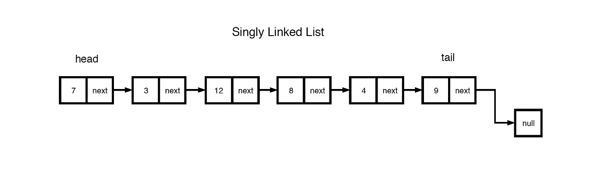
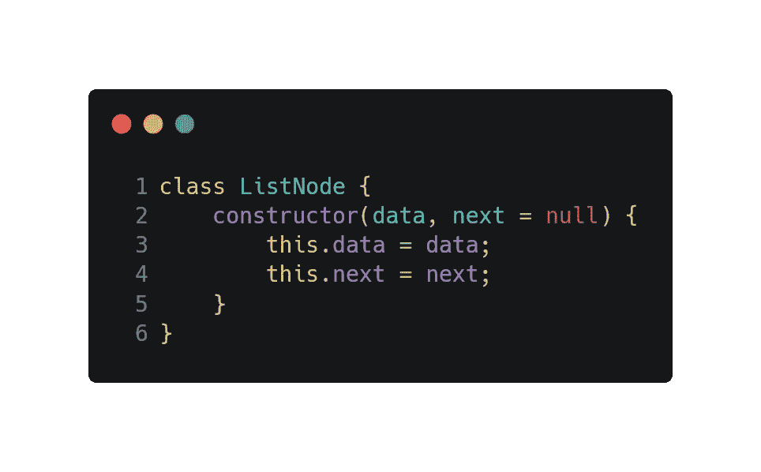
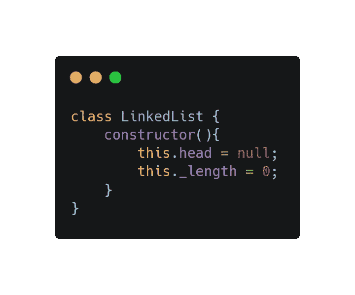
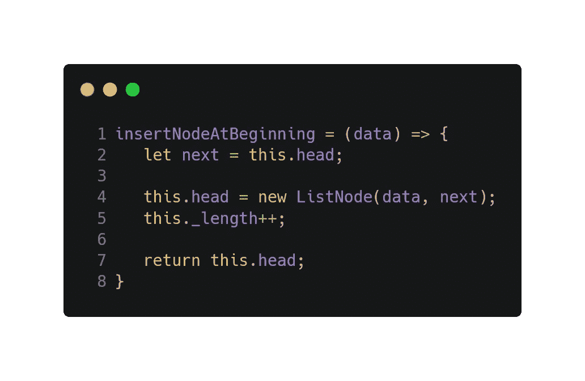
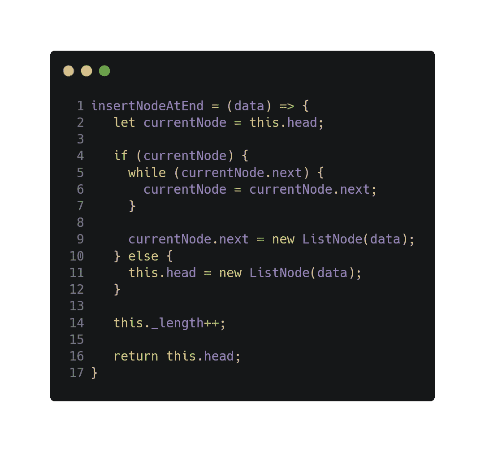
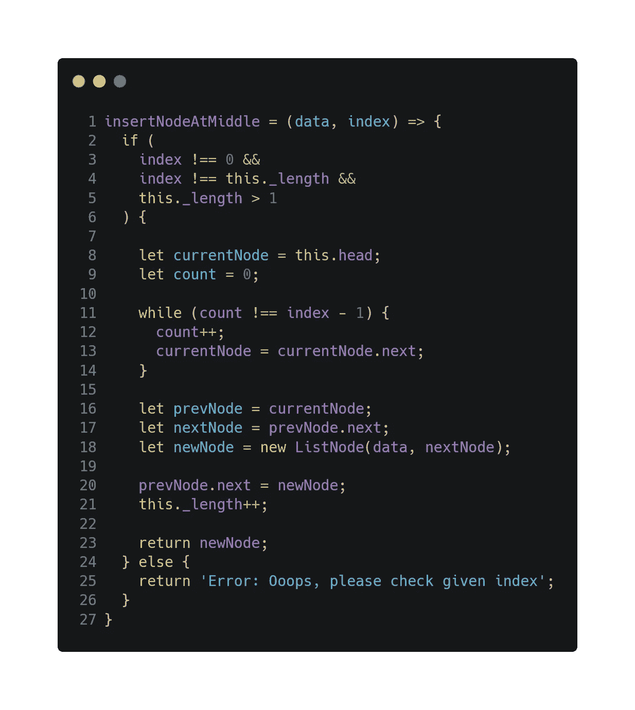
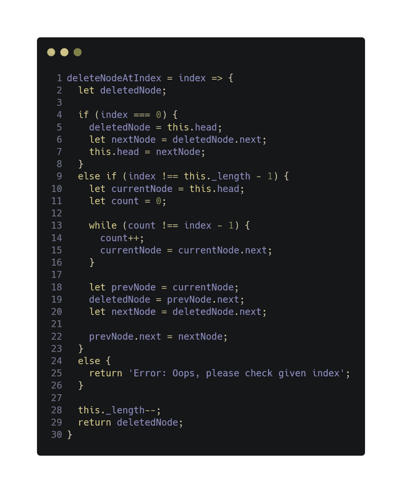
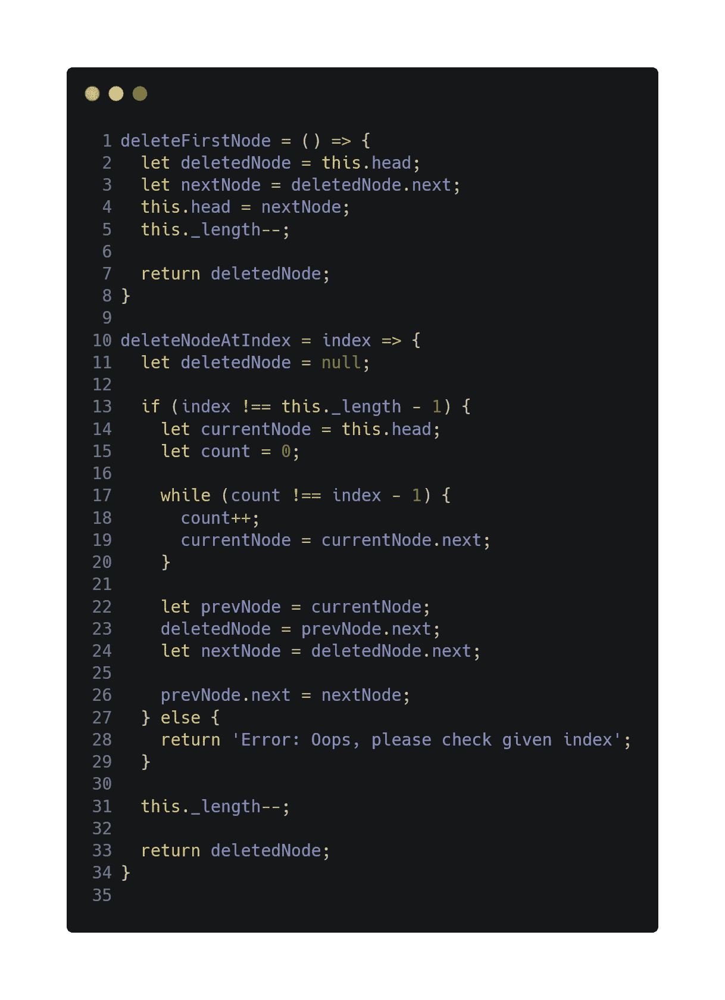
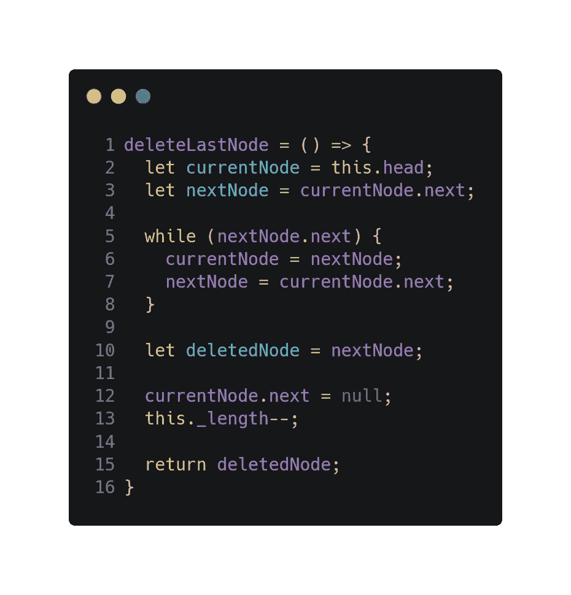
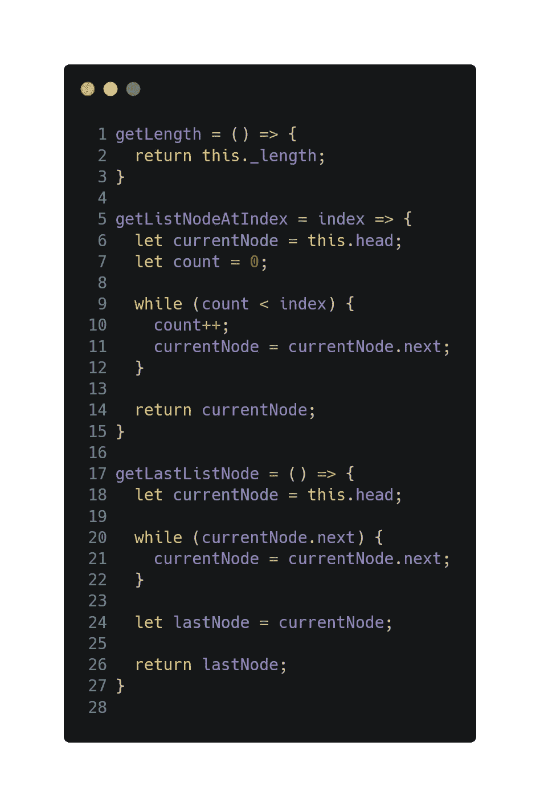

# 单链表:JavaScript 中的数据结构(第 1 部分)

> 原文：<https://levelup.gitconnected.com/data-structures-linked-lists-in-javascript-es6-part-i-db9c83854d94>

这张照片是我在亚美尼亚埃里温的黑安格斯汉堡酒吧拍的📸

数据结构有不同的例子:数组、二叉树、基于散列的结构、图、链表、字符、指针、整数等等。有些是原始数据结构，有些是非原始数据结构。

在链表文章的这一部分，我想谈谈**单个** **链表**以及如何在 JavaScript 中创建它们。

链表是由节点组成的非原始数据结构。节点由数据和一个指向另一个节点的地址(或者双向链表中的地址)组成。

列表的起点是对第一个节点的引用，它被称为**头**。所有的链表都必须有一个头，因为这实际上是链表及其所有元素的唯一入口点，没有它，你将不知道从哪里开始！列表的结尾不是一个节点，而是一个指向空值的节点。

图片来自 [jojozhuang.github.io](https://jojozhuang.github.io/popular/data-structure/data-structure-linked-list/)

链表类似于数组。让我们来看看链表和 [**数组**](https://developer.mozilla.org/en-US/docs/Web/JavaScript/Reference/Global_Objects/Array) 的一些区别:

1.  数组的大小是固定的，但是链表是动态的、灵活的，可以扩展和收缩它们的大小。
2.  在数组中，要找到特定的元素，你可以用 index 找到它，但是在链表中，你必须从头开始，直到找到第四个元素。
3.  访问数组中的元素很快，而链表需要线性时间，所以比较慢。
4.  像数组中的插入和删除这样的操作会消耗很多时间。另一方面，链表上这些操作的性能很快。
5.  此外，阵列中的内存利用率很低。相反，链表中的内存利用是高效的。

这是数组和链表的主要区别。

所以让我们通过一步一步在 JavaScript 环境下制作链表来看看。但是在阅读本文的下一部分之前，我建议阅读这个[链接](https://javascript.info/class)中的 JavaScript 类以及其他 [ES6 特性](/ultimate-guide-to-tips-tricks-and-javascript-features-you-should-know-27e0a4a6ffdf)。

# 步骤 1:创建节点构造函数

首先让我们制作我们的主要构造块——带有`class`的节点。

这是一个节点构造器，它接受第**个数据**和第**个**个参数。**数据**参数表示 Node 的值，您希望将它存储在您的节点中。 **next** 参数指向链表中在我们的节点之后出现的下一个元素，默认情况下我们将其初始化为 null(如果在 next 参数下没有传递任何值)。

# 步骤 2:创建一个链表构造函数

下一步是创建主容器构造函数——链表构造函数，它将是我们所有节点的容器。

**头**属性指向列表中的第一个节点。

由于我们的链表的起点是头**头**，它最初将不会指向任何地方(`null`)，因为当我们第一次创建一个链表时，将不会有指向的节点。

我们的**链表**类中的下一个构造函数项是链表的**长度**，它是可选的。我们将长度指定为 0，因为我们知道，最初我们的列表没有节点。

# 步骤 3:为我们的链表创建插入方法

链表的主要功能之一是插入。可以在列表的开头、中间(通过索引)和末尾插入。

所以我们需要为它们建立 3 个方法。

## **在开头插入**

在第 2 行，我们初始化即将到来的节点的 **next** 指针，当我们在列表的开头插入新节点时， **next** 节点将是我们当前的第一个节点，它由**头**指向。

数据参数作为参数传递给第 1 行的 **insertNodeAtBeginning** 方法。

我们有 **next** 和 **data** 参数，所以在第 4 行我们创建了新的节点，并把它指定为列表的头。如果您已经初始化了列表的 length 属性，不要忘记增加它的值(第 5 行)。

之后，在第 7 行，我们返回新的节点作为列表的头。

## **在末端插入**

好吧，这个有点长。在这种插入类型中，我们需要到达列表的末尾，并在那里插入节点。所以我们需要从我们列表的开始(头部)开始上路。

**当前节点**是我们当前正在查看的节点。第一个节点是**头**指向的节点。因此，我们获取 head 指针，并将其分配给第 2 行的 **currentNode** 。

有了起点之后，我们检查我们的列表是否有任何节点(第 4 行)。

如果答案是肯定的，我们就遍历节点来找到列表的尾部(第 5-7 行)。当我们找到它的时候，就是插入的时候了(第 9 行)。

但是如果我们得到一个否定的答案，我们只需将链表的头指针指向第 11 行的新节点。

插入后，除了增加列表的长度和返回头指针之外，什么都不做。

## **在中间插入**

在这个方法中，我们不仅需要指定数据参数，还需要指定新节点的**索引**。

在第 2-6 行，我们检查给定的索引是否在列表的中间。如果没有，我们返回一个错误信息。

但是，如果索引是正确的，我们需要找到我们的节点的位置，并将其插入那里。求解路径类似于在结束路径插入，除了此时我们的方向是给定的索引而不是列表的端点，并且我们还需要一些辅助变量。

我们在第 8 行指定起点，也在第 9 行计数。**计数**帮助我们找到循环的停止点。

假设我们想在索引 5 处插入新节点。我们循环遍历索引 0、1、2、3，当我们在索引 4 时，我们停止循环( **count = 4** )。

在第 16 行和第 17 行，我们获取索引 4 ( **prevNode** )和索引 5 ( **nextNode** )处的节点。在第 18 行，我们创建了一个指向索引 5 的节点。在第 20 行，我们将索引 4 节点的指针改为指向我们的新节点。

在所有这些之后，我们最终得到了索引 4( **prevNode** )、索引 5( **newNode** )和索引 6( **nextNode** )处的节点。

这是最后一种插入方法。让我们看看我们一起写的全部代码。

别担心，你可以在文章下面找到完整的代码源代码。

# 4.为链接列表创建删除方法

链表的下一个主要功能是删除。像插入一样，可以从列表的开头、中间(通过索引)和结尾删除。

## **中间删除+开始删除**

我们可以将两三种删除或插入方法结合成一种，但是不推荐

**在这种方法中，我们结合了两种删除类型(从中间删除和从开始删除)。在第 2 行中，我们初始化了 deletedNode 变量，需要它来显示哪个节点被删除了。**(注意:最好初始赋值为空)****

**在初始化之后，像从中间方法插入一样，我们检查索引值是否为 0。此时，当它为 0 时，我们不会给出错误。相反，我们取第一个节点，并通过将 **head** 指针改为指向第一个节点之后的下一个节点来删除它。然后我们从语句中退出，减少列表的长度，并返回被删除的节点。**

**下一个语句是检查我们的索引是否不是列表的最后一个索引。如果不是，那么我们开始遍历列表节点，直到到达指定的索引- 1。**

**就拿前面的例子来说吧。我们想删除索引 5 处的节点。因此，我们循环遍历索引 0、1、2、3，当我们在索引 4 时，我们停止循环( **count = 4** )。**

**在第 18 行和第 20 行，我们取索引 4 (prevNode)和索引 6 ( **nextNode** )处的节点。在第 19 行，我们取索引 5 处的目标节点。然后在第 22 行，我们通过切换 **prevNode** 的指针到 **nextNode 来删除一个节点。****

**现在 **prevNode** 将指向 **nextNode** ，它位于索引 6，最终成为索引 5 节点。**

**所以这是两种结合在一起的方法。但是我建议将它们彼此分开，如下面的代码图所示👇。**

****

## ****从末尾删除****

****

**在这个方法中，我们循环遍历节点，直到到达末尾，就像在 list 方法的末尾插入一样，只是现在我们还需要最后一个节点的前一个节点(第 5–8 行)。到达最后一个节点后，我们简单地获取前一个节点，并将其指针改为 null(删除它们之间的连接线)(第 12 行)。减少列表的长度并返回删除的节点。**

**这就是删除过程。**

# **5.为链表创建一个 getter 方法**

****

**要向链表中添加更多的信息源，你可以添加那些方法或者更好的方法——试着也创建你自己的方法。**

**就是这样！感谢您阅读本文！希望这篇文章能帮助你理解什么是链表以及如何实现它。下一章见，我会讲到双向链表😉。**

> **[github 链接完整代码](https://github.com/danomov/DataStructures)**

**喜欢这篇文章吗？你可以在下面找到更多有趣的。**

> **[JS 功能终极指南](/ultimate-guide-to-tips-tricks-and-javascript-features-you-should-know-27e0a4a6ffdf)**
> 
> **如何成为一名更好的开发人员**
> 
> **[什么是 AI？是还是不是？](https://medium.com/@danielmovsesyan/what-is-ai-yay-or-nay-781a5713b9cc)**