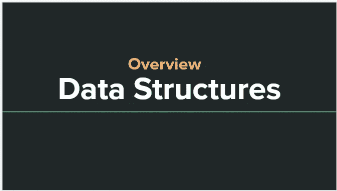

# 数据结构:概述

> 原文：<https://levelup.gitconnected.com/data-structures-overview-13ac8a02a880>

什么是数据结构？数据结构是值的集合。算法是我们用来处理这些值集合的步骤或过程。它让我们能够编写程序。欢迎来到 DSA 系列，我知道我很懒，但这次不是😤我会尽我所能让这个系列继续下去，因为它很重要，我喜欢记录我学到的任何东西，所以没有进一步的告别，让我们开始吧:)

# 概观

在今天的文章中，我们将学习以下概念:

**→** 什么是数据结构，如何使用这些数据结构？

**→** 什么是算法，如何使用这些算法？

# 数据结构列表

***→*** *数组*

***→*** *链表*

***→*** *堆栈*

***→*** *队列*

***→*** *树木*

***→*** *二叉树*

***→*** *二叉查找树*

***→*** *图形*

***→*** *设置*

***→*** *哈希表*

# 算法的类型

***→*** *搜索*

***→*** *排序*

***→*** *哈希*

# 数据结构基础

**→** 将内存中的数据进行排列或组织，称为数据结构。如前所述，数据结构是值的集合。算法是我们用来处理这些值集合的步骤或过程。它让我们能够编写程序。

**→** 数据可以有条理地存储，并在需要时使用。

**→** 存储数据的方式有很多种，其中一种是数据一个接一个顺序存储的数组。

**→** 数据结构不是一种编程语言，而是一套组织和存储内存中数据的算法。

**→** 构造内存中数据的一组规则称为**抽象数据类型。**

**→** 结构中提出了很多算法来存储数据，我们将一一看到。

# 数据结构的类型

基本上有两种数据结构:

**→** 原始数据结构

**→** 非原语数据结构。

# 原始数据结构

**→** Int、Char、Float、Double、Pointer 称为原始数据结构。

**→** 这些可以保存单个值，也称为原始数据类型。

# 非原始数据结构

非原语数据结构分为以下两种类型:

## →线性数据结构

在这个数据结构中，数据是按顺序排列的。数组、堆栈、队列和链表都是线性数据结构的例子，其中一个元素以线性形式只与另一个元素相连。

## →非线性数据结构

数据连接到该数据结构中的 n 个元素。树和图是非线性数据结构，其中的元素不是按顺序排列的。

# 数据结构的特征

## →正确性

这个属性与数据结构的算法有关。算法正确很重要。这里的正确性是指算法总是产生预期的输出或遵循有效输入范围的基本事实，并最终终止。它很重要，因为您依赖它来获得想要的输出。

## →时间复杂性

作为输入长度的函数的数据结构的运行时间或执行时间被称为**时间复杂度**。数据结构的操作的执行时间必须尽可能少，因为你的数据结构花费的时间越多，它的效率就会降低。

## →空间复杂性

当一个算法或数据结构在你的计算机上运行时，它需要某种空间/内存。数据结构执行或正常工作所需的总内存空间称为**空间复杂度。**同样，操作的内存使用必须尽可能少，因为你的数据结构占用的空间越多，效率就越低。

# 执行时间案例

## →最坏情况

这是指某个特定的操作花费了最长的时间。例如，如果操作的最坏情况时间是 f(n ),那么该操作将不会花费超过 f(n)的时间。f(n)代表 n 的函数。一个好的开发人员会确保他们的代码不会达到最坏的情况，并进行所有必要的优化以达到最好的情况。离最坏的情况越远越好。

## →最佳情况

这基本上描述了一个操作的最小可能执行时间。每个人都希望自己的代码在这样的场景中运行。

## →一般情况

这个案例描述了一个操作的平均执行时间。

# 基本术语

## **→数据**

值或一组值称为数据。

## **→数据项**

它是一个单一的价值单位。

## **→分组项目**

数据项被分成称为组项的子项。

## **→基本项目**

不能再分成子项的数据项称为基本项。

## **→属性和实体**

该实体包含可以被赋值的某些属性或特性。

## **→实体集**

相似属性的实体形成一个实体集。

## →现场

该字段是表示实体属性的单个基本信息单元。

## →记录

它是给定实体的字段值的集合。

## →文件

它是给定集合中实体记录的集合。

# 数据结构中的操作

您可以对数据结构执行各种操作。但是，可以对数据结构执行的主要操作如下:

## →搜索

## →分类

## →插入

## →更新

## →删除

# 数据结构的分类

我想我们已经在上面讨论过这个问题了，无论如何我们会更深入地讨论它来重申这个概念！基本上有两种类型的数据结构，原始数据结构和非原始数据结构。

## 原始数据结构

**→** Int、Char、Float、Double、Pointer 称为原始数据结构。

**→** 这些可以保存单个值，也称为原始数据类型。

## 非原始数据结构

非原语数据结构分为以下两种类型:

**→线性数据结构:**元素以非层次化的方式顺序存储，其中除了第一个和最后一个元素，每个元素都有后继元素和前趋元素。一个元素以线性形式仅连接到另一个元素。数组、堆栈、队列和链表都是线性数据结构的例子。

**→非线性数据结构:**非线性数据结构中的每个元素都连接到一个或多个节点，并且不是同时的，元素也不是顺序排列的。树和图是非线性数据结构的例子。

# 数据结构的优势

## →可重复使用

数据结构是高度可重用的。它们也可以被编译成库，供不同的用户使用。

## →效率

效率总是取决于所使用的数据结构的类型，以及我们此刻所面对的用例。例如，与哈希表相比，从数组中搜索元素可能效率较低，因为在数组中，必须顺序搜索元素，而哈希表以键:值对格式存储数据，因此更容易找到！我们将在接下来的文章中详细讨论它。

## →抽象

数据结构本质上是抽象的。开发人员或客户仅在接口级别使用数据结构，而不了解其实现细节。例如，我们不会从头开始构建像数组这样的数据结构来解决现实生活中的问题，我们只是使用编程语言为我们制作的预先存在的结构。

# 数据结构的应用

## →人工智能

## →机器学习

## →数据科学

## →网络安全

## →编译器设计

## →图像处理

## →操作系统开发

## →区块链

## →数据库管理系统

## →统计，以及更多

# 数据结构的重要性

## 数据搜索

例如，让我们以一个流行的电子商务品牌亚马逊为例。它有成千上万的产品，如果它不利用有效的数据结构和算法，当客户搜索特定产品时，它可能会增加复杂性并减慢搜索过程！

## 过程速度

数据搜索和处理速度齐头并进。数据复杂度随着文件和数据的增加而增加，处理如此大量的数据变得困难，因此需要高速处理！

## 多个请求

例如，在节日期间，电子商务网站经常会发现用户流量激增。当数千人同时在网络浏览器上搜索商品时，大型服务器有时会出现故障。因此，要解决这些问题，需要数据结构！

最后， ***它们是计算机存储数据的骨干*，**对信息进行分类和归类，处理数据计算，等等。在过去的几十年里，随着许多大规模应用程序在日常操作中使用复杂的计算和排序，这个领域的重要性日益增加。

至此，我们已经详细介绍了数据结构的基础知识。希望它对初学者友好，并且对你有所帮助。好吧，让我们在另一篇深入探讨 DSA 的文章中再见吧。直到那时 TC:)

**❖** [***下一条 DSA***](https://ritchiepulikottil.medium.com/data-structures-arrays-e9925add4ff3)

❖ [*GitHub*](https://github.com/ritchiepulikottil)

❖ [*领英*](https://www.linkedin.com/in/ritchie-pulikottil-6876341aa/)

❖ [*Youtube*](https://heylink.me/rp1/)

❖ [*接我*](https://ritchiepulikottil.netlify.app/) *！*