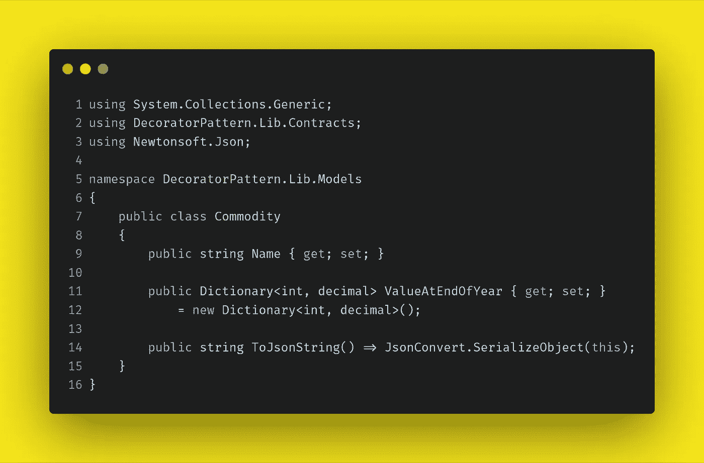
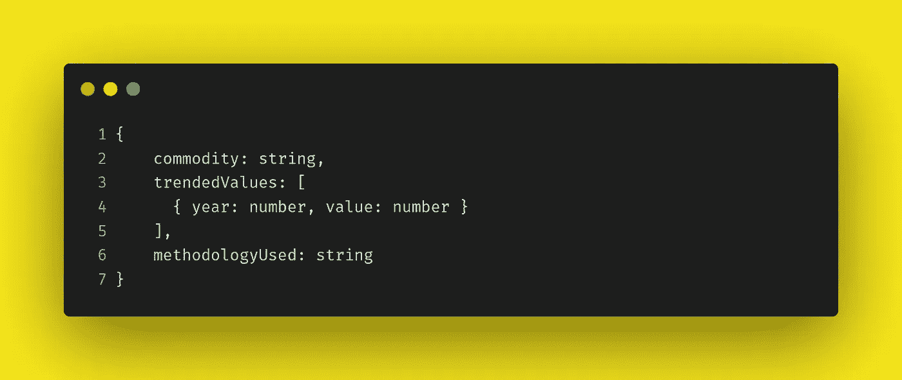
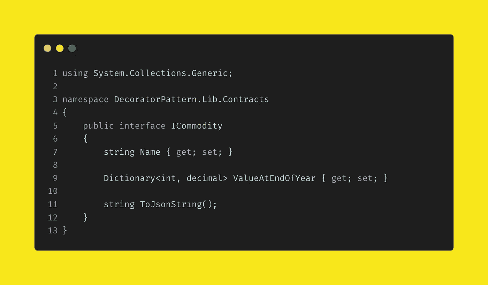
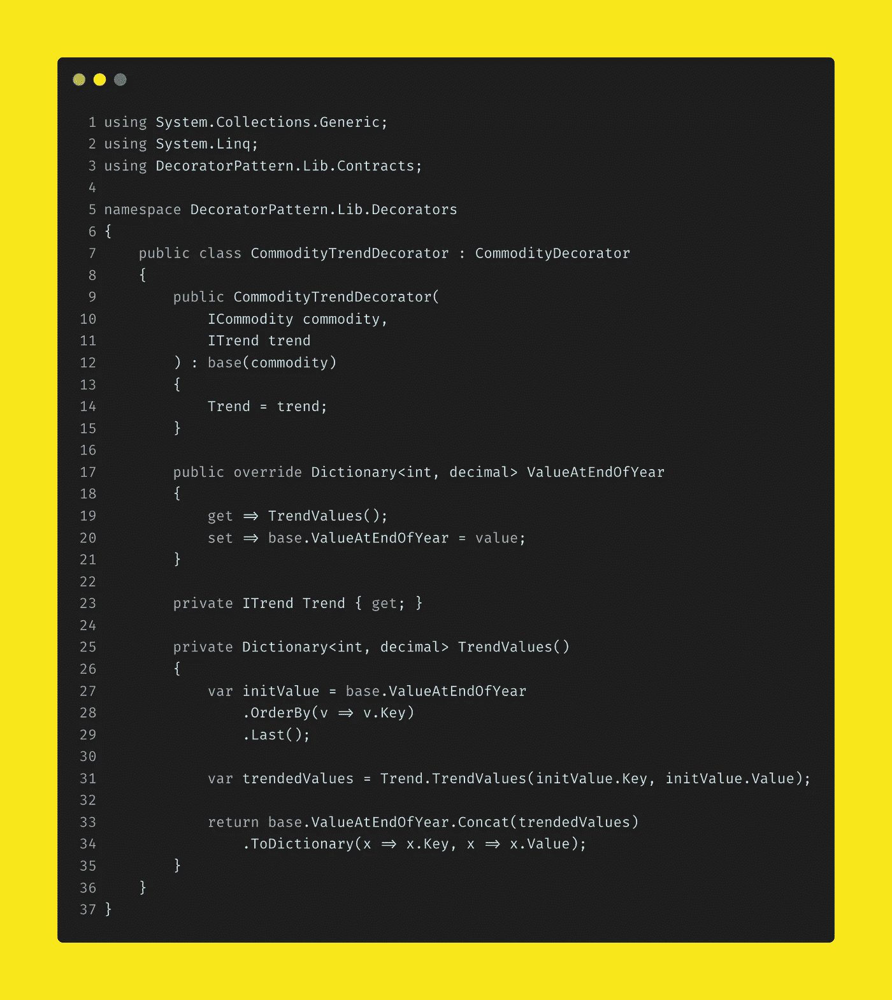
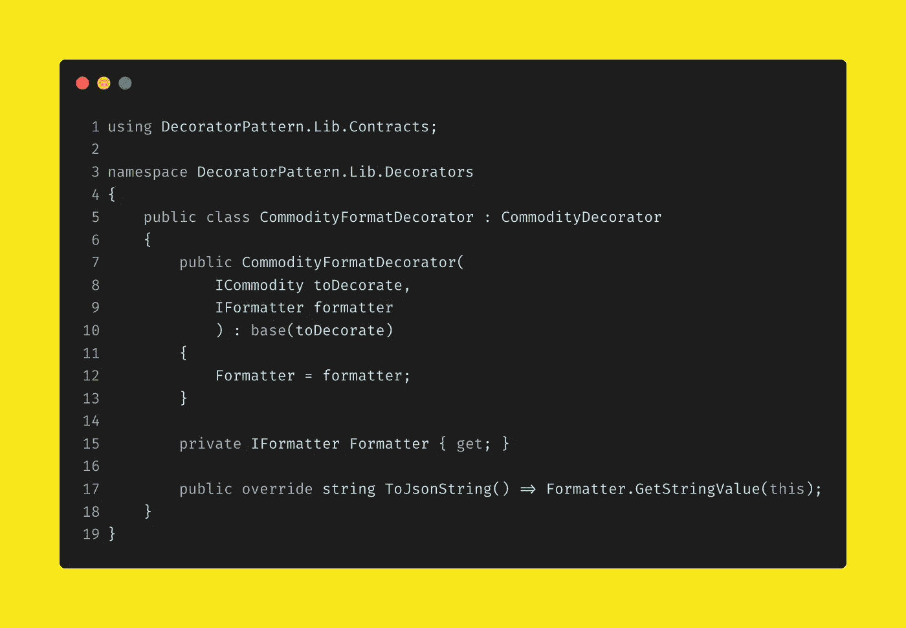
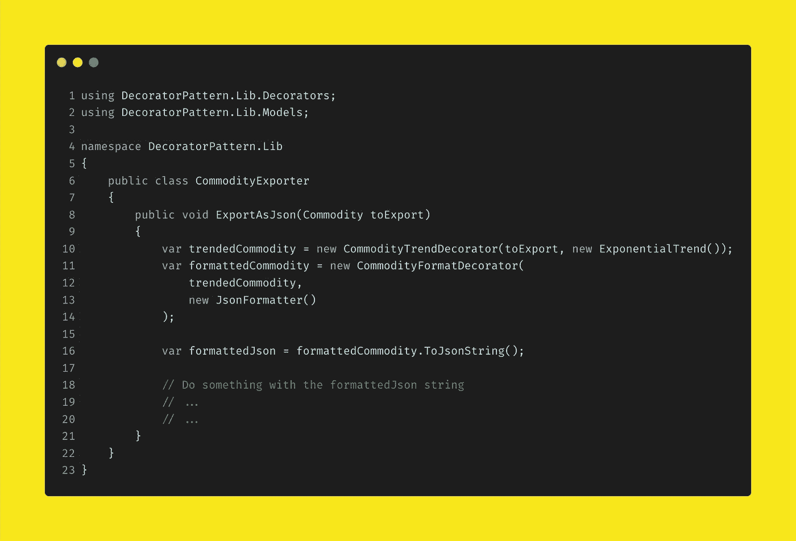

# 使用装饰模式的数据转换

> 原文：<https://levelup.gitconnected.com/data-transformation-using-the-decorator-pattern-d94441d13b66>

照片由来自[佩克斯](https://www.pexels.com/photo/anonymous-female-cook-in-uniform-and-latex-gloves-decorating-cake-with-macaroons-in-light-kitchen-3983660/?utm_content=attributionCopyText&utm_medium=referral&utm_source=pexels)的[古斯塔沃·福林](https://www.pexels.com/@gustavo-fring?utm_content=attributionCopyText&utm_medium=referral&utm_source=pexels)拍摄

装饰模式是软件工程中最通用的设计模式之一。它允许动态地将行为添加到对象中，同时仍然遵守单一责任原则。它类似于我在这里写的的[责任链模式，但是一个关键的区别是，不是单个类(或者链中的一环)处理特定的请求或者动作，而是所有的类处理请求或者动作。](/validation-using-the-chain-of-responsibility-pattern-236a6ded7078)

本文展示了在转换数据时这是多么有用，通常作为提取、转换和加载管道的一部分。在这个例子中，我们将看到如何应用装饰模式来扩展一个对象的功能，同时保持与单一责任原则的一致性。

好吧——我们继续干吧。

在这个例子中，想象一个存储和处理商品数据的系统——关于石油、黄金、白银等的数据。具体来说，我们将看到一个数据传输对象，即 DTO，它保存从数据库中检索到的数据。

商品模型

这个类 *Commodity* ，在字典中存储商品的名称和一些时间序列数据。

我们的系统需要处理这个模型的实例，并在 JSON 中产生一个输出。很简单吧？

嗯，差不多…

您会看到输出需要包括未来几年 *ValueAtEndOfYear* 的值。在我们的管道中的某个地方，我们将需要做一些数学和一些新的价值趋势。

这是装饰模式可以大放异彩的地方。

在我们继续之前，让我们问一个问题“我们能在模型类本身中放入做数学运算的功能吗？”

简短的回答是一个强有力的“不”

更长的答案是——是的，你可以。但你不会想的。这样做会违反单一责任原则(*商品*的责任是传输数据，而**没有其他责任**)，并引入会以封装、混淆的方式改变其自身状态的功能。这样一来，错误和意想不到的结果就会出现…

好了，现在我们继续，开始实现装饰器模式。

首先，让我们看看预期的输出——这是一个简单的 JSON 对象。

期望的输出

好的——这显然不同于 DTO 的结构，所以我们需要一个室内设计师来做一些转换，以及一些数学运算。我们做事情的方式没有太大关系，但首先做数学似乎是有意义的。这就是我们要做的。

首先，我们需要一个接口或基类。我在这个例子中使用了一个接口——ymmv，对于某些情况，基类可能更合适。我们需要这样做，因为我们的装饰者需要实现与被装饰对象相同的方法。

这是我们的接口，我们假设我们已经在*商品*类中实现了它。

ICommodity 界面

现在我们需要实现一个基本的装饰类。这抽象出了常见的功能。当你真的这么做时，确保你的焦点保持狭窄——你不想以一个[香蕉、大猩猩、丛林问题](https://softwareengineering.stackexchange.com/questions/368797/sample-code-to-explain-banana-monkey-jungle-problem-by-joe-armstrong#368798)结束吧！

我们的抽象基类

对于我们的小例子，这个基类可能看起来有点多余(老实说，确实是这样)，但是如果你真的要实现它，你几乎肯定会希望在基类中弹出公共功能。

好了，基类完成了。现在让我们实现一个计算趋势值的装饰器。

我们的第一个装饰器实现——计算趋势值

让我们快速看一下这里发生了什么。

构造函数获取了一个 *ICommodity* 的实例——它可能是另一个装饰器或者是*商品*类的实例。它还采用了一个 *ITrend* 的实例。我们不会详细讨论这是什么，但从本质上讲，它执行数学运算来确定值的趋势。

主要动作发生在属性 *ValueAtEndOfYear* 中。我们覆盖了基类中的实现(它反过来只是获取/设置装饰商品的属性)。我们调用方法 *TrendValues* ，而不仅仅是从基类返回值。该方法使用 *ITrend* 实例来确定值的趋势，然后将它们与存储在基类中的值一起返回。

对——接下来是第二个装修工。这一个将处理数据转换，以便我们的输出匹配所需的模式。

格式装饰者

在这个装饰器中，我们覆盖了 *ToJsonString* 方法。我们传入一个 *IFormatter* 的实例，并使用它获得正确格式的字符串。和上面的 *ITrend* 一样，在这个例子中我们把它当作一个黑盒，假设它像我们想要的那样工作；)

您会注意到两个装饰器有一些共同点——它们都覆盖方法。这是理解我们是什么以及如何实现我们的目标的关键。我们使用 decorator 类来提供额外的数据，或者操作现有的数据，我们通过提供现有方法的覆盖来做到这一点。

好吧，好东西。现在我们已经有了两个 decorators，它们用来绘制值的趋势并创建格式正确的输出，我们需要做的就是连接它。

下面是一个处理导出的类的片段。我们一会儿就来看一下。

在 exporter 类中进行所有的连接

这里我们感兴趣的方法是 *ExportAsJson* 。它以*商品*的一个实例作为它的参数，我们只对传递这个方法感兴趣，所以我们不使用接口。

然后，在第 10 行，我们创建了一个 *CommodityTrendDecorator* 类的实例，并将这个商品传递给 export 和实现 *ITrend* (在这个实例中，我们预测这个商品的价值将呈指数增长)。

在第 11 行，我们创建了一个 *CommodityFormatDecorator* 的实例，并将它传递给我们的 trend decorator 实例和一个*I matter*实例。

最后，我们得到了想要的输出——为了简洁起见，我没有展示我们用这个格式良好的 JSON 实际做了什么。

您会注意到 *ExportAsJson* 方法中的代码看起来与责任链非常相似。我在开始的时候说过装饰者和责任链模式是相似的，现在你可以看到为什么了！

区别也很明显——为了完成我们的操作，我们使用每个修饰的类，每个类执行一些动作，它们不把责任交给另一个类。

## 结论

在本文中，我们已经看到了如何向类添加行为，如何扩展它的功能，而不违反单一责任原则。

我们已经采取了一个简单的 DTO，并提供了一个受控的，可管理的方式的状态突变。我们还实现了一种格式化数据以便导出的方法，而不必用许多无关的方法来污染 DTO。

这种事情在我们的日常生活中是相当常见的，使用装饰者并不是唯一的解决方案。例如，我们在这里所做的可以通过将 DTO 传递给一个责任链来完成。也就是说，如果将装饰模式和策略模式结合起来，就可以创建灵活而健壮的系统。