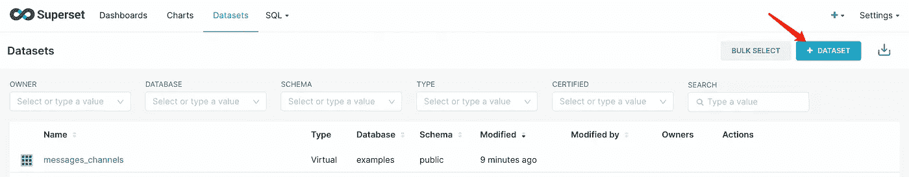

# Apache 超集的数据可视化——分步指南

> 原文：<https://levelup.gitconnected.com/data-visualisation-with-apache-superset-a-step-by-step-guide-e5b0c150f358>

本文旨在演示如何使用 Apache 超集构建一个简单的仪表板。让我们开始吧…


# 首先，为什么是 **Apache 超集？**

Apache Superset 是开源的，与 **Tableau 和 Power BI** 相比是完全免费的，如果你正在经营一家规模较小的创业公司，这是非常棒的。

## 先决条件:

* docker
* git

# 步骤 1:安装并运行

*   提取 Apache 超集的 git repo(这可能需要一段时间)
    `git clone [https://github.com/apache/superset.git](https://github.com/apache/superset.git)`
*   用`cd superset`输入目录
*   提取并运行 docker 映像(这可能需要一段时间)

```
docker-compose -f docker-compose-non-dev.yml pull
docker-compose -f docker-compose-non-dev.yml up
// ensure you wait patient for it to full loads
```

*   访问 [http://localhost:8088](http://localhost:8088) ，用`username: admin`和`password: admin`登录超集


步骤 1 的成功屏幕结束

# 步骤 2:连接到数据库

我将假设使用一个 MySQL 数据库，用[这个指南在这里](https://medium.com/@caopengau/running-mysql-with-docker-and-docker-compose-with-seeded-data-a-step-by-step-guide-fd12fbef6896)来设置。或者，你可以使用你自己的数据源或者从`[superset](https://github.com/apache/superset.git)`挑选一些现有的数据库和数据集

*   点击右上角的“+”按钮，然后选择“数据”，然后选择“连接数据库”


*   填写数据库凭据，单击“连接”，然后单击“完成”


# 步骤 3:添加数据集

*   切换到数据集视图并单击“+数据集”



*   选择正确的“数据库”、“模式”和“查看表模式”，然后单击“添加数据集和创建图表”


之后，您应该会被引导到下一步“创建新图表”

# 步骤 4:创建新图表

对于这个例子，让我们创建一个饼图。

*   单击“饼图”，然后单击“创建新图表”


*   命名此图表，拖放数据列，然后单击右侧的“单击此处”查看预览


*   如果它看起来不错，让我们保存它，我们可以添加到仪表板，以便快速访问。


# **结论**

祝贺你，你已经用 Apache Superset 创建了你的第一个图表，并获得了数据可视化的新技能！保持好奇心，探索 Apache 超集的更多特性。

[使用 Python 的数据工程和 ETL 过程可以通过几个脚本变得更容易](https://medium.com/@caopengau/data-engineering-made-easy-attached-python-scripts-to-head-startyour-etl-tasks-960e766f3ae3)

[数据验证是最重要的步骤之一，可以用 Python pydantic 来完成](/python-data-pipeline-first-and-foremost-step-data-validation-e15017b7ef8d)

**呼吁行动**

如果你觉得这个指南有帮助，请鼓掌并跟我来。通过[链接](https://medium.com/@caopengau/membership)加入 medium，在 medium 上获取我和所有其他优秀作家的优质文章。