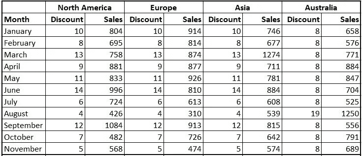
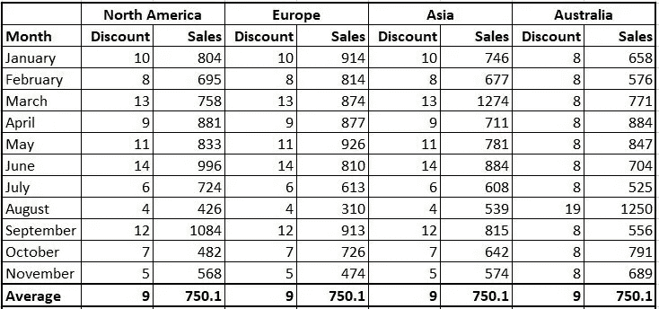
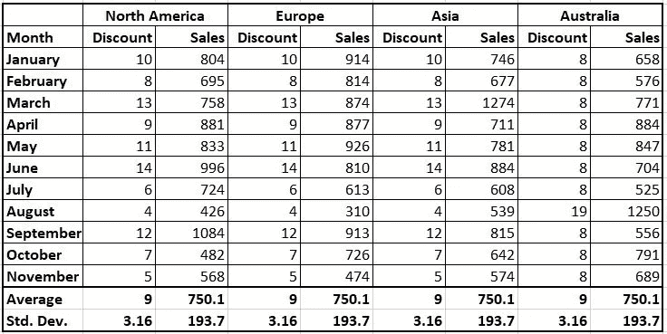
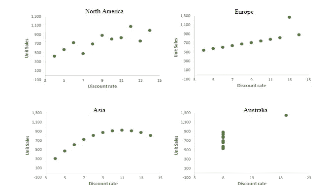
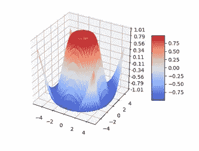
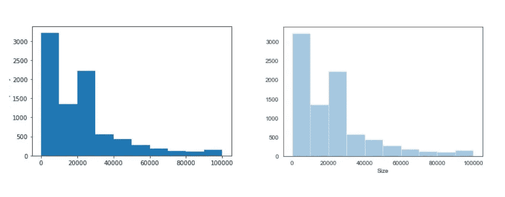
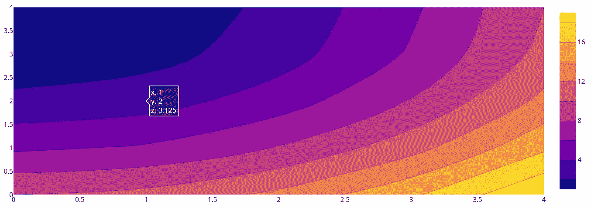

# 数据可视化及其重要性:Python

> 原文：<https://levelup.gitconnected.com/data-visualization-and-its-importance-python-7599c1092a09>

## 我们都知道这句名言，“一张图片胜过千言万语。”Python 允许我们使用 Matplotlib 和 Seaborn 轻松快速地创建可视化。

在 [Unsplash](https://unsplash.com/s/photos/graph?utm_source=unsplash&utm_medium=referral&utm_content=creditCopyText) 上由 [Carlos Muza](https://unsplash.com/@kmuza?utm_source=unsplash&utm_medium=referral&utm_content=creditCopyText) 拍摄的照片

对于任何试图从数据中提取和交流见解的人来说，数据可视化是一项重要的技能。在机器学习领域，可视化在整个分析过程中发挥着关键作用。

**为什么我们需要可视化数据？**

比方说，我们有前 11 个月四大洲的汽车销售数据集。

1 月至 11 月的汽车销量

单独分析每一列并根据上面的数据得出一些结论是相当麻烦的。所以，我们通常做的是，总结数据并从中推导出一些见解。现在，让我们来看看与其他洲相比，每个洲的销售额如何，为此，我们将计算每个洲的平均折扣和销售额，

折扣和销售额的平均值

看起来在前 11 个月，各大洲的销售额相当均衡。让我们通过进一步检查数据来看看每一列的标准偏差，

各大洲的标准差

因此，通过上述数据，我们可以推断，与各大洲相比，销售业绩是相同的。看，这就是汇总统计数据容易误导人的地方。

如果我们用 Python 在散点图上绘制上述数据的折扣率的销售业绩，我们会得到以下图表。

散点图

每个大洲都采用了不同的策略来提高他们的销售额和折扣率，所有这些大洲的销售数字也大相径庭。仅用数字很难理解各大洲的模式或战略。所以，这就是为什么将数据可视化而不是仅仅根据数字得出结论是很重要的。

上面的数据集是安斯科姆的四重奏的修改版本，它们是由统计学家弗朗西斯·安斯科姆在 1973 年构建的，以对抗统计学家之间“数字计算是精确的，但图表是粗糙的”的印象

> 你可以在这里找到更多关于安斯科姆的四重奏。

所以，现在百万美元的问题来了，

## 我们应该使用哪个 Python 库进行数据可视化？

Python 拥有一些最具交互性的数据可视化工具。最基本的绘图类型在多个库之间共享，但其他类型仅在某些库中可用。

每位数据科学家使用的三个主要数据可视化库是:

1.  Matplotlib
2.  海生的
3.  Plotly

## **1。Matplotlib**

Matplotlib 是 Python 中最流行的数据可视化库。它用于生成简单而强大的可视化效果。从数据科学的初学者到经验丰富的专业人员，Matplotlib 是最广泛使用的绘图库。

**优势:**

1.  Matplotlib 支持各种类型的图形表示，如条形图、直方图、线图、散点图、茎图等。
2.  Matplotlib 可以以多种方式使用，包括 Python 脚本、Python 和 iPython shells、Jupyter 笔记本。
3.  Matplotlib 是一个二维绘图库。但是有一些扩展，我们可以用来创建高级的可视化，如三维绘图等。

使用 matplotlib 的 3D 表示

## 2.海生的

Python 库 Seaborn 是一个基于 Matplotlib 的数据可视化库。Seaborn 提供了多种可视化模式。与 matplotlib 相比，使用 Pandas dataframe 的集成性更强。Seaborn 被广泛用于统计可视化，因为它内置了一些最好的统计任务。

**优点:**

1.  Seaborn 使用更少的语法，我们编写更少的代码来实现高质量的可视化。
2.  与 matplolib 相比，seaborn 图在默认情况下更具视觉吸引力。

Matplotlib 与 Seaborn 使用相同的数据集

3.与处理数据帧和数组的 matplotlib 相比，Seaborn 将整个数据集作为一个整体来处理。

## 3.Plotly

Plotly 提供了互动的情节，对于没有多少阅读情节知识的观众来说很容易读懂。Plotly 主要用于处理地理、科学、统计和金融数据。

**优点:**

1.  Plotly 与 Jupyter 笔记本和网络浏览器高度兼容，这使得与最终用户共享图形变得容易。
2.  最重要的优点是 Plotly 提供了等高线图，这在大多数库中是找不到的。

使用 Plotly 绘制基本等高线图

3.使用 Plotly 时，如果我们将鼠标悬停在图形上，它会显示该特定点的轴值。

Python 中还有更多数据可视化库，如 Bokeh、Altair、ggplot 等。但是，上面提到的是世界上最常见和最广泛使用的库。

## 结论

在本文中，我们首先了解了可视化数据而不是仅仅根据数据表进行推断的重要性。之后，我们看到了 Python 中不同类型的数据可视化库。除了上面讨论和提到的工具，Python 中还有各种各样的数据可视化工具。在使用特定的方法之前，熟悉这些库是很重要的。

**感谢您阅读**和**快乐编码！！！**

# 在这里查看我以前关于 Python 的文章

*   [**熊猫:巨蟒**](/pandas-python-e69f4829fee1)
*   [**Matplotlib:Python**](/matplotlib-python-ecc7ba303848)
*   [**NumPy: Python**](https://medium.com/coderbyte/numpy-python-f8c8f2bbd13e)
*   [**Python 中的时间复杂度及其重要性**](https://medium.com/swlh/time-complexity-and-its-importance-in-python-2b2ba03c786b)
*   [**Python 中的递归或递归函数**](https://medium.com/python-in-plain-english/python-recursion-or-recursive-function-in-python-5802c74c1844)
*   [**Python 程序检查阿姆斯特朗数(n 位数)和栅栏矩阵**](https://medium.com/python-in-plain-english/python-programs-to-check-for-armstrong-number-n-digit-and-fenced-matrix-bc84a1bf32aa)
*   [**Python:基础参考问题—对换、阶乘、反数位、模式打印**](https://medium.com/python-in-plain-english/python-problems-for-basics-reference-swapping-factorial-reverse-digits-pattern-print-241dde763c74)

# 参考

*   **安斯科姆的四重奏:**https://en.wikipedia.org/wiki/Anscombe%27s_quartet
*   **Matplotlib——用 Python 可视化**:[https://matplotlib.org/](https://matplotlib.org/)
*   **seaborn —统计数据可视化:**https://seaborn.pydata.org/ T42
*   **Plotly Python 开源图形库:**[https://plotly.com/python/](https://plotly.com/python/)
*   **Python 中的等高线图:**【https://plotly.com/python/contour-plots/ 