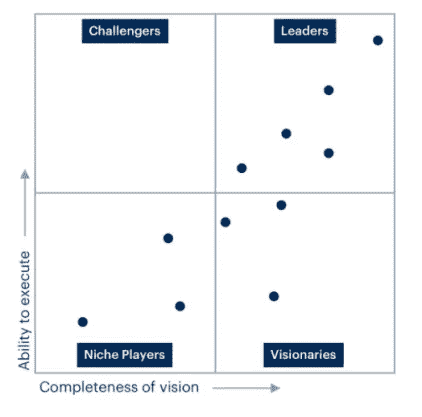
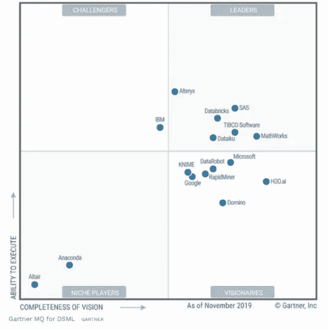
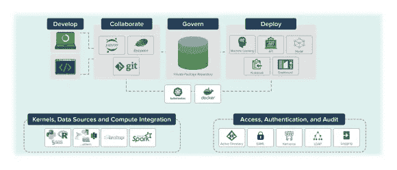

# 数据可视化—如何选择合适的工具

> 原文：<https://levelup.gitconnected.com/data-visualization-how-to-pick-the-right-tool-106a41525293>

[Firmbee.com](https://unsplash.com/@firmbee?utm_source=medium&utm_medium=referral)在 [Unsplash](https://unsplash.com?utm_source=medium&utm_medium=referral) 上拍照

也许开始比较数据科学分析平台的功能、优势和劣势的最佳方式是查看 Gartner 最近发布的关于数据科学和机器学习(DSML)平台的魔力象限报告。

# Gartner 魔力象限

G 平台的商业可用性和客户接受度是确定供应商排名的主要影响因素。特别强调平台在公共云、混合云和内部数据中心的可用性。

**Gartner 魔力象限是如何工作的？**

幻方图提供了四类技术提供商在市场中的图形化竞争定位，在这些市场中，增长速度很快，提供商之间的差异也很明显:

**1 号。领导者对当前愿景执行良好，并为未来做好准备。**

**二号。远见者了解市场走向**或对改变市场规则有远见，但执行得不好。

**3 号。利基参与者成功地专注于一小部分**，或者不专注，没有超越创新或超越他人。

**4 号。挑战者今天表现出色，或者可能主导一大块市场**，但没有表现出对市场方向的理解。

图片来自 [Gartner](https://www.gartner.com/en/research/methodologies/magic-quadrants-research)

**Gartner 数据科学和机器学习平台魔力象限**

魔力象限报告是 Gartner 最可信、最真实、最权威的研究之一。因为它影响着企业的购买决策，所以厂商都努力在报告中占有一席之地。

2021 年 3 月，Gartner 发布了关于[数据科学和机器学习](https://www.gartner.com/en/documents/3998753) (DSML)平台的魔力象限报告。

他们的评估标准基于专家数据科学家和担任这些角色的其他专业人员的经验，包括供应商的执行能力和愿景的业务完整性。

图片来自 [Gartner](https://www.gartner.com/en/documents/3980855)

## 领导力象限

据 Gartner 称，在数据科学和机器学习(DSML)市场，领导者拥有强大的影响力和显著的*知名度*。他们在整个数据探索、模型开发和操作化流程的深度和广度上展现了实力。

在 2020 年的魔力象限中，有 6 家公司进入了领导力象限。这些供应商的共同点是他们在交付端到端数据科学平台方面的良好记录。 **SAS** ， **TIBCO** ， **MathWorks** 拥有构建基于数据和分析的平台的传统。有趣的是，一些年轻的公司，如 **Alteryx** 、 **Databricks** 和 **Dataiku** 已经在右上象限找到了一席之地。

领导力象限中的所有供应商都提供商业上可行的、与平台无关的成熟数据科学平台。

**大台库 DSS**

[Dataiku](https://www.dataiku.com/product/get-started/) 是唯一一个一体化的集中式数据平台，可推动企业沿着从大规模分析到企业人工智能的数据之旅前进，支持自助服务分析，同时确保机器学习模型在生产中的可操作性。

奥特莱克斯

该平台旨在通过[Alteryx Analytics Hub(AAH)](https://www.alteryx.com/products/alteryx-platform/alteryx-analytics-hub)的集中式服务器环境建立受管域。可以控制资产和分析工作流的发布、编目、共享和治理，还可以轻松地扩展、组织、搜索和跟踪资产。AAH 包括内置的调度和多租户。

**数据块**

[数据科学工作区](https://databricks.com/product/data-science-workspace)是一个协作环境，从业者可以在一个地方运行所有分析流程，并在整个生命周期中管理 ML 模型。

产品组件:

> 协作笔记本
> 
> 机器学习运行时
> 
> 管理 MLflow

泰伯科

[TIBCO Data Science](https://www.tibco.com/products/data-science) 软件帮助组织更快地创新和解决复杂问题，以确保预测结果迅速转化为最佳结果。

**SAS**

[SAS Visual Analytics](https://www.sas.com/en_us/software/visual-analytics.html) 为报告、数据探索和分析提供单一应用程序。

**MathWorks**

[MATLAB](https://www.mathworks.com/solutions/data-science.html) 通过工具访问和预处理数据，建立机器学习和预测模型，并将模型部署到企业 IT 系统，使数据科学变得简单。

## 挑战者象限

Gartner 将*挑战者*称为已经确立地位、信誉、生存能力和强大产品能力，但距离成为领导者还差几个等级的人。

IBM 是挑战者象限中的独行侠。在 DataScience orientation 上可以找到的产品包括 Watson Studio，因为用于内部部署的 ML PaaS 和 IBM Cloud Paks 使 IBM 成为市场上的一个独特参与者。但 IBM 频繁的品牌重塑和产品组合更名损害了其将 Watson 确立为 ML 和 AI 顶级品牌的能力。

**IBM**

[IBM Watson Studio](https://www.ibm.com/ar-es/analytics/data-science) 提供了工具来更轻松地处理和协作数据，以创建和训练大规模模型。它使您能够灵活地构建数据驻留的模型，并将其部署到混合环境中的任何位置，因此您可以更快地启动和运行数据科学。

## 小众玩家象限

根据 Gartner 的说法，*利基参与者*展示了在特定行业或方法中的实力，或者与特定的技术组合配合良好。他们应该考虑由买家在他们特定的利基。

**牛郎星**和**蟒蛇**共用最底部的左象限。通过收购 Datawatch，Altair 跃居到这个象限，data watch 又收购了 Angoss。Datawatch 和 Angoss 都是 2019 年小众玩家象限的一部分。

Anaconda 是一家专注于数据科学的公司，提供开源和商业平台。庞大的社区加上 Python 和基于 R 的库和包的简化，使得 Anaconda 成为市场上的一个利基参与者。

**蟒蛇**

Anaconda Enterprise 支持任何规模的组织，轻松地从一台笔记本电脑上的单个用户扩展到数千台内置了故障转移控制和安全性的机器。没有头痛，没有 IT 噩梦。

图片来自[蟒蛇](https://www.anaconda.com/products/enterprise)

**牛郎星**

Altair 拥有专为许多不同技能而设计的解决方案:从经验丰富的数据科学家、IT/MLOps 工程师、数据工程师，到业务分析师和高管。连接并转换几乎任何数据源，从结构化数据库到实时流和云数据源。我们对可扩展数据分析平台的关注意味着 Altair 不会破坏现有的分析投资。

## 远见者象限

Gartner 称拥有有潜力影响市场的产品的公司为远见者。这些公司从早期创业公司到成熟的平台公司都有，但他们的产品仍可能是新的和新兴的。

在 2020 年 DSML MQ 报告中，这是最拥挤的象限。7 个不同的玩家共享这个空间，这确实是一个值得关注的有趣空间。

**DataRobot** ， **Domino** ， **Google** ， **H20.ai** ， **KNIME** ，**微软**和 **RapidMiner** 是 2020 年的 DSML 远见者。随着谷歌和微软的营销活动，普通用户可能会认为他们会在领导者象限。但根据 Gartner 的标准，微软和谷歌都缺乏一个可行的内部 DSML 平台来对抗他们的得分。

使用 Gartner 魔力象限作为了解技术提供商的第一步，将有助于您和您的团队考虑各种投资机会。

请记住，专注于领导者象限并不总是最佳的行动方案。有充分的理由考虑市场挑战者。一个利基参与者可能比一个市场领导者更好地支持你的需求。这完全取决于提供商如何与您的业务目标保持一致。

**数据机器人**

[DataRobot 的](https://www.datarobot.com/platform/automated-machine-learning/)自动化机器学习产品通过授权现有分析师成为公民数据科学家，提高了您的数据科学团队的生产力，同时增加了您的人工智能能力。这使您的组织能够打开创新的闸门，立即开始您的智能革命。

**多米诺骨牌**

[Domino](https://www.dominodatalab.com/product/domino-data-science-platform/) 在整个企业中集中数据科学工作和基础设施，以便更快、更高效地协作构建、培训、部署和管理模型。有了 Domino，数据科学家可以更快地创新，团队可以重用工作并进行更多的协作，IT 团队可以管理和治理基础设施。

**KNIME**

[KNIME](https://www.knime.com/knime-analytics-platform) 分析平台是创建数据科学的开源软件。KNIME 直观、开放，并不断集成新的开发成果，使每个人都可以理解数据、设计数据科学工作流和可重用组件。

**微软 Azure**

[微软](https://docs.microsoft.com/en-us/azure/machine-learning/team-data-science-process/platforms-and-tools)为云和内部平台提供了全面的分析资源。可以部署它们来提高数据科学项目的执行效率和可扩展性。团队数据科学流程(TDSP)为团队以可跟踪、版本控制和协作的方式实施数据科学项目提供了指导。

使用 TDSP 的数据科学团队可用的分析资源包括:

> 数据科学虚拟机(Windows 和 Linux CentOS)
> 
> HDInsight 火花簇
> 
> Azure Synapse 分析
> 
> 蔚蓝数据湖
> 
> HDInsight 配置单元集群
> 
> Azure 文件存储
> 
> SQL Server 2019 R 和 Python 服务
> 
> Azure 数据块

**谷歌云平台**

对于那些不熟悉[谷歌云](#section-9)的人来说，谷歌云平台(GCP)是一套基于云的计算服务，旨在支持一系列常见的用例；从托管容器化应用程序，如社交媒体应用程序，到大规模数据分析平台，以及高级机器学习和人工智能的应用。

谷歌云是目前市场上三大云提供商之一，另外两家是微软 Azure 和亚马逊网络服务(AWS)。

**H2O 艾**

[H2O](https://www.h2o.ai/products/h2o/) 是一个完全开源的分布式内存机器学习平台，具有线性可扩展性。H2O 支持最广泛使用的统计&机器学习算法，包括梯度增强机器、广义线性模型、深度学习等。H2O 还拥有行业领先的 AutoML 功能，可自动运行所有算法及其超参数，生成最佳模型排行榜。H2O 平台被全球超过 18，000 个组织使用，并且在 T21 Python 社区中非常受欢迎。

**RapidMiner**

[RapidMiner Studio](https://rapidminer.com/products/studio/) 是一个全面的数据科学平台，具有可视化工作流设计和完全自动化。具有以下特点:

> 可视化工作流设计器
> 
> 连接到任何数据源
> 
> 自动化数据库内处理
> 
> 数据可视化和探索
> 
> 数据准备和混合
> 
> 视觉和自动化机器学习
> 
> 模型验证
> 
> 可解释的模型而不是黑盒
> 
> 从 R & Python 代码中获得更多
> 
> 灵活的评分和模型操作
> 
> 自动化和过程控制
> 
> 开放和可扩展

# DSML 平台的 Gartner MQ:离群值。

Gartner 令人惊讶地将 **AWS** 与 **SAP** 、**甲骨文**和 **Teradata、**真诚地将 AWS 放在了远见者象限中。像 **Cloudera** 、 **FICO** 和 **Iquazio** 这样的初创公司在荣誉奖中占有一席之地。

本文描述了 Gartner 幻方图的主要元素及其评估标准。详细描述了来自相应象限的所有供应商。