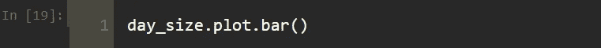
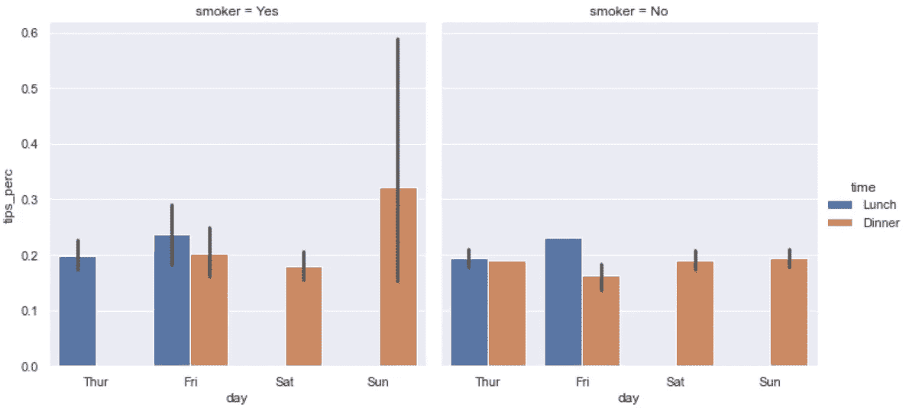

# 熊猫和海牛的数据可视化🎓

> 原文：<https://levelup.gitconnected.com/data-visualization-with-pandas-and-seaborn-5de444b567a0>

## 学习本帖中的方法，轻松画出统计图。

在 [Unsplash](https://unsplash.com?utm_source=medium&utm_medium=referral) 上由 [Austin Distel](https://unsplash.com/@austindistel?utm_source=medium&utm_medium=referral) 拍摄的照片

数据可视化是数据分析的重要步骤之一。Matplotlib 库和 Pandas 中的 plot 方法不足以绘制高级图形。为了更好和更容易地可视化数据，您可以使用 Seaborn 库，它在 Matplotlib 库上工作，并与 Pandas 兼容。许多统计图表很容易用 Seaborn 绘制。

在这篇文章中，我将向你展示如何用 Pandas 和 Seaborn 进行数据可视化。我将讨论以下主题:

*   线形图
*   条形图
*   直方图和密度图
*   散点图
*   如何绘制分类变量？

让我们开始吧！

 [## 蒂伦达兹学院

### 嗨，欢迎来到提伦达兹学院。Tirendaz 学院是一个在线教育平台，制作视频和写博客…

www.youtube.com](https://www.youtube.com/channel/UCFU9Go20p01kC64w-tmFORw) 

# 线形图

在讲线条图之前，我们先导入 Matplotlib，Pandas，Seaborn，和 Numpy 库。

为了内联查看图形，我将编写% matplotlib notebook magic 命令，并使用 sns.set()命令来设置图形样式。

> 你可以在下面的 GitHub 页面访问我在这里使用的 Jupyter 笔记本和数据集。

为了显示线图，让我们首先导入著名的 iris 数据集。

让我们在屏幕上打印数据集的前 5 行。

让我们在虹膜数据集中画一个花瓣长度的线图。

现在让我们画出所有列的线图。

如您所见，iris 数据集的数字列是使用 plot 方法绘制的，并且会自动添加一个图例。

# 条形图

条形图是可视化数据时最常用的图表之一。该图表通常在 y 轴上包含数值，在 x 轴上包含分类值。

bar 方法用于垂直显示条形，barh 函数用于水平显示条形。为了说明这一点，让我们首先创建一个系列数据。

我们来看看数据。

现在我们来画这个数据的柱状图。

这里的 color 参数用于确定列的颜色和可见性的 alpha 参数。您还可以横向查看数据列。让我们将列的颜色设为红色，并降低一点可见度。

现在让我们展示数据框的条形图。为了展示这一点，让我们创建一个数据集。

让我们看一下 df 数据集。

现在让我们画出这个数据集的柱状图。

您可以使用 stacked = True 参数创建堆积条形图。

请注意，在绘制条形图时，有时条形显示数据集中的值，有时显示数据集中的统计数据。现在，让我们使用数据集中变量的一些计算来绘制条形图。为了展示这一点，让我们导入 tips 数据集。您可以使用 Seaborn 库中的 load_datasets()方法加载该数据集。

让我们看看数据集的前五行。

让我们用交叉表方法处理数据集中的 size 和 days 列。

让我们来看看 day_size 变量。

让我们画出这个变量的柱状图。

你可以很容易地画出统计计算的图表。为了说明这一点，让我们计算每日小费的百分比，并将这些值添加到数据集中。

让我们来看看这个新的数据集。

您可以使用柱状图方法查看带误差线的每日小费百分比。

从图中可以看出，大部分小费是在周日和周五支付的。条形图方法具有色调参数。您可以使用此参数来允许分类值。

# 直方图和密度图

直方图是一种条形图，指示数据集中值的出现频率。我们来看看数据百分比出现的频率。

请注意，这里的每个条形代表观察值的数量。
如果你想绘制带有密度曲线的直方图，你可以使用带有 *kde=True* 参数的 histplot 方法。

# 散点图或点状图

散点图用于查看两个变量之间的关系。例如，让我们看看虹膜数据集中萼片长度和花瓣长度之间的关系。为此，可以在 Seaborn 中使用 regplot 方法。

您可以使用 pairplot()方法查看数据集中所有数值变量的二进制关系。

您可以看到带有色调参数的类别。

# 分面网格和分类数据

catplot 方法允许您绘制多个分类变量的图。例如，让我们处理 tips 数据集，并再次查看这个数据集。

如您所见，吸烟者、日期和时间变量是分类变量。现在让我们看看使用这些分类变量的小费百分比图。

我们按时间来分别看吸烟者和不吸烟者的情节。

请注意，晚上吸烟者的小费比例高于其他人，但这些人的置信区间相当宽，所以他们给的小费或高或低。

您可以在 catplot()方法中更改绘图类型。例如，您可以使用 kind = 'box '参数来查看箱线图。

箱线图也显示了异常值。您可以将框外的值视为异常值。

# 结论

数据可视化是数据分析最重要的状态之一。在这篇文章中，我谈到了如何用 Seaborn 和 Pandas 进行数据可视化。就是这样。我希望你喜欢它。感谢您的阅读。你可以在这里找到这个笔记本[。](https://github.com/TirendazAcademy/DATA-VISUALIZATION-WITH-PYTHON/blob/main/04-Data%20Visualization%20with%20Pandas%20and%20Seaborn.ipynb)

别忘了在[YouTube](https://www.youtube.com/channel/UCFU9Go20p01kC64w-tmFORw)|[GitHub](https://github.com/tirendazacademy)|[Twitter](https://twitter.com/TirendazAcademy)|[ka ggle](https://www.kaggle.com/tirendazacademy)|[LinkedIn](https://www.linkedin.com/in/tirendaz-academy)上关注我们

 [## 数据科学的 10 个最佳 Python 库

### 数据科学家应该知道的图书馆和学习它们的前 5 本书。

levelup.gitconnected.com](/top-10-python-libraries-and-5-best-books-for-data-science-fa0d0cf171a6)  [## 8 个最好的 Seaborn 可视化

### 使用企鹅数据集与 Seaborn 一起动手绘制统计图。

medium.com](https://medium.com/geekculture/8-best-seaborn-visualizations-20143a4b3b2f) 

*如果这篇文章有帮助，请点击拍手👏按钮几下，以示支持👇*