# 与熊猫一起实践数据可视化

> 原文：<https://levelup.gitconnected.com/data-visualization-with-pandas-in-action-1-98582b69ee8b>

## 数据可视化教程

## 使用绘图方法绘制条形图、直方图和箱形图。


[Lidya Nada](https://unsplash.com/@lidyanada?utm_source=medium&utm_medium=referral) 在 [Unsplash](https://unsplash.com?utm_source=medium&utm_medium=referral) 上拍摄的照片

作为一名数据科学爱好者，我最喜欢的数据分析阶段之一是数据可视化。当我可视化数据时，我感觉自己像个艺术家。数据可视化是数据分析的重要步骤之一。为了可视化数据，大多数人通常使用 Matplotlib 和 Seaborn。Pandas 是 Python 最重要的库之一，用于数据预处理和数据清理。你也可以使用《熊猫》中的方法来绘制情节。这些方法使您可以更容易地可视化系列和数据帧。在这篇文章中，我将讨论以下主题:

*   怎么用剧情法？
*   使用绘图方法绘制条形图
*   用绘图法绘制直方图
*   使用绘图方法绘制方框图

让我们开始吧！

[](https://www.youtube.com/channel/UCFU9Go20p01kC64w-tmFORw) [## 蒂伦达兹学院

### 嗨，欢迎来到提伦达兹学院。Tirendaz 学院是一个在线教育平台，制作视频和写博客…

www.youtube.com](https://www.youtube.com/channel/UCFU9Go20p01kC64w-tmFORw) 

# 怎么用剧情法？

绘图法是一种神奇的方法，可以帮助你更容易地绘制绘图。为了展示这个方法，让我导入必要的库。

```
import matplotlib.pyplot as plt
import numpy as np
import pandas as pd
```

请注意，您可以在这里找到笔记本和数据集[。接下来，让我们使用`%matplotlib inline` magic 命令来查看字里行间的图形。](https://github.com/TirendazAcademy/DATA-VISUALIZATION-WITH-PYTHON/blob/main/09-Data%20Visualization%20with%20Pandas%20-%20Part%201.ipynb)

```
%matplotlib inline
```

让我们选择 seaborn-white 样式作为图形样式。

```
plt.style.use("fivethirtyeight")
```

你可以用`plot`的方法在熊猫里画一个情节。让我们画一个简单的线图。首先，让我们创建一个序列，并使用`cumsum`方法将值相加。

```
data=pd.Series(np.random.randn(1000).cumsum())
```

现在让我们用`plot`方法画一个图。

```
data.plot()
```

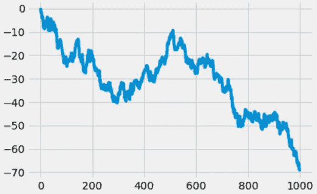

系列的折线图

# 数据帧的绘制方法

您也可以对数据帧使用`plot`方法。为了展示这一点，让我们创建一个数据帧。

```
df1 = pd.DataFrame(np.random.randn(100, 4),columns=list('ABCD'))
df1 = df1.cumsum()
```

让我们用`plot`方法画一个线图。

```
df1.plot()
```

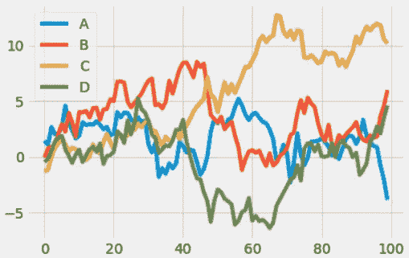

数据帧的线图

# 使用绘图方法绘制条形图

您也可以使用`plot`方法绘制条形图。例如，让我们取 df1 的前 10 行，用`kind='bar'`参数画出它的条形图。

```
df1.iloc[10].plot(kind='bar')
```

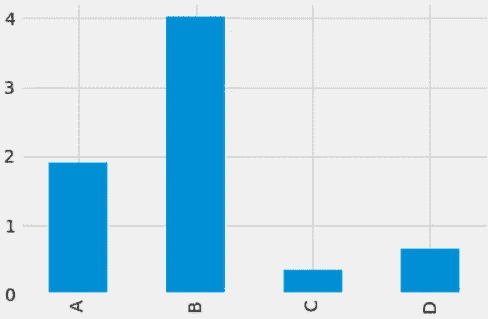

4 个变量的条形图

您可以通过使用`plot`方法的属性来绘制其他类型的图形。例如，让我们用`bar`属性来绘制条形图。

```
df1.iloc[10].plot.bar()
```

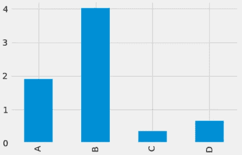

使用 plot.bar 方法绘制条形图

您也可以绘制多条图。让我们创建一个数据集来演示这一点。

```
df2=pd.DataFrame(np.random.rand(7,3), columns=list("ABC"))
```

现在，让我们用`bar`来绘制这 3 列的多条形图。

```
df2.plot.bar()
```

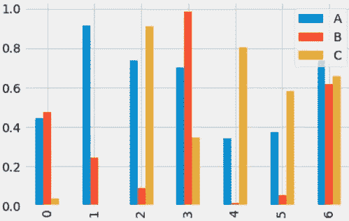

多条图

您也可以使用`stacked=True`参数绘制堆积条形图。

```
df2.plot.bar(stacked=True)
```

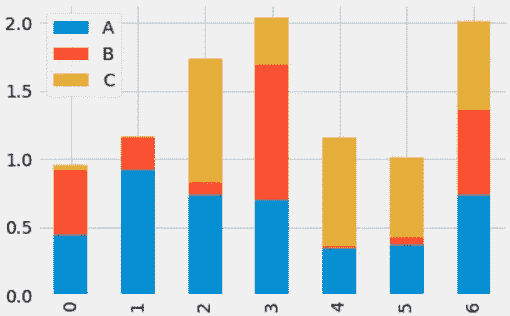

堆积条形图

`barh`方法用于水平查看条形。

```
df2.plot.barh(stacked=True)
```

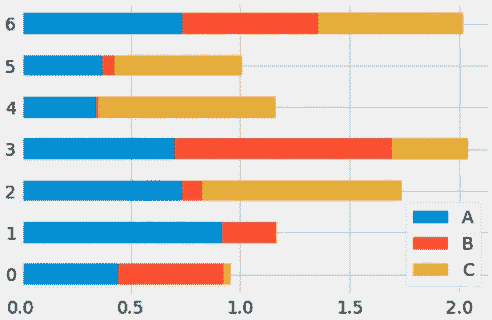

水平堆积条形图

# 使用 plot.hist 方法的直方图

您可以使用直方图通过`hist`方法查看数据的分布。为了证明这一点，让我们加载著名的虹膜数据集。

```
iris=pd.read_csv("iris.data", header=None)
iris.columns=["sepal_length","sepal_width", "petal_length", 
              "petal_width", "species"]
```

您可以在这里访问该数据集[。让我们看看这个数据集的前 5 行。](https://github.com/tirendazacademy/data-visualization-with-python)

```
iris.head()
```

在鸢尾数据集中有 4 个数值变量和一个分类变量，表示三种类型的鸢尾花。让我们用`hist`方法在同一个图中画出这些变量的直方图。

```
iris.plot.hist(alpha=0.7)
```

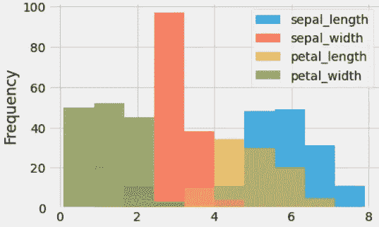

虹膜数据集中数值变量的直方图

要查看堆叠直方图，您可以使用`stacked=True`参数。

```
iris.plot.hist(alpha=1, stacked=True)
```

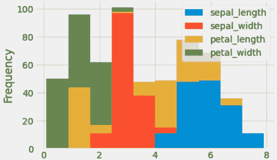

iris 数据集中数值变量的堆叠直方图

您也可以调整媒体夹的大小。为了说明这一点，让我们创建一个`bins`变量。

```
bins=25
```

现在让我们使用这个`bins`变量来绘制直方图。

```
iris.plot.hist(alpha=1, stacked=True, bins=25)
```

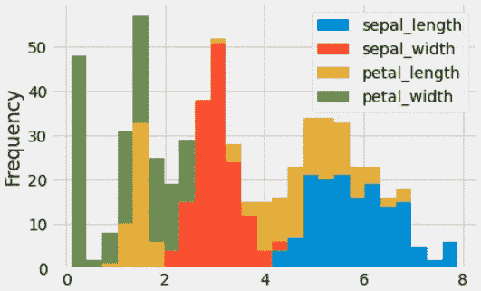

调整了方框宽度的直方图

您也可以使用`orientation = "horizontal"`参数水平绘制直方图。

```
iris["sepal_width"].plot.hist(orientation="horizontal")
```


水平直方图

您可以使用`diff`方法绘制一个直方图，其中包含每行值之间的差异。

```
iris["sepal_length"].diff().hist()
```

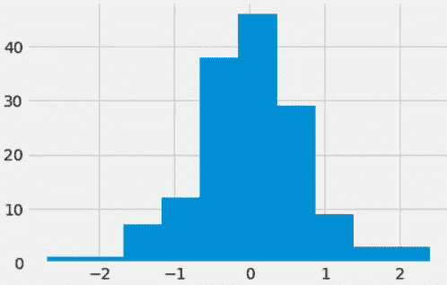

值之间差异的直方图

您可以为数据集中的每个变量绘制单独的直方图。

```
iris.hist(color="blue", alpha=1, bins=20)
```

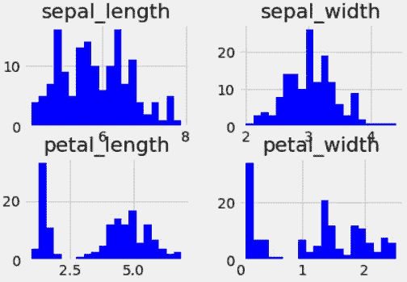

分离直方图

您可以使用`by`参数绘制花瓣长度中每个物种的直方图。

```
iris.hist("petal_length",by="species")
```

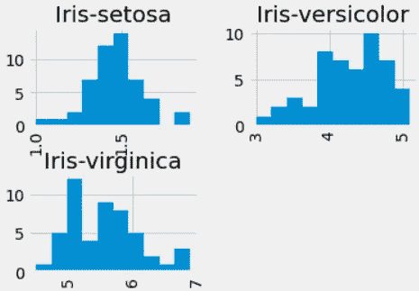

每个物种花瓣长度的直方图

# 使用 plot.box 方法绘制方框图

箱形图显示了连续变量的分布。此图允许您查看分布的范围、中值、峰度、偏斜度和异常值。在 Pandas 中，您可以对系列和数据帧使用`plot.box`方法。

```
iris.plot.box()
```

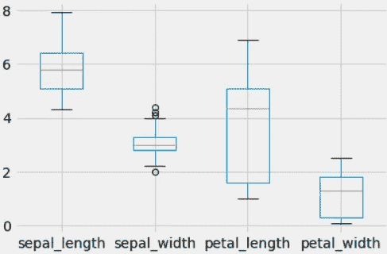

数值变量的箱线图

您还可以调整图中的方框、触须、中线和端点的颜色。为了说明这一点，让我们以一个名为`color`的变量为例。

```
colors={'boxes': 'Red', 'whiskers': 'blue','medians': 'Black', 'caps': 'Green'}
```

现在让我们将这个变量传递给`plot.box`方法。

```
iris.plot.box(color=colors)
```

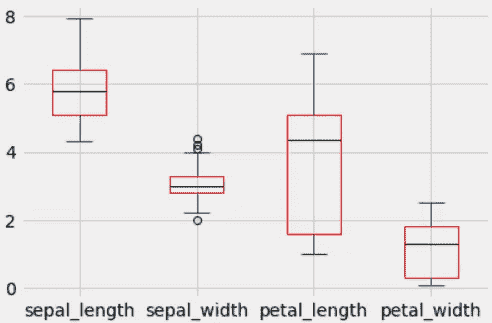

彩色盒状图

您也可以通过`vert=False`参数水平绘制方框图。

```
iris.plot.box(vert=False)
```

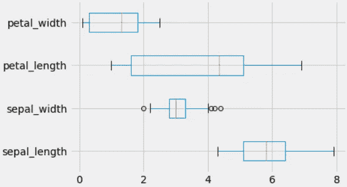

水平箱线图

# 使用箱线图方法绘制箱线图

您可以使用 boxplot 方法来绘制盒状图。boxplot 方法允许您绘制数据集每一列的盒状图。

```
iris.boxplot()
```

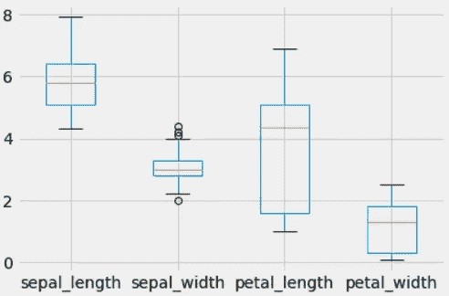

使用箱线图方法绘制箱线图

您可以绘制分组数据的盒状图。例如，让我们为 iris 数据集中的每个数值变量单独绘制类型`by`参数。在画这个情节之前，我们先确定一下情节的主题。

```
plt.rcParams["figure.figsize"]=(8,8)
plt.style.use("ggplot")
```

接下来，我将使用`by`参数为 iris 数据集中的每个数值变量绘制箱线图。

```
iris.boxplot(by='species')
```

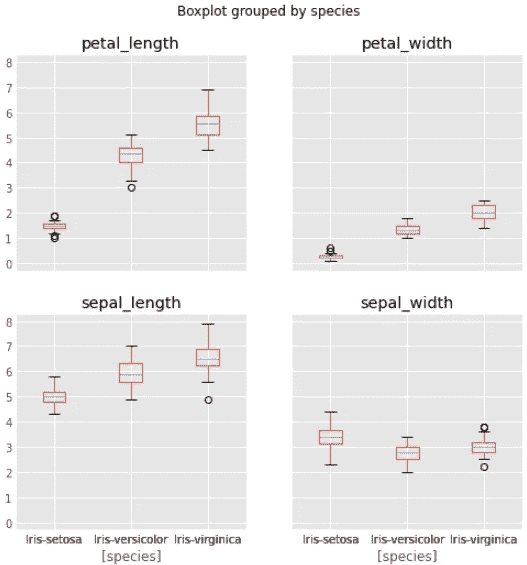

iris 数据集中每个数值变量的方框图

# 结论

您可以在 Pandas 中使用`plot`方法进行数据可视化。这种方法可以让您更容易地绘制图形。就是这样。我希望你喜欢它。感谢您的阅读。你可以在这里找到这本笔记本[。别忘了关注我们的](https://github.com/TirendazAcademy/DATA-VISUALIZATION-WITH-PYTHON/blob/main/09-Data%20Visualization%20with%20Pandas%20-%20Part%201.ipynb)[YouTube](https://www.youtube.com/channel/UCFU9Go20p01kC64w-tmFORw)|[GitHub](https://github.com/tirendazacademy)|[Twitter](https://twitter.com/TirendazAcademy)|[ka ggle](https://www.kaggle.com/tirendazacademy)|[LinkedIn](https://www.linkedin.com/in/tirendaz-academy)


[提伦达兹艾](https://tirendazacademy.medium.com/?source=post_page-----98582b69ee8b--------------------------------)

## 用 Python 实现数据可视化

[View list](https://tirendazacademy.medium.com/list/data-visualization-with-python-72919ad57b84?source=post_page-----98582b69ee8b--------------------------------)11 stories

*如果这篇文章有帮助，请点击拍手👏按钮几下，以示支持👇*