# 熊猫数据可视化的绘图方法

> 原文：<https://levelup.gitconnected.com/data-visualization-with-pandas-in-action-part-2-2cc8674da1d0>

## 数据可视化

## 面积图、散点图、六边形箱线图、饼图、密度图、散点图。


[本·怀特](https://unsplash.com/@benwhitephotography?utm_source=medium&utm_medium=referral)在 [Unsplash](https://unsplash.com?utm_source=medium&utm_medium=referral) 上拍照

数据可视化是数据分析中最令人愉快的阶段之一。Pandas 是用于数据预处理和数据清理的最常用的 Python 库之一。Matplotlib 和 Seaborn 等库经常用于可视化数据。但是，你可以很容易地用熊猫形象化系列和数据框架。

[在我的上一篇文章](/data-visualization-with-pandas-in-action-1-98582b69ee8b)中，我展示了如何使用`plot`方法，并谈到了使用这种方法的条形图、直方图和盒状图。在这篇文章中，我将讨论以下主题:

*   面积图
*   散点图
*   六边形箱线图
*   饼图
*   密度图
*   散布矩阵图

让我们开始吧！

[](https://www.youtube.com/channel/UCFU9Go20p01kC64w-tmFORw) [## 蒂伦达兹学院

### 嗨，欢迎来到提伦达兹学院。Tirendaz 学院是一个在线教育平台，制作视频和写博客…

www.youtube.com](https://www.youtube.com/channel/UCFU9Go20p01kC64w-tmFORw) 

# 面积图

通过填充完成线下方的空间来绘制面积图。请注意，对于面积图，每列必须是正数或负数。为了显示面积图，让我们导入必要的库。

```
import matplotlib.pyplot as plt                       
import numpy as np                       
import pandas as pd
```

让我将 seaborn-white 样式设置为图形样式。

```
plt.style.use("fivethirtyeight")
```

您可以使用`plot.area`方法绘制面积图。为了展示这个方法，让我创建一个数据帧。

```
df = pd.DataFrame(np.random.rand(10, 4), columns=list("ABCD"))
df.head()
```

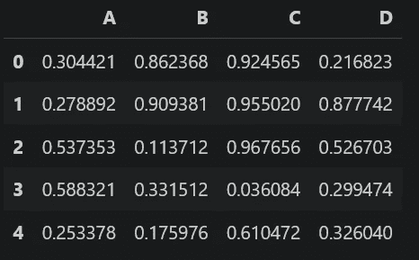

数据帧的前五行

请注意，您可以在这里找到笔记本和数据集[。让我们只为这个数据集中的一个变量绘制一个面积图。](https://github.com/TirendazAcademy/DATA-VISUALIZATION-WITH-PYTHON/blob/main/10-Data%20Visualization%20with%20Pandas%20-%20Part%202.ipynb)

```
df['A'].plot.area()
```

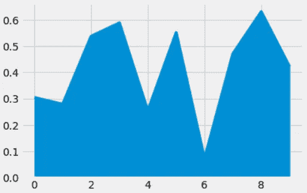

一个变量的面积图

让我们画出所有柱子的面积图。

```
df.plot.area()
```

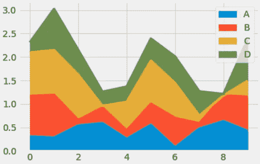

多变量面积图

默认情况下，面积图是堆叠的。要绘制未堆叠的图，可以使用`stacked = False`参数。

```
df.plot.area(stacked=False)
```

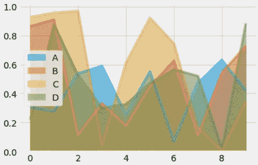

未堆叠面积图

请注意，如果有丢失的数据，该值会自动设置为零。此外，您可以使用`fillna`方法删除丢失的数据。

让我们继续使用名为 iris 和 movies 的真实数据集。你可以点击下载这些数据集[。首先，我将使用`read_csv`方法加载著名的虹膜数据集。](https://github.com/TirendazAcademy/DATA-VISUALIZATION-WITH-PYTHON/tree/main/Datasets)

```
iris=pd.read_csv("iris.data", header=None)
```

数据集中没有列名。让我们用`columns`方法命名数据集的列。

```
iris.columns=["sepal_length","sepal_width", "petal_length", 
              "petal_width", "species"]
```

让我们看看带有`dtypes`属性的数据集的列类型。

```
iris.dtypes
```

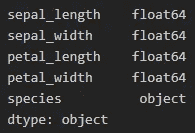

iris 数据集的前四列是数字，最后一列是分类。现在让我们用`plot.area`方法画出数值数据的面积图。

```
iris.plot.area()
```


虹膜数据集的面积图

让我们用`stacked=False`参数绘制变量的非堆叠图。

```
iris.plot.area(stacked=False)
```

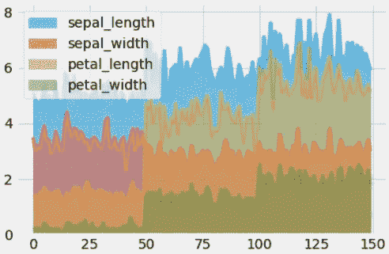

iris 数据集的未堆叠面积图

# 散点图

散点图用于查看两个数值变量之间的关系。`plot.scatter`方法用于绘制散点图。让我们用这种方法在 df 数据集中绘制变量 A 和 B 之间的散点图。

```
df.plot.scatter(x='A', y='B')
```

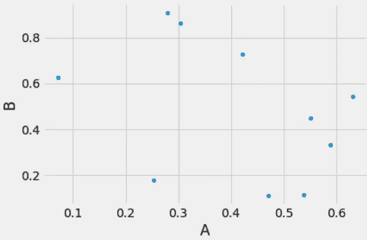

散点图

现在让我们使用 IMDb 数据集来显示散点图。首先，让我们用`read_csv`方法加载这个数据集。

```
movies=pd.read_csv("imdbratings.txt")
```

让我们用`head`方法来看看这个数据集的第一行。

```
movies.head()
```


imdb 评级数据集的前几行

让我们看看数据集中的列类型。

```
movies.dtypes
```

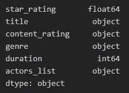

变量类型

注意变量`star_rating`和`duration`是数字。让我们用`plot.scatter`方法画出这两个变量的散点图。

```
movies.plot.scatter(x='star_rating', y='duration')
```

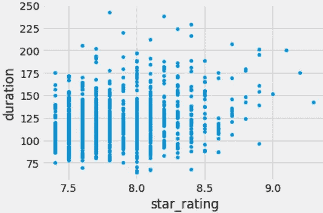

您可以使用`plot`方法两次绘制图中两对变量的散点图。让我们在同一个图上查看 iris 数据集中`sepal_length`和`sepal_width`以及`petal_length`和`petal_width`变量的散点图。为此，让我们首先创建一个名为`ax`的变量，并用这个变量`ax`绘制散点图。

```
ax=iris.plot.scatter(x='sepal_length', y='sepal_width', 
                     color='Blue', label='sepal')
iris.plot.scatter(x='petal_length', y='petal_width', color='red', 
                  label='petal', ax=ax)
```

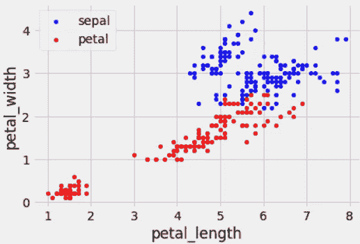

两对变量的散点图

如果您想在比较两个变量时设置每个点的颜色，您可以如下编写参数`c`:

```
iris.plot.scatter(x='sepal_length', y='sepal_width', 
                  c='petal_length', s=100)
```

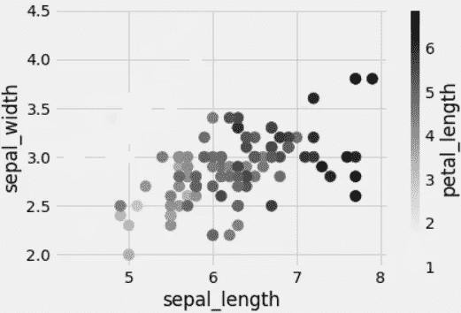

您可以使用`s`参数调整图上每个点的大小。

```
iris.plot.scatter(x='sepal_length', y='sepal_width', 
                  s=iris['petal_length'] * 50)
```

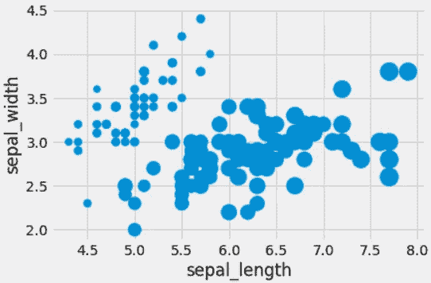

# 六边形箱线图

如果数据中的观察值数量很大，您可以使用六边形图，而不是使用`plot.hexbin`方法的散点图。让我们画出电影数据集中的`star_rating`和`duration`变量的六边形面元图。

```
movies.plot.hexbin(x="star_rating", y="duration", gridsize=25)
```

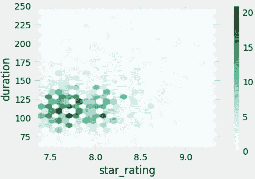

六边形箱线图

要确定 x 轴上六边形的数量，您可以使用`gridsize`参数。默认情况下，该值为 100。让我们将`gridsize`设置为 10。

```
movies.plot.hexbin(x="star_rating", y="duration", gridsize=10)
```


六边形箱线图

请记住，因为我们设置为`gridsize=10`，六边形变得更大。

# 饼图

饼图是只能显示一个数据系列的圆形统计图。您可以使用`plot.pie`方法绘制系列和数据框的饼图。让我们用虹膜数据集来展示这个图。首先，我将选择`petal_width`变量，并通过变量`species`对数据集进行分组。

```
iris_avg=iris["petal_width"].groupby(iris["species"]).mean()
iris_avg
```

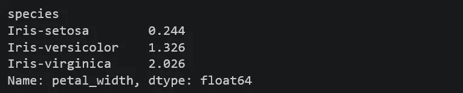

现在让我们用`plot.pie`方法绘制一个饼状图。

```
iris_avg.plot.pie()
```

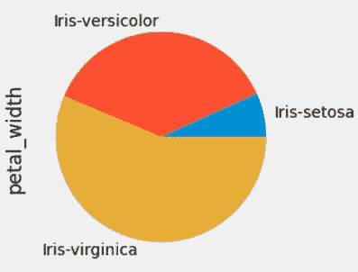

现在让我们画出 iris 数据集的两个数值变量的饼状图，我们根据变量种类对它们进行了分组。首先，让我们创建名为`iris_avg_2`的变量。

```
iris_avg_2=iris[["petal_width", 
                 "petal_length"]].groupby(iris["species"]).mean()
```

现在，让我们为这个数据集的每一列分别绘制一个饼图。对于数据帧数据的饼图，要么输入特定的 a `y`值，要么使用`subplots = True`参数。

```
iris_avg_2.plot.pie(subplots=True)
```

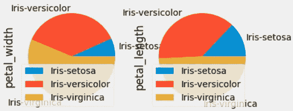

您还可以设置其他属性，如饼图中的标签。例如，让我们处理`iris_avg`数据，并用默认值绘制该数据的饼图。

```
iris_avg.plot.pie()
```

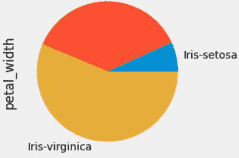

现在让我们设置属性。

```
iris_avg.plot.pie(labels=["setosa","versicolor", "virginica"], 
                  colors=list("brg"), fontsize=25, figsize=(10,10))
```

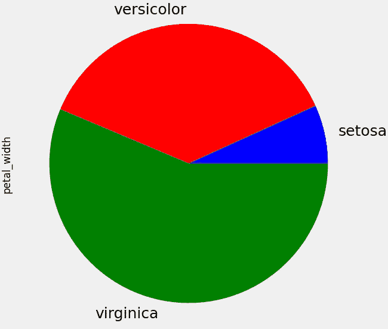

要查看饼图切片的百分比，您可以使用`autopct='%.2f'`参数。

```
iris_avg.plot.pie(labels=["setosa","versicolor", "virginica"],   
                  colors=list("brg"),
                  autopct='%.2f', 
                  fontsize=25, 
                  figsize=(10,10))
```

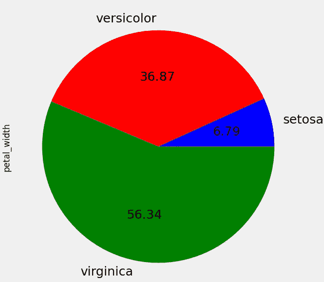

# 密度图

密度图允许可视化一个或几个组的数值变量的分布。您可以使用`plot.kde`方法绘制密度图。此方法可用于序列和数据帧。让我们绘制 iris 数据集中数值变量的密度图。

```
iris.plot.kde()
```

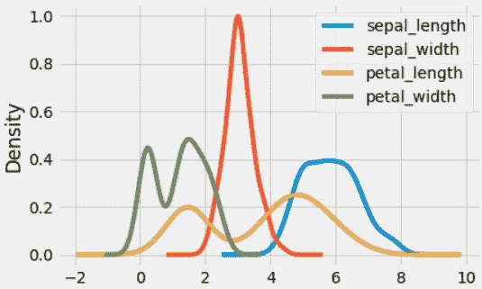

密度图

# 散布矩阵

在多元统计和概率论中，散布矩阵是用于估计协方差矩阵的统计量。您可以使用`scatter_matrix`方法绘制散布矩阵。我们先从`pandas.plotting`导入这个方法。

```
from pandas.plotting import scatter_matrix
```

现在让我们看看电影数据集中数字列的散布矩阵。

```
scatter_matrix(movies, alpha=0.5, diagonal='kde')
```

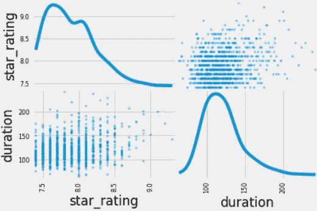

散布矩阵

# 结论

可以使用 Pandas 中的`plot`方法进行数据可视化。这种方法可以让您更容易地绘制图形。在这篇文章中，我用这种方法讲了面积图，散点图，六边形面元图，饼图，密度图，散点图。就是这样。我希望你喜欢它。感谢您的阅读。你可以在这里找到这个笔记本[。别忘了关注我们的](https://github.com/TirendazAcademy/DATA-VISUALIZATION-WITH-PYTHON/blob/main/09-Data%20Visualization%20with%20Pandas%20-%20Part%201.ipynb)[YouTube](https://www.youtube.com/channel/UCFU9Go20p01kC64w-tmFORw)|[GitHub](https://github.com/tirendazacademy)|[Twitter](https://twitter.com/TirendazAcademy)|[ka ggle](https://www.kaggle.com/tirendazacademy)|[LinkedIn](https://www.linkedin.com/in/tirendaz-academy)


[提伦达兹艾](https://tirendazacademy.medium.com/?source=post_page-----2cc8674da1d0--------------------------------)

## 用 Python 实现数据可视化

[View list](https://tirendazacademy.medium.com/list/data-visualization-with-python-72919ad57b84?source=post_page-----2cc8674da1d0--------------------------------)11 stories

*如果这篇文章有帮助，请点击拍手👏按钮几下，以示支持👇*