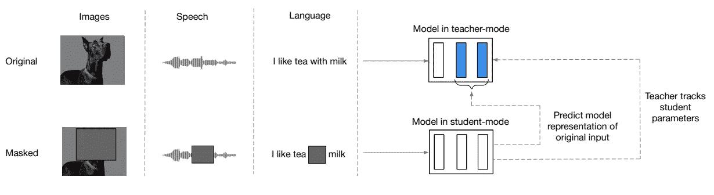
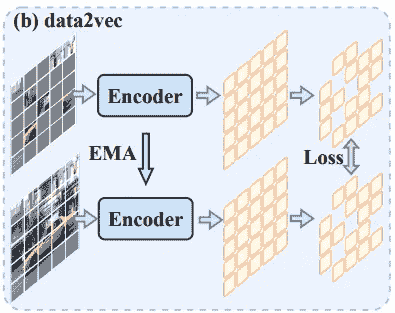
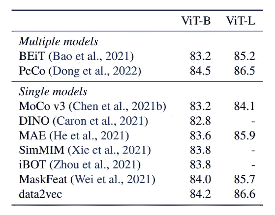
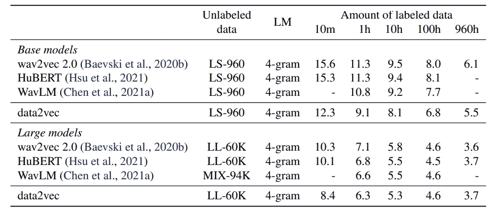
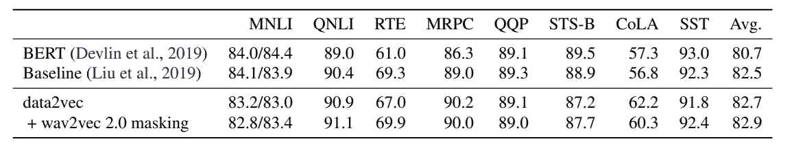
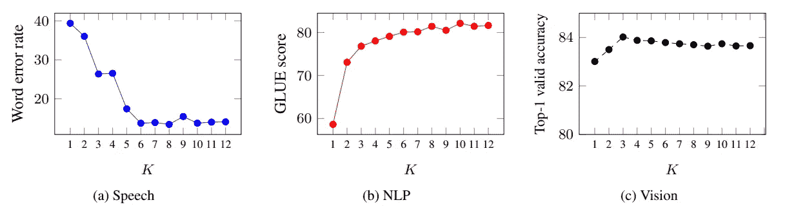

# Data2vec:一个 AI 统治一切

> 原文：<https://levelup.gitconnected.com/data2vec-one-ai-to-rule-all-6c9be729331d>

## 一个可以跨模态自我学习的模型

作者用 OpanAI DALL-E 创建的图像

人工智能在不同领域(成像、文本分析、语音等)实现了令人难以置信的能力。然而，这些模型一次只能分析一种类型的输入。但是这个世界并不是单一模态的，Data2vec 就是基于这个想法构建的。它是如何工作的？新版本有什么变化？为什么重要？

本文试图回答这些问题。

# 监督学习与自我监督学习

[**监督学习**](https://en.wikipedia.org/wiki/Supervised_learning)**【SL】**可能是最知名的，也是历史上使用最广泛的深度学习类型。另一方面，这也是当前人工智能研究的一个瓶颈:实际上，SL 需要大量已经被标注的数据。

这并不总是可能的(例如，如果您想要为低资源语言构建一个翻译器，或者当获取数据非常昂贵时，等等)。此外，今天的模型是用大量数据训练的，这需要付出巨大的努力才能注释万亿字节的数据。

如前所述，人类通过观察世界或与世界互动来学习。在我们的一生中，我们观察、提出假设，并通过反复试验来检验我们的想法是否正确。

> “人类如何能够在几乎没有监督的情况下，在大约 20 小时的练习中学会驾驶汽车，而完全自动驾驶仍然无法通过人类驾驶员数千小时的数据训练我们最好的人工智能系统？”— [来源](https://ai.facebook.com/blog/self-supervised-learning-the-dark-matter-of-intelligence/)

图片由[为什么 kei](https://unsplash.com/fr/@whykei) 在 unsplash.com

人类利用他们对世界的先验知识来执行新的任务。因此， [**自我监督学习**](https://en.wikipedia.org/wiki/Self-supervised_learning) (SSL)的想法是模仿这种先验知识，让 AI 发展出一种“常识”

更具体地说，一些例子:

*   在 NLP 中，一种训练模型的技术是屏蔽句子中的单词，并要求模型使用句子中的剩余单词作为上下文来预测它。
*   通过提供其他帧来猜测视频的下一帧。

其思想是，模型可以使用数据本身的结构得出正确的答案，并识别数据中的模式，使其能够理解如何执行任务(并且不需要标签！).

这些模型(如 [BERT](https://en.wikipedia.org/wiki/BERT_(language_model)) 及其所有后代)的美妙之处在于，它们可以用于不同的任务([迁移学习](https://en.wikipedia.org/wiki/Transfer_learning))。例如，它们可以针对分类进行微调，在这种情况下，只需要几个带有标签的示例。**事实上，这个模型保留了一些关于语言及其句法规则的知识，这些知识可以用于所有涉及语言的任务。**

# DATA2VEC:一种多模态数据的自监督算法

马库斯·温克勒在 unsplash.com 拍摄的图片

**SSL 算法已经成功地用于自然语言处理、语音和计算机视觉。**局限性在于，这些算法中的每一个都只针对一种数据形态进行了训练(因此，针对文本训练的算法不能推广到另一种形态，例如图像)。

同样，成功创建一个可以同时使用多种模态的模型也不容易。例如，在医学中同时考虑放射科医生的笔记(文本)和 x 光片(图像)可能是有用的。**此外，我们希望有一个同时考虑世界不同方面的模型。**

> Data2vec 简化了这一过程，它通过训练模型来预测它们自己的输入数据表示，而不考虑模态— [来源](https://ai.facebook.com/blog/the-first-high-performance-self-supervised-algorithm-that-works-for-speech-vision-and-text/)

图片来自原文章([来源](https://arxiv.org/pdf/2202.03555.pdf))

那么它是如何工作的呢？无论何种形式的输入(图像、文本、语音)，该模型都以相同的方式工作。该过程包括两个步骤:

*   **在教师模式**中，原始输入(一段文本、一幅图像、一段语音)被呈现给教师模型(一个编码器)，教师模型计算目标表示。
*   在第二步或**学生模式**中，输入的一部分被屏蔽(一段文本中的一个单词，一个图像的片段)。在这一点上，模型(学生，另一个编码器)必须预测教师的潜在表示(除了输入被部分屏蔽，模型是相同的，只有权重略有改变)。

图像来源([此处为](https://arxiv.org/pdf/2208.00449.pdf))

换句话说，在学生模式下，模型试图通过重建老师已经理解的内容来发展自己对数据的理解。

该架构基本上是一个变压器。在用作输入之前，数据经过以下处理:

*   **文本**，以及子词标记化(就像在经典的 transformer 中一样)。
*   **图像**被分成小块(每幅图像 16 x16 个小块)。
*   **语音**，数据使用一维卷积网络进行转换。

伯特有什么不同？伯特预言了“蒙面”这个词。在这个模型中，**巧妙之处在于它预测了语境化的信息**。转换器实际上使用了自我注意，这意味着在教师模式下学习的单词的表示是与周围的输入信息相关联的(因此模型不仅必须预测准确的单词，还必须预测特定上下文中的单词)。

**为什么这很重要？**例如，“跑步”这个词可以有不同的意思(“约翰在公园跑步”或者“约翰在竞选总统”)。许多英语单词可能有不同的意思(有些甚至超过 50 个)，而上下文是理解句子意图的关键。

他们的结果表明，该模型在所有三种模态上都比当前模型具有更好的性能:

**图像**:精度越高越好(该模型也比其他模型训练的时期少)

图片来自原文章([来源](https://arxiv.org/pdf/2202.03555.pdf))

**语音**:错误率更低([休伯特](https://arxiv.org/abs/2106.07447)和 [wav2vec](https://arxiv.org/abs/2006.11477) 其实也是 META 做的模型)

图片来自原文章([来源](https://arxiv.org/pdf/2202.03555.pdf))

**正文**:他们对[胶水](https://gluebenchmark.com/)进行了测试(数值越高意味着性能越好)

图片来自原文章([来源](https://arxiv.org/pdf/2202.03555.pdf))

最后，他们表明使用前 k 个块(层)而不是最后一个块进行预测更好

图片来自原文章([来源](https://arxiv.org/pdf/2202.03555.pdf))

总的来说，该模型在所有三种模式下都表现良好。正如作者所指出的，仍然缺少的是一种不可知的预处理方法(这里，在用作模型的输入之前，每个模式仍然是单独处理的)。

# DATA2VEC 2.0:有什么新内容？

Meta 最近公布了 Data2vec 的新版本。但是什么改变了呢？

META 研究人员宣称，新版本更快。他们声称该模型比以前的版本快 16 倍，但性能也更好(达到了与计算机视觉中的 SOTA 算法相同的性能)。此外，该模型与 RoBERTa 一样准确，但它有一半的时间是在训练中(相当令人印象深刻)。

他们是如何做到的？

> 我们在几个方面提高了原始 data2vec 算法的效率:首先，我们采用为特定训练示例构建的目标表示，并在屏蔽版本中重用它们(其中我们隐藏了训练示例的不同随机部分)。我们将每个版本输入到学生模型中，该模型为不同的屏蔽版本预测相同的上下文化目标表示。第二，类似于[屏蔽自动编码器](https://l.facebook.com/l.php?u=https%3A%2F%2Farxiv.org%2Fabs%2F2111.06377&h=AT2IJZiHNdcbK34gDslqz6quHqd0xzrXPCw-sUtV4jmPFZAvtvnA3_Hp9WG-F2aCzySGU47WqCwNd9y5IG03XFUwwE4XKKh0uzSmlloIOi6DUNv6IylNpqQ7Lo_r-C7uqeBxkk0bQgyTOVgL)，我们不为训练示例中被删除的部分运行学生编码器网络(在我们的例子中，大约是图像的 80%)，从而节省大量计算周期。最后，我们使用一种更有效的解码器模型，它不依赖于变压器网络，而是依赖于多层卷积网络。— [来源](https://ai.facebook.com/blog/ai-self-supervised-learning-data2vec/)

简而言之，输入数据在输入模型之前准备得更充分。第二，学生模型不再是编码器，而是卷积网络(显然更快)。因此，这个版本的主要改进是更高的速度和更低的计算成本。

这个版本也是开源的(GitHub 链接:[此处](https://github.com/facebookresearch/fairseq/tree/main/examples/data2vec)；HuggingFace for data2vec: [此处](https://huggingface.co/docs/transformers/model_doc/data2vec)

# **关闭思路**

[多模态学习](https://en.wikipedia.org/wiki/Multimodal_learning)很可能是 2023 年 AI 的新前沿。毕竟这是人类学习的方式(比如读一篇课文，如果配上插图就容易理解多了)。此外，不是所有的问题都可以只用一种模式来回答。

多模态人工智能将在许多领域产生变革性的影响。例如，在医学领域，一个病人存在多种类型的数据(图像、基因组数据、医疗记录等)，人们寻求找到一个使用所有这些来源的模型。

Data2vec 是一种方法，其中单个神经网络能够处理不同的模态(在适当的预处理之后),并保留关于数据的信息。此外，Data2vec 演示了 SSL 如何能够跨不同的域工作。

[严乐存认为](https://www.youtube.com/watch?v=Wb3cnG0o7b8)SSL 是人工通用智能的关键(AGI)。明年我们很可能会看到集成非结构化数据(如图表)的模型和具有不可知预处理的模型。

# 如果你觉得有趣:

你可以寻找我的其他文章，你也可以 [**订阅**](https://salvatore-raieli.medium.com/subscribe) 在我发表文章时获得通知，你也可以在**[**LinkedIn**](https://www.linkedin.com/in/salvatore-raieli/)**上连接或联系我。**感谢您的支持！**

**这是我的 GitHub 知识库的链接，我计划在这里收集代码和许多与机器学习、人工智能等相关的资源。**

** [## GitHub - SalvatoreRa/tutorial:关于机器学习、人工智能、数据科学的教程…

### 关于机器学习、人工智能、数据科学的教程，包括数学解释和可重复使用的代码(python…

github.com](https://github.com/SalvatoreRa/tutorial) 

或者看看我的另一篇文章:

 [## 人工智能的崛起:2022 年展望

### 创新与颠覆:2022 年人工智能的展望

pub.towardsai.net](https://pub.towardsai.net/the-rise-of-ai-a-look-at-the-2022-landscape-956e7e3f1839)  [## 梅塔的西塞罗:在外交上击败人类

### 一个能够在信任和背叛的游戏中与你交谈、说服并击败你的模型

medium.com](https://medium.com/mlearning-ai/metas-cicero-beating-humans-at-diplomacy-298fd1b365d7)  [## META 的 PEER:一个协作语言模型

### 与人工智能合作编写和编辑文本

pub.towardsai.net](https://pub.towardsai.net/metas-peer-a-collaborative-language-model-a58a5dd709fe)  [## 人工智能如何帮助保存艺术品

### 艺术杰作随时都是风险；人工智能和新技术可以助一臂之力

towardsdatascience.com](https://towardsdatascience.com/how-ai-could-help-preserve-art-f40c8376781d)**