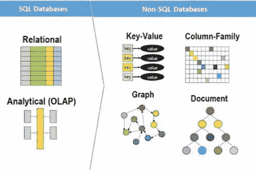
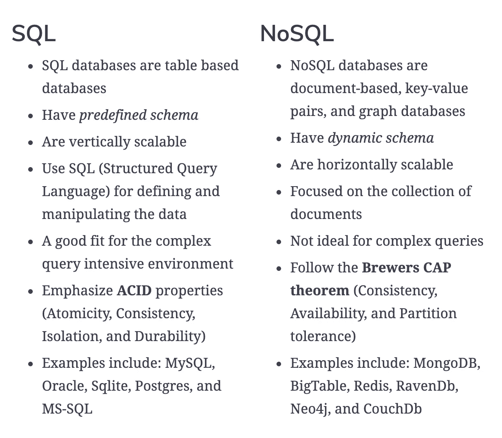
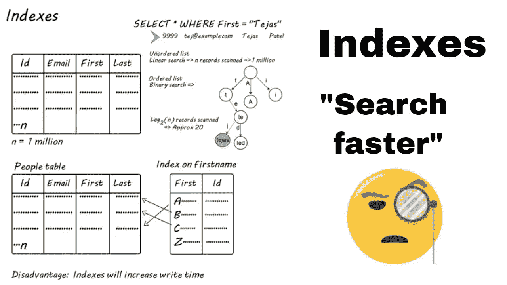
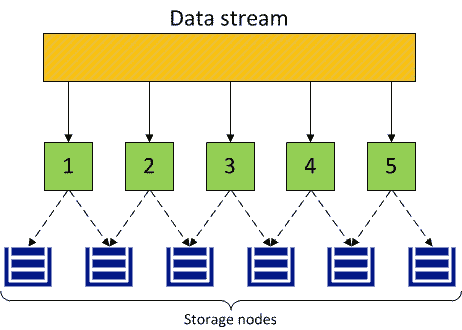
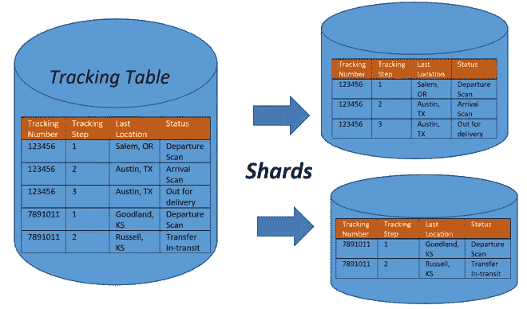

# 大型系统设计中的数据库问题

> 原文：<https://levelup.gitconnected.com/database-concerns-in-large-system-design-3f84b6331ff9>

## 数据库索引、复制和分片

克里斯蒂娜@ wocintechchat.com 在 [Unsplash](https://unsplash.com?utm_source=medium&utm_medium=referral) 上的照片

当我们设计一个大型系统时，数据库是我们必须考虑的核心部分之一。设计桌子方案不仅仅是我们所寻求的。我们可能不得不在**大型**上花费更多时间，这意味着每秒数百万次读/写请求。在本文中，我将介绍设计这个大型数据库的主要关注点，以帮助您确定系统设计任务或面试。

本文的主题是或，面向那些想了解大型可伸缩数据库系统的读者。如果您是数据库初学者，我相信在回到本文之前，您可以找到更多的其他基础资源。

# SQL 与 NoSQL

来源:[https://www.thorntech.com/2019/03/sql-vs-nosql/](https://www.thorntech.com/2019/03/sql-vs-nosql/)

## 概念

**SQL** 是一个以行和列存储数据的关系数据库。每行包含一个实体的所有信息，每列包含所有单独的数据点。

**NoSQL** 是非关系数据库，它不是以表格的形式构建的。大多数时候，数据是基于文档的，具有键值对，并且没有模式。

## 比较:

来源:[https://www . educative . io/edpresso/a-comparison-SQL-or-no SQL-databases](https://www.educative.io/edpresso/a-comparison-sql-or-nosql-databases?utm_source=Google%20AdWords&aid=5082902844932096&utm_medium=cpc&utm_campaign=kb-dynamic-edpresso&gclid=Cj0KCQjw5eX7BRDQARIsAMhYLP9Q0PlcXGPSeYZkx0JfvU5vBBolorGHxx0PKHgLEtb3u7yJSvIeACQaAuK-EALw_wcB)

## 用法:

**使用 SQL 数据库的理由:**

1.  我们需要确保酸性合规性。ACID 合规性通过准确规定事务与数据库的交互方式，减少了异常并保护了数据库的完整性。通常，NoSQL 数据库为了可伸缩性和处理速度而牺牲了 ACID 遵从性，但是对于许多电子商务和金融应用程序，ACID 遵从性数据库仍然是首选。
2.  您的数据是结构化的，不会改变。如果您的企业没有经历需要更多服务器的大规模增长，并且如果您只处理一致的数据，则可能没有理由使用旨在支持各种数据类型和高流量的系统。

**使用 NoSQL 数据库的理由:**

1.  存储大量数据，这些数据通常很少甚至没有结构。NoSQL 数据库对我们可以一起存储的数据类型没有限制，并允许我们根据需要的变化添加新的类型。使用基于文档的数据库，您可以将数据存储在一个地方，而不必预先定义数据的“类型”。
2.  充分利用云计算和存储。基于云的存储是一种非常节省成本的解决方案，但需要数据能够轻松地分布在多个服务器上以进行扩展。在现场或云中使用商用(价格合理、体积较小)硬件可以省去额外软件的麻烦，而 Cassandra 等 NoSQL 数据库的设计宗旨是开箱即可跨多个数据中心扩展，不会带来很多麻烦。
3.  快速发展。NoSQL 对于快速开发非常有用，因为它不需要提前准备。如果您正在进行系统的快速迭代，这需要对数据结构进行频繁的更新，并且在版本之间没有大量的停机时间，那么关系数据库会降低您的速度。

**注**:

内存缓存具有弱一致性—您写，您可能不读。

NoSQL 有最终的一致性——你写，过一会儿你读。

SQL 具有很强的一致性——无论何时写，都能立即阅读。

如此多的 NoSQL 系统具有最终一致性的原因是，几乎所有的系统都被设计为分布式的，对于完全分布式的系统，维护严格一致性的开销是超线性的(这意味着在事情开始变慢之前，您只能扩展到这个程度，当事情变慢时，您需要投入更多的硬件来解决问题以保持扩展)。

 [## SQL 与 NoSQL —对于您的数据库需求，什么是最佳选择？—索恩科技公司

### 这是我们云系列大数据的第三篇文章。你可以在这里阅读前两条:获得我们的通知…

www.thorntech.com](https://www.thorntech.com/2019/03/sql-vs-nosql/) 

# 数据库索引

[资料来源:Tejas Patel](https://www.youtube.com/watch?v=Le74ewlajxg)

## 概念:

*   索引是一个**数据结构**，它可以被理解为一个目录表，将我们指向实际数据所在的位置。当我们在一个表的一列上创建一个索引时，我们将该列和一个指向整行的指针存储在索引中。数据结构可以是 BST 或 B +树，这有助于在表中轻松搜索。
*   在如此大的数据集中找到一个小的有效负载可能是一个真正的挑战，因为我们不可能在任何合理的时间内迭代那么多数据。此外，如此大的数据集很可能分布在多个物理设备上，这意味着我们需要某种方法来找到所需数据的正确物理位置。索引是实现这一点的最佳方式。

## 权衡:

*   索引可以极大地加快数据检索的速度，但是由于额外的键，索引本身可能会很大，从而降低数据插入和更新的速度。当添加行或更新带有活动索引的表的现有行时，我们不仅要写入数据，还要更新索引。这将降低写入性能。

## 示例:

如果插入一个没有索引的记录，通过在末尾追加值将花费 O(1)时间，如果有许多二分搜索法/ B+树索引，每个插入将花费 O(log N)时间。所以限制索引的数量是至关重要的。如果系统的读取量很大，最好有索引

# 数据冗余和复制(读取)

[来源:Virtuozzo](https://docs.virtuozzo.com/virtuozzo_infrastructure_platform_3_installation_guide/planning-infrastructure/understanding-data-redundancy.html)

## 概念:

*   冗余是系统关键组件或功能的复制，目的是增加系统的可靠性，通常以备份或故障安全的形式，或提高实际系统性能。例如，如果某个文件只有一个副本存储在一台服务器上，那么失去该服务器就意味着失去该文件。由于丢失数据很少是一件好事，我们可以创建文件的重复或冗余副本来解决这个问题。
*   冗余在消除系统中的单点故障方面起着关键作用，并在危机中需要时提供备份。例如，如果我们有两个服务实例在生产环境中运行，其中一个出现故障，系统可以故障转移到另一个。
*   复制在许多数据库管理系统(DBMS)中广泛使用，通常在原始数据和副本之间存在主副本关系。主服务器获得所有更新，然后这些更新会传播到副本服务器。每个副本都会输出一条消息，声明它已成功接收到更新，从而允许发送后续更新。

## 用法:

*   主从式:1 个主数据库+ n 个从数据库。从数据库是从主数据库复制的。从属数据库仅用于读取。母带可以用来写字。当主数据库上的写操作完成时，它会将更新传播到其他从数据库。
*   当用户有阅读量大的标准(比如 youtube)时，主从是必要的。通过随机选择一个从数据库进行备份比备份主数据库更容易，因为备份主数据库可能会降低性能。

 [## 2.6.了解数据冗余

### Virtuozzo 基础设施平台通过使数据冗余来保护每一部分数据。这意味着每个的副本…

docs.virtuozzo.com](https://docs.virtuozzo.com/virtuozzo_infrastructure_platform_3_installation_guide/planning-infrastructure/understanding-data-redundancy.html) 

# 数据库分片(分区)(写)

来源:[https://profit pt . com/2018/01/09/supply _ chain _ optimization _ database _ sharding _ partitioning/](https://profitpt.com/2018/01/09/supply_chain_optimization_database_sharding_partitioning/)

## 概念:

水平分区(分片):在这个方案中，我们将不同的行放入不同的表中。例如，如果我们在一个表中存储不同的地点，我们可以决定将邮政编码小于 10000 的地点存储在一个表中，而将邮政编码大于 10000 的地点存储在另一个表中。

## 权衡:

这种方法的关键问题是，如果没有仔细选择用于分区的值的范围，那么分区方案将导致不平衡的服务器。在前面的示例中，根据邮政编码分割位置假设地点将平均分布在不同的邮政编码上。这个假设是不成立的，因为与郊区城市相比，像曼哈顿这样人口稠密的地区会有很多地方。

## 用法:

*   当有一百万次写入数据库的操作时，服务器端需要数据库分片来平衡对不同数据库的写入请求。因为数据库不可能同时处理太多的请求。
*   如何平衡写请求？来自请求 MOD 数据库数量的用户 id 可以是将请求转发到数据负载相对较低的数据库的一种方式
*   **如果公司需要添加新的数据库，该怎么办？怎么 mod 呢？**最初，我们用少量的数据库来维护大量的数据。然后我们设置请求的范围来分离数据库，当一个新的数据库加入时，系统可以调整范围以确保新的数据库能够适应。例如，我们有十个数据库，我们的范围数是 100，所以每个数据库可以从范围中取 10。当一个新数据库加入时，每个数据库的范围减少 1。那么新的数据库可以具有新的范围等。
*   **如果一个 ID 5 的流行用户总是写东西会怎么样？**我们可以分析用户行为，并根据位置、发布时间、发布长度等传播请求。代价是当您想要查询这个用户的所有数据时，您必须检查多个数据库，这会导致延迟。
*   内存缓存有助于提高写入性能

 [## 数据库分片和分区*利润点

### 上周末，我和一些 DBA 朋友一起吃午饭。不管你怎么努力，谈话似乎总是回到…

profitpt.com](https://profitpt.com/2018/01/09/supply_chain_optimization_database_sharding_partitioning/) 

# 摘要

希望这篇文章对你自己的系统设计有所启发，特别是对 FAANG 公司的面试。如果你有兴趣阅读我的其他文章，欢迎查看我的个人资料。你也可以通过媒体或邮件联系我。